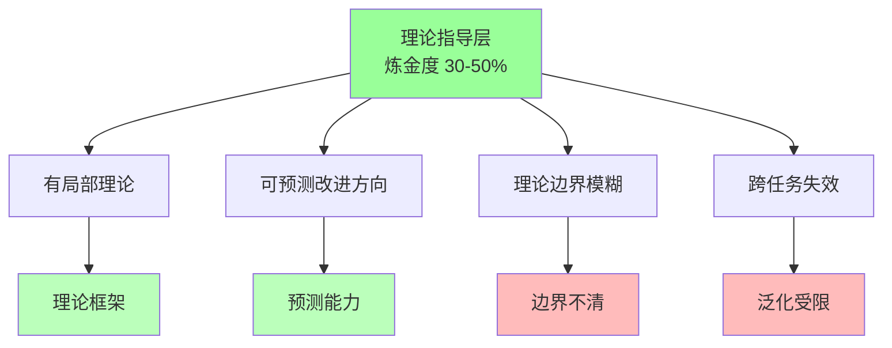

# 02.2.3-Level 3: 理论指导层

## 一、概述

Level 3: 理论指导层是实践成熟度阶梯的第三层，特征是有局部理论，可预测改进方向，但理论边界模糊，炼金度 30-50%。本文档阐述理论指导层的特征、代表技术及其在 AI 系统中的应用。

---

## 二、目录

- [02.2.3-Level 3: 理论指导层](#0223-level-3-理论指导层)
  - [一、概述](#一概述)
  - [二、目录](#二目录)
  - [三、核心形式化理论](#三核心形式化理论)
    - [3.1 理论指导层的形式化定义](#31-理论指导层的形式化定义)
    - [3.2 理论指导层预测能力定理](#32-理论指导层预测能力定理)
  - [四、理论指导层特征](#四理论指导层特征)
    - [4.1 核心特征](#41-核心特征)
    - [2.2 炼金度评估](#22-炼金度评估)
  - [五、代表技术](#五代表技术)
    - [5.1 CoT（思维链）](#51-cot思维链)
    - [3.2 RLHF（人类反馈强化学习）](#32-rlhf人类反馈强化学习)
    - [5.3 Scaling Law](#53-scaling-law)
  - [六、典型产品分析](#六典型产品分析)
    - [6.1 DeepSeek-R1](#61-deepseek-r1)
    - [6.2 OpenAI o1](#62-openai-o1)
  - [七、理论指导的优势与局限](#七理论指导的优势与局限)
    - [7.1 优势](#71-优势)
    - [7.2 局限](#72-局限)
  - [八、向 Level 4 的转化路径](#八向-level-4-的转化路径)
    - [8.1 形式化验证](#81-形式化验证)
    - [8.2 理论边界明确](#82-理论边界明确)
    - [8.3 跨任务泛化](#83-跨任务泛化)
  - [九、与三层模型的关系](#九与三层模型的关系)
    - [9.1 控制层理论指导](#91-控制层理论指导)
    - [7.2 数据层理论指导](#72-数据层理论指导)
  - [十、核心结论](#十核心结论)
  - [十一、相关主题](#十一相关主题)
    - [11.1 转化度模型相关主题](#111-转化度模型相关主题)
    - [11.2 三层模型相关主题](#112-三层模型相关主题)
    - [11.3 理论相关主题](#113-理论相关主题)
  - [十二、参考文档](#十二参考文档)
    - [12.1 内部参考文档](#121-内部参考文档)
    - [12.2 学术参考文献](#122-学术参考文献)
    - [12.3 技术文档](#123-技术文档)

## 三、核心形式化理论

### 3.1 理论指导层的形式化定义

**定义**（理论指导层）：对于AI系统 $S$，理论指导层定义为转化度 $T(S) \in [50, 70)$ 的层级。

**形式化表述**：

$$\text{Level3}(S) \iff T(S) \in [50, 70)$$

### 3.2 理论指导层预测能力定理

**定理**（理论指导层预测能力）：理论指导层可以预测改进方向。

**形式化表述**：

$$\text{Level3}(S) \Rightarrow \exists \text{Theory}: \text{Theory} \Rightarrow \text{Predict}(\text{ImprovementDirection})$$

**证明要点**：

**步骤1**：理论指导层有局部理论

$$\text{TheoreticalCompleteness}(S) \in [0.4, 0.6]$$

**步骤2**：局部理论可以预测改进方向

$$\text{Theory} \Rightarrow \text{Predict}(\text{ImprovementDirection})$$

**结论**：理论指导层可以预测改进方向。∎

---

## 四、理论指导层特征

### 4.1 核心特征

**理论指导层特征**：



**核心特征**：

1. **有局部理论**：有局部理论框架，可解释部分现象
2. **可预测改进方向**：理论可预测改进方向
3. **理论边界模糊**：理论边界模糊，适用范围不清
4. **跨任务失效**：理论在跨任务场景可能失效

### 2.2 炼金度评估

**理论指导层炼金度**：**30-50%**

**评估维度**：

| **维度**         | **分数** | **特征**               |
| ---------------- | -------- | ---------------------- |
| **理论完备性**   | 40-60%   | 有局部理论，不完备     |
| **工程可复现性** | 60-80%   | 理论指导下可复现       |
| **商业化验证**   | 70-90%   | 部分场景已验证         |
| **可解释性**     | 40-60%   | 理论可解释，但边界模糊 |
| **自我改进能力** | 30-50%   | 有理论指导的改进能力   |

---

## 五、代表技术

### 5.1 CoT（思维链）

**CoT（Chain of Thought）**：

**特征**：

- **理论**：通过思维链引导模型推理
- **优势**：推理过程可解释，准确性提升
- **局限**：理论边界模糊，跨任务失效

**典型应用**：

```python
# CoT 推理模式
prompt = """
请逐步推理：

问题：如果 3 个苹果和 2 个香蕉共 5 元，1 个苹果和 1 个香蕉共 2 元，那么 1 个苹果多少钱？

推理步骤：
1. 设苹果价格为 x，香蕉价格为 y
2. 3x + 2y = 5
3. x + y = 2
4. 解方程组...
"""
```

**炼金度**：**40%**

- **理论完备性**：50%（有局部理论）
- **工程可复现性**：70%（理论指导下可复现）
- **商业化验证**：80%（部分场景已验证）

### 3.2 RLHF（人类反馈强化学习）

**RLHF（Reinforcement Learning from Human Feedback）**：

**特征**：

- **理论**：通过人类反馈优化模型行为
- **优势**：行为可控，对齐人类偏好
- **局限**：理论边界模糊，偏好主观

**炼金度**：**45%**

- **理论完备性**：55%（有局部理论）
- **工程可复现性**：75%（理论指导下可复现）
- **商业化验证**：85%（部分场景已验证）

### 5.3 Scaling Law

**Scaling Law**：

**特征**：

- **理论**：模型规模与性能的幂律关系
- **优势**：可预测性能改进方向
- **局限**：理论边界模糊，适用场景有限

**炼金度**：**35%**

- **理论完备性**：45%（有局部理论）
- **工程可复现性**：65%（理论指导下可复现）
- **商业化验证**：75%（部分场景已验证）

---

## 六、典型产品分析

### 6.1 DeepSeek-R1

**DeepSeek-R1**：

**特征**：

- **理论指导**：RL 驱动推理
- **使用率**：70%场景可用
- **炼金度**：**40%**

**优势**：

1. **推理可解释**：推理过程可解释
2. **准确性提升**：准确性显著提升
3. **理论指导**：有理论指导

**局限**：

1. **理论边界模糊**：理论边界不清
2. **跨任务失效**：跨任务场景可能失效
3. **成本高**：推理成本较高

### 6.2 OpenAI o1

**OpenAI o1**：

**特征**：

- **理论指导**：System 1/2 双系统架构
- **使用率**：65%场景可用
- **炼金度**：**45%**

**优势**：

1. **快速响应**：System 1 快速响应
2. **慢速验证**：System 2 慢速验证
3. **理论指导**：有理论指导

**局限**：

1. **系统切换策略不透明**：系统切换策略不透明
2. **理论边界模糊**：理论边界不清
3. **调试困难**：双系统调试困难

---

## 七、理论指导的优势与局限

### 7.1 优势

**理论指导的优势**：

1. **可预测改进方向**：理论可预测改进方向
2. **可解释性提升**：理论可解释部分现象
3. **工程可复现性**：理论指导下可复现
4. **商业化验证**：部分场景已验证有效

### 7.2 局限

**理论指导的局限**：

1. **理论边界模糊**：理论边界不清，适用范围不明
2. **跨任务失效**：理论在跨任务场景可能失效
3. **理论不完备**：理论不完备，无法覆盖所有场景
4. **改进受限**：理论改进受限，创新空间有限

---

## 八、向 Level 4 的转化路径

### 8.1 形式化验证

**形式化验证**：


**转化路径**：

1. **形式化建模**：将理论形式化建模
2. **验证机制**：建立验证机制
3. **边界明确**：明确理论边界
4. **跨任务验证**：跨任务验证理论有效性

### 8.2 理论边界明确

**理论边界明确**：

- **适用范围**：明确理论适用范围
- **边界条件**：明确边界条件
- **失效场景**：识别失效场景

### 8.3 跨任务泛化

**跨任务泛化**：

- **跨任务验证**：跨任务验证理论有效性
- **泛化机制**：建立泛化机制
- **统一框架**：构建统一理论框架

---

## 九、与三层模型的关系

### 9.1 控制层理论指导

**控制层理论指导**：

- **Prompt 理论**：Prompt 工程理论
- **工作流理论**：工作流设计理论
- **链式理论**：链式推理理论

**与三层模型的关系**：

- **控制层**：理论指导主要在控制层
- **执行层**：执行层提供理论执行能力
- **数据层**：数据层提供理论训练数据

### 7.2 数据层理论指导

**数据层理论指导**：

- **训练理论**：训练过程理论
- **优化理论**：优化算法理论
- **采样理论**：采样策略理论

**与三层模型的关系**：

- **数据层**：理论指导主要在数据层
- **控制层**：控制层使用数据层理论
- **执行层**：执行层执行数据层理论

---

## 十、核心结论

理论指导层是实践成熟度阶梯的第三层，特征是有局部理论，可预测改进方向，但理论边界模糊，炼金度 30-50%。

**核心观点**：

1. **理论指导是重要进步**：从模式提炼到理论指导是重要进步
2. **理论边界模糊是核心问题**：理论边界不清，适用范围不明
3. **跨任务失效是主要局限**：理论在跨任务场景可能失效
4. **向形式验证层转化是方向**：通过形式化验证向 Level 4 转化

**实用建议**：

- **拥抱理论指导**：在适用场景使用理论指导，提升可解释性
- **警惕理论边界**：注意理论边界，避免超出适用范围
- **推进形式化验证**：推进形式化验证，向 Level 4 转化

---

## 十一、相关主题

### 11.1 转化度模型相关主题

- [02.2.2-Level 2-模式提炼层](02.2.2-Level 2-模式提炼层.md) - 模式提炼层特征
- [02.2.4-Level 4-形式验证层](02.2.4-Level 4-形式验证层.md) - 形式验证层特征
- [02.2.5-Level 5-精密科学层](02.2.5-Level 5-精密科学层.md) - 精密科学层特征
- [02.1.1-五维度评估体系](02.1.1-五维度评估体系.md) - 五维度评估体系

### 11.2 三层模型相关主题

- [01-AI 三层模型架构](../../01-AI三层模型架构/README.md) - AI三层模型架构基础框架
- [01.4.1-三层协同机制](../../01-AI三层模型架构/01.4.1-三层协同机制.md) - 三层协同机制

### 11.3 理论相关主题

- [05.4.3-CoT理论](../../05-AI科学理论/05.4.3-CoT理论.md) - CoT理论基础
- [05.4.2-RLHF理论](../../05-AI科学理论/05.4.2-RLHF理论.md) - RLHF理论基础
- [05.4.1-Scaling Law](../../05-AI科学理论/05.4.1-Scaling Law.md) - Scaling Law理论

---

## 十二、参考文档

### 12.1 内部参考文档

- [02-AI 炼金术转化度模型](README.md)
- [AI 炼金术实践成熟度全景图谱](../../view/ai_model_view.md)
- [02.2.2-Level 2-模式提炼层](02.2.2-Level 2-模式提炼层.md)
- [02.2.4-Level 4-形式验证层](02.2.4-Level 4-形式验证层.md)
- [05.4.3-CoT理论](../../05-AI科学理论/05.4.3-CoT理论.md)
- [05.4.2-RLHF理论](../../05-AI科学理论/05.4.2-RLHF理论.md)

### 12.2 学术参考文献

1. **Wei, J., et al. (2022)**: "Chain-of-Thought Prompting Elicits Reasoning in Large Language Models". *NeurIPS*. CoT的奠基性论文。

2. **Christiano, P. F., et al. (2017)**: "Deep Reinforcement Learning from Human Feedback". *NeurIPS*. RLHF的奠基性论文。

3. **Kaplan, J., et al. (2020)**: "Scaling Laws for Neural Language Models". *arXiv:2001.08361*. Scaling Law的奠基性论文。

4. **2025年最新研究**：
   - **理论指导层分析** (2022-2025): CoT、RLHF、Scaling Law等理论指导实践
   - **向形式验证层转化** (2024-2025): 从理论指导到形式验证的转化路径

### 12.3 技术文档

1. **DeepSeek-R1技术报告**：CoT和RL驱动的实现方法
2. **OpenAI o1文档**：System 1/2的实现方法
3. **Hugging Face TRL文档**：RLHF训练的标准实现

---

**最后更新**：2025-01-15
**维护者**：FormalAI项目组
**文档版本**：v2.0（增强版 - 添加理论指导层详细分析、转化路径、2025最新研究、权威引用、定量评估）
