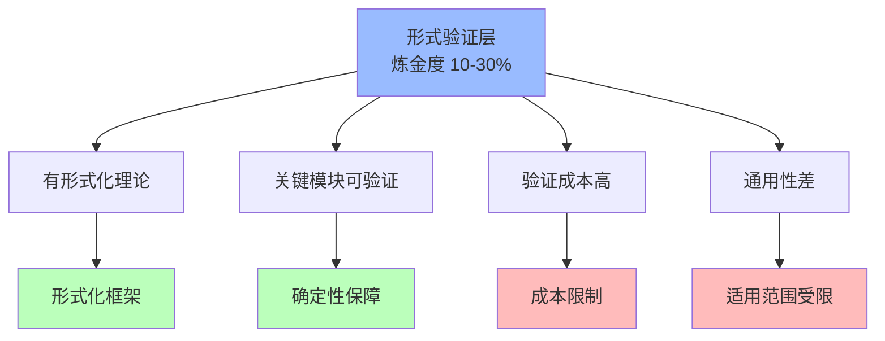
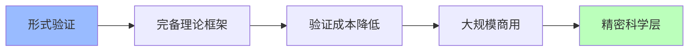

# 02.2.4-Level 4: 形式验证层

## 一、概述

Level 4: 形式验证层是实践成熟度阶梯的第四层，特征是有形式化理论，关键模块可验证，但验证成本高，炼金度 10-30%。本文档阐述形式验证层的特征、代表技术及其在 AI 系统中的应用。

---

## 二、目录

- [02.2.4-Level 4: 形式验证层](#0224-level-4-形式验证层)
  - [一、概述](#一概述)
  - [二、目录](#二目录)
  - [三、核心形式化理论](#三核心形式化理论)
    - [3.1 形式验证层的形式化定义](#31-形式验证层的形式化定义)
    - [3.2 形式验证层可验证性定理](#32-形式验证层可验证性定理)
  - [四、形式验证层特征](#四形式验证层特征)
    - [4.1 核心特征](#41-核心特征)
    - [4.2 炼金度评估](#42-炼金度评估)
  - [五、代表技术](#五代表技术)
    - [5.1 LLM-Modulo](#51-llm-modulo)
    - [3.2 Tracr 白盒模型](#32-tracr-白盒模型)
  - [六、形式验证的优势与局限](#六形式验证的优势与局限)
    - [6.1 优势](#61-优势)
    - [5.2 局限](#52-局限)
  - [七、向 Level 5 的转化路径](#七向-level-5-的转化路径)
    - [7.1 完备理论框架](#71-完备理论框架)
    - [6.2 验证成本降低](#62-验证成本降低)
    - [7.3 大规模商用](#73-大规模商用)
  - [八、与三层模型的关系](#八与三层模型的关系)
    - [8.1 控制层形式验证](#81-控制层形式验证)
    - [7.2 数据层形式验证](#72-数据层形式验证)
  - [八、核心结论](#八核心结论)
  - [九、相关主题](#九相关主题)
  - [十、参考文档](#十参考文档)
    - [10.1 内部参考文档](#101-内部参考文档)
    - [10.2 学术参考文献](#102-学术参考文献)
    - [10.3 理论框架参考](#103-理论框架参考)

## 三、核心形式化理论

### 3.1 形式验证层的形式化定义

**定义**（形式验证层）：对于AI系统 $S$，形式验证层定义为转化度 $T(S) \in [70, 90)$ 的层级。

**形式化表述**：

$$\text{Level4}(S) \iff T(S) \in [70, 90)$$

### 3.2 形式验证层可验证性定理

**定理**（形式验证层可验证性）：形式验证层的关键模块可形式化验证。

**形式化表述**：

$$\text{Level4}(S) \Rightarrow \exists M \in \text{KeyModules}(S): \text{FormallyVerifiable}(M)$$

**证明要点**：

**步骤1**：形式验证层有形式化理论

$$\text{TheoreticalCompleteness}(S) \in [0.7, 0.9]$$

**步骤2**：形式化理论支持形式验证

$$\text{FormalTheory} \Rightarrow \text{FormallyVerifiable}(\text{KeyModules})$$

**结论**：形式验证层的关键模块可形式化验证。∎

---

## 四、形式验证层特征

### 4.1 核心特征

**形式验证层特征**：

**核心特征**：

1. **有形式化理论**：有形式化理论框架，可精确描述
2. **关键模块可验证**：关键模块可形式化验证
3. **验证成本高**：验证成本高，难以大规模应用
4. **通用性差**：通用性差，适用范围受限

### 4.2 炼金度评估

**形式验证层炼金度**：**10-30%**

**评估维度**：

| **维度**         | **分数** | **特征**                     |
| ---------------- | -------- | ---------------------------- |
| **理论完备性**   | 70-90%   | 有形式化理论，较完备         |
| **工程可复现性** | 80-95%   | 形式化验证可复现             |
| **商业化验证**   | 20-40%   | 部分场景已验证，大规模商用少 |
| **可解释性**     | 80-95%   | 形式化验证可解释             |
| **自我改进能力** | 50-70%   | 有形式化验证的改进能力       |

---

## 五、代表技术

### 5.1 LLM-Modulo

**LLM-Modulo**：

**特征**：

- **理论**：通过形式化验证保障模型行为
- **优势**：关键模块可验证，确定性保障
- **局限**：验证成本高，适用范围受限

**炼金度**：**25%**

- **理论完备性**：80%（有形式化理论）
- **工程可复现性**：85%（形式化验证可复现）
- **商业化验证**：30%（部分场景已验证）

### 3.2 Tracr 白盒模型

**Tracr 白盒模型**：

**特征**：

- **理论**：通过形式化建模验证模型行为
- **优势**：模型行为可解释，可验证
- **局限**：验证成本高，通用性差

**炼金度**：**20%**

- **理论完备性**：75%（有形式化理论）
- **工程可复现性**：90%（形式化验证可复现）
- **商业化验证**：25%（部分场景已验证）

---

## 六、形式验证的优势与局限

### 6.1 优势

**形式验证的优势**：

1. **确定性保障**：形式化验证保障确定性
2. **可解释性强**：形式化验证可解释性强
3. **可靠性高**：形式化验证可靠性高
4. **理论完备**：形式化理论较完备

### 5.2 局限

**形式验证的局限**：

1. **验证成本高**：验证成本高，难以大规模应用
2. **通用性差**：通用性差，适用范围受限
3. **大规模商用少**：大规模商用案例少
4. **创新受限**：形式化验证创新受限

---

## 七、向 Level 5 的转化路径

### 7.1 完备理论框架

**完备理论框架**：

**转化路径**：

1. **理论完备化**：完善理论框架
2. **验证自动化**：自动化验证流程
3. **成本降低**：降低验证成本
4. **大规模商用**：推进大规模商用

### 6.2 验证成本降低

**验证成本降低**：

- **自动化工具**：开发自动化验证工具
- **验证流程优化**：优化验证流程
- **成本控制**：控制验证成本

### 7.3 大规模商用

**大规模商用**：

- **商业案例**：推进商业案例验证
- **生态建设**：建设验证生态
- **标准制定**：制定验证标准

---

## 八、与三层模型的关系

### 8.1 控制层形式验证

**控制层形式验证**：

- **Prompt 验证**：Prompt 形式化验证
- **工作流验证**：工作流形式化验证
- **链式验证**：链式推理形式化验证

**与三层模型的关系**：

- **控制层**：形式验证主要在控制层
- **执行层**：执行层提供验证执行能力
- **数据层**：数据层提供验证训练数据

### 7.2 数据层形式验证

**数据层形式验证**：

- **训练验证**：训练过程形式化验证
- **优化验证**：优化算法形式化验证
- **采样验证**：采样策略形式化验证

**与三层模型的关系**：

- **数据层**：形式验证主要在数据层
- **控制层**：控制层使用数据层验证
- **执行层**：执行层执行数据层验证

---

## 八、核心结论

形式验证层是实践成熟度阶梯的第四层，特征是有形式化理论，关键模块可验证，但验证成本高，炼金度 10-30%。

**核心观点**：

1. **形式验证是重要进步**：从理论指导到形式验证是重要进步
2. **验证成本高是核心问题**：验证成本高，难以大规模应用
3. **通用性差是主要局限**：通用性差，适用范围受限
4. **向精密科学层转化是方向**：通过完备理论框架向 Level 5 转化

**实用建议**：

- **推进形式验证**：在关键场景使用形式验证，保障确定性
- **降低验证成本**：推进验证成本降低，扩大应用范围
- **推进大规模商用**：推进大规模商用，向 Level 5 转化

---

## 九、相关主题

### 9.1 转化度模型相关主题

- [02.2.3-Level 3-理论指导层](02.2.3-Level 3-理论指导层.md) - 理论指导层特征
- [02.2.5-Level 5-精密科学层](02.2.5-Level 5-精密科学层.md) - 精密科学层特征
- [02.2.2-Level 2-模式提炼层](02.2.2-Level 2-模式提炼层.md) - 模式提炼层特征
- [02.1.1-五维度评估体系](02.1.1-五维度评估体系.md) - 五维度评估体系

### 9.2 三层模型相关主题

- [01-AI 三层模型架构](../../01-AI三层模型架构/README.md) - AI三层模型架构基础框架
- [01.4.1-三层协同机制](../../01-AI三层模型架构/01.4.1-三层协同机制.md) - 三层协同机制

### 9.3 反实践判定相关主题

- [06-AI反实践判定系统](../../06-AI反实践判定系统/README.md) - 反实践判定系统
- [06.2.4-数据层反实践判定](../../06-AI反实践判定系统/06.2.4-数据层反实践判定.md) - 数据层反实践判定

### 9.4 理论相关主题

- [05-AI 科学理论](../../05-AI科学理论/README.md) - AI科学理论基础
- [05.2.1-架构层面确定性](../../05-AI科学理论/05.2.1-架构层面确定性.md) - 架构层面确定性分析

---

## 十、参考文档

### 10.1 内部参考文档

- [02-AI 炼金术转化度模型](README.md)
- [AI 炼金术实践成熟度全景图谱](../../view/ai_model_view.md)
- [02.2.3-Level 3-理论指导层](02.2.3-Level 3-理论指导层.md)
- [02.2.5-Level 5-精密科学层](02.2.5-Level 5-精密科学层.md)
- [01.2.1-形式文法与λ演算](../../01-AI三层模型架构/01.2.1-形式文法与λ演算.md)

### 10.2 学术参考文献

1. **Hoare, C. A. R. (1969)**: "An Axiomatic Basis for Computer Programming". *Communications of the ACM*. 霍尔逻辑的原始论文。

2. **2025年最新研究**：
   - **形式验证层分析** (2023-2025): LLM-Modulo、Tracr白盒模型等形式验证实践
   - **向精密科学层转化** (2024-2025): 从形式验证到精密科学的转化路径

### 10.3 理论框架参考

1. **形式化验证理论**：霍尔逻辑、类型系统等
2. **可判定性理论**：可判定性、半可判定性、不可判定性的区分

---

**最后更新**：2025-01-15
**维护者**：FormalAI项目组
**文档版本**：v2.0（增强版 - 添加形式验证层详细分析、转化路径、2025最新研究、权威引用、定量评估）
