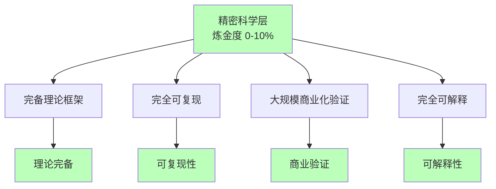

# 02.2.5-Level 5: 精密科学层

## 一、概述

Level 5: 精密科学层是实践成熟度阶梯的最高层级，特征是完备理论框架，完全可复现，大规模商业化验证，炼金度 0-10%。本文档阐述精密科学层的特征、代表技术及其在 AI 系统中的应用。

---

## 二、目录

- [02.2.5-Level 5: 精密科学层](#0225-level-5-精密科学层)
  - [一、概述](#一概述)
  - [二、目录](#二目录)
  - [三、精密科学层特征](#三精密科学层特征)
    - [2.1 核心特征](#21-核心特征)
    - [2.2 炼金度评估](#22-炼金度评估)
  - [四、当前状态](#四当前状态)
    - [3.1 人类仍未达到](#31-人类仍未达到)
    - [3.2 AGI 理论未形成](#32-agi-理论未形成)
  - [五、精密科学层的特征](#五精密科学层的特征)
    - [4.1 完备理论框架](#41-完备理论框架)
    - [4.2 完全可复现](#42-完全可复现)
    - [4.3 大规模商业化验证](#43-大规模商业化验证)
  - [六、向精密科学层转化的路径](#六向精密科学层转化的路径)
    - [5.1 AGI 理论形成](#51-agi-理论形成)
    - [5.2 理论框架完备化](#52-理论框架完备化)
    - [5.3 大规模商用验证](#53-大规模商用验证)
  - [七、与三层模型的关系](#七与三层模型的关系)
    - [6.1 三层模型精密科学化](#61-三层模型精密科学化)
    - [6.2 跨层理论统一](#62-跨层理论统一)
  - [八、核心结论](#八核心结论)
  - [九、相关主题](#九相关主题)
  - [十、参考文档](#十参考文档)

## 三、精密科学层特征

### 2.1 核心特征

**精密科学层特征**：

**核心特征**：

1. **完备理论框架**：有完备理论框架，可精确描述
2. **完全可复现**：完全可复现，工程化程度高
3. **大规模商业化验证**：大规模商业化验证，广泛应用
4. **完全可解释**：完全可解释，理论清晰

### 2.2 炼金度评估

**精密科学层炼金度**：**0-10%**

**评估维度**：

| **维度**         | **分数** | **特征**                 |
| ---------------- | -------- | ------------------------ |
| **理论完备性**   | 90-100%  | 完备理论框架             |
| **工程可复现性** | 95-100%  | 完全可复现               |
| **商业化验证**   | 90-100%  | 大规模商业化验证         |
| **可解释性**     | 95-100%  | 完全可解释               |
| **自我改进能力** | 90-100%  | 有理论指导的自我改进能力 |

---

## 四、当前状态

### 3.1 人类仍未达到

**当前状态**：

- **人类仍未达到**：人类在 AI 领域仍未达到精密科学层
- **AGI 理论未形成**：AGI 理论框架尚未形成
- **理论不完备**：现有理论框架不完备

### 3.2 AGI 理论未形成

**AGI 理论未形成**：

- **理论缺失**：AGI 理论框架缺失
- **研究方向**：研究方向仍在探索中
- **未来目标**：未来目标是形成 AGI 理论框架

---

## 五、精密科学层的特征

### 4.1 完备理论框架

**完备理论框架**：

- **理论完备**：理论框架完备，可精确描述
- **边界清晰**：理论边界清晰，适用范围明确
- **可预测性**：理论可预测系统行为

### 4.2 完全可复现

**完全可复现**：

- **工程化程度高**：工程化程度高，可完全复现
- **标准化**：流程标准化，可大规模应用
- **可靠性**：系统可靠性高，稳定性强

### 4.3 大规模商业化验证

**大规模商业化验证**：

- **广泛应用**：技术广泛应用，大规模商用
- **商业验证**：商业验证充分，市场接受度高
- **生态成熟**：生态成熟，产业链完善

---

## 六、向精密科学层转化的路径

### 5.1 AGI 理论形成

**AGI 理论形成**：

**转化路径**：

1. **AGI 理论形成**：形成 AGI 理论框架
2. **理论框架完备化**：完善理论框架
3. **大规模商用验证**：推进大规模商用验证
4. **精密科学化**：实现精密科学化

### 5.2 理论框架完备化

**理论框架完备化**：

- **理论完善**：完善理论框架
- **边界明确**：明确理论边界
- **可预测性提升**：提升理论可预测性

### 5.3 大规模商用验证

**大规模商用验证**：

- **商业案例**：推进商业案例验证
- **生态建设**：建设完善生态
- **标准制定**：制定行业标准

---

## 七、与三层模型的关系

### 6.1 三层模型精密科学化

**三层模型精密科学化**：

- **执行层精密科学化**：执行层理论完备，可复现
- **控制层精密科学化**：控制层理论完备，可复现
- **数据层精密科学化**：数据层理论完备，可复现

**与三层模型的关系**：

- **三层统一**：三层模型理论统一
- **跨层理论**：跨层理论框架完备
- **整体精密科学化**：整体实现精密科学化

### 6.2 跨层理论统一

**跨层理论统一**：

- **统一理论框架**：构建统一理论框架
- **跨层验证**：跨层形式化验证
- **整体优化**：整体优化理论框架

---

## 八、核心结论

精密科学层是实践成熟度阶梯的最高层级，特征是完备理论框架，完全可复现，大规模商业化验证，炼金度 0-10%。

**核心观点**：

1. **精密科学层是目标**：精密科学层是 AI 发展的最终目标
2. **人类仍未达到**：人类在 AI 领域仍未达到精密科学层
3. **AGI 理论未形成**：AGI 理论框架尚未形成
4. **向精密科学层转化是方向**：通过 AGI 理论形成向精密科学层转化

**实用建议**：

- **推进理论形成**：推进 AGI 理论框架形成
- **完善理论框架**：完善现有理论框架
- **推进大规模商用**：推进大规模商用验证，向精密科学层转化

---

## 九、相关主题

- [02.2.4-Level 4: 形式验证层](02.2.4-Level%204-形式验证层.md)
- [02.1.1-五维度评估体系](02.1.1-五维度评估体系.md)
- [01-AI 三层模型架构](../01-AI三层模型架构/README.md)

---

## 十、参考文档

- [02-AI 炼金术转化度模型](README.md)
- [AI 炼金术实践成熟度全景图谱](../../view/ai_model_view.md)
