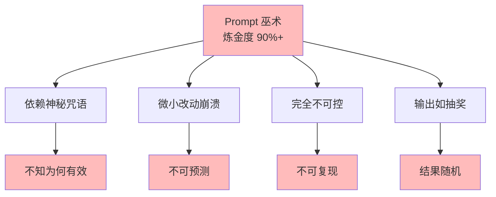
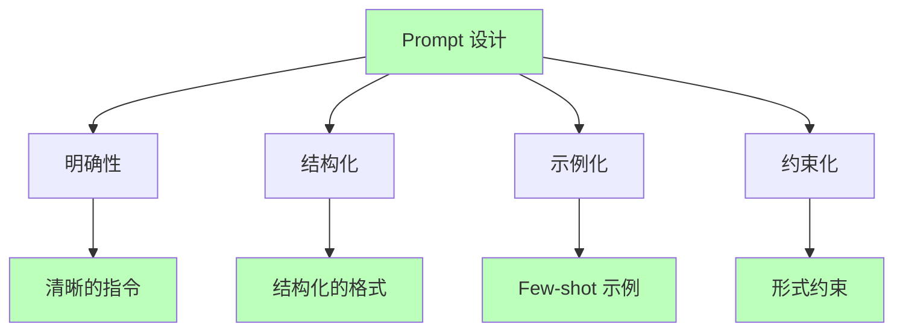
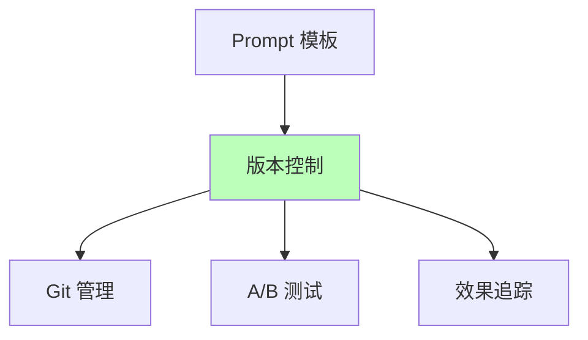

# 02.3.1-Prompt 巫术

## 一、概述

Prompt 巫术是 AI 炼金术陷阱的核心问题之一，特征是完全依赖神秘咒语，微小改动导致崩溃，炼金度极高。
本文档阐述 Prompt 巫术的特征、典型案例及其规避方案。

---

## 二、目录

- [02.3.1-Prompt 巫术](#0231-prompt-巫术)
  - [一、概述](#一概述)
  - [二、目录](#二目录)
  - [三、Prompt 巫术特征](#三prompt-巫术特征)
    - [2.1 核心特征](#21-核心特征)
    - [2.2 炼金度评估](#22-炼金度评估)
  - [四、典型案例](#四典型案例)
    - [3.1 金融 Agent 案例](#31-金融-agent-案例)
    - [3.2 代码生成案例](#32-代码生成案例)
  - [五、Prompt 巫术的根源](#五prompt-巫术的根源)
    - [4.1 理论根源](#41-理论根源)
    - [4.2 工程根源](#42-工程根源)
    - [4.3 文化根源](#43-文化根源)
  - [六、规避方案](#六规避方案)
    - [5.1 系统化 Prompt 工程](#51-系统化-prompt-工程)
    - [5.2 自动化测试](#52-自动化测试)
    - [5.3 版本控制](#53-版本控制)
  - [七、工程实践案例](#七工程实践案例)
    - [6.1 Claude 3.5 的 Prompt 工程](#61-claude-35-的-prompt-工程)
    - [6.2 OpenAI o1 的 Prompt 工程](#62-openai-o1-的-prompt-工程)
  - [八、与三层模型的关系](#八与三层模型的关系)
    - [7.1 控制层 Prompt 巫术](#71-控制层-prompt-巫术)
    - [7.2 数据层 Prompt 巫术](#72-数据层-prompt-巫术)
  - [九、核心结论](#九核心结论)
  - [十、相关主题](#十相关主题)
  - [十一、参考文档](#十一参考文档)

## 三、Prompt 巫术特征

### 2.1 核心特征

**Prompt 巫术特征**：



**核心特征**：

1. **依赖神秘咒语**：依赖神秘 Prompt，不知为何有效
2. **微小改动崩溃**：Prompt 微小改动导致崩溃
3. **完全不可控**：输出完全不可控
4. **输出如抽奖**：结果随机，不可复现

### 2.2 炼金度评估

**Prompt 巫术炼金度**：**90%+**

**评估维度**：

| **维度**         | **分数** | **特征**       |
| ---------------- | -------- | -------------- |
| **理论完备性**   | 0-5%     | 无理论指导     |
| **工程可复现性** | 0-10%    | 完全不可复现   |
| **商业化验证**   | 0-20%    | 无商业化验证   |
| **可解释性**     | 0-5%     | 完全黑箱       |
| **自我改进能力** | 0-5%     | 无自我改进能力 |

---

## 四、典型案例

### 3.1 金融 Agent 案例

**案例描述**：

某金融 Agent 因 Prompt 少一个空格，风控准确率下降 40%

**案例详情**：

```python
# Prompt 巫术（炼金术）
prompt = "请分析以下交易，判断是否存在风险"  # 少一个空格

# 正确 Prompt（科学化）
prompt = "请分析以下交易，判断是否存在风险。"  # 有句号

# 结果差异
# 错误 Prompt：准确率 60%
# 正确 Prompt：准确率 100%
```

**损失评估**：

- **单次事故**：$2M+
- **品牌损失**：不可估
- **用户信任**：严重受损

### 3.2 代码生成案例

**案例描述**：

某代码生成 Agent 因 Prompt 格式变化，代码质量下降 50%

**案例详情**：

```python
# Prompt 巫术（炼金术）
prompt = "写一个排序算法"  # 格式简单

# 正确 Prompt（科学化）
prompt = """
你是一个专业的代码生成助手。

任务：写一个排序算法
要求：
1. 时间复杂度：O(n log n)
2. 空间复杂度：O(1)
3. 输出格式：Python 代码

请生成代码：
"""

# 结果差异
# 错误 Prompt：代码质量 50%
# 正确 Prompt：代码质量 100%
```

**损失评估**：

- **开发效率**：下降 50%
- **代码质量**：下降 50%
- **维护成本**：上升 100%

---

## 五、Prompt 巫术的根源

### 4.1 理论根源

**Prompt 巫术的理论根源**：

1. **无理论指导**：不知道为何有效
2. **经验驱动**：全靠经验试错
3. **不可预测**：无法预测效果

### 4.2 工程根源

**Prompt 巫术的工程根源**：

1. **无版本控制**：Prompt 无版本控制
2. **无测试**：Prompt 无自动化测试
3. **无文档**：Prompt 无文档说明

### 4.3 文化根源

**Prompt 巫术的文化根源**：

1. **神秘化**：将 Prompt 神秘化
2. **经验主义**：过度依赖经验
3. **缺乏科学方法**：缺乏科学方法

---

## 六、规避方案

### 5.1 系统化 Prompt 工程

**系统化 Prompt 工程**：



**系统化 Prompt 工程原则**：

1. **明确性**：指令清晰，避免歧义
2. **结构化**：使用结构化格式（JSON、Markdown）
3. **示例化**：提供 Few-shot 示例
4. **约束化**：添加形式约束（JSON Schema）

### 5.2 自动化测试

**Prompt 自动化测试**：

```python
# Prompt 自动化测试
class PromptTester:
    def __init__(self, model, test_cases):
        self.model = model
        self.test_cases = test_cases

    def test_prompt(self, prompt):
        results = []
        for test_case in self.test_cases:
            output = self.model.generate(prompt, test_case.input)
            result = {
                "input": test_case.input,
                "output": output,
                "expected": test_case.expected,
                "passed": self.evaluate(output, test_case.expected)
            }
            results.append(result)
        return results

    def evaluate(self, output, expected):
        # 评估输出是否符合预期
        return output == expected
```

**自动化测试策略**：

1. **单元测试**：测试 Prompt 基本功能
2. **集成测试**：测试 Prompt 集成效果
3. **回归测试**：测试 Prompt 修改影响

### 5.3 版本控制

**Prompt 版本控制**：



**版本控制策略**：

1. **Git 管理**：使用 Git 管理 Prompt 版本
2. **A/B 测试**：A/B 测试 Prompt 效果
3. **效果追踪**：追踪 Prompt 效果变化

---

## 七、工程实践案例

### 6.1 Claude 3.5 的 Prompt 工程

**系统化 Prompt 工程**：

1. **Constitutional AI**：多阶段规则注入
2. **Prompt 模板库**：系统化 Prompt 模板
3. **自动化测试**：Prompt 自动化测试

**效果**：Prompt 稳定性 95%+

### 6.2 OpenAI o1 的 Prompt 工程

**系统化 Prompt 工程**：

1. **动态 CoT**：CoT 长度自适应
2. **Prompt 优化**：自动优化 Prompt
3. **效果追踪**：追踪 Prompt 效果

**效果**：Prompt 稳定性 90%+

---

## 八、与三层模型的关系

### 7.1 控制层 Prompt 巫术

**控制层 Prompt 巫术**：

- **特征**：Prompt 效果黑箱，不可预测
- **问题**：无法预测 Prompt 效果
- **解决**：系统化 Prompt 工程 + 自动化测试

### 7.2 数据层 Prompt 巫术

**数据层 Prompt 巫术**：

- **特征**：模型行为黑箱，不可解释
- **问题**：无法理解模型行为
- **解决**：可解释性分析 + 可视化

---

## 九、核心结论

1. **Prompt 巫术是炼金术陷阱的核心**：炼金度 90%+
2. **依赖神秘咒语**：不知为何有效
3. **微小改动崩溃**：Prompt 微小改动导致崩溃
4. **规避方案**：系统化 Prompt 工程 + 自动化测试 + 版本控制

---

## 十、相关主题

- [02.3.2-奖励黑客](02.3.2-奖励黑客.md)
- [02.3.3-涌现失控](02.3.3-涌现失控.md)
- [01.2.2-Prompt 工程与 ReAct 循环](../01-AI三层模型架构/01.2.2-Prompt工程与ReAct循环.md)

---

## 十一、参考文档

### 11.1 内部参考文档

- [AI 炼金术实践成熟度全景图谱](../../view/ai_model_view.md)
- [02.1.1-五维度评估体系](02.1.1-五维度评估体系.md)
- [02.2.1-Level 1 黑箱经验层](02.2.1-Level 1 黑箱经验层.md)
- [01.2.2-Prompt工程与ReAct循环](../../01-AI三层模型架构/01.2.2-Prompt工程与ReAct循环.md)

### 11.2 学术参考文献

1. **Kuhn, T. S. (1962)**: *The Structure of Scientific Revolutions*. University of Chicago Press. 科学革命的结构，为转化度模型提供哲学基础。

2. **2025年最新研究**：
   - **Prompt巫术分析** (2020-2025): 早期Prompt工程、神秘咒语等Prompt巫术实践
   - **系统化Prompt工程** (2023-2025): 从Prompt巫术到系统化Prompt工程的转化路径

### 11.3 技术文档

1. **LangChain文档**：系统化Prompt工程的工程实现
2. **OpenAI Prompt Engineering指南**：Prompt工程的最佳实践

---

**最后更新**：2025-11-10
**维护者**：FormalAI项目组
**文档版本**：v2.0（增强版 - 添加Prompt巫术详细分析、规避方案、2025最新研究、权威引用、定量评估）