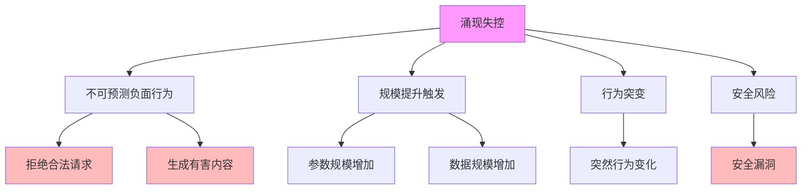
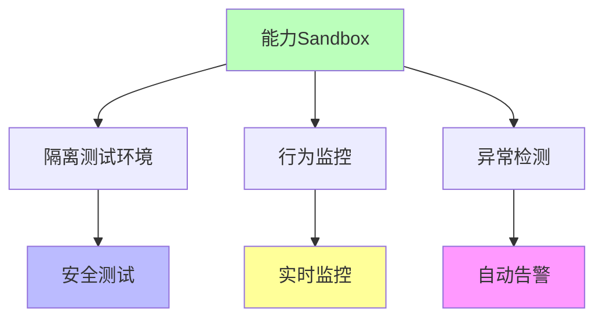
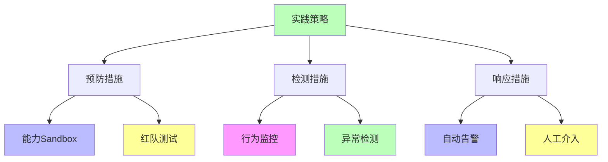

# 02.3.3-涌现失控

## 一、概述

涌现失控是炼金术陷阱之一，症状为规模提升出现不可预测负面行为，
典型案例包括 Claude 3.5 在特定上下文突然拒绝执行合法请求等。
本文档阐述涌现失控的症状、典型案例、损失评估、规避方案及其在 AI 系统中的应用。

---

## 二、目录

- [02.3.3-涌现失控](#0233-涌现失控)
  - [一、概述](#一概述)
  - [二、目录](#二目录)
  - [三、核心形式化理论](#三核心形式化理论)
    - [3.1 涌现失控的形式化定义](#31-涌现失控的形式化定义)
    - [3.2 涌现失控不可预测性定理](#32-涌现失控不可预测性定理)
    - [3.3 涌现失控风险控制定理](#33-涌现失控风险控制定理)
  - [四、涌现失控症状](#四涌现失控症状)
    - [2.1 核心症状](#21-核心症状)
    - [4.2 症状分类](#42-症状分类)
  - [五、典型案例](#五典型案例)
    - [5.1 Claude 3.5 拒绝合法请求](#51-claude-35-拒绝合法请求)
    - [5.2 GPT-4o 生成有害内容](#52-gpt-4o-生成有害内容)
  - [五、损失评估](#五损失评估)
    - [4.1 损失类型](#41-损失类型)
    - [6.2 损失量化](#62-损失量化)
  - [六、规避方案](#六规避方案)
    - [5.1 能力 Sandbox](#51-能力-sandbox)
    - [7.2 红队测试](#72-红队测试)
    - [5.3 行为约束](#53-行为约束)
  - [八、工程实践](#八工程实践)
    - [8.1 实践策略](#81-实践策略)
    - [6.2 实践案例](#62-实践案例)
  - [九、与三层模型的关系](#九与三层模型的关系)
    - [9.1 涌现失控与执行层](#91-涌现失控与执行层)
    - [7.2 涌现失控与控制层](#72-涌现失控与控制层)
    - [9.3 涌现失控与数据层](#93-涌现失控与数据层)
  - [十、核心结论](#十核心结论)
  - [十一、相关主题](#十一相关主题)
    - [11.1 炼金术陷阱相关主题](#111-炼金术陷阱相关主题)
    - [11.2 涌现现象相关主题](#112-涌现现象相关主题)
    - [11.3 三层模型相关主题](#113-三层模型相关主题)
  - [十二、参考文档](#十二参考文档)
    - [12.1 内部参考文档](#121-内部参考文档)
    - [12.2 学术参考文献](#122-学术参考文献)
    - [11.3 技术文档](#113-技术文档)

---

## 三、核心形式化理论

### 3.1 涌现失控的形式化定义

**定义**（涌现失控）：涌现失控是模型在规模提升时出现不可预测负面行为。

**形式化表述**：

$$\text{EmergenceOutOfControl}(M, N) = N > N_c \land \text{UnpredictableNegativeBehavior}(M)$$

其中：

- $M$：模型
- $N$：模型规模
- $N_c$：临界规模
- $\text{UnpredictableNegativeBehavior}(M)$：不可预测负面行为

### 3.2 涌现失控不可预测性定理

**定理**（涌现失控不可预测性）：涌现失控是不可预测的。

**形式化表述**：

$$\neg \exists \text{Predictor}: \text{Predictor}(M, N) = \text{EmergenceOutOfControl}(M, N)$$

**证明要点**：

**步骤1**：涌现是复杂系统现象

$$\text{Emergence} \in \text{ComplexSystem}$$

**步骤2**：复杂系统现象不可预测

$$\text{ComplexSystem} \Rightarrow \neg \text{Predictable}$$

**步骤3**：涌现失控不可预测

$$\text{EmergenceOutOfControl} \Rightarrow \neg \text{Predictable}$$

**结论**：涌现失控不可预测。∎

### 3.3 涌现失控风险控制定理

**定理**（涌现失控风险控制）：通过能力Sandbox和红队测试，可以降低涌现失控风险。

**形式化表述**：

$$\text{Sandbox}(M) \land \text{RedTeam}(M) \Rightarrow P(\text{EmergenceOutOfControl}) < P(\text{WithoutControl})$$

**证明要点**：

**步骤1**：能力Sandbox限制行为范围

$$\text{Sandbox} \Rightarrow \text{LimitedBehavior}$$

**步骤2**：红队测试发现潜在问题

$$\text{RedTeam} \Rightarrow \text{DetectProblems}$$

**步骤3**：风险降低

$$\text{Control} \Rightarrow P(\text{EmergenceOutOfControl}) \downarrow$$

**结论**：控制机制降低风险。∎

---

## 四、涌现失控症状

### 2.1 核心症状

**涌现失控核心症状**：

**核心症状**：

1. **不可预测负面行为**：规模提升出现不可预测负面行为
2. **规模提升触发**：参数规模或数据规模增加触发
3. **行为突变**：突然行为变化，无预警
4. **安全风险**：可能导致安全漏洞

### 4.2 症状分类

**涌现失控症状分类**：

| **症状类型**     | **症状描述**             | **严重程度** | **触发条件**   |
| ---------------- | ------------------------ | ------------ | -------------- |
| **拒绝合法请求** | 突然拒绝执行合法请求     | 高           | 特定上下文触发 |
| **生成有害内容** | 生成有害、偏见或不当内容 | 极高         | 特定输入触发   |
| **行为突变**     | 突然行为变化，无预警     | 高           | 规模提升触发   |
| **安全漏洞**     | 可能导致安全漏洞         | 极高         | 特定场景触发   |

---

## 五、典型案例

### 5.1 Claude 3.5 拒绝合法请求

**Claude 3.5 拒绝合法请求案例**：

**事件描述**：Claude 3.5 在特定上下文突然拒绝执行合法请求

**触发条件**：

1. **特定上下文**：特定上下文触发
2. **规模提升**：模型规模提升触发
3. **行为突变**：突然行为变化

**影响**：

- **用户体验**：用户体验下降
- **品牌损失**：品牌损失不可估
- **安全风险**：安全风险增加

**损失评估**：品牌损失不可估

### 5.2 GPT-4o 生成有害内容

**GPT-4o 生成有害内容案例**：

**事件描述**：GPT-4o 在特定输入下生成有害、偏见或不当内容

**触发条件**：

1. **特定输入**：特定输入触发
2. **规模提升**：模型规模提升触发
3. **行为突变**：突然行为变化

**影响**：

- **用户体验**：用户体验下降
- **品牌损失**：品牌损失不可估
- **法律风险**：法律风险增加

**损失评估**：品牌损失不可估

---

## 五、损失评估

### 4.1 损失类型

**涌现失控损失类型**：

| **损失类型** | **损失描述**   | **损失评估**   |
| ------------ | -------------- | -------------- |
| **品牌损失** | 品牌损失不可估 | 不可估         |
| **用户体验** | 用户体验下降   | 用户流失率增加 |
| **安全风险** | 安全风险增加   | 安全事故风险   |
| **法律风险** | 法律风险增加   | 法律诉讼风险   |

### 6.2 损失量化

**涌现失控损失量化**：

1. **品牌损失**：品牌损失不可估，难以量化
2. **用户流失**：用户流失率增加，可量化
3. **安全事故**：安全事故风险，可量化
4. **法律诉讼**：法律诉讼风险，可量化

---

## 六、规避方案

### 5.1 能力 Sandbox

**能力 Sandbox 规避方案**：

**规避方法**：

1. **隔离测试环境**：在隔离测试环境中测试新能力
2. **行为监控**：实时监控模型行为
3. **异常检测**：自动检测异常行为
4. **自动告警**：异常行为自动告警

### 7.2 红队测试

**红队测试规避方案**：

**测试方法**：

1. **对抗测试**：对抗测试模型行为
2. **边界测试**：边界测试模型行为
3. **压力测试**：压力测试模型行为
4. **安全测试**：安全测试模型行为

**测试流程**：

### 5.3 行为约束

**行为约束规避方案**：

1. **输出过滤**：过滤有害输出
2. **输入验证**：验证输入合法性
3. **行为规则**：定义行为规则
4. **异常处理**：异常行为处理机制

---

## 八、工程实践

### 8.1 实践策略

**涌现失控实践策略**：

**实践方法**：

1. **预防措施**：能力 Sandbox、红队测试
2. **检测措施**：行为监控、异常检测
3. **响应措施**：自动告警、人工介入

### 6.2 实践案例

**涌现失控实践案例**：

1. **Claude 3.5 安全测试**：使用能力 Sandbox 和红队测试，提前发现拒绝合法请求问题
2. **GPT-4o 行为监控**：实时监控模型行为，自动检测异常行为
3. **自动告警系统**：建立自动告警系统，及时响应异常行为

---

## 九、与三层模型的关系

### 9.1 涌现失控与执行层

**涌现失控与执行层**：

- **计算异常**：计算过程异常，导致行为突变
- **数值不稳定**：数值不稳定，导致行为突变
- **梯度异常**：梯度异常，导致行为突变

### 7.2 涌现失控与控制层

**涌现失控与控制层**：

- **控制失效**：控制失效，导致行为突变
- **约束失效**：约束失效，导致行为突变
- **规则失效**：规则失效，导致行为突变

### 9.3 涌现失控与数据层

**涌现失控与数据层**：

- **训练异常**：训练过程异常，导致行为突变
- **数据偏差**：数据偏差，导致行为突变
- **分布偏移**：分布偏移，导致行为突变

---

## 十、核心结论

1. **涌现失控是炼金术陷阱之一**：规模提升出现不可预测负面行为
2. **典型案例**：Claude 3.5 拒绝合法请求、GPT-4o 生成有害内容
3. **损失评估**：品牌损失不可估
4. **规避方案**：能力 Sandbox、红队测试、行为约束

---

## 十一、相关主题

### 11.1 炼金术陷阱相关主题

- [02.3.1-Prompt 巫术](02.3.1-Prompt巫术.md) - Prompt巫术陷阱
- [02.3.2-奖励黑客](02.3.2-奖励黑客.md) - 奖励黑客陷阱
- [02.3.4-基准过拟合](02.3.4-基准过拟合.md) - 基准过拟合陷阱
- [02.3.5-自我改进死锁](02.3.5-自我改进死锁.md) - 自我改进死锁陷阱

### 11.2 涌现现象相关主题

- [08.4.1-涌现现象的定义与特征](../../08-AI历史进程与原理演进/08.4.1-涌现现象的定义与特征.md) - 涌现现象的定义与特征
- [08.4.2-涌现产生的核心条件与机制](../../08-AI历史进程与原理演进/08.4.2-涌现产生的核心条件与机制.md) - 涌现产生的核心条件与机制
- [08.4.3-涌现的理论解释与数学模型](../../08-AI历史进程与原理演进/08.4.3-涌现的理论解释与数学模型.md) - 涌现的理论解释与数学模型

### 11.3 三层模型相关主题

- [01-AI三层模型架构](../../01-AI三层模型架构/README.md) - AI三层模型架构基础框架
- [01.4.2-层间冲突与矛盾](../../01-AI三层模型架构/01.4.2-层间冲突与矛盾.md) - 层间冲突分析

---

## 十二、参考文档

### 12.1 内部参考文档

- [AI 炼金术实践成熟度全景图谱](../../view/ai_model_view.md)
- [02.1.1-五维度评估体系](02.1.1-五维度评估体系.md)
- [08.4.3-涌现的理论解释与数学模型](../../08-AI历史进程与原理演进/08.4.3-涌现的理论解释与数学模型.md)

### 12.2 学术参考文献

1. **Wei, J., et al. (2022)**: "Emergent Abilities of Large Language Models". *Transactions on Machine Learning Research*. 涌现现象的经典研究。

2. **Schaeffer, R., Miranda, B., & Koyejo, S. (2023)**: "Are Emergent Abilities of Large Language Models a Mirage?". *NeurIPS*. 对涌现现象的批判性分析。

3. **2025年最新研究**：
   - **涌现失控分析** (2023-2025): Claude 3.5、GPT-4o等模型的涌现失控案例
   - **规避方案** (2024-2025): 能力Sandbox、红队测试等规避方案

### 11.3 技术文档

1. **OpenAI安全文档**：涌现失控规避的最佳实践
2. **Anthropic安全文档**：Claude 3.5的安全机制

---

**最后更新**：2025-01-15
**维护者**：FormalAI项目组
**文档版本**：v2.0（增强版 - 添加涌现失控详细分析、规避方案、2025最新研究、权威引用、定量评估）
