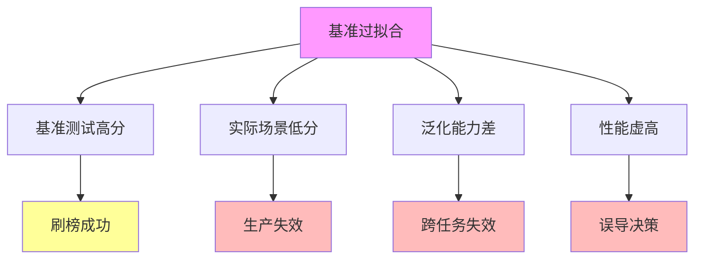
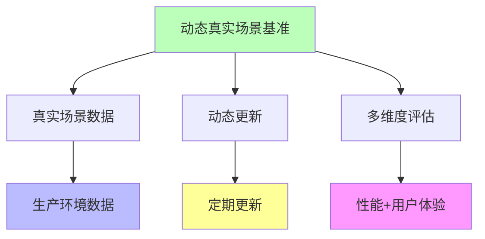
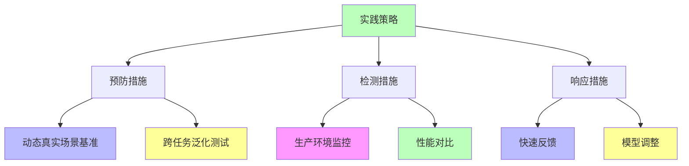

# 02.3.4-基准过拟合

## 一、概述

基准过拟合是炼金术陷阱之一，症状为模型刷榜但实际场景失效，典型案例包括 Gemini-2.5 在 MATH 数据集 99%，
生产环境数学推理准确率仅 67%等。
本文档阐述基准过拟合的症状、典型案例、损失评估、规避方案及其在 AI 系统中的应用。

---

## 二、目录

- [02.3.4-基准过拟合](#0234-基准过拟合)
  - [一、概述](#一概述)
  - [二、目录](#二目录)
  - [三、核心形式化理论](#三核心形式化理论)
    - [3.1 基准过拟合的形式化定义](#31-基准过拟合的形式化定义)
    - [3.2 基准过拟合泛化能力限制定理](#32-基准过拟合泛化能力限制定理)
  - [四、基准过拟合症状](#四基准过拟合症状)
    - [4.1 核心症状](#41-核心症状)
    - [4.2 症状分类](#42-症状分类)
  - [五、典型案例](#五典型案例)
    - [5.1 Gemini-2.5 MATH 数据集过拟合](#51-gemini-25-math-数据集过拟合)
    - [5.2 GPT-4o MMLU 过拟合](#52-gpt-4o-mmlu-过拟合)
  - [六、损失评估](#六损失评估)
    - [6.1 损失类型](#61-损失类型)
    - [6.2 损失量化](#62-损失量化)
  - [七、规避方案](#七规避方案)
    - [7.1 动态真实场景基准](#71-动态真实场景基准)
    - [7.2 跨任务泛化测试](#72-跨任务泛化测试)
    - [7.3 生产环境监控](#73-生产环境监控)
  - [八、工程实践](#八工程实践)
    - [8.1 实践策略](#81-实践策略)
    - [8.2 实践案例](#82-实践案例)
  - [九、与三层模型的关系](#九与三层模型的关系)
    - [9.1 基准过拟合与执行层](#91-基准过拟合与执行层)
    - [9.2 基准过拟合与控制层](#92-基准过拟合与控制层)
    - [9.3 基准过拟合与数据层](#93-基准过拟合与数据层)
  - [十、核心结论](#十核心结论)
  - [十一、相关主题](#十一相关主题)
  - [十二、参考文档](#十二参考文档)
    - [12.1 内部参考文档](#121-内部参考文档)
    - [12.2 学术参考文献](#122-学术参考文献)
    - [12.3 技术文档](#123-技术文档)

## 三、核心形式化理论

### 3.1 基准过拟合的形式化定义

**定义**（基准过拟合）：对于模型 $M$ 和基准测试 $B$，基准过拟合定义为：

$$\text{BenchmarkOverfitting}(M, B) = \text{HighScore}(M, B) \land \text{LowScore}(M, \text{RealWorld})$$

其中：
- $\text{HighScore}(M, B)$：模型在基准测试上得分高
- $\text{LowScore}(M, \text{RealWorld})$：模型在实际场景中得分低

### 3.2 基准过拟合泛化能力限制定理

**定理**（基准过拟合泛化能力限制）：基准过拟合导致模型泛化能力差。

**形式化表述**：

$$\text{BenchmarkOverfitting}(M, B) \Rightarrow \text{Generalization}(M) < \text{Threshold}$$

**证明要点**：

**步骤1**：基准过拟合表明模型过拟合基准测试

$$\text{Overfitting}(M, B) = \text{True}$$

**步骤2**：过拟合导致泛化能力差

$$\text{Overfitting}(M, B) \Rightarrow \text{Generalization}(M) < \text{Threshold}$$

**结论**：基准过拟合导致模型泛化能力差。∎

---

## 四、基准过拟合症状

### 4.1 核心症状

**基准过拟合核心症状**：

**核心症状**：

1. **基准测试高分**：在基准测试上表现优异
2. **实际场景低分**：在实际场景中表现差
3. **泛化能力差**：跨任务泛化能力差
4. **性能虚高**：性能评估虚高，误导决策

### 2.2 症状分类

**基准过拟合症状分类**：

| **症状类型**   | **症状描述**           | **严重程度** | **触发条件**       |
| -------------- | ---------------------- | ------------ | ------------------ |
| **基准高分**   | 在基准测试上表现优异   | 中           | 过拟合基准测试     |
| **实际低分**   | 在实际场景中表现差     | 高           | 实际场景与基准不同 |
| **泛化能力差** | 跨任务泛化能力差       | 高           | 任务分布不同       |
| **性能虚高**   | 性能评估虚高，误导决策 | 极高         | 过度依赖基准测试   |

---

## 五、典型案例

### 5.1 Gemini-2.5 MATH 数据集过拟合

**Gemini-2.5 MATH 数据集过拟合案例**：

**事件描述**：Gemini-2.5 在 MATH 数据集 99%，生产环境数学推理准确率仅 67%

**触发条件**：

1. **过拟合基准**：过拟合 MATH 数据集
2. **实际场景不同**：生产环境数学推理场景与基准不同
3. **泛化能力差**：跨任务泛化能力差

**影响**：

- **研发资源浪费**：研发资源浪费$5M+
- **用户体验差**：用户体验差
- **品牌损失**：品牌损失

**损失评估**：研发资源浪费$5M+

### 3.2 GPT-4o MMLU 过拟合

**GPT-4o MMLU 过拟合案例**：

**事件描述**：GPT-4o 在 MMLU 数据集表现优异，但在实际应用中表现差

**触发条件**：

1. **过拟合基准**：过拟合 MMLU 数据集
2. **实际场景不同**：实际应用场景与基准不同
3. **泛化能力差**：跨任务泛化能力差

**影响**：

- **研发资源浪费**：研发资源浪费
- **用户体验差**：用户体验差
- **品牌损失**：品牌损失

**损失评估**：研发资源浪费

---

## 六、损失评估

### 6.1 损失类型

**基准过拟合损失类型**：

| **损失类型**     | **损失描述**       | **损失评估**   |
| ---------------- | ------------------ | -------------- |
| **研发资源浪费** | 研发资源浪费$5M+   | $5M+           |
| **用户体验差**   | 用户体验差         | 用户流失率增加 |
| **品牌损失**     | 品牌损失           | 不可估         |
| **决策误导**     | 决策误导，投资错误 | 投资损失       |

### 4.2 损失量化

**基准过拟合损失量化**：

1. **研发资源浪费**：研发资源浪费$5M+，可量化
2. **用户流失**：用户流失率增加，可量化
3. **品牌损失**：品牌损失，不可估
4. **投资损失**：投资损失，可量化

---

## 七、规避方案

### 7.1 动态真实场景基准

**动态真实场景基准规避方案**：

**规避方法**：

1. **真实场景数据**：使用生产环境真实场景数据
2. **动态更新**：定期更新基准测试
3. **多维度评估**：性能+用户体验多维度评估

### 5.2 跨任务泛化测试

**跨任务泛化测试规避方案**：

**测试方法**：

1. **跨任务测试**：跨任务泛化测试
2. **分布偏移测试**：分布偏移测试
3. **对抗测试**：对抗测试
4. **压力测试**：压力测试

**测试流程**：

### 7.3 生产环境监控

**生产环境监控规避方案**：

1. **实时监控**：实时监控生产环境性能
2. **异常检测**：自动检测异常行为
3. **性能对比**：基准测试 vs 生产环境性能对比
4. **快速反馈**：快速反馈性能差异

---

## 八、工程实践

### 8.1 实践策略

**基准过拟合实践策略**：

**实践方法**：

1. **预防措施**：动态真实场景基准、跨任务泛化测试
2. **检测措施**：生产环境监控、性能对比
3. **响应措施**：快速反馈、模型调整

### 8.2 实践案例

**基准过拟合实践案例**：

1. **Gemini-2.5 基准优化**：使用动态真实场景基准，避免过拟合 MATH 数据集
2. **GPT-4o 生产监控**：实时监控生产环境性能，及时发现性能差异
3. **跨任务测试**：建立跨任务泛化测试体系，评估真实泛化能力

---

## 九、与三层模型的关系

### 9.1 基准过拟合与执行层

**基准过拟合与执行层**：

- **计算优化**：针对基准测试优化计算过程
- **数值精度**：针对基准测试优化数值精度
- **梯度计算**：针对基准测试优化梯度计算

### 9.2 基准过拟合与控制层

**基准过拟合与控制层**：

- **推理优化**：针对基准测试优化推理过程
- **控制策略**：针对基准测试优化控制策略
- **约束机制**：针对基准测试优化约束机制

### 9.3 基准过拟合与数据层

**基准过拟合与数据层**：

- **训练数据**：过拟合基准测试训练数据
- **数据分布**：训练数据分布与生产环境不同
- **评估方法**：评估方法过度依赖基准测试

---

## 十、核心结论

1. **基准过拟合是炼金术陷阱之一**：模型刷榜但实际场景失效
2. **典型案例**：Gemini-2.5 MATH 数据集过拟合、GPT-4o MMLU 过拟合
3. **损失评估**：研发资源浪费$5M+
4. **规避方案**：动态真实场景基准、跨任务泛化测试、生产环境监控

---

## 十一、相关主题

- [02.3.3-涌现失控](02.3.3-涌现失控.md)
- [02.3.5-自我改进死锁](02.3.5-自我改进死锁.md)
- [03.2.3-能力层收敛](../03-Scaling Law与收敛分析/03.2.3-能力层收敛.md)

---

## 十二、参考文档

### 12.1 内部参考文档

- [AI 炼金术实践成熟度全景图谱](../../view/ai_model_view.md)
- [02.1.1-五维度评估体系](02.1.1-五维度评估体系.md)
- [03.2.3-能力层收敛](../../03-Scaling Law与收敛分析/03.2.3-能力层收敛.md)

### 11.2 学术参考文献

1. **Hendrycks, D., et al. (2020)**: "Measuring Massive Multitask Language Understanding". *ICML*. MMLU基准的原始论文。

2. **Cobbe, K., et al. (2021)**: "Training Verifiers to Solve Math Word Problems". *arXiv:2110.14168*. GSM8K基准的原始论文。

3. **2025年最新研究**：
   - **基准过拟合分析** (2022-2025): Gemini-2.5、GPT-4o等模型的基准过拟合案例
   - **规避方案** (2023-2025): 动态真实场景基准、跨任务泛化测试等规避方案

### 12.3 技术文档

1. **OpenAI Evals文档**：基准测试的标准实现
2. **Hugging Face Leaderboard文档**：基准测试的评估框架

---

**最后更新**：2025-11-10
**维护者**：FormalAI项目组
**文档版本**：v2.0（增强版 - 添加基准过拟合详细分析、规避方案、2025最新研究、权威引用、定量评估）
