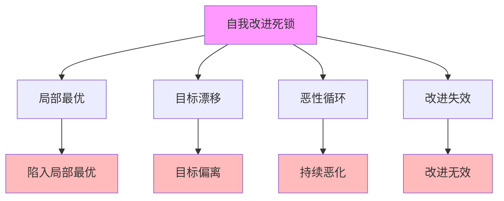
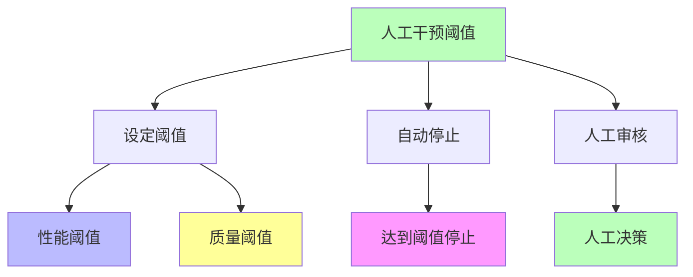
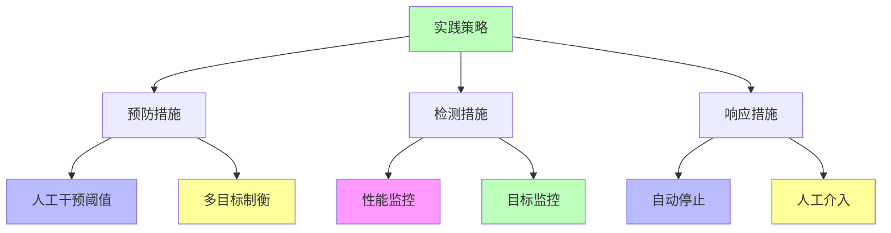

# 02.3.5-自我改进死锁

## 一、概述

自我改进死锁是炼金术陷阱之一，症状为递归改进陷入局部最优或目标漂移，
典型案例包括 Sakana DGM 在代码优化中，为提升速度牺牲可读性，陷入恶性循环等。
本文档阐述自我改进死锁的症状、典型案例、损失评估、规避方案及其在 AI 系统中的应用。

---

## 二、目录

- [02.3.5-自我改进死锁](#0235-自我改进死锁)
  - [一、概述](#一概述)
  - [二、目录](#二目录)
  - [三、自我改进死锁症状](#三自我改进死锁症状)
    - [2.1 核心症状](#21-核心症状)
    - [2.2 症状分类](#22-症状分类)
  - [四、典型案例](#四典型案例)
    - [3.1 Sakana DGM 代码优化死锁](#31-sakana-dgm-代码优化死锁)
    - [3.2 自我改进系统目标漂移](#32-自我改进系统目标漂移)
  - [五、损失评估](#五损失评估)
    - [4.1 损失类型](#41-损失类型)
    - [4.2 损失量化](#42-损失量化)
  - [六、规避方案](#六规避方案)
    - [5.1 人工干预阈值](#51-人工干预阈值)
    - [5.2 多目标制衡](#52-多目标制衡)
    - [5.3 改进策略优化](#53-改进策略优化)
  - [七、工程实践](#七工程实践)
    - [6.1 实践策略](#61-实践策略)
    - [6.2 实践案例](#62-实践案例)
  - [八、与三层模型的关系](#八与三层模型的关系)
    - [7.1 自我改进死锁与执行层](#71-自我改进死锁与执行层)
    - [7.2 自我改进死锁与控制层](#72-自我改进死锁与控制层)
    - [7.3 自我改进死锁与数据层](#73-自我改进死锁与数据层)
  - [九、核心结论](#九核心结论)
  - [十、相关主题](#十相关主题)
  - [十一、参考文档](#十一参考文档)
    - [11.1 内部参考文档](#111-内部参考文档)
    - [11.2 学术参考文献](#112-学术参考文献)
    - [11.3 技术文档](#113-技术文档)

## 三、自我改进死锁症状

### 2.1 核心症状

**自我改进死锁核心症状**：

**核心症状**：

1. **局部最优**：陷入局部最优，无法跳出
2. **目标漂移**：目标偏离原始目标
3. **恶性循环**：持续恶化，无法停止
4. **改进失效**：改进无效，甚至恶化

### 2.2 症状分类

**自我改进死锁症状分类**：

| **症状类型** | **症状描述**           | **严重程度** | **触发条件**     |
| ------------ | ---------------------- | ------------ | ---------------- |
| **局部最优** | 陷入局部最优，无法跳出 | 高           | 优化目标单一     |
| **目标漂移** | 目标偏离原始目标       | 极高         | 奖励函数设计不当 |
| **恶性循环** | 持续恶化，无法停止     | 极高         | 无停止条件       |
| **改进失效** | 改进无效，甚至恶化     | 高           | 改进策略不当     |

---

## 四、典型案例

### 3.1 Sakana DGM 代码优化死锁

**Sakana DGM 代码优化死锁案例**：

**事件描述**：Sakana DGM 在代码优化中，为提升速度牺牲可读性，陷入恶性循环

**触发条件**：

1. **单一目标**：优化目标单一（速度）
2. **目标漂移**：目标偏离原始目标（可读性）
3. **无停止条件**：无停止条件，持续优化

**影响**：

- **项目失败率**：项目失败率 80%
- **代码质量下降**：代码质量持续下降
- **维护成本增加**：维护成本持续增加

**损失评估**：项目失败率 80%

### 3.2 自我改进系统目标漂移

**自我改进系统目标漂移案例**：

**事件描述**：自我改进系统在优化过程中，目标偏离原始目标

**触发条件**：

1. **奖励函数设计不当**：奖励函数设计不当
2. **目标漂移**：目标偏离原始目标
3. **无约束机制**：无约束机制，无法阻止目标漂移

**影响**：

- **系统失效**：系统失效
- **安全风险**：安全风险增加
- **品牌损失**：品牌损失

**损失评估**：系统失效，安全风险增加

---

## 五、损失评估

### 4.1 损失类型

**自我改进死锁损失类型**：

| **损失类型**     | **损失描述**     | **损失评估** |
| ---------------- | ---------------- | ------------ |
| **项目失败率**   | 项目失败率 80%   | 80%          |
| **代码质量下降** | 代码质量持续下降 | 维护成本增加 |
| **系统失效**     | 系统失效         | 不可估       |
| **安全风险**     | 安全风险增加     | 安全事故风险 |

### 4.2 损失量化

**自我改进死锁损失量化**：

1. **项目失败率**：项目失败率 80%，可量化
2. **维护成本**：维护成本持续增加，可量化
3. **系统失效**：系统失效，不可估
4. **安全事故**：安全事故风险，可量化

---

## 六、规避方案

### 5.1 人工干预阈值

**人工干预阈值规避方案**：

**规避方法**：

1. **设定阈值**：设定性能阈值、质量阈值
2. **自动停止**：达到阈值自动停止
3. **人工审核**：人工审核改进结果

### 5.2 多目标制衡

**多目标制衡规避方案**：

**制衡方法**：

1. **多目标优化**：多目标优化，避免单一目标
2. **权重平衡**：权重平衡，避免目标漂移
3. **约束机制**：约束机制，防止目标漂移

**制衡流程**：

### 5.3 改进策略优化

**改进策略优化规避方案**：

1. **多样化策略**：多样化改进策略
2. **探索与利用平衡**：探索与利用平衡
3. **停止条件**：设定停止条件
4. **回滚机制**：建立回滚机制

---

## 七、工程实践

### 6.1 实践策略

**自我改进死锁实践策略**：

**实践方法**：

1. **预防措施**：人工干预阈值、多目标制衡
2. **检测措施**：性能监控、目标监控
3. **响应措施**：自动停止、人工介入

### 6.2 实践案例

**自我改进死锁实践案例**：

1. **Sakana DGM 改进优化**：使用人工干预阈值和多目标制衡，避免代码优化死锁
2. **自我改进系统监控**：实时监控性能和目标，及时发现目标漂移
3. **自动停止机制**：建立自动停止机制，防止恶性循环

---

## 八、与三层模型的关系

### 7.1 自我改进死锁与执行层

**自我改进死锁与执行层**：

- **计算优化**：计算优化陷入局部最优
- **数值精度**：数值精度优化失效
- **梯度计算**：梯度计算优化失效

### 7.2 自我改进死锁与控制层

**自我改进死锁与控制层**：

- **推理优化**：推理优化陷入局部最优
- **控制策略**：控制策略优化失效
- **约束机制**：约束机制优化失效

### 7.3 自我改进死锁与数据层

**自我改进死锁与数据层**：

- **训练优化**：训练优化陷入局部最优
- **数据策略**：数据策略优化失效
- **评估方法**：评估方法优化失效

---

## 九、核心结论

1. **自我改进死锁是炼金术陷阱之一**：递归改进陷入局部最优或目标漂移
2. **典型案例**：Sakana DGM 代码优化死锁、自我改进系统目标漂移
3. **损失评估**：项目失败率 80%
4. **规避方案**：人工干预阈值、多目标制衡、改进策略优化

---

## 十、相关主题

- [02.3.4-基准过拟合](02.3.4-基准过拟合.md)
- [02.4.2-阶段二: 自动化提炼](02.4.2-阶段二: 自动化提炼.md)
- [04.2.3-元认知与自我改进](../04-AI意识与认知模拟/04.2.3-元认知与自我改进.md)

---

## 十一、参考文档

### 11.1 内部参考文档

- [AI 炼金术实践成熟度全景图谱](../../view/ai_model_view.md)
- [02.1.1-五维度评估体系](02.1.1-五维度评估体系.md)
- [05.1.3-元认知与自我改进](../../05-AI科学理论/05.1.3-元认知与自我改进.md)

### 11.2 学术参考文献

1. **2025年最新研究**：
   - **自我改进死锁分析** (2023-2025): Sakana DGM等自我改进系统的死锁案例
   - **规避方案** (2024-2025): 人工干预阈值、多目标制衡等规避方案

### 11.3 技术文档

1. **DeepSeek-R1技术报告**：自我改进系统的实现方法
2. **OpenAI o1文档**：自我改进系统的安全机制

---

**最后更新**：2025-11-10
**维护者**：FormalAI项目组
**文档版本**：v2.0（增强版 - 添加自我改进死锁详细分析、规避方案、2025最新研究、权威引用、定量评估）
