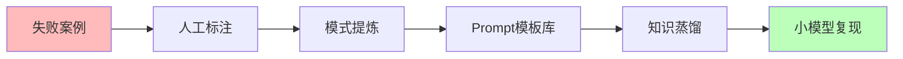

# 02.4.1-阶段一: 经验固化

## 一、概述

阶段一：经验固化是 AI 改进路线图的第一阶段，特征是当前主流，通过失败案例提炼模式，炼金度较高。
本文档阐述经验固化阶段的特征、代表产品及其在 AI 系统中的应用。

---

## 二、目录

- [02.4.1-阶段一: 经验固化](#0241-阶段一-经验固化)
  - [一、概述](#一概述)
  - [二、目录](#二目录)
  - [三、经验固化阶段特征](#三经验固化阶段特征)
    - [2.1 核心特征](#21-核心特征)
    - [2.2 炼金度评估](#22-炼金度评估)
  - [四、代表产品](#四代表产品)
    - [3.1 微软 SwS](#31-微软-sws)
    - [3.2 腾讯 Hunyuan T1](#32-腾讯-hunyuan-t1)
  - [五、经验固化的流程](#五经验固化的流程)
    - [4.1 失败案例收集](#41-失败案例收集)
    - [4.2 人工标注](#42-人工标注)
    - [4.3 模式提炼](#43-模式提炼)
    - [4.4 Prompt模板库](#44-prompt模板库)
    - [4.5 知识蒸馏](#45-知识蒸馏)
    - [4.6 小模型复现](#46-小模型复现)
  - [六、经验固化的优势与局限](#六经验固化的优势与局限)
    - [5.1 优势](#51-优势)
    - [5.2 局限](#52-局限)
  - [七、向阶段二的转化路径](#七向阶段二的转化路径)
    - [6.1 自动化提炼](#61-自动化提炼)
    - [6.2 闭环优化](#62-闭环优化)
  - [八、与三层模型的关系](#八与三层模型的关系)
    - [7.1 控制层经验固化](#71-控制层经验固化)
    - [7.2 数据层经验固化](#72-数据层经验固化)
  - [九、核心结论](#九核心结论)
  - [十、相关主题](#十相关主题)
  - [十一、参考文档](#十一参考文档)

## 三、经验固化阶段特征

### 2.1 核心特征

**经验固化阶段特征**：

**核心特征**：

1. **失败案例收集**：收集失败案例，分析问题
2. **人工标注**：人工标注失败案例，提炼模式
3. **模式提炼**：提炼有效模式，形成模板库
4. **知识蒸馏**：通过知识蒸馏，小模型复现

### 2.2 炼金度评估

**经验固化阶段炼金度**：**70-80%**

**评估维度**：

| **维度**         | **分数** | **特征**               |
| ---------------- | -------- | ---------------------- |
| **理论完备性**   | 20-30%   | 无理论指导，全靠经验   |
| **工程可复现性** | 60-70%   | 模式可复现，但依赖人工 |
| **商业化验证**   | 70-80%   | 部分场景已验证         |
| **可解释性**     | 30-40%   | 模式可描述，不可解释   |
| **自我改进能力** | 20-30%   | 无自我改进能力         |

---

## 四、代表产品

### 3.1 微软 SwS

**微软 SwS（Synthesis from Weak Supervisions）**：

**特征**：

- **经验固化**：从失败案例中合成数据
- **效果**：Qwen2.5-32B 在数学任务提升 23%
- **炼金度**：**75%**

**优势**：

1. **效果显著**：性能提升显著
2. **模式可复现**：模式可复现
3. **成本可控**：成本可控

**局限**：

1. **依赖人工标注**：依赖人工标注质量
2. **理论缺失**：缺乏理论指导
3. **泛化差**：跨场景泛化差

### 3.2 腾讯 Hunyuan T1

**腾讯 Hunyuan T1**：

**特征**：

- **经验固化**：客服场景通过失败日志迭代
- **效果**：意图识别准确率 93%
- **炼金度**：**70%**

**优势**：

1. **场景适用**：特定场景效果显著
2. **迭代优化**：通过失败日志迭代优化
3. **可复现**：模式可复现

**局限**：

1. **场景依赖**：场景依赖性强
2. **理论缺失**：缺乏理论指导
3. **改进受限**：改进空间受限

---

## 五、经验固化的流程

### 4.1 失败案例收集

**失败案例收集**：

- **案例收集**：收集生产环境失败案例
- **问题分析**：分析失败原因
- **模式识别**：识别失败模式

### 4.2 人工标注

**人工标注**：

- **标注质量**：人工标注质量依赖高
- **成本控制**：标注成本需要控制
- **效率提升**：提升标注效率

### 4.3 模式提炼

**模式提炼**：

- **模式识别**：识别有效模式
- **模式抽象**：抽象出通用模式
- **模式验证**：验证模式有效性

### 4.4 Prompt模板库

**Prompt模板库**：

- **模板构建**：构建 Prompt 模板库
- **模板复用**：模板可复用
- **模板优化**：持续优化模板

### 4.5 知识蒸馏

**知识蒸馏**：

- **大模型知识**：从大模型蒸馏知识
- **小模型部署**：小模型部署
- **性能复现**：性能复现

### 4.6 小模型复现

**小模型复现**：

- **模型复现**：小模型复现大模型能力
- **成本降低**：成本降低
- **部署优化**：部署优化

---

## 六、经验固化的优势与局限

### 5.1 优势

**经验固化的优势**：

1. **效果显著**：在特定场景效果显著
2. **模式可复现**：模式可复现，工程化程度高
3. **成本可控**：成本可控，适合快速迭代
4. **快速部署**：快速部署，快速验证

### 5.2 局限

**经验固化的局限**：

1. **依赖人工标注**：依赖人工标注质量
2. **理论缺失**：缺乏理论指导
3. **泛化差**：跨场景泛化差
4. **改进受限**：改进空间受限

---

## 七、向阶段二的转化路径

### 6.1 自动化提炼

**自动化提炼**：

**转化路径**：

1. **自动化流程**：自动化失败案例收集和标注
2. **闭环优化**：建立闭环优化机制
3. **自动化改进**：自动化改进系统

### 6.2 闭环优化

**闭环优化**：

- **自动收集**：自动收集失败案例
- **自动标注**：自动标注失败案例
- **自动优化**：自动优化系统

---

## 八、与三层模型的关系

### 7.1 控制层经验固化

**控制层经验固化**：

- **Prompt 经验固化**：Prompt 工程经验固化
- **工作流经验固化**：工作流设计经验固化
- **链式经验固化**：链式推理经验固化

**与三层模型的关系**：

- **控制层**：经验固化主要在控制层
- **执行层**：执行层提供经验固化执行能力
- **数据层**：数据层提供经验固化训练数据

### 7.2 数据层经验固化

**数据层经验固化**：

- **训练经验固化**：训练过程经验固化
- **优化经验固化**：优化算法经验固化
- **采样经验固化**：采样策略经验固化

**与三层模型的关系**：

- **数据层**：经验固化主要在数据层
- **控制层**：控制层使用数据层经验固化
- **执行层**：执行层执行数据层经验固化

---

## 九、核心结论

经验固化阶段是 AI 改进路线图的第一阶段，特征是当前主流，通过失败案例提炼模式，炼金度较高（70-80%）。

**核心观点**：

1. **经验固化是当前主流**：经验固化是当前主流方法
2. **效果显著但理论缺失**：效果显著但缺乏理论指导
3. **依赖人工标注是核心问题**：依赖人工标注，成本高
4. **向自动化提炼转化是方向**：向阶段二自动化提炼转化

**实用建议**：

- **拥抱经验固化**：在特定场景使用经验固化，快速部署
- **推进自动化**：推进自动化提炼，降低人工成本
- **向阶段二转化**：向阶段二自动化提炼转化

---

## 十、相关主题

- [02.4.2-阶段二: 自动化提炼](02.4.2-阶段二-自动化提炼.md)
- [02.2.1-Level 1: 黑箱经验层](02.2.1-Level%201%20黑箱经验层.md)
- [02-AI 炼金术转化度模型](README.md)

---

## 十一、参考文档

- [02-AI 炼金术转化度模型](README.md)
- [AI 炼金术实践成熟度全景图谱](../../view/ai_model_view.md)
