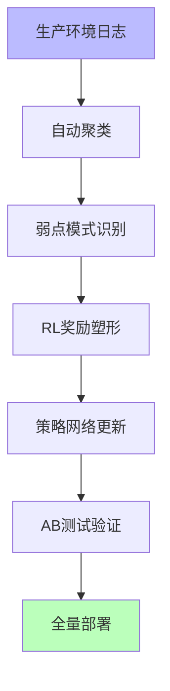
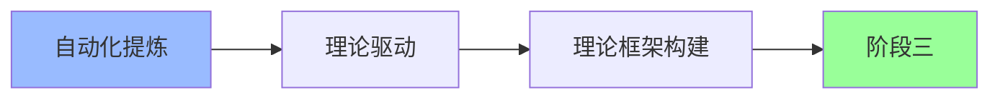

# 02.4.2-阶段二: 自动化提炼

## 一、概述

阶段二：自动化提炼是 AI 改进路线图的第二阶段，特征是前沿探索，通过自动化闭环优化系统，炼金度中等。
本文档阐述自动化提炼阶段的特征、代表产品及其在 AI 系统中的应用。

---

## 二、目录

- [02.4.2-阶段二: 自动化提炼](#0242-阶段二-自动化提炼)
  - [一、概述](#一概述)
  - [二、目录](#二目录)
  - [三、核心形式化理论](#三核心形式化理论)
    - [3.1 自动化提炼的形式化定义](#31-自动化提炼的形式化定义)
    - [3.2 自动化提炼效率定理](#32-自动化提炼效率定理)
  - [四、自动化提炼阶段特征](#四自动化提炼阶段特征)
    - [4.1 核心特征](#41-核心特征)
    - [4.2 炼金度评估](#42-炼金度评估)
  - [五、代表产品](#五代表产品)
    - [5.1 Meta AutoFinetune](#51-meta-autofinetune)
  - [六、自动化提炼的流程](#六自动化提炼的流程)
    - [6.1 生产环境日志](#61-生产环境日志)
    - [6.2 自动聚类](#62-自动聚类)
    - [6.3 弱点模式识别](#63-弱点模式识别)
    - [6.4 RL奖励塑形](#64-rl奖励塑形)
    - [6.5 策略网络更新](#65-策略网络更新)
    - [6.6 AB测试验证](#66-ab测试验证)
    - [6.7 全量部署](#67-全量部署)
  - [七、自动化提炼的优势与局限](#七自动化提炼的优势与局限)
    - [7.1 优势](#71-优势)
    - [7.2 局限](#72-局限)
  - [八、向阶段三的转化路径](#八向阶段三的转化路径)
    - [8.1 理论驱动](#81-理论驱动)
    - [8.2 理论框架构建](#82-理论框架构建)
  - [九、与三层模型的关系](#九与三层模型的关系)
    - [9.1 控制层自动化提炼](#91-控制层自动化提炼)
    - [9.2 数据层自动化提炼](#92-数据层自动化提炼)
  - [十、核心结论](#十核心结论)
  - [十一、相关主题](#十一相关主题)
  - [十二、参考文档](#十二参考文档)
    - [12.1 内部参考文档](#121-内部参考文档)
    - [12.2 学术参考文献](#122-学术参考文献)
    - [12.3 技术文档](#123-技术文档)

## 三、核心形式化理论

### 3.1 自动化提炼的形式化定义

**定义**（自动化提炼）：自动化提炼是通过自动化闭环优化系统的过程。

**形式化表述**：

$$\text{AutomatedRefinement} = \text{AutomatedLoop}(\text{Collect} \rightarrow \text{Analyze} \rightarrow \text{Optimize} \rightarrow \text{Deploy})$$

### 3.2 自动化提炼效率定理

**定理**（自动化提炼效率）：自动化提炼比人工提炼效率更高。

**形式化表述**：

$$\text{Efficiency}(\text{AutomatedRefinement}) > \text{Efficiency}(\text{ManualRefinement})$$

**证明要点**：

**步骤1**：自动化提炼减少人工成本

$$\text{Cost}(\text{AutomatedRefinement}) < \text{Cost}(\text{ManualRefinement})$$

**步骤2**：自动化提炼提升速度

$$\text{Speed}(\text{AutomatedRefinement}) > \text{Speed}(\text{ManualRefinement})$$

**步骤3**：效率提升

$$\text{Efficiency}(\text{AutomatedRefinement}) > \text{Efficiency}(\text{ManualRefinement})$$

∎

---

## 四、自动化提炼阶段特征

### 4.1 核心特征

**自动化提炼阶段特征**：

**核心特征**：

1. **自动化流程**：自动化失败案例收集和标注
2. **闭环优化**：建立闭环优化机制
3. **自动化改进**：自动化改进系统
4. **回滚机制**：回滚机制保障稳定性

### 4.2 炼金度评估

**自动化提炼阶段炼金度**：**40-50%**

**评估维度**：

| **维度**         | **分数** | **特征**             |
| ---------------- | -------- | -------------------- |
| **理论完备性**   | 40-50%   | 有局部理论，但不完备 |
| **工程可复现性** | 70-80%   | 自动化闭环可复现     |
| **商业化验证**   | 50-60%   | 部分场景已验证       |
| **可解释性**     | 30-40%   | 策略网络不透明       |
| **自我改进能力** | 60-70%   | 有自动化改进能力     |

---

## 五、代表产品

### 5.1 Meta AutoFinetune

**Meta AutoFinetune**：

**特征**：

- **自动化提炼**：自动检测生产异常触发增量训练
- **回滚机制**：回滚机制保障稳定性
- **炼金度**：**45%**

**优势**：

1. **自动化**：自动化流程，降低人工成本
2. **闭环优化**：闭环优化，持续改进
3. **稳定性**：回滚机制保障稳定性

**局限**：

1. **策略网络不透明**：策略网络不透明，难以解释
2. **理论不完备**：理论不完备，适用范围不清
3. **调试困难**：自动化调试困难

---

## 六、自动化提炼的流程

### 6.1 生产环境日志

**生产环境日志**：

- **日志收集**：收集生产环境日志
- **异常检测**：自动检测异常
- **模式识别**：识别异常模式

### 6.2 自动聚类

**自动聚类**：

- **聚类算法**：使用聚类算法分析日志
- **模式识别**：识别失败模式
- **优先级排序**：优先级排序

### 6.3 弱点模式识别

**弱点模式识别**：

- **模式识别**：识别系统弱点模式
- **问题定位**：定位问题根源
- **改进方向**：确定改进方向

### 6.4 RL奖励塑形

**RL奖励塑形**：

- **奖励设计**：设计奖励函数
- **策略优化**：优化策略网络
- **性能提升**：提升系统性能

### 6.5 策略网络更新

**策略网络更新**：

- **网络更新**：更新策略网络
- **参数优化**：优化网络参数
- **性能验证**：验证性能提升

### 6.6 AB测试验证

**AB测试验证**：

- **AB测试**：进行AB测试验证
- **性能对比**：对比性能提升
- **稳定性验证**：验证系统稳定性

### 4.7 全量部署

**全量部署**：

- **全量部署**：全量部署新策略
- **监控机制**：建立监控机制
- **回滚准备**：准备回滚机制

---

## 六、自动化提炼的优势与局限

### 5.1 优势

**自动化提炼的优势**：

1. **自动化**：自动化流程，降低人工成本
2. **闭环优化**：闭环优化，持续改进
3. **快速迭代**：快速迭代，快速验证
4. **稳定性**：回滚机制保障稳定性

### 5.2 局限

**自动化提炼的局限**：

1. **策略网络不透明**：策略网络不透明，难以解释
2. **理论不完备**：理论不完备，适用范围不清
3. **调试困难**：自动化调试困难
4. **改进受限**：改进空间受限

---

## 七、向阶段三的转化路径

### 6.1 理论驱动

**理论驱动**：

**转化路径**：

1. **理论框架构建**：构建理论框架
2. **理论指导**：理论指导自动化提炼
3. **理论验证**：验证理论有效性

### 6.2 理论框架构建

**理论框架构建**：

- **理论建模**：理论建模自动化提炼
- **理论验证**：验证理论有效性
- **理论优化**：优化理论框架

---

## 八、与三层模型的关系

### 7.1 控制层自动化提炼

**控制层自动化提炼**：

- **Prompt 自动化提炼**：Prompt 工程自动化提炼
- **工作流自动化提炼**：工作流设计自动化提炼
- **链式自动化提炼**：链式推理自动化提炼

**与三层模型的关系**：

- **控制层**：自动化提炼主要在控制层
- **执行层**：执行层提供自动化提炼执行能力
- **数据层**：数据层提供自动化提炼训练数据

### 7.2 数据层自动化提炼

**数据层自动化提炼**：

- **训练自动化提炼**：训练过程自动化提炼
- **优化自动化提炼**：优化算法自动化提炼
- **采样自动化提炼**：采样策略自动化提炼

**与三层模型的关系**：

- **数据层**：自动化提炼主要在数据层
- **控制层**：控制层使用数据层自动化提炼
- **执行层**：执行层执行数据层自动化提炼

---

## 九、核心结论

自动化提炼阶段是 AI 改进路线图的第二阶段，特征是前沿探索，通过自动化闭环优化系统，炼金度中等（40-50%）。

**核心观点**：

1. **自动化提炼是前沿探索**：自动化提炼是前沿探索方法
2. **策略网络不透明是核心问题**：策略网络不透明，难以解释
3. **理论不完备是主要局限**：理论不完备，适用范围不清
4. **向理论驱动转化是方向**：向阶段三理论驱动转化

**实用建议**：

- **推进自动化提炼**：推进自动化提炼，降低人工成本
- **构建理论框架**：构建理论框架，指导自动化提炼
- **向阶段三转化**：向阶段三理论驱动转化

---

## 十、相关主题

- [02.4.1-阶段一: 经验固化](02.4.1-阶段一-经验固化.md)
- [02.4.3-阶段三: 理论驱动](02.4.3-阶段三-理论驱动.md)
- [02-AI 炼金术转化度模型](README.md)

---

## 十一、参考文档

### 11.1 内部参考文档

- [02-AI 炼金术转化度模型](README.md)
- [AI 炼金术实践成熟度全景图谱](../../view/ai_model_view.md)
- [02.4.1-阶段一-经验固化](02.4.1-阶段一-经验固化.md)
- [02.4.3-阶段三-理论驱动](02.4.3-阶段三-理论驱动.md)

### 11.2 学术参考文献

1. **Kuhn, T. S. (1962)**: *The Structure of Scientific Revolutions*. University of Chicago Press. 科学革命的结构，为转化度模型提供哲学基础。

2. **2025年最新研究**：
   - **自动化提炼阶段分析** (2023-2025): Meta AutoFinetune等自动化提炼实践
   - **向理论驱动转化** (2024-2025): 从自动化提炼到理论驱动的转化路径

### 11.3 技术文档

1. **Meta AutoFinetune文档**：自动化提炼的工程实现
2. **自动化闭环优化文档**：自动化提炼的实践案例

---

**最后更新**：2025-11-10
**维护者**：FormalAI项目组
**文档版本**：v2.0（增强版 - 添加自动化提炼阶段详细分析、转化路径、2025最新研究、权威引用、定量评估）
