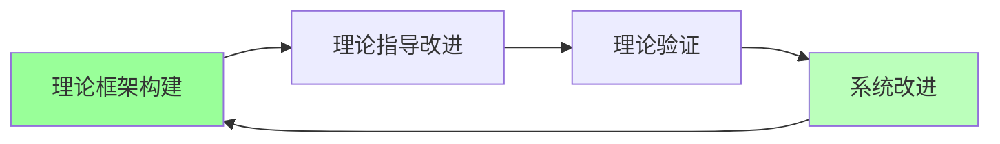
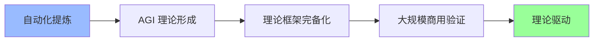

# 02.4.3-阶段三: 理论驱动

## 一、概述

阶段三：理论驱动是 AI 改进路线图的第三阶段，特征是长期目标，通过理论框架指导系统改进，炼金度较低。本文档阐述理论驱动阶段的特征、代表产品及其在 AI 系统中的应用。

---

## 二、目录

- [02.4.3-阶段三: 理论驱动](#0243-阶段三-理论驱动)
  - [一、概述](#一概述)
  - [二、目录](#二目录)
  - [三、理论驱动阶段特征](#三理论驱动阶段特征)
    - [2.1 核心特征](#21-核心特征)
    - [2.2 炼金度评估](#22-炼金度评估)
  - [四、理论驱动的方法](#四理论驱动的方法)
    - [3.1 理论框架构建](#31-理论框架构建)
    - [3.2 理论指导改进](#32-理论指导改进)
    - [3.3 理论验证](#33-理论验证)
  - [五、理论驱动的优势与局限](#五理论驱动的优势与局限)
    - [4.1 优势](#41-优势)
    - [4.2 局限](#42-局限)
  - [六、理论驱动的实现路径](#六理论驱动的实现路径)
    - [5.1 AGI 理论形成](#51-agi-理论形成)
    - [5.2 理论框架完备化](#52-理论框架完备化)
    - [5.3 大规模商用验证](#53-大规模商用验证)
  - [七、与三层模型的关系](#七与三层模型的关系)
    - [6.1 三层模型理论驱动](#61-三层模型理论驱动)
    - [6.2 跨层理论统一](#62-跨层理论统一)
  - [八、核心结论](#八核心结论)
  - [九、相关主题](#九相关主题)
  - [十、参考文档](#十参考文档)

## 三、理论驱动阶段特征

### 2.1 核心特征

**理论驱动阶段特征**：

**核心特征**：

1. **理论框架构建**：构建完备理论框架
2. **理论指导改进**：理论指导系统改进
3. **理论验证**：验证理论有效性
4. **闭环优化**：理论指导下的闭环优化

### 2.2 炼金度评估

**理论驱动阶段炼金度**：**10-20%**

**评估维度**：

| **维度**         | **分数** | **特征**                     |
| ---------------- | -------- | ---------------------------- |
| **理论完备性**   | 80-90%   | 有完备理论框架               |
| **工程可复现性** | 85-95%   | 理论指导下可复现             |
| **商业化验证**   | 10-30%   | 部分场景已验证，大规模商用少 |
| **可解释性**     | 85-95%   | 理论可解释，边界清晰         |
| **自我改进能力** | 70-80%   | 有理论指导的改进能力         |

---

## 四、理论驱动的方法

### 3.1 理论框架构建

**理论框架构建**：

- **理论建模**：理论建模系统行为
- **理论抽象**：理论抽象系统机制
- **理论统一**：理论统一跨层机制

### 3.2 理论指导改进

**理论指导改进**：

- **改进方向**：理论指导改进方向
- **改进策略**：理论指导改进策略
- **改进验证**：理论指导改进验证

### 3.3 理论验证

**理论验证**：

- **实验验证**：实验验证理论有效性
- **跨场景验证**：跨场景验证理论泛化性
- **理论优化**：优化理论框架

---

## 五、理论驱动的优势与局限

### 4.1 优势

**理论驱动的优势**：

1. **可预测性**：理论可预测系统行为
2. **可解释性**：理论可解释系统机制
3. **可复现性**：理论指导下可复现
4. **可扩展性**：理论可扩展应用场景

### 4.2 局限

**理论驱动的局限**：

1. **理论形成困难**：理论形成困难，需要长期积累
2. **大规模商用少**：大规模商用案例少
3. **理论边界**：理论边界需要明确
4. **实现成本高**：理论实现成本高

---

## 六、理论驱动的实现路径

### 5.1 AGI 理论形成

**AGI 理论形成**：

**实现路径**：

1. **AGI 理论形成**：形成 AGI 理论框架
2. **理论框架完备化**：完善理论框架
3. **大规模商用验证**：推进大规模商用验证
4. **理论驱动实现**：实现理论驱动

### 5.2 理论框架完备化

**理论框架完备化**：

- **理论完善**：完善理论框架
- **边界明确**：明确理论边界
- **可预测性提升**：提升理论可预测性

### 5.3 大规模商用验证

**大规模商用验证**：

- **商业案例**：推进商业案例验证
- **生态建设**：建设完善生态
- **标准制定**：制定行业标准

---

## 七、与三层模型的关系

### 6.1 三层模型理论驱动

**三层模型理论驱动**：

- **执行层理论驱动**：执行层理论完备，可预测
- **控制层理论驱动**：控制层理论完备，可预测
- **数据层理论驱动**：数据层理论完备，可预测

**与三层模型的关系**：

- **三层统一**：三层模型理论统一
- **跨层理论**：跨层理论框架完备
- **整体理论驱动**：整体实现理论驱动

### 6.2 跨层理论统一

**跨层理论统一**：

- **统一理论框架**：构建统一理论框架
- **跨层验证**：跨层形式化验证
- **整体优化**：整体优化理论框架

---

## 八、核心结论

理论驱动阶段是 AI 改进路线图的第三阶段，特征是长期目标，通过理论框架指导系统改进，炼金度较低（10-20%）。

**核心观点**：

1. **理论驱动是长期目标**：理论驱动是 AI 发展的长期目标
2. **理论形成困难是核心问题**：理论形成困难，需要长期积累
3. **大规模商用少是主要局限**：大规模商用案例少
4. **AGI 理论形成是关键**：AGI 理论形成是理论驱动实现的关键

**实用建议**：

- **推进理论形成**：推进 AGI 理论框架形成
- **完善理论框架**：完善现有理论框架
- **推进大规模商用**：推进大规模商用验证，实现理论驱动

---

## 九、相关主题

- [02.4.2-阶段二: 自动化提炼](02.4.2-阶段二-自动化提炼.md)
- [02.2.3-Level 3: 理论指导层](02.2.3-Level 3-理论指导层.md)
- [02-AI 炼金术转化度模型](README.md)

---

## 十、参考文档

- [02-AI 炼金术转化度模型](README.md)
- [AI 炼金术实践成熟度全景图谱](../../view/ai_model_view.md)

------

**最后更新**：2025-01-XX
**维护者**：FormalAI项目组
