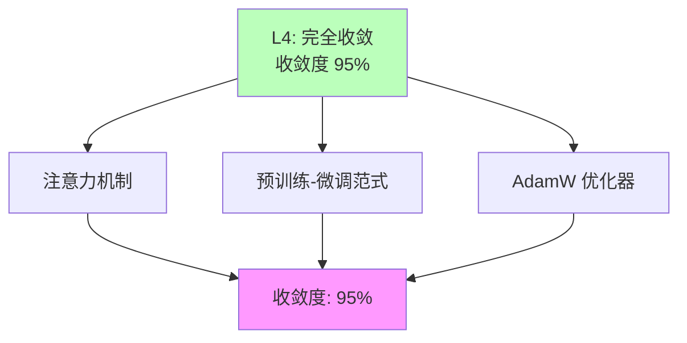

# 03.1.1-L4: 完全收敛（工业标准）

## 一、概述

L4: 完全收敛（工业标准）是收敛模型分类的最高层级，特征是无有效替代方案，放弃研究其他路径，收敛度 95%。本文档阐述完全收敛的特征、代表技术及其在 AI 系统中的应用。

---

## 二、目录

- [03.1.1-L4: 完全收敛（工业标准）](#0311-l4-完全收敛工业标准)
  - [一、概述](#一概述)
  - [二、目录](#二目录)
  - [三、完全收敛定义](#三完全收敛定义)
    - [2.1 收敛状态](#21-收敛状态)
    - [2.2 收敛度评估](#22-收敛度评估)
  - [四、代表技术](#四代表技术)
    - [3.1 注意力机制](#31-注意力机制)
    - [3.2 预训练-微调范式](#32-预训练-微调范式)
    - [3.3 AdamW 优化器](#33-adamw-优化器)
  - [五、完全收敛的影响](#五完全收敛的影响)
    - [4.1 技术影响](#41-技术影响)
    - [4.2 产业影响](#42-产业影响)
  - [六、与收敛模型的关系](#六与收敛模型的关系)
    - [5.1 L4 vs L3](#51-l4-vs-l3)
    - [5.2 L4 vs L2](#52-l4-vs-l2)
  - [七、核心结论](#七核心结论)
  - [八、相关主题](#八相关主题)
  - [九、参考文档](#九参考文档)

## 三、完全收敛定义

### 2.1 收敛状态

**完全收敛状态**：

| **维度**     | **特征**               | **2025 状态**        |
| ------------ | ---------------------- | -------------------- |
| **采用率**   | 100%新产品采用         | 完全收敛             |
| **研究投入** | 已放弃研究其他路径     | 成为"公共知识"       |
| **争议度**   | 无争议                 | 已被广泛接受         |
| **确定性**   | ★★★★★                  | 完全确定，可精确预测 |
| **收敛度**   | 95%                    | 完全收敛             |

### 2.2 收敛度评估

**完全收敛特征**：



---

## 四、代表技术

### 3.1 注意力机制

**注意力机制（Attention Mechanism）**：

**收敛状态**：

- **采用率**：100%（所有 Transformer 架构都使用）
- **研究投入**：业界已放弃研究替代方案
- **争议度**：无争议
- **确定性**：★★★★★

**注意力机制公式**：

```text
Attention(Q, K, V) = softmax(QK^T / √d_k) V
```

**在 AI 系统中的应用**：

- **Transformer 架构**：所有 Transformer 架构都使用注意力机制
- **BERT、GPT**：BERT、GPT 等模型都基于注意力机制
- **视觉 Transformer**：视觉 Transformer 也使用注意力机制

### 3.2 预训练-微调范式

**预训练-微调范式（Pre-training Fine-tuning）**：

**收敛状态**：

- **采用率**：100%（所有 LLM 都使用）
- **研究投入**：业界已放弃研究替代方案
- **争议度**：无争议
- **确定性**：★★★★★

**预训练-微调范式优势**：

1. **迁移学习**：通过预训练迁移学习
2. **任务适应**：通过微调适应特定任务
3. **工程成熟**：工程化成熟，工具链完善

### 3.3 AdamW 优化器

**AdamW 优化器**：

**收敛状态**：

- **采用率**：100%（所有 LLM 训练都使用）
- **研究投入**：业界已放弃研究替代方案
- **争议度**：无争议
- **确定性**：★★★★★

---

## 五、完全收敛的影响

### 4.1 技术影响

**技术影响**：

- **完全收敛**：技术完全收敛
- **标准化**：技术标准化
- **工具化**：技术工具化
- **成本化**：技术成本化

### 4.2 产业影响

**产业影响**：

- **完全垄断**：技术完全垄断
- **生态统一**：生态完全统一
- **成本最低**：技术成本最低
- **创新受限**：创新空间受限

---

## 六、与收敛模型的关系

### 5.1 L4 vs L3

**L4 vs L3 对比**：

| **维度**   | **L4: 完全收敛** | **L3: 准收敛** |
| ---------- | ----------------- | -------------- |
| **采用率** | 100%              | 90%+           |
| **研究投入** | 已放弃研究其他路径 | 研究投入低     |
| **争议度** | 无争议            | 争议度低       |
| **收敛度** | 95%               | 85%            |

### 5.2 L4 vs L2

**L4 vs L2 对比**：

| **维度**   | **L4: 完全收敛** | **L2: 收敛进行时** |
| ---------- | ----------------- | ----------------- |
| **采用率** | 100%              | 50-70%            |
| **研究投入** | 已放弃研究其他路径 | 研究投入高       |
| **争议度** | 无争议            | 争议度中等       |
| **收敛度** | 95%               | 60%               |

---

## 七、核心结论

1. **L4 完全收敛是最高层级**：收敛度 95%，无有效替代方案
2. **注意力机制、预训练-微调范式、AdamW 优化器**：是 L4 完全收敛的代表技术
3. **完全收敛带来完全垄断**：技术完全垄断，创新空间受限
4. **完全收敛形成工业标准**：已成为工业标准，被广泛接受

---

## 八、相关主题

- [03.1.2-L3: 准收敛（事实垄断）](03.1.2-L3-准收敛（事实垄断）.md)
- [03.2.1-数学层收敛](03.2.1-数学层收敛.md)
- [03-Scaling Law与收敛分析](README.md)

---

## 九、参考文档

- [03-Scaling Law与收敛分析](README.md)
- [AI 收敛分析全景图谱](../../view/ai_scale_view.md)

------

**最后更新**：2025-01-XX
**维护者**：FormalAI项目组