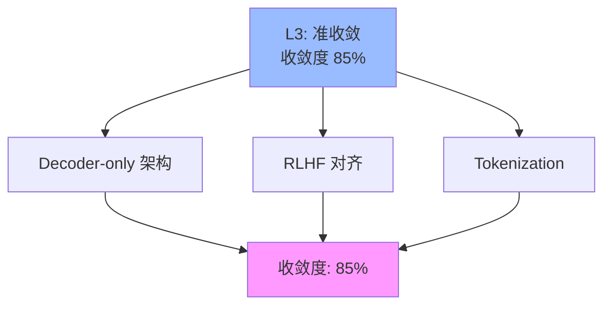

# 03.1.2-L3: 准收敛（事实垄断）

## 一、概述

L3: 准收敛（事实垄断）是收敛模型分类的第三层级，特征是 90%以上新产品采用，但理论挑战存在，收敛度 85%。本文档阐述准收敛的特征、代表技术及其在 AI 系统中的应用。

---

## 二、目录

- [03.1.2-L3: 准收敛（事实垄断）](#0312-l3-准收敛事实垄断)
  - [一、概述](#一概述)
  - [二、目录](#二目录)
  - [三、准收敛定义](#三准收敛定义)
    - [2.1 收敛状态](#21-收敛状态)
    - [2.2 收敛度评估](#22-收敛度评估)
  - [四、代表技术](#四代表技术)
    - [3.1 Decoder-only 架构](#31-decoder-only-架构)
    - [3.2 RLHF 对齐](#32-rlhf-对齐)
    - [3.3 Tokenization](#33-tokenization)
  - [五、准收敛的影响](#五准收敛的影响)
    - [4.1 技术影响](#41-技术影响)
    - [4.2 产业影响](#42-产业影响)
  - [六、与收敛模型的关系](#六与收敛模型的关系)
    - [5.1 L3 vs L4](#51-l3-vs-l4)
    - [5.2 L3 vs L2](#52-l3-vs-l2)
  - [七、核心结论](#七核心结论)
  - [八、相关主题](#八相关主题)
  - [九、参考文档](#九参考文档)

## 三、准收敛定义

### 2.1 收敛状态

**准收敛状态**：

| **维度**     | **特征**               | **2025 状态**        |
| ------------ | ---------------------- | -------------------- |
| **采用率**   | 90%+                   | 90%以上新产品采用     |
| **研究投入** | 低                     | 研究投入低           |
| **争议度**   | 低                     | 争议度低             |
| **确定性**   | ★★★★☆                  | 基本确定，但存在理论挑战 |
| **收敛度**   | 85%                    | 准收敛               |

### 2.2 收敛度评估

**准收敛特征**：

---

## 四、代表技术

### 3.1 Decoder-only 架构

**Decoder-only 架构**：

**收敛状态**：

- **采用率**：90%+（大部分 LLM 都使用）
- **研究投入**：低（业界已基本放弃其他架构）
- **争议度**：低
- **确定性**：★★★★☆

**Decoder-only 架构优势**：

1. **自回归生成**：自回归生成能力强
2. **训练简单**：训练流程简单
3. **工程成熟**：工程化成熟

**理论挑战**：

- **二次方复杂度**：注意力机制二次方复杂度
- **效率瓶颈**：长上下文效率瓶颈

### 3.2 RLHF 对齐

**RLHF（Reinforcement Learning from Human Feedback）**：

**收敛状态**：

- **采用率**：90%+（大部分 LLM 都使用）
- **研究投入**：低
- **争议度**：低
- **确定性**：★★★★☆

**RLHF 优势**：

1. **行为对齐**：行为对齐人类偏好
2. **安全性**：提升模型安全性
3. **工程成熟**：工程化成熟

**理论挑战**：

- **偏好主观性**：人类偏好主观性
- **对齐目标**：对齐目标不明确

### 3.3 Tokenization

**Tokenization（分词）**：

**收敛状态**：

- **采用率**：90%+（大部分 LLM 都使用）
- **研究投入**：低
- **争议度**：低
- **确定性**：★★★★☆

**Tokenization 优势**：

1. **文本处理**：文本处理标准化
2. **工程成熟**：工程化成熟
3. **工具链完善**：工具链完善

**理论挑战**：

- **语言差异**：不同语言分词差异
- **语义损失**：分词可能损失语义

---

## 五、准收敛的影响

### 4.1 技术影响

**技术影响**：

- **准收敛**：技术准收敛
- **标准化**：技术标准化
- **工具化**：技术工具化
- **创新受限**：创新空间受限

### 4.2 产业影响

**产业影响**：

- **事实垄断**：技术事实垄断
- **生态统一**：生态基本统一
- **成本降低**：技术成本降低
- **理论挑战**：面临理论挑战

---

## 六、与收敛模型的关系

### 5.1 L3 vs L4

**L3 vs L4 对比**：

| **维度**   | **L3: 准收敛** | **L4: 完全收敛** |
| ---------- | -------------- | ---------------- |
| **采用率** | 90%+           | 100%             |
| **研究投入** | 低             | 已放弃研究其他路径 |
| **争议度** | 低             | 无争议           |
| **收敛度** | 85%            | 95%              |

### 5.2 L3 vs L2

**L3 vs L2 对比**：

| **维度**   | **L3: 准收敛** | **L2: 收敛进行时** |
| ---------- | -------------- | ------------------ |
| **采用率** | 90%+           | 50-70%             |
| **研究投入** | 低             | 高                 |
| **争议度** | 低             | 中                 |
| **收敛度** | 85%            | 60%                |

---

## 七、核心结论

1. **L3 准收敛是第三层级**：收敛度 85%，90%以上新产品采用
2. **Decoder-only 架构、RLHF 对齐、Tokenization**：是 L3 准收敛的代表技术
3. **准收敛带来事实垄断**：技术事实垄断，但存在理论挑战
4. **理论挑战是主要问题**：效率瓶颈、偏好主观性等理论挑战

---

## 八、相关主题

- [03.1.1-L4: 完全收敛（工业标准）](03.1.1-L4-完全收敛（工业标准）.md)
- [03.1.3-L2: 收敛进行时（双寡头竞争）](03.1.3-L2-收敛进行时（双寡头竞争）.md)
- [03-Scaling Law 与收敛分析](README.md)

---

## 九、参考文档

- [03-Scaling Law 与收敛分析](README.md)
- [AI 收敛分析全景图谱](../../view/ai_scale_view.md)

------

**最后更新**：2025-01-XX
**维护者**：FormalAI项目组