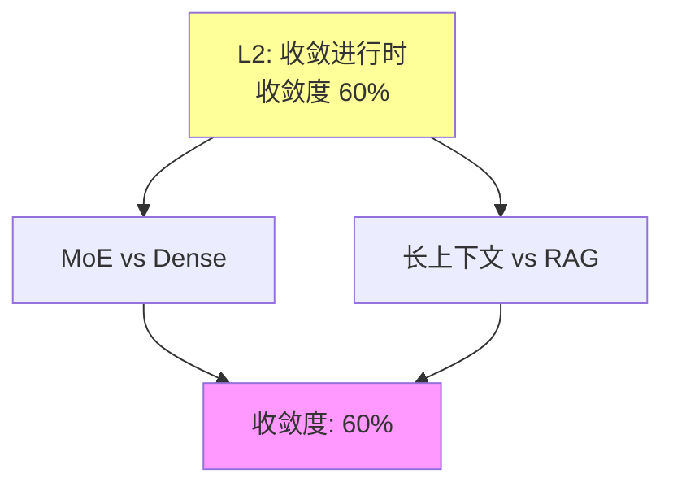

# 03.1.3-L2: 收敛进行时（双寡头竞争）

## 一、概述

L2: 收敛进行时（双寡头竞争）是收敛模型分类的第二层级，特征是两种方案并存，各有优劣，未分胜负，收敛度 60%。本文档阐述收敛进行时的特征、代表技术及其在 AI 系统中的应用。

---

## 二、目录

- [03.1.3-L2: 收敛进行时（双寡头竞争）](#0313-l2-收敛进行时双寡头竞争)
  - [一、概述](#一概述)
  - [二、目录](#二目录)
  - [三、收敛进行时定义](#三收敛进行时定义)
    - [2.1 收敛状态](#21-收敛状态)
    - [2.2 收敛度评估](#22-收敛度评估)
  - [四、代表技术](#四代表技术)
    - [3.1 MoE vs Dense](#31-moe-vs-dense)
    - [3.2 长上下文（128K+）vs RAG](#32-长上下文128kvs-rag)
  - [五、双寡头竞争分析](#五双寡头竞争分析)
    - [4.1 竞争态势](#41-竞争态势)
    - [4.2 技术特征](#42-技术特征)
  - [六、与收敛模型的关系](#六与收敛模型的关系)
    - [5.1 L2 vs L3](#51-l2-vs-l3)
    - [5.2 L2 vs L1](#52-l2-vs-l1)
  - [七、核心结论](#七核心结论)
  - [八、相关主题](#八相关主题)
  - [九、参考文档](#九参考文档)

## 三、收敛进行时定义

### 2.1 收敛状态

**收敛进行时状态**：

| **维度**     | **特征**             | **2025 状态**        |
| ------------ | -------------------- | -------------------- |
| **采用率**   | 50-70%               | 两种方案各占 50-70%  |
| **研究投入** | 高                   | 研究投入高           |
| **争议度**   | 中                   | 争议度中等           |
| **确定性**   | ★★★☆☆                | 基本确定，但存在争议 |
| **收敛度**   | 60%                  | 收敛进行时           |

### 2.2 收敛度评估

**收敛进行时特征**：

---

## 四、代表技术

### 3.1 MoE vs Dense

**MoE（Mixture of Experts）vs Dense（密集模型）**：

**竞争态势**：

| **维度**     | **MoE（Mixture of Experts）** | **Dense（密集模型）** |
| ------------ | ----------------------------- | --------------------- |
| **代表产品** | GPT-4、Claude 3.5             | GPT-3、PaLM           |
| **优势**     | 参数多、成本低、推理快        | 训练简单、稳定        |
| **劣势**     | 动态路由不稳定、训练复杂      | 参数少、成本高        |
| **采用率**   | 60%                           | 40%                   |
| **研究投入** | 高                            | 中                    |

**技术特征**：

- **MoE**：动态路由，参数多，成本低
- **Dense**：全连接，参数少，稳定

### 3.2 长上下文（128K+）vs RAG

**长上下文（128K+）vs RAG（检索增强生成）**：

**竞争态势**：

| **维度**     | **长上下文（128K+）**   | **RAG（检索增强生成）**  |
| ------------ | ----------------------- | ------------------------ |
| **代表产品** | Claude 3.5、GPT-4 Turbo | Perplexity、You.com      |
| **优势**     | 上下文完整、推理连贯    | 成本低、实时更新         |
| **劣势**     | 成本高、计算复杂        | 检索质量依赖、上下文断裂 |
| **采用率**   | 50%                     | 50%                      |
| **研究投入** | 高                      | 高                       |

**技术特征**：

- **长上下文**：上下文长，推理连贯，成本高
- **RAG**：成本低，实时更新，检索依赖

---

## 五、双寡头竞争分析

### 4.1 竞争态势

**竞争态势**：

- **双寡头竞争**：两种方案并存，各有优劣
- **未分胜负**：尚未分出胜负，竞争激烈
- **研究投入高**：研究投入高，快速迭代

### 4.2 技术特征

**技术特征**：

- **各有优劣**：两种方案各有优劣
- **适用场景不同**：适用场景不同
- **技术演进**：技术快速演进

---

## 六、与收敛模型的关系

### 5.1 L2 vs L3

**L2 vs L3 对比**：

| **维度**   | **L2: 收敛进行时** | **L3: 准收敛** |
| ---------- | ------------------ | -------------- |
| **采用率** | 50-70%             | 90%+           |
| **研究投入** | 高                 | 低             |
| **争议度** | 中                 | 低             |
| **收敛度** | 60%                | 85%            |

### 5.2 L2 vs L1

**L2 vs L1 对比**：

| **维度**   | **L2: 收敛进行时** | **L1: 未收敛** |
| ---------- | ------------------ | -------------- |
| **采用率** | 50-70%             | <50%           |
| **研究投入** | 高                 | 高             |
| **争议度** | 中                 | 高             |
| **收敛度** | 60%                | 30%            |

---

## 七、核心结论

1. **L2 收敛进行时是第二层级**：收敛度 60%，两种方案并存
2. **MoE vs Dense、长上下文 vs RAG**：是 L2 收敛进行时的代表技术
3. **双寡头竞争是主要特征**：两种方案并存，各有优劣
4. **技术演进是主要方向**：技术快速演进，竞争激烈

---

## 八、相关主题

- [03.1.2-L3: 准收敛（事实垄断）](03.1.2-L3-准收敛（事实垄断）.md)
- [03.1.4-L1: 未收敛（百家争鸣）](03.1.4-L1-未收敛（百家争鸣）.md)
- [03-Scaling Law 与收敛分析](README.md)

---

## 九、参考文档

- [03-Scaling Law 与收敛分析](README.md)
- [AI 收敛分析全景图谱](../../view/ai_scale_view.md)
