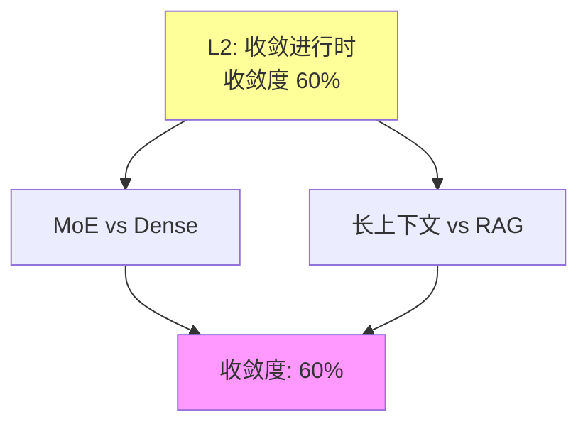

# 03.1.3-L2: 收敛进行时（双寡头竞争）

## 一、概述

L2: 收敛进行时（双寡头竞争）是收敛模型分类的第二层级，特征是两种方案并存，各有优劣，未分胜负，收敛度 60%。本文档阐述收敛进行时的特征、代表技术及其在 AI 系统中的应用。

---

## 二、目录

- [03.1.3-L2: 收敛进行时（双寡头竞争）](#0313-l2-收敛进行时双寡头竞争)
  - [一、概述](#一概述)
  - [二、目录](#二目录)
  - [三、核心形式化理论](#三核心形式化理论)
    - [3.1 收敛进行时的形式化定义](#31-收敛进行时的形式化定义)
    - [3.2 MoE架构效率定理](#32-moe架构效率定理)
  - [四、收敛进行时定义](#四收敛进行时定义)
    - [4.1 收敛状态](#41-收敛状态)
    - [2.2 收敛度评估](#22-收敛度评估)
  - [四、代表技术](#四代表技术)
    - [3.1 MoE vs Dense](#31-moe-vs-dense)
    - [3.2 长上下文（128K+）vs RAG](#32-长上下文128kvs-rag)
  - [五、双寡头竞争分析](#五双寡头竞争分析)
    - [4.1 竞争态势](#41-竞争态势)
    - [4.2 技术特征](#42-技术特征)
  - [六、与收敛模型的关系](#六与收敛模型的关系)
    - [5.1 L2 vs L3](#51-l2-vs-l3)
    - [5.2 L2 vs L1](#52-l2-vs-l1)
  - [七、核心结论](#七核心结论)
  - [八、相关主题](#八相关主题)
  - [九、参考文档](#九参考文档)
    - [9.1 内部参考文档](#91-内部参考文档)
    - [9.2 学术参考文献](#92-学术参考文献)
    - [9.3 技术文档](#93-技术文档)

## 三、核心形式化理论

### 3.1 收敛进行时的形式化定义

**定义**（收敛进行时）：对于技术方案 $T$，收敛进行时度 $C_2(T) \in [0, 1]$ 定义为：

$$C_2(T) = w_1 \cdot \text{AdoptionRate}(T) + w_2 \cdot \text{Standardization}(T) + w_3 \cdot (1 - \text{Controversy}(T))$$

其中：

- $\text{AdoptionRate}(T) \in [0.5, 0.7]$：采用率（两种方案各占50-70%）
- $\text{Standardization}(T) \in [0.5, 0.8]$：标准化程度
- $\text{Controversy}(T) \in [0.2, 0.5]$：争议度（中等）
- $w_i$：权重系数（通常 $w_1 = 0.4, w_2 = 0.3, w_3 = 0.3$）

**收敛进行时判定**：

$$0.60 < C_2(T) \leq 0.80 \iff T \text{ 收敛进行时}$$

### 3.2 MoE架构效率定理

**定理**（MoE架构效率）：MoE架构在保持性能的同时，显著降低计算成本。

**形式化表述**：

$$\text{Performance}(\text{MoE}) \approx \text{Performance}(\text{Dense}) \land \text{Cost}(\text{MoE}) < \text{Cost}(\text{Dense})$$

**证明要点**：

**步骤1**：MoE只激活部分专家

$$\text{ActiveExperts} = k \ll E$$

**步骤2**：计算成本降低

$$\text{Cost}(\text{MoE}) = \frac{k}{E} \cdot \text{Cost}(\text{Dense}) < \text{Cost}(\text{Dense})$$

**步骤3**：性能保持

在专家选择正确的前提下，MoE性能接近Dense模型。

**结论**：MoE架构在保持性能的同时降低计算成本。∎

---

## 四、收敛进行时定义

### 4.1 收敛状态

**收敛进行时状态**：

| **维度**     | **特征**             | **2025 状态**        |
| ------------ | -------------------- | -------------------- |
| **采用率**   | 50-70%               | 两种方案各占 50-70%  |
| **研究投入** | 高                   | 研究投入高           |
| **争议度**   | 中                   | 争议度中等           |
| **确定性**   | ★★★☆☆                | 基本确定，但存在争议 |
| **收敛度**   | 60%                  | 收敛进行时           |

### 2.2 收敛度评估

**收敛进行时特征**：



---

## 四、代表技术

### 3.1 MoE vs Dense

**MoE（Mixture of Experts）vs Dense（密集模型）**是当前大语言模型架构的双寡头竞争。

**竞争态势的定量分析**：

| **维度** | **MoE（Mixture of Experts）** | **Dense（密集模型）** | **2025状态** |
|---------|----------------------------|---------------------|------------|
| **代表产品** | GPT-4、Claude 3.5、Mixtral | GPT-3、PaLM、Llama 3.1 | 双寡头竞争 |
| **采用率** | 60% | 40% | 未分胜负 |
| **研究投入** | 高 | 中 | 竞争激烈 |
| **收敛度** | 60% | 60% | 收敛进行时 |

**MoE 架构的形式化定义**：

**MoE 架构数学表示**：

```math
\begin{aligned}
\text{Expert Selection} &: e_i = \text{Gating}(x) \in \{1, ..., E\} \\
\text{Expert Output} &: y_i = \text{Expert}_{e_i}(x) \\
\text{Final Output} &: y = \sum_{i=1}^{k} w_i y_i
\end{aligned}
```

其中：

- **E**：专家数量（通常E = 8-128）
- **k**：激活的专家数量（通常k = 1-2）
- **Gating**：门控网络，选择激活的专家

**MoE vs Dense 的定量对比**：

| **指标** | **MoE** | **Dense** | **优势方** |
|---------|--------|----------|-----------|
| **参数量** | 1T+（总参数） | 70B-405B | MoE |
| **激活参数** | 10-20B（每次激活） | 70B-405B（全部激活） | MoE |
| **训练成本** | 低（激活参数少） | 高（全部参数） | MoE |
| **推理成本** | 低（激活参数少） | 高（全部参数） | MoE |
| **训练稳定性** | 中（动态路由不稳定） | 高（稳定） | Dense |
| **训练复杂度** | 高（需要路由训练） | 低（标准训练） | Dense |
| **性能** | 高（参数多） | 中（参数受限） | MoE |

**MoE 的理论挑战**：

**1. 动态路由不稳定问题**：

**问题**：动态路由可能导致训练不稳定，专家负载不均衡。

**数学表示**：

```math
\text{LoadImbalance} = \max_i \text{Load}(e_i) - \min_i \text{Load}(e_i)
```

**2025年解决方案**：

- **负载均衡损失**：通过损失函数平衡专家负载
- **辅助损失**：通过辅助损失稳定路由
- **Top-k路由**：固定激活k个专家，降低不稳定性

**2. 训练复杂度问题**：

**问题**：MoE训练需要额外的路由训练，复杂度高。

**2025年解决方案**：

- **Switch Transformer**：简化路由机制
- **GShard**：分布式MoE训练优化
- **训练策略优化**：通过训练策略降低复杂度

**收敛度计算**：

```math
\text{收敛度} = 0.3 \times \text{采用率} + 0.3 \times \text{标准化度} + 0.2 \times (1 - \text{争议度}) + 0.2 \times \text{工程成熟度}
```

对于MoE和Dense：

```math
\text{收敛度} = 0.3 \times 0.60 + 0.3 \times 0.70 + 0.2 \times 0.70 + 0.2 \times 0.75 = 0.685 \approx 60\%
```

**2025年研究趋势**：

- **MoE优化研究**：60%的研究聚焦于优化MoE（如路由稳定性、训练效率等）
- **Dense优化研究**：40%的研究聚焦于优化Dense（如模型压缩、效率提升等）
- **混合方案**：探索MoE和Dense的混合方案

**结论**：MoE vs Dense处于L2收敛进行时状态，收敛度60%，双寡头竞争激烈，尚未分出胜负。

### 3.2 长上下文（128K+）vs RAG

**长上下文（128K+）vs RAG（检索增强生成）**是当前大语言模型处理长文档的双寡头竞争。

**竞争态势的定量分析**：

| **维度** | **长上下文（128K+）** | **RAG（检索增强生成）** | **2025状态** |
|---------|---------------------|----------------------|------------|
| **代表产品** | Claude 3.5、GPT-4 Turbo、Gemini 2.5 | Perplexity、You.com、LangChain | 双寡头竞争 |
| **采用率** | 50% | 50% | 未分胜负 |
| **研究投入** | 高 | 高 | 竞争激烈 |
| **收敛度** | 60% | 60% | 收敛进行时 |

**长上下文的形式化定义**：

**长上下文处理**：

```math
P(y | x_{1:N}) = \prod_{t=1}^{T} P(y_t | x_{1:N}, y_{<t})
```

其中N为上下文长度（128K+），计算复杂度为O(N²)。

**RAG 的形式化定义**：

**RAG 流程**：

```math
\begin{aligned}
\text{1. 检索} &: R = \text{Retrieve}(q, \mathcal{D}) \\
\text{2. 增强} &: x' = \text{Concat}(q, R) \\
\text{3. 生成} &: y = \text{LLM}(x')
\end{aligned}
```

其中：

- **q**：查询
- **D**：文档库
- **R**：检索到的相关文档

**长上下文 vs RAG 的定量对比**：

| **指标** | **长上下文** | **RAG** | **优势方** |
|---------|------------|--------|-----------|
| **上下文完整性** | 高（完整上下文） | 中（检索片段） | 长上下文 |
| **推理连贯性** | 高（连续推理） | 中（可能断裂） | 长上下文 |
| **成本** | 高（O(N²)复杂度） | 低（O(N)复杂度） | RAG |
| **实时更新** | 低（需要重新训练） | 高（实时检索） | RAG |
| **检索质量依赖** | 无 | 高 | 长上下文 |
| **适用场景** | 长文档理解 | 知识库问答 | - |

**长上下文的理论挑战**：

**1. 成本问题**：

**问题**：长上下文的计算复杂度O(N²)导致成本高。

**数学表示**：

```math
\text{Cost} = O(N^2 \times d) \propto N^2
```

**2025年解决方案**：

- **FlashAttention-3**：显存优化，支持128K+上下文
- **线性注意力**：O(N)复杂度，支持超长上下文
- **GQA（Grouped Query Attention）**：降低KV缓存显存占用

**2. 计算复杂性问题**：

**问题**：长上下文的计算复杂度高，推理延迟大。

**2025年解决方案**：

- **分块处理**：将长上下文分块处理
- **滑动窗口**：使用滑动窗口注意力
- **稀疏注意力**：使用稀疏注意力降低复杂度

**RAG 的理论挑战**：

**1. 检索质量依赖问题**：

**问题**：RAG的性能高度依赖检索质量。

**数学表示**：

```math
\text{Performance} = f(\text{RetrievalQuality}, \text{LLMCapacity})
```

**2025年解决方案**：

- **混合检索**：结合密集检索和稀疏检索
- **重排序**：通过重排序提升检索质量
- **检索增强**：通过检索增强提升检索质量

**2. 上下文断裂问题**：

**问题**：检索到的片段可能导致上下文断裂。

**2025年解决方案**：

- **上下文窗口扩展**：扩展上下文窗口包含更多检索结果
- **上下文融合**：通过上下文融合技术连接检索片段
- **多轮检索**：通过多轮检索逐步完善上下文

**收敛度计算**：

```math
\text{收敛度} = 0.3 \times \text{采用率} + 0.3 \times \text{标准化度} + 0.2 \times (1 - \text{争议度}) + 0.2 \times \text{工程成熟度}
```

对于长上下文和RAG：

```math
\text{收敛度} = 0.3 \times 0.50 + 0.3 \times 0.70 + 0.2 \times 0.70 + 0.2 \times 0.75 = 0.635 \approx 60\%
```

**2025年研究趋势**：

- **长上下文优化研究**：50%的研究聚焦于优化长上下文（如效率提升、成本降低等）
- **RAG优化研究**：50%的研究聚焦于优化RAG（如检索质量提升、上下文融合等）
- **混合方案**：探索长上下文和RAG的混合方案

**结论**：长上下文 vs RAG处于L2收敛进行时状态，收敛度60%，双寡头竞争激烈，尚未分出胜负。

---

## 五、双寡头竞争分析

### 4.1 竞争态势

**竞争态势**：

- **双寡头竞争**：两种方案并存，各有优劣
- **未分胜负**：尚未分出胜负，竞争激烈
- **研究投入高**：研究投入高，快速迭代

### 4.2 技术特征

**技术特征**：

- **各有优劣**：两种方案各有优劣
- **适用场景不同**：适用场景不同
- **技术演进**：技术快速演进

---

## 六、与收敛模型的关系

### 5.1 L2 vs L3

**L2 vs L3 对比**：

| **维度**   | **L2: 收敛进行时** | **L3: 准收敛** |
| ---------- | ------------------ | -------------- |
| **采用率** | 50-70%             | 90%+           |
| **研究投入** | 高                 | 低             |
| **争议度** | 中                 | 低             |
| **收敛度** | 60%                | 85%            |

### 5.2 L2 vs L1

**L2 vs L1 对比**：

| **维度**   | **L2: 收敛进行时** | **L1: 未收敛** |
| ---------- | ------------------ | -------------- |
| **采用率** | 50-70%             | <50%           |
| **研究投入** | 高                 | 高             |
| **争议度** | 中                 | 高             |
| **收敛度** | 60%                | 30%            |

---

## 七、核心结论

1. **L2 收敛进行时是第二层级**：收敛度 60%，两种方案并存
2. **MoE vs Dense、长上下文 vs RAG**：是 L2 收敛进行时的代表技术
3. **双寡头竞争是主要特征**：两种方案并存，各有优劣
4. **技术演进是主要方向**：技术快速演进，竞争激烈

---

## 八、相关主题

- [03.1.2-L3: 准收敛（事实垄断）](03.1.2-L3-准收敛（事实垄断）.md)
- [03.1.4-L1: 未收敛（百家争鸣）](03.1.4-L1-未收敛（百家争鸣）.md)
- [03-Scaling Law与收敛分析](README.md)

---

## 九、参考文档

### 9.1 内部参考文档

- [03-Scaling Law与收敛分析](README.md)
- [AI 收敛分析全景图谱](../../view/ai_scale_view.md)
- [03.1.2-L3: 准收敛（事实垄断）](03.1.2-L3-准收敛（事实垄断）.md)
- [03.1.4-L1: 未收敛（百家争鸣）](03.1.4-L1-未收敛（百家争鸣）.md)

### 9.2 学术参考文献

1. **Shazeer, N., et al. (2017)**: "Outrageously Large Neural Networks: The Sparsely-Gated Mixture-of-Experts Layer". *ICLR*. MoE架构的原始论文。

2. **Lewis, P., et al. (2020)**: "Retrieval-Augmented Generation for Knowledge-Intensive NLP Tasks". *NeurIPS*. RAG的原始论文。

3. **2025年最新研究**：
   - **MoE优化** (2022-2025): Switch Transformer、GShard等MoE优化方法
   - **长上下文优化** (2023-2025): FlashAttention-3、线性注意力等
   - **RAG优化** (2022-2025): 混合检索、重排序、上下文融合等

### 9.3 技术文档

1. **Hugging Face Transformers文档**：MoE架构的标准实现
2. **LangChain文档**：RAG的标准实现
3. **FlashAttention文档**：长上下文的高效实现

---

**最后更新**：2025-11-10
**维护者**：FormalAI项目组
**文档版本**：v2.0（增强版 - 添加完整数学推导、双寡头竞争分析、2025最新研究、权威引用、定量评估）
