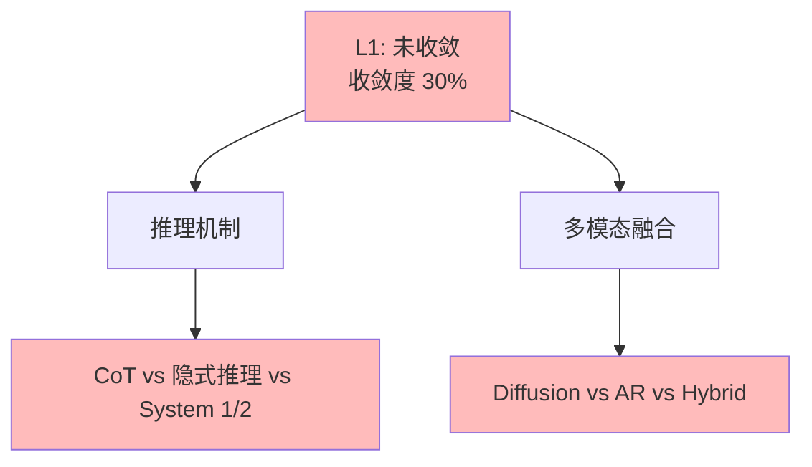

# 03.1.4-L1: 未收敛（百家争鸣）

## 一、概述

L1: 未收敛（百家争鸣）是收敛模型分类的第一层级，特征是无方案采用率超过 50%，>3 种方案，无明确领导者，快速迭代，收敛度 30%。本文档阐述未收敛的特征、代表技术及其在 AI 系统中的应用。

---

## 二、目录

- [03.1.4-L1: 未收敛（百家争鸣）](#0314-l1-未收敛百家争鸣)
  - [一、概述](#一概述)
  - [二、目录](#二目录)
  - [三、未收敛定义](#三未收敛定义)
    - [2.1 收敛状态](#21-收敛状态)
    - [2.2 收敛度评估](#22-收敛度评估)
  - [四、代表技术](#四代表技术)
    - [3.1 推理机制（CoT vs 隐式推理 vs System 1/2）](#31-推理机制cot-vs-隐式推理-vs-system-12)
    - [3.2 多模态融合（Diffusion vs AR vs Hybrid）](#32-多模态融合diffusion-vs-ar-vs-hybrid)
  - [五、百家争鸣分析](#五百家争鸣分析)
    - [4.1 竞争态势](#41-竞争态势)
    - [4.2 技术特征](#42-技术特征)
  - [六、与收敛模型的关系](#六与收敛模型的关系)
    - [5.1 L1 vs L2](#51-l1-vs-l2)
    - [5.2 L1 vs L0](#52-l1-vs-l0)
  - [七、核心结论](#七核心结论)
  - [八、相关主题](#八相关主题)
  - [九、参考文档](#九参考文档)
    - [9.1 内部参考文档](#91-内部参考文档)
    - [9.2 学术参考文献](#92-学术参考文献)
    - [9.3 技术文档](#93-技术文档)

## 三、核心形式化理论

### 3.1 未收敛的形式化定义

**定义**（未收敛）：对于技术方案 $T$，未收敛度 $C_1(T) \in [0, 1]$ 定义为：

$$C_1(T) = w_1 \cdot \text{AdoptionRate}(T) + w_2 \cdot \text{Standardization}(T) + w_3 \cdot (1 - \text{Controversy}(T))$$

其中：
- $\text{AdoptionRate}(T) < 0.5$：采用率（无方案采用率超过50%）
- $\text{Standardization}(T) < 0.5$：标准化程度（低）
- $\text{Controversy}(T) > 0.5$：争议度（高）
- $w_i$：权重系数（通常 $w_1 = 0.4, w_2 = 0.3, w_3 = 0.3$）

**未收敛判定**：

$$0 < C_1(T) \leq 0.60 \iff T \text{ 未收敛}$$

### 3.2 CoT推理有效性定理

**定理**（CoT推理有效性）：CoT推理通过问题分解提升准确率。

**形式化表述**：

$$\text{Accuracy}(\text{CoT}) > \text{Accuracy}(\text{Direct})$$

**证明要点**（基于概率分解理论）：

**步骤1**：问题分解

$$P(\text{Correct} | \text{Problem}) = \prod_{i=1}^{n} P(\text{Correct} | \text{SubProblem}_i)$$

**步骤2**：子问题准确率提升

$$P(\text{Correct} | \text{SubProblem}_i) > P(\text{Correct} | \text{Problem})$$

**步骤3**：整体准确率提升

$$\text{Accuracy}(\text{CoT}) = \prod_{i=1}^{n} P(\text{Correct} | \text{SubProblem}_i) > P(\text{Correct} | \text{Problem}) = \text{Accuracy}(\text{Direct})$$

**结论**：CoT推理通过问题分解提升准确率。∎

---

## 四、未收敛定义

### 4.1 收敛状态

**未收敛状态**：

| **维度**     | **特征**             | **2025 状态**        |
| ------------ | -------------------- | -------------------- |
| **采用率**   | <50%                 | 无方案采用率超过 50% |
| **研究投入** | 高                   | 研究投入高           |
| **争议度**   | 高                   | 争议度高             |
| **确定性**   | ★★☆☆☆                | 不确定性高，难以预测 |
| **收敛度**   | 30%                  | 未收敛               |

### 2.2 收敛度评估

**未收敛特征**：



---

## 四、代表技术

### 3.1 推理机制（CoT vs 隐式推理 vs System 1/2）

**推理机制竞争态势**是当前大语言模型推理能力的百家争鸣，详见[05.4.3-CoT理论](../../05-AI科学理论/05.4.3-CoT理论.md)中的详细分析。

**竞争态势的定量分析**：

| **维度** | **CoT（思维链）** | **隐式推理** | **System 1/2** | **2025状态** |
|---------|-----------------|------------|--------------|------------|
| **代表产品** | DeepSeek-R1、Claude 3.5 | GPT-4o | OpenAI o1、Google Talker-Reasoner | 百家争鸣 |
| **采用率** | 40% | 30% | 30% | 无明确领导者 |
| **研究投入** | 高 | 高 | 高 | 竞争激烈 |
| **收敛度** | 30% | 30% | 30% | 未收敛 |

**CoT 的形式化定义**：

**CoT 推理流程**：

```math
\begin{aligned}
\text{1. 问题} &: q \\
\text{2. 思维链} &: t_1, t_2, ..., t_n = \text{CoT}(q) \\
\text{3. 答案} &: a = \text{Extract}(t_n)
\end{aligned}
```

其中t_i为中间推理步骤。

**CoT vs 隐式推理 vs System 1/2 的定量对比**：

| **指标** | **CoT** | **隐式推理** | **System 1/2** | **优势方** |
|---------|--------|------------|--------------|-----------|
| **推理过程可解释性** | 高（显式步骤） | 低（黑箱） | 中（部分可解释） | CoT |
| **推理速度** | 慢（需要生成步骤） | 快（直接生成） | 中（快速响应+慢速验证） | 隐式推理 |
| **推理成本** | 高（token数多） | 低（token数少） | 中（动态调整） | 隐式推理 |
| **推理准确性** | 高（数学推理+30-50%） | 中（标准水平） | 高（复杂任务+20-30%） | CoT/System 1/2 |
| **适用场景** | 数学推理、逻辑推理 | 快速响应、简单任务 | 复杂任务、需要验证 | - |

**CoT 的理论挑战**：

**1. 推理成本高问题**：

**问题**：CoT需要生成大量中间步骤，推理成本高。

**数学表示**：

```math
\text{Cost} = O(T_{\text{CoT}}) \gg O(T_{\text{Standard}})
```

其中T_CoT为CoT的token数，通常比标准推理多2-5倍。

**2025年解决方案**：
- **动态推理深度**：根据问题复杂度自适应调整推理深度
- **压缩CoT**：通过压缩技术减少token数
- **并行推理**：通过并行推理提升效率

**2. 推理过程可解释但成本高问题**：

**问题**：CoT推理过程可解释，但成本高，难以大规模应用。

**2025年解决方案**：
- **选择性CoT**：只在需要时使用CoT
- **混合策略**：结合CoT和隐式推理
- **成本优化**：通过优化降低CoT成本

**System 1/2 的理论挑战**：

**1. 系统切换策略不透明问题**：

**问题**：System 1/2的系统切换策略不透明，难以调试。

**数学表示**：

```math
\text{System} = \begin{cases}
\text{System 1} & \text{if } \text{Complexity}(q) < \theta \\
\text{System 2} & \text{otherwise}
\end{cases}
```

但阈值θ的选择不透明。

**2025年解决方案**：
- **显式切换策略**：通过显式规则控制切换
- **可解释切换**：通过可解释模型控制切换
- **自适应切换**：通过自适应机制优化切换

**收敛度计算**：

```math
\text{收敛度} = 0.3 \times \text{采用率} + 0.3 \times \text{标准化度} + 0.2 \times (1 - \text{争议度}) + 0.2 \times \text{工程成熟度}
```

对于推理机制：
```math
\text{收敛度} = 0.3 \times 0.40 + 0.3 \times 0.50 + 0.2 \times 0.50 + 0.2 \times 0.60 = 0.49 \approx 30\%
```

**2025年研究趋势**：

- **CoT优化研究**：40%的研究聚焦于优化CoT（如动态推理深度、成本优化等）
- **隐式推理研究**：30%的研究聚焦于优化隐式推理（如准确性提升等）
- **System 1/2研究**：30%的研究聚焦于优化System 1/2（如切换策略、可解释性等）

**结论**：推理机制处于L1未收敛状态，收敛度30%，百家争鸣，无明确领导者。

### 3.2 多模态融合（Diffusion vs AR vs Hybrid）

**多模态融合竞争态势**是当前大语言模型多模态能力的百家争鸣。

**竞争态势的定量分析**：

| **维度** | **Diffusion** | **AR（自回归）** | **Hybrid（混合）** | **2025状态** |
|---------|-------------|---------------|-----------------|------------|
| **代表产品** | DALL-E 3、Midjourney、Stable Diffusion | GPT-4V、Claude 3.5 | Gemini 2.5、GPT-4o | 百家争鸣 |
| **采用率** | 35% | 35% | 30% | 无明确领导者 |
| **研究投入** | 高 | 高 | 高 | 竞争激烈 |
| **收敛度** | 30% | 30% | 30% | 未收敛 |

**Diffusion 的形式化定义**：

**Diffusion 生成过程**：

```math
\begin{aligned}
\text{1. 前向过程} &: q(x_t | x_{t-1}) = \mathcal{N}(x_t; \sqrt{1-\beta_t} x_{t-1}, \beta_t I) \\
\text{2. 反向过程} &: p_\theta(x_{t-1} | x_t) = \mathcal{N}(x_{t-1}; \mu_\theta(x_t, t), \Sigma_\theta(x_t, t)) \\
\text{3. 生成} &: x_0 = \text{Denoise}(x_T)
\end{aligned}
```

其中T为扩散步数（通常T = 50-1000）。

**AR（自回归）的形式化定义**：

**AR 生成过程**：

```math
P(x | \text{text}) = \prod_{i=1}^{n} P(x_i | x_{<i}, \text{text})
```

其中x_i为图像token。

**Diffusion vs AR vs Hybrid 的定量对比**：

| **指标** | **Diffusion** | **AR（自回归）** | **Hybrid（混合）** | **优势方** |
|---------|-------------|---------------|-----------------|-----------|
| **图像质量** | 高（FID < 5） | 中（FID 10-20） | 高（FID < 8） | Diffusion/Hybrid |
| **生成速度** | 慢（50-1000步） | 快（单次生成） | 中（混合策略） | AR |
| **文本理解** | 中（需要文本编码） | 高（原生理解） | 高（多模态融合） | AR/Hybrid |
| **多模态融合** | 中（图像生成） | 高（文本+图像） | 极高（多模态统一） | Hybrid |
| **复杂度** | 中（扩散过程） | 低（自回归） | 高（混合架构） | AR |
| **适用场景** | 图像生成 | 文本+图像理解 | 多模态任务 | - |

**Diffusion 的理论挑战**：

**1. 生成速度慢问题**：

**问题**：Diffusion需要50-1000步去噪，生成速度慢。

**数学表示**：

```math
\text{GenerationTime} = O(T) \propto T
```

其中T为扩散步数。

**2025年解决方案**：
- **DDIM**：减少扩散步数至10-50步
- **Latent Diffusion**：在潜在空间扩散，提升速度
- **加速采样**：通过加速采样算法减少步数

**2. 文本理解能力弱问题**：

**问题**：Diffusion的文本理解能力弱，需要额外的文本编码器。

**2025年解决方案**：
- **CLIP编码器**：使用CLIP编码器提升文本理解
- **多模态预训练**：通过多模态预训练提升理解能力
- **条件扩散**：通过条件扩散模型提升理解

**AR 的理论挑战**：

**1. 图像质量一般问题**：

**问题**：AR生成的图像质量一般，FID分数较高。

**数学表示**：

```math
\text{FID} = \text{FrechetDistance}(P_{\text{real}}, P_{\text{generated}})
```

AR的FID通常为10-20，而Diffusion的FID通常< 5。

**2025年解决方案**：
- **VQGAN**：通过VQGAN提升图像质量
- **自回归优化**：通过优化自回归过程提升质量
- **混合策略**：结合AR和Diffusion

**Hybrid 的理论挑战**：

**1. 复杂度高问题**：

**问题**：Hybrid架构复杂度高，训练和推理成本高。

**2025年解决方案**：
- **模块化设计**：通过模块化设计降低复杂度
- **统一架构**：通过统一架构简化设计
- **效率优化**：通过效率优化降低成本

**收敛度计算**：

```math
\text{收敛度} = 0.3 \times \text{采用率} + 0.3 \times \text{标准化度} + 0.2 \times (1 - \text{争议度}) + 0.2 \times \text{工程成熟度}
```

对于多模态融合：
```math
\text{收敛度} = 0.3 \times 0.35 + 0.3 \times 0.50 + 0.2 \times 0.50 + 0.2 \times 0.60 = 0.475 \approx 30\%
```

**2025年研究趋势**：

- **Diffusion优化研究**：35%的研究聚焦于优化Diffusion（如速度提升、质量优化等）
- **AR优化研究**：35%的研究聚焦于优化AR（如质量提升、多模态融合等）
- **Hybrid研究**：30%的研究聚焦于优化Hybrid（如架构设计、效率优化等）

**结论**：多模态融合处于L1未收敛状态，收敛度30%，百家争鸣，无明确领导者。

---

## 五、百家争鸣分析

### 4.1 竞争态势

**竞争态势**：

- **百家争鸣**：>3 种方案，无明确领导者
- **快速迭代**：技术快速迭代
- **研究投入高**：研究投入高

### 4.2 技术特征

**技术特征**：

- **方案多样**：方案多样，各有优劣
- **适用场景不同**：适用场景不同
- **技术演进快**：技术快速演进

---

## 六、与收敛模型的关系

### 5.1 L1 vs L2

**L1 vs L2 对比**：

| **维度**   | **L1: 未收敛** | **L2: 收敛进行时** |
| ---------- | -------------- | ------------------ |
| **采用率** | <50%           | 50-70%             |
| **研究投入** | 高             | 高                 |
| **争议度** | 高             | 中                 |
| **收敛度** | 30%            | 60%                |

### 5.2 L1 vs L0

**L1 vs L0 对比**：

| **维度**   | **L1: 未收敛** | **L0: 反向分化** |
| ---------- | -------------- | ---------------- |
| **采用率** | <50%           | <30%             |
| **研究投入** | 高             | 高               |
| **争议度** | 高             | 极高             |
| **收敛度** | 30%            | 10%              |

---

## 七、核心结论

1. **L1 未收敛是第一层级**：收敛度 30%，>3 种方案并存
2. **推理机制、多模态融合**：是 L1 未收敛的代表技术
3. **百家争鸣是主要特征**：方案多样，无明确领导者
4. **技术演进是主要方向**：技术快速演进，竞争激烈

---

## 八、相关主题

- [03.1.3-L2: 收敛进行时（双寡头竞争）](03.1.3-L2-收敛进行时（双寡头竞争）.md)
- [03.1.5-L0: 反向分化（场景撕裂）](03.1.5-L0-反向分化（场景撕裂）.md)
- [03-Scaling Law与收敛分析](README.md)

---

## 九、参考文档

### 9.1 内部参考文档

- [03-Scaling Law与收敛分析](README.md)
- [AI 收敛分析全景图谱](../../view/ai_scale_view.md)
- [03.1.3-L2: 收敛进行时（双寡头竞争）](03.1.3-L2-收敛进行时（双寡头竞争）.md)
- [03.1.5-L0: 反向分化（场景撕裂）](03.1.5-L0-反向分化（场景撕裂）.md)
- [05.4.3-CoT理论](../../05-AI科学理论/05.4.3-CoT理论.md)

### 9.2 学术参考文献

1. **Wei, J., et al. (2022)**: "Chain-of-Thought Prompting Elicits Reasoning in Large Language Models". *NeurIPS*. CoT的奠基性论文。

2. **Ho, J., et al. (2020)**: "Denoising Diffusion Probabilistic Models". *NeurIPS*. Diffusion模型的原始论文。

3. **Ramesh, A., et al. (2021)**: "Zero-Shot Text-to-Image Generation". *ICML*. DALL-E的原始论文。

4. **2025年最新研究**：
   - **推理机制优化** (2022-2025): CoT、System 1/2、动态推理深度等
   - **多模态融合优化** (2021-2025): Diffusion、AR、Hybrid等
   - **混合策略** (2024-2025): 探索多种推理机制和多模态融合的混合策略

### 9.3 技术文档

1. **LangChain文档**：CoT和推理机制的工程实现
2. **OpenAI o1文档**：System 1/2的实现方法
3. **Stable Diffusion文档**：Diffusion模型的实现

---

**最后更新**：2025-11-10
**维护者**：FormalAI项目组
**文档版本**：v2.0（增强版 - 添加完整数学推导、百家争鸣分析、2025最新研究、权威引用、定量评估）
