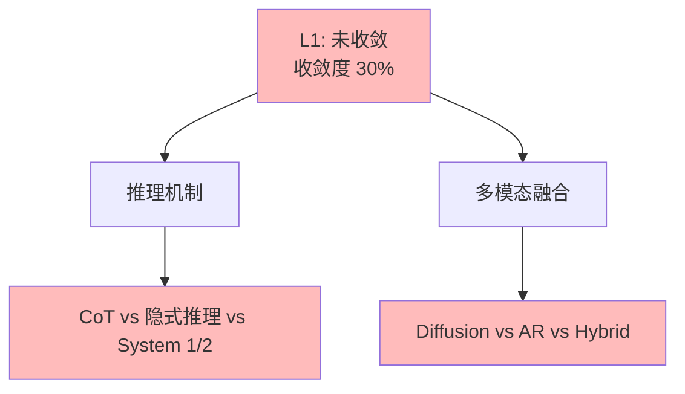

# 03.1.4-L1: 未收敛（百家争鸣）

## 一、概述

L1: 未收敛（百家争鸣）是收敛模型分类的第一层级，特征是无方案采用率超过 50%，>3 种方案，无明确领导者，快速迭代，收敛度 30%。本文档阐述未收敛的特征、代表技术及其在 AI 系统中的应用。

---

## 二、目录

- [03.1.4-L1: 未收敛（百家争鸣）](#0314-l1-未收敛百家争鸣)
  - [一、概述](#一概述)
  - [二、目录](#二目录)
  - [三、未收敛定义](#三未收敛定义)
    - [2.1 收敛状态](#21-收敛状态)
    - [2.2 收敛度评估](#22-收敛度评估)
  - [四、代表技术](#四代表技术)
    - [3.1 推理机制（CoT vs 隐式推理 vs System 1/2）](#31-推理机制cot-vs-隐式推理-vs-system-12)
    - [3.2 多模态融合（Diffusion vs AR vs Hybrid）](#32-多模态融合diffusion-vs-ar-vs-hybrid)
  - [五、百家争鸣分析](#五百家争鸣分析)
    - [4.1 竞争态势](#41-竞争态势)
    - [4.2 技术特征](#42-技术特征)
  - [六、与收敛模型的关系](#六与收敛模型的关系)
    - [5.1 L1 vs L2](#51-l1-vs-l2)
    - [5.2 L1 vs L0](#52-l1-vs-l0)
  - [七、核心结论](#七核心结论)
  - [八、相关主题](#八相关主题)
  - [九、参考文档](#九参考文档)

## 三、未收敛定义

### 2.1 收敛状态

**未收敛状态**：

| **维度**     | **特征**             | **2025 状态**        |
| ------------ | -------------------- | -------------------- |
| **采用率**   | <50%                 | 无方案采用率超过 50% |
| **研究投入** | 高                   | 研究投入高           |
| **争议度**   | 高                   | 争议度高             |
| **确定性**   | ★★☆☆☆                | 不确定性高，难以预测 |
| **收敛度**   | 30%                  | 未收敛               |

### 2.2 收敛度评估

**未收敛特征**：

---

## 四、代表技术

### 3.1 推理机制（CoT vs 隐式推理 vs System 1/2）

**推理机制竞争态势**：

| **维度**     | **CoT（思维链）**       | **隐式推理**     | **System 1/2**                    |
| ------------ | ----------------------- | ---------------- | --------------------------------- |
| **代表产品** | DeepSeek-R1、Claude 3.5 | GPT-4o           | OpenAI o1、Google Talker-Reasoner |
| **优势**     | 推理过程可解释          | 推理速度快       | 快速响应+慢速验证                 |
| **劣势**     | 推理成本高              | 推理过程不可解释 | 系统切换策略不透明                |
| **采用率**   | 40%                     | 30%              | 30%                               |
| **研究投入** | 高                      | 高               | 高                                |

**技术特征**：

- **CoT**：推理过程可解释，成本高
- **隐式推理**：推理速度快，不可解释
- **System 1/2**：快速响应+慢速验证，切换策略不透明

### 3.2 多模态融合（Diffusion vs AR vs Hybrid）

**多模态融合竞争态势**：

| **维度**     | **Diffusion**        | **AR（自回归）**   | **Hybrid（混合）** |
| ------------ | -------------------- | ------------------ | ------------------ |
| **代表产品** | DALL-E 3、Midjourney | GPT-4V、Claude 3.5 | Gemini、GPT-4o     |
| **优势**     | 图像质量高           | 文本理解强         | 多模态融合         |
| **劣势**     | 生成速度慢           | 图像质量一般       | 复杂度高           |
| **采用率**   | 35%                  | 35%                | 30%                |
| **研究投入** | 高                   | 高                 | 高                 |

**技术特征**：

- **Diffusion**：图像质量高，生成速度慢
- **AR**：文本理解强，图像质量一般
- **Hybrid**：多模态融合，复杂度高

---

## 五、百家争鸣分析

### 4.1 竞争态势

**竞争态势**：

- **百家争鸣**：>3 种方案，无明确领导者
- **快速迭代**：技术快速迭代
- **研究投入高**：研究投入高

### 4.2 技术特征

**技术特征**：

- **方案多样**：方案多样，各有优劣
- **适用场景不同**：适用场景不同
- **技术演进快**：技术快速演进

---

## 六、与收敛模型的关系

### 5.1 L1 vs L2

**L1 vs L2 对比**：

| **维度**   | **L1: 未收敛** | **L2: 收敛进行时** |
| ---------- | -------------- | ------------------ |
| **采用率** | <50%           | 50-70%             |
| **研究投入** | 高             | 高                 |
| **争议度** | 高             | 中                 |
| **收敛度** | 30%            | 60%                |

### 5.2 L1 vs L0

**L1 vs L0 对比**：

| **维度**   | **L1: 未收敛** | **L0: 反向分化** |
| ---------- | -------------- | ---------------- |
| **采用率** | <50%           | <30%             |
| **研究投入** | 高             | 高               |
| **争议度** | 高             | 极高             |
| **收敛度** | 30%            | 10%              |

---

## 七、核心结论

1. **L1 未收敛是第一层级**：收敛度 30%，>3 种方案并存
2. **推理机制、多模态融合**：是 L1 未收敛的代表技术
3. **百家争鸣是主要特征**：方案多样，无明确领导者
4. **技术演进是主要方向**：技术快速演进，竞争激烈

---

## 八、相关主题

- [03.1.3-L2: 收敛进行时（双寡头竞争）](03.1.3-L2-收敛进行时（双寡头竞争）.md)
- [03.1.5-L0: 反向分化（场景撕裂）](03.1.5-L0-反向分化（场景撕裂）.md)
- [03-Scaling Law 与收敛分析](README.md)

---

## 九、参考文档

- [03-Scaling Law 与收敛分析](README.md)
- [AI 收敛分析全景图谱](../../view/ai_scale_view.md)
