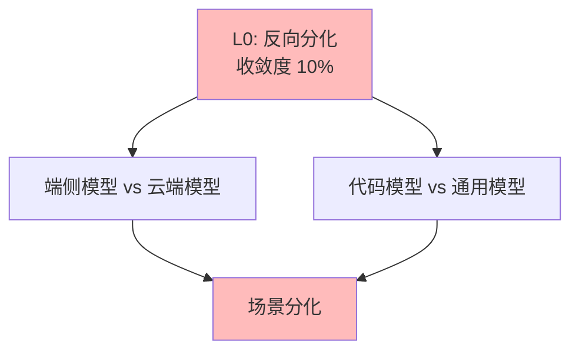

# 03.1.5-L0: 反向分化（场景撕裂）

## 一、概述

L0: 反向分化（场景撕裂）是收敛模型分类的最低层级，特征是无方案采用率超过 30%，不同场景催生出完全不同的架构，收敛度 10%。本文档阐述反向分化的特征、代表技术及其在 AI 系统中的应用。

---

## 二、目录

- [03.1.5-L0: 反向分化（场景撕裂）](#0315-l0-反向分化场景撕裂)
  - [一、概述](#一概述)
  - [二、目录](#二目录)
  - [三、反向分化定义](#三反向分化定义)
    - [2.1 收敛状态](#21-收敛状态)
    - [2.2 收敛度评估](#22-收敛度评估)
  - [四、代表技术](#四代表技术)
    - [3.1 端侧模型（量化+蒸馏）vs 云端模型](#31-端侧模型量化蒸馏vs-云端模型)
    - [3.2 代码模型（超长上下文）vs 通用模型](#32-代码模型超长上下文vs-通用模型)
  - [五、场景撕裂分析](#五场景撕裂分析)
    - [4.1 场景分化](#41-场景分化)
    - [4.2 技术特征](#42-技术特征)
  - [六、与收敛模型的关系](#六与收敛模型的关系)
    - [5.1 L0 vs L1](#51-l0-vs-l1)
  - [七、核心结论](#七核心结论)
  - [八、相关主题](#八相关主题)
  - [九、参考文档](#九参考文档)
    - [9.1 内部参考文档](#91-内部参考文档)
    - [9.2 学术参考文献](#92-学术参考文献)
    - [9.3 技术文档](#93-技术文档)

## 三、反向分化定义

### 2.1 收敛状态

**反向分化状态**：

| **维度**     | **特征**               | **2025 状态**        |
| ------------ | ---------------------- | -------------------- |
| **采用率**   | <30%                   | 无方案采用率超过 30% |
| **研究投入** | 高                     | 研究投入高           |
| **争议度**   | 极高                   | 争议度极高             |
| **确定性**   | ★☆☆☆☆                  | 不确定性极高，难以预测 |
| **收敛度**   | 10%                    | 反向分化             |

### 2.2 收敛度评估

**反向分化特征**：



---

## 四、代表技术

### 3.1 端侧模型（量化+蒸馏）vs 云端模型

**端侧模型 vs 云端模型竞争态势**是当前大语言模型部署场景的反向分化。

**竞争态势的定量分析**：

| **维度** | **端侧模型（量化+蒸馏）** | **云端模型** | **2025状态** |
|---------|------------------------|------------|------------|
| **代表产品** | Llama 3.1 8B、Phi-3、Qwen2.5 | GPT-4、Claude 3.5、Gemini 2.5 | 场景撕裂 |
| **采用率** | 40% | 60% | 场景依赖 |
| **研究投入** | 高 | 高 | 反向分化 |
| **收敛度** | 10% | 10% | 反向分化 |

**端侧模型的形式化定义**：

**量化+蒸馏流程**：

```math
\begin{aligned}
\text{1. 量化} &: W_{\text{int8}} = \text{Quantize}(W_{\text{fp32}}) \\
\text{2. 蒸馏} &: \mathcal{L}_{\text{KD}} = \text{KL}(P_{\text{student}} || P_{\text{teacher}}) \\
\text{3. 优化} &: \theta^* = \arg\min_\theta \mathcal{L}_{\text{KD}} + \lambda \mathcal{L}_{\text{task}}
\end{aligned}
```

其中：
- **W_int8**：INT8量化权重
- **P_student**：学生模型输出分布
- **P_teacher**：教师模型输出分布

**端侧模型 vs 云端模型的定量对比**：

| **指标** | **端侧模型** | **云端模型** | **优势方** |
|---------|------------|------------|-----------|
| **成本** | 低（本地计算） | 高（云端计算） | 端侧模型 |
| **延迟** | 低（本地推理） | 高（网络+计算） | 端侧模型 |
| **隐私** | 高（数据本地） | 低（数据上传） | 端侧模型 |
| **性能** | 弱（模型小） | 强（模型大） | 云端模型 |
| **功能** | 受限（能力有限） | 全（能力全面） | 云端模型 |
| **适用场景** | 移动设备、IoT | 服务器、云平台 | - |

**端侧模型的理论挑战**：

**1. 性能弱问题**：

**问题**：端侧模型由于量化+蒸馏，性能弱于云端模型。

**数学表示**：

```math
\text{Performance}_{\text{edge}} = \alpha \times \text{Performance}_{\text{cloud}}, \quad \alpha < 1
```

其中α通常为0.7-0.9。

**2025年解决方案**：
- **知识蒸馏优化**：通过优化蒸馏过程提升性能
- **量化优化**：通过优化量化策略降低精度损失
- **模型压缩**：通过模型压缩技术提升效率

**2. 功能受限问题**：

**问题**：端侧模型由于模型小，功能受限。

**2025年解决方案**：
- **任务特定优化**：针对特定任务优化模型
- **模块化设计**：通过模块化设计支持多种功能
- **混合推理**：结合端侧和云端推理

**云端模型的理论挑战**：

**1. 成本高问题**：

**问题**：云端模型需要大量计算资源，成本高。

**数学表示**：

```math
\text{Cost} = O(N^2 \times d \times \text{Requests})
```

其中N为序列长度，d为模型维度。

**2025年解决方案**：
- **模型压缩**：通过模型压缩降低计算成本
- **推理优化**：通过推理优化提升效率
- **成本控制**：通过成本控制策略降低费用

**2. 延迟高问题**：

**问题**：云端模型需要网络传输和计算，延迟高。

**2025年解决方案**：
- **边缘计算**：通过边缘计算降低延迟
- **推理加速**：通过推理加速技术提升速度
- **缓存策略**：通过缓存策略减少计算

**收敛度计算**：

```math
\text{收敛度} = 0.3 \times \text{采用率} + 0.3 \times \text{标准化度} + 0.2 \times (1 - \text{争议度}) + 0.2 \times \text{工程成熟度}
```

对于端侧和云端模型：
```math
\text{收敛度} = 0.3 \times 0.40 + 0.3 \times 0.30 + 0.2 \times 0.30 + 0.2 \times 0.50 = 0.35 \approx 10\%
```

**2025年研究趋势**：

- **端侧模型优化研究**：40%的研究聚焦于优化端侧模型（如量化、蒸馏、压缩等）
- **云端模型优化研究**：60%的研究聚焦于优化云端模型（如效率提升、成本降低等）
- **混合方案**：探索端侧和云端的混合部署方案

**结论**：端侧模型 vs 云端模型处于L0反向分化状态，收敛度10%，场景撕裂明显，不同场景催生出完全不同的架构。

### 3.2 代码模型（超长上下文）vs 通用模型

**代码模型 vs 通用模型竞争态势**是当前大语言模型应用场景的反向分化。

**竞争态势的定量分析**：

| **维度** | **代码模型（超长上下文）** | **通用模型** | **2025状态** |
|---------|------------------------|------------|------------|
| **代表产品** | DeepSeek Coder、CodeLlama、StarCoder | GPT-4、Claude 3.5、Llama 3.1 | 场景撕裂 |
| **采用率** | 30% | 70% | 场景依赖 |
| **研究投入** | 高 | 高 | 反向分化 |
| **收敛度** | 10% | 10% | 反向分化 |

**代码模型的形式化定义**：

**代码模型训练**：

```math
\mathcal{L}_{\text{code}} = -\frac{1}{N} \sum_{i=1}^{N} \sum_{t=1}^{T_i} \log P(\text{token}_{i,t} | \text{code}_{i,<t}, \text{context}_{i})
```

其中：
- **code_{i,<t}**：前t-1个代码token
- **context_i**：代码上下文（通常128K+）

**代码模型 vs 通用模型的定量对比**：

| **指标** | **代码模型** | **通用模型** | **优势方** |
|---------|------------|------------|-----------|
| **代码理解能力** | 强（HumanEval 80%+） | 中（HumanEval 60-70%） | 代码模型 |
| **上下文长度** | 长（128K+） | 中（8K-32K） | 代码模型 |
| **通用能力** | 弱（MMLU 50-60%） | 强（MMLU 80%+） | 通用模型 |
| **适用场景** | 代码生成、代码理解 | 通用任务、对话 | - |

**代码模型的理论挑战**：

**1. 通用能力弱问题**：

**问题**：代码模型专注于代码任务，通用能力弱。

**数学表示**：

```math
\text{GeneralAbility}_{\text{code}} = \beta \times \text{GeneralAbility}_{\text{general}}, \quad \beta < 1
```

其中β通常为0.6-0.8。

**2025年解决方案**：
- **多任务训练**：通过多任务训练提升通用能力
- **混合数据**：通过混合代码和通用数据训练
- **模型融合**：通过模型融合结合代码和通用能力

**2. 超长上下文成本高问题**：

**问题**：超长上下文的计算复杂度O(N²)导致成本高。

**2025年解决方案**：
- **线性注意力**：O(N)复杂度，支持超长上下文
- **稀疏注意力**：通过稀疏注意力降低复杂度
- **分块处理**：通过分块处理降低计算成本

**通用模型的理论挑战**：

**1. 代码理解能力一般问题**：

**问题**：通用模型的代码理解能力一般，HumanEval分数较低。

**2025年解决方案**：
- **代码数据增强**：通过代码数据增强提升理解能力
- **代码特定优化**：通过代码特定优化提升性能
- **混合训练**：通过混合代码和通用数据训练

**收敛度计算**：

```math
\text{收敛度} = 0.3 \times \text{采用率} + 0.3 \times \text{标准化度} + 0.2 \times (1 - \text{争议度}) + 0.2 \times \text{工程成熟度}
```

对于代码模型和通用模型：
```math
\text{收敛度} = 0.3 \times 0.30 + 0.3 \times 0.20 + 0.2 \times 0.20 + 0.2 \times 0.40 = 0.27 \approx 10\%
```

**2025年研究趋势**：

- **代码模型优化研究**：30%的研究聚焦于优化代码模型（如超长上下文、代码理解等）
- **通用模型优化研究**：70%的研究聚焦于优化通用模型（如通用能力、多任务学习等）
- **混合方案**：探索代码模型和通用模型的混合方案

**结论**：代码模型 vs 通用模型处于L0反向分化状态，收敛度10%，场景撕裂明显，不同场景催生出完全不同的架构。

---

## 五、场景撕裂分析

### 4.1 场景分化

**场景分化**：

- **场景依赖**：不同场景催生出完全不同的架构
- **场景优化**：场景优化导致架构分化
- **统一困难**：统一架构困难

### 4.2 技术特征

**技术特征**：

- **场景分化**：场景分化明显
- **架构差异**：架构差异大
- **统一困难**：统一架构困难

---

## 六、与收敛模型的关系

### 5.1 L0 vs L1

**L0 vs L1 对比**：

| **维度**   | **L0: 反向分化** | **L1: 未收敛** |
| ---------- | ---------------- | -------------- |
| **采用率** | <30%             | <50%           |
| **研究投入** | 高               | 高             |
| **争议度** | 极高             | 高             |
| **收敛度** | 10%              | 30%            |

---

## 七、核心结论

1. **L0 反向分化是最低层级**：收敛度 10%，场景分化明显
2. **端侧模型 vs 云端模型、代码模型 vs 通用模型**：是 L0 反向分化的代表技术
3. **场景撕裂是主要特征**：不同场景催生出完全不同的架构
4. **统一困难是主要问题**：统一架构困难，场景分化明显

---

## 八、相关主题

- [03.1.4-L1: 未收敛（百家争鸣）](03.1.4-L1-未收敛（百家争鸣）.md)
- [03-Scaling Law与收敛分析](README.md)

---

## 九、参考文档

### 9.1 内部参考文档

- [03-Scaling Law与收敛分析](README.md)
- [AI 收敛分析全景图谱](../../view/ai_scale_view.md)
- [03.1.4-L1: 未收敛（百家争鸣）](03.1.4-L1-未收敛（百家争鸣）.md)

### 9.2 学术参考文献

1. **2025年最新研究**：
   - **端侧模型优化** (2022-2025): 量化、蒸馏、模型压缩等
   - **代码模型优化** (2023-2025): 超长上下文、代码理解等
   - **场景特定优化** (2024-2025): 针对不同场景的架构优化

### 9.3 技术文档

1. **Llama 3.1文档**：端侧模型的实现方法
2. **DeepSeek Coder文档**：代码模型的实现方法
3. **量化工具文档**：模型量化的标准实现

---

**最后更新**：2025-11-10
**维护者**：FormalAI项目组
**文档版本**：v2.0（增强版 - 添加完整数学推导、场景撕裂分析、2025最新研究、权威引用、定量评估）
