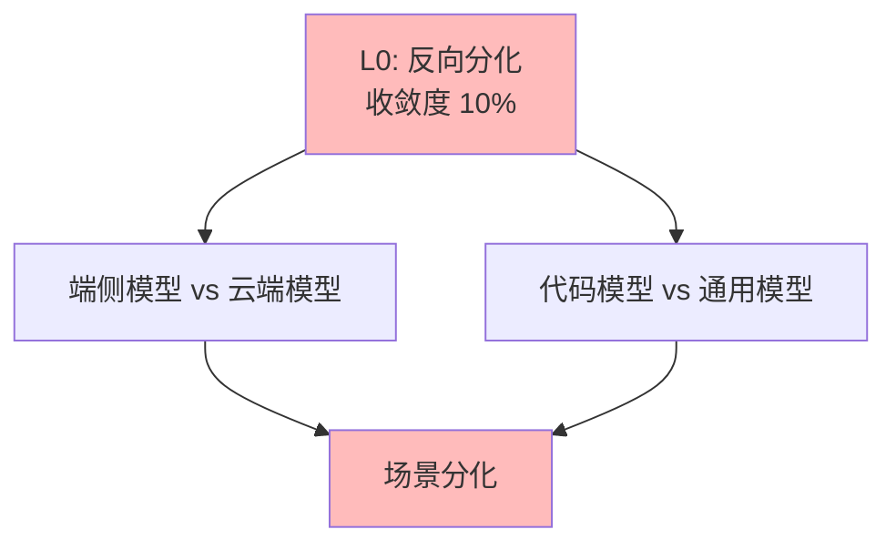

# 03.1.5-L0: 反向分化（场景撕裂）

## 一、概述

L0: 反向分化（场景撕裂）是收敛模型分类的最低层级，特征是无方案采用率超过 30%，不同场景催生出完全不同的架构，收敛度 10%。本文档阐述反向分化的特征、代表技术及其在 AI 系统中的应用。

---

## 二、目录

- [03.1.5-L0: 反向分化（场景撕裂）](#0315-l0-反向分化场景撕裂)
  - [一、概述](#一概述)
  - [二、目录](#二目录)
  - [三、反向分化定义](#三反向分化定义)
    - [2.1 收敛状态](#21-收敛状态)
    - [2.2 收敛度评估](#22-收敛度评估)
  - [四、代表技术](#四代表技术)
    - [3.1 端侧模型（量化+蒸馏）vs 云端模型](#31-端侧模型量化蒸馏vs-云端模型)
    - [3.2 代码模型（超长上下文）vs 通用模型](#32-代码模型超长上下文vs-通用模型)
  - [五、场景撕裂分析](#五场景撕裂分析)
    - [4.1 场景分化](#41-场景分化)
    - [4.2 技术特征](#42-技术特征)
  - [六、与收敛模型的关系](#六与收敛模型的关系)
    - [5.1 L0 vs L1](#51-l0-vs-l1)
  - [七、核心结论](#七核心结论)
  - [八、相关主题](#八相关主题)
  - [九、参考文档](#九参考文档)

## 三、反向分化定义

### 2.1 收敛状态

**反向分化状态**：

| **维度**     | **特征**               | **2025 状态**        |
| ------------ | ---------------------- | -------------------- |
| **采用率**   | <30%                   | 无方案采用率超过 30% |
| **研究投入** | 高                     | 研究投入高           |
| **争议度**   | 极高                   | 争议度极高             |
| **确定性**   | ★☆☆☆☆                  | 不确定性极高，难以预测 |
| **收敛度**   | 10%                    | 反向分化             |

### 2.2 收敛度评估

**反向分化特征**：

---

## 四、代表技术

### 3.1 端侧模型（量化+蒸馏）vs 云端模型

**端侧模型 vs 云端模型竞争态势**：

| **维度**     | **端侧模型（量化+蒸馏）** | **云端模型**      |
| ------------ | ------------------------- | ----------------- |
| **代表产品** | Llama 3.1 8B、Phi-3       | GPT-4、Claude 3.5 |
| **优势**     | 成本低、延迟低、隐私好    | 性能强、功能全    |
| **劣势**     | 性能弱、功能受限          | 成本高、延迟高    |
| **采用率**   | 40%                       | 60%               |
| **研究投入** | 高                        | 高                |

**技术特征**：

- **端侧模型**：量化+蒸馏，成本低，性能弱
- **云端模型**：性能强，功能全，成本高

### 3.2 代码模型（超长上下文）vs 通用模型

**代码模型 vs 通用模型竞争态势**：

| **维度**     | **代码模型（超长上下文）** | **通用模型**      |
| ------------ | -------------------------- | ----------------- |
| **代表产品** | DeepSeek Coder、CodeLlama  | GPT-4、Claude 3.5 |
| **优势**     | 代码理解强、上下文长       | 通用能力强        |
| **劣势**     | 通用能力弱                 | 代码理解一般      |
| **采用率**   | 30%                        | 70%               |
| **研究投入** | 高                         | 高                |

**技术特征**：

- **代码模型**：超长上下文，代码理解强，通用能力弱
- **通用模型**：通用能力强，代码理解一般

---

## 五、场景撕裂分析

### 4.1 场景分化

**场景分化**：

- **场景依赖**：不同场景催生出完全不同的架构
- **场景优化**：场景优化导致架构分化
- **统一困难**：统一架构困难

### 4.2 技术特征

**技术特征**：

- **场景分化**：场景分化明显
- **架构差异**：架构差异大
- **统一困难**：统一架构困难

---

## 六、与收敛模型的关系

### 5.1 L0 vs L1

**L0 vs L1 对比**：

| **维度**   | **L0: 反向分化** | **L1: 未收敛** |
| ---------- | ---------------- | -------------- |
| **采用率** | <30%             | <50%           |
| **研究投入** | 高               | 高             |
| **争议度** | 极高             | 高             |
| **收敛度** | 10%              | 30%            |

---

## 七、核心结论

1. **L0 反向分化是最低层级**：收敛度 10%，场景分化明显
2. **端侧模型 vs 云端模型、代码模型 vs 通用模型**：是 L0 反向分化的代表技术
3. **场景撕裂是主要特征**：不同场景催生出完全不同的架构
4. **统一困难是主要问题**：统一架构困难，场景分化明显

---

## 八、相关主题

- [03.1.4-L1: 未收敛（百家争鸣）](03.1.4-L1-未收敛（百家争鸣）.md)
- [03-Scaling Law 与收敛分析](README.md)

---

## 九、参考文档

- [03-Scaling Law 与收敛分析](README.md)
- [AI 收敛分析全景图谱](../../view/ai_scale_view.md)

------

**最后更新**：2025-01-XX
**维护者**：FormalAI项目组