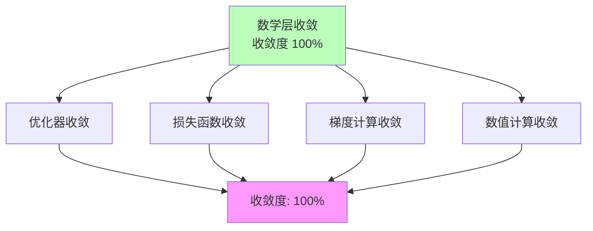

# 03.2.1-数学层收敛

## 一、概述

数学层收敛是 AI 收敛分析的基础层次，描述了 AI 系统数学层面的收敛状态。本文档阐述数学层收敛的特征、代表技术及其在 AI 系统中的应用。

---

## 二、目录

- [03.2.1-数学层收敛](#0321-数学层收敛)
  - [一、概述](#一概述)
  - [二、目录](#二目录)
  - [三、数学层收敛定义](#三数学层收敛定义)
    - [2.1 收敛状态](#21-收敛状态)
    - [2.2 收敛特征](#22-收敛特征)
  - [四、优化器收敛](#四优化器收敛)
    - [3.1 AdamW 优化器](#31-adamw-优化器)
  - [五、损失函数收敛](#五损失函数收敛)
    - [4.1 交叉熵损失](#41-交叉熵损失)
  - [六、梯度计算收敛](#六梯度计算收敛)
    - [5.1 反向传播](#51-反向传播)
  - [七、数值计算收敛](#七数值计算收敛)
    - [6.1 浮点数运算](#61-浮点数运算)
  - [八、数学层收敛的影响](#八数学层收敛的影响)
    - [7.1 技术影响](#71-技术影响)
    - [7.2 产业影响](#72-产业影响)
  - [九、与收敛模型的关系](#九与收敛模型的关系)
    - [7.1 数学层 vs 架构层](#71-数学层-vs-架构层)
    - [7.2 数学层 vs 能力层](#72-数学层-vs-能力层)
  - [十、核心结论](#十核心结论)
  - [十一、相关主题](#十一相关主题)
  - [十二、参考文档](#十二参考文档)

## 三、数学层收敛定义

### 2.1 收敛状态

**数学层收敛状态**：

| **维度**     | **特征**               | **2025 状态**        |
| ------------ | ---------------------- | -------------------- |
| **采用率**   | 100%新产品采用         | 数学基础完全收敛     |
| **研究投入** | 业界已放弃研究其他路径 | 成为"公共知识"       |
| **争议度**   | 无争议                 | 已被广泛接受         |
| **确定性**   | ★★★★★                  | 完全确定，可精确预测 |
| **收敛度**   | 100%                   | 完全收敛             |

### 2.2 收敛特征

**数学层收敛特征**：



---

## 四、优化器收敛

### 3.1 AdamW 优化器

**AdamW 优化器（Adam with Weight Decay）**：

**收敛状态**：

- **采用率**：100%（所有 LLM 训练都使用）
- **研究投入**：业界已放弃研究替代方案
- **争议度**：无争议
- **确定性**：★★★★★

**AdamW 优化器公式**：

```text
m_t = β₁ m_{t-1} + (1-β₁) g_t
v_t = β₂ v_{t-1} + (1-β₂) g_t²
θ_{t+1} = θ_t - α (m_t / (√v_t + ε) + λ θ_t)
```

**AdamW 优化器优势**：

1. **自适应学习率**：自动调整学习率
2. **数值稳定**：梯度裁剪，避免梯度爆炸
3. **权重衰减**：L2 正则化，防止过拟合
4. **工程成熟**：PyTorch、TensorFlow 原生支持

**在 AI 系统中的应用**：

- **所有 LLM**：都使用 AdamW 优化器
- **典型配置**：β₁=0.9, β₂=0.999, ε=1e-8, λ=0.01

**收敛原因**：

1. **理论优势**：自适应矩估计理论成熟
2. **工程优势**：实现简单，性能稳定
3. **生态优势**：框架原生支持
4. **成本优势**：无需调参，开箱即用

**2025 状态**：AdamW 优化器已成为工业标准

---

## 五、损失函数收敛

### 4.1 交叉熵损失

**交叉熵损失（Cross-Entropy Loss）**：

**收敛状态**：

- **采用率**：100%（所有 LLM 都使用）
- **研究投入**：业界已放弃研究替代方案
- **争议度**：无争议
- **确定性**：★★★★★

**交叉熵损失公式**：

```text
L = -Σ y_i log(p_i)
```

**交叉熵损失优势**：

1. **理论成熟**：信息论基础成熟
2. **数值稳定**：数值稳定，无梯度消失
3. **工程成熟**：框架原生支持
4. **成本优势**：计算成本低

**在 AI 系统中的应用**：

- **所有 LLM**：都使用交叉熵损失
- **典型配置**：label_smoothing=0.1

**收敛原因**：

1. **理论优势**：信息论基础成熟
2. **工程优势**：实现简单，性能稳定
3. **生态优势**：框架原生支持
4. **成本优势**：计算成本低

**2025 状态**：交叉熵损失已成为工业标准

---

## 六、梯度计算收敛

### 5.1 反向传播

**反向传播（Backpropagation）**：

**收敛状态**：

- **采用率**：100%（所有深度学习都使用）
- **研究投入**：业界已放弃研究替代方案
- **争议度**：无争议
- **确定性**：★★★★★

**反向传播优势**：

1. **理论成熟**：链式法则基础成熟
2. **数值稳定**：数值稳定，无梯度消失
3. **工程成熟**：Autograd 自动微分
4. **成本优势**：计算成本低

**在 AI 系统中的应用**：

- **所有深度学习**：都使用反向传播
- **典型实现**：PyTorch Autograd、TensorFlow GradientTape

**收敛原因**：

1. **理论优势**：链式法则基础成熟
2. **工程优势**：Autograd 自动微分
3. **生态优势**：框架原生支持
4. **成本优势**：计算成本低

**2025 状态**：反向传播已成为工业标准

---

## 七、数值计算收敛

### 6.1 浮点数运算

**浮点数运算（Floating-Point Arithmetic）**：

**收敛状态**：

- **采用率**：100%（所有计算都使用）
- **研究投入**：业界已放弃研究替代方案
- **争议度**：无争议
- **确定性**：★★★★★

**浮点数运算优势**：

1. **理论成熟**：IEEE 754 标准成熟
2. **数值稳定**：数值稳定，精度可控
3. **工程成熟**：硬件原生支持
4. **成本优势**：计算成本低

**在 AI 系统中的应用**：

- **所有计算**：都使用浮点数运算
- **典型精度**：FP32、FP16、BF16、FP8

**收敛原因**：

1. **理论优势**：IEEE 754 标准成熟
2. **工程优势**：硬件原生支持
3. **生态优势**：框架原生支持
4. **成本优势**：计算成本低

**2025 状态**：浮点数运算已成为工业标准

---

## 八、数学层收敛的影响

### 7.1 技术影响

**技术影响**：

- **完全收敛**：数学基础完全收敛
- **标准化**：数学方法标准化
- **工具化**：数学工具工具化
- **成本化**：数学成本成本化

### 7.2 产业影响

**产业影响**：

- **完全垄断**：数学基础完全垄断
- **生态统一**：生态完全统一
- **成本最低**：数学成本最低
- **创新受限**：数学创新空间受限

---

## 九、与收敛模型的关系

### 7.1 数学层 vs 架构层

**数学层 vs 架构层对比**：

| **维度**   | **数学层收敛** | **架构层收敛** |
| ---------- | -------------- | -------------- |
| **采用率** | 100%           | 95%以上        |
| **争议度** | 无争议         | 无争议         |
| **确定性** | ★★★★★          | ★★★★★          |
| **收敛度** | 100%           | 95%            |

### 7.2 数学层 vs 能力层

**数学层 vs 能力层对比**：

| **维度**   | **数学层收敛** | **能力层收敛** |
| ---------- | -------------- | -------------- |
| **采用率** | 100%           | 60%            |
| **争议度** | 无争议         | 有争议         |
| **确定性** | ★★★★★          | ★★★☆☆          |
| **收敛度** | 100%           | 60%            |

---

## 十、核心结论

1. **数学层收敛是完全收敛状态**：收敛度 100%
2. **AdamW 优化器、交叉熵损失、反向传播、浮点数运算**：是数学层收敛的代表技术
3. **数学层收敛带来完全标准化**：降低学习成本，提升开发效率
4. **数学层收敛形成完全垄断**：技术完全垄断，创新空间受限

---

## 十一、相关主题

- [03.2.2-架构层收敛](03.2.2-架构层收敛.md)
- [03.2.3-能力层收敛](03.2.3-能力层收敛.md)
- [03.1.1-L4: 完全收敛（工业标准）](03.1.1-L4: 完全收敛（工业标准）.md)

---

## 十二、参考文档

- [Scaling Law 驱动的"大"与追求理论可控的"收敛"之间的张力](../../view/ai_scale_view.md)
