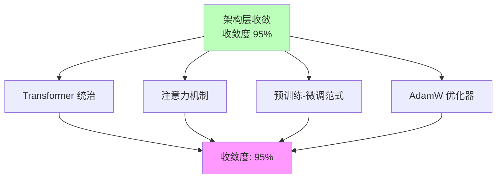
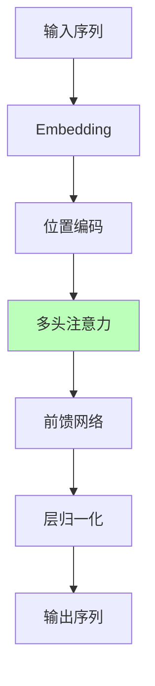

# 03.2.2-架构层收敛

## 目录

- [03.2.2-架构层收敛](#0322-架构层收敛)
  - [目录](#目录)
  - [一、概述](#一概述)
  - [二、架构层收敛定义](#二架构层收敛定义)
    - [2.1 收敛状态](#21-收敛状态)
    - [2.2 收敛特征](#22-收敛特征)
  - [三、Transformer 统治](#三transformer-统治)
    - [3.1 Transformer 架构](#31-transformer-架构)
    - [3.2 Transformer 收敛原因](#32-transformer-收敛原因)
  - [四、注意力机制收敛](#四注意力机制收敛)
    - [4.1 注意力机制](#41-注意力机制)
    - [4.2 注意力机制收敛原因](#42-注意力机制收敛原因)
  - [五、预训练-微调范式收敛](#五预训练-微调范式收敛)
    - [5.1 预训练-微调范式](#51-预训练-微调范式)
    - [5.2 预训练-微调范式收敛原因](#52-预训练-微调范式收敛原因)
  - [六、AdamW 优化器收敛](#六adamw-优化器收敛)
    - [6.1 AdamW 优化器](#61-adamw-优化器)
    - [6.2 AdamW 优化器收敛原因](#62-adamw-优化器收敛原因)
  - [七、架构层收敛的影响](#七架构层收敛的影响)
    - [7.1 技术影响](#71-技术影响)
    - [7.2 产业影响](#72-产业影响)
  - [七、与收敛模型的关系](#七与收敛模型的关系)
    - [7.1 架构层 vs 数学层](#71-架构层-vs-数学层)
    - [7.2 架构层 vs 能力层](#72-架构层-vs-能力层)
  - [八、核心结论](#八核心结论)
  - [九、相关主题](#九相关主题)
  - [十、参考文档](#十参考文档)

---

## 一、概述

架构层收敛是 AI 收敛分析的核心层次之一，描述了 AI 系统架构层面的收敛状态。本文档阐述架构层收敛的特征、代表技术及其在 AI 系统中的应用。

---

## 二、架构层收敛定义

### 2.1 收敛状态

**架构层收敛状态**：

| **维度**     | **特征**               | **2025 状态**        |
| ------------ | ---------------------- | -------------------- |
| **采用率**   | 95%以上新产品采用      | Transformer 一统天下 |
| **研究投入** | 业界已放弃研究其他路径 | 成为"公共知识"       |
| **争议度**   | 无争议                 | 已被广泛接受         |
| **确定性**   | ★★★★★                  | 完全确定，可精确预测 |
| **收敛度**   | 95%                    | 接近完全收敛         |

### 2.2 收敛特征

**架构层收敛特征**：



---

## 三、Transformer 统治

### 3.1 Transformer 架构

**Transformer 架构**：

**收敛状态**：

- **采用率**：100%（所有 LLM 都使用）
- **研究投入**：业界已放弃研究其他路径
- **争议度**：无争议
- **确定性**：★★★★★

**Transformer 架构**：



**Transformer 优势**：

1. **并行计算**：注意力机制支持并行计算
2. **长程依赖**：注意力机制捕获长程依赖
3. **表达能力**：多头注意力增强表达能力

**Transformer 劣势**：

1. **效率瓶颈**：注意力机制二次方复杂度
2. **显存占用**：长上下文显存占用高
3. **计算成本**：计算成本高

### 3.2 Transformer 收敛原因

**Transformer 收敛原因**：

1. **理论优势**：注意力机制理论上最优（信息瓶颈理论）
2. **工程优势**：实现简单，性能优秀
3. **生态优势**：CUDA、PyTorch 等工具链完善
4. **成本优势**：切换成本 > 收益

**2025 状态**：Transformer 已成为工业标准

---

## 四、注意力机制收敛

### 4.1 注意力机制

**注意力机制（Attention Mechanism）**：

**收敛状态**：

- **采用率**：100%（所有 Transformer 模型都使用）
- **研究投入**：业界已放弃研究替代方案
- **争议度**：无争议
- **确定性**：★★★★★

**注意力机制公式**：

```text
Attention(Q, K, V) = softmax(QK^T / √d_k) V
```

**注意力机制优势**：

1. **并行计算**：支持并行计算
2. **长程依赖**：捕获长程依赖
3. **表达能力**：增强表达能力

**注意力机制劣势**：

1. **效率瓶颈**：二次方复杂度
2. **显存占用**：长上下文显存占用高
3. **计算成本**：计算成本高

### 4.2 注意力机制收敛原因

**注意力机制收敛原因**：

1. **理论优势**：信息瓶颈理论支持
2. **工程优势**：实现简单，性能优秀
3. **生态优势**：工具链完善
4. **成本优势**：切换成本 > 收益

**2025 状态**：注意力机制已成为工业标准

---

## 五、预训练-微调范式收敛

### 5.1 预训练-微调范式

**预训练-微调范式（Pre-training + Fine-tuning）**：

**收敛状态**：

- **采用率**：95%以上（几乎所有 LLM 都使用）
- **研究投入**：业界已放弃研究替代方案
- **争议度**：无争议
- **确定性**：★★★★★

**预训练-微调范式流程**：


**预训练-微调范式优势**：

1. **数据效率**：预训练模型可迁移到多个任务
2. **计算效率**：微调成本远低于从头训练
3. **性能优势**：预训练模型性能显著优于从头训练
4. **生态优势**：HuggingFace 等平台提供预训练模型

### 5.2 预训练-微调范式收敛原因

**预训练-微调范式收敛原因**：

1. **理论优势**：迁移学习理论支持
2. **工程优势**：实现简单，效果显著
3. **生态优势**：预训练模型库完善
4. **成本优势**：微调成本低，效果好

**2025 状态**：预训练-微调范式已成为工业标准

---

## 六、AdamW 优化器收敛

### 6.1 AdamW 优化器

**AdamW 优化器（Adam with Weight Decay）**：

**收敛状态**：

- **采用率**：95%以上（几乎所有 LLM 训练都使用）
- **研究投入**：业界已放弃研究替代方案
- **争议度**：无争议
- **确定性**：★★★★★

**AdamW 优化器公式**：

```text
m_t = β₁ m_{t-1} + (1-β₁) g_t
v_t = β₂ v_{t-1} + (1-β₂) g_t²
θ_{t+1} = θ_t - α (m_t / (√v_t + ε) + λ θ_t)
```

**AdamW 优化器优势**：

1. **自适应学习率**：自动调整学习率
2. **数值稳定**：梯度裁剪，避免梯度爆炸
3. **权重衰减**：L2 正则化，防止过拟合
4. **工程成熟**：PyTorch、TensorFlow 原生支持

### 6.2 AdamW 优化器收敛原因

**AdamW 优化器收敛原因**：

1. **理论优势**：自适应矩估计理论成熟
2. **工程优势**：实现简单，性能稳定
3. **生态优势**：框架原生支持
4. **成本优势**：无需调参，开箱即用

**2025 状态**：AdamW 优化器已成为工业标准

---

## 七、架构层收敛的影响

### 7.1 技术影响

**架构层收敛的技术影响**：

- **标准化**：架构路径标准化，降低学习成本
- **工具化**：架构工具化，提升开发效率
- **生态化**：架构生态化，形成完整工具链
- **成本化**：架构成本化，降低使用成本

### 7.2 产业影响

**架构层收敛的产业影响**：

- **集中化**：架构集中化，形成寡头垄断
- **专业化**：架构专业化，形成专业分工
- **规模化**：架构规模化，形成规模效应
- **标准化**：架构标准化，形成行业标准

---

## 七、与收敛模型的关系

### 7.1 架构层 vs 数学层

**架构层 vs 数学层对比**：

| **维度**   | **架构层收敛** | **数学层收敛** |
| ---------- | -------------- | -------------- |
| **采用率** | 95%以上        | 100%           |
| **争议度** | 无争议         | 无争议         |
| **确定性** | ★★★★★          | ★★★★★          |
| **收敛度** | 95%            | 100%           |

### 7.2 架构层 vs 能力层

**架构层 vs 能力层对比**：

| **维度**   | **架构层收敛** | **能力层收敛** |
| ---------- | -------------- | -------------- |
| **采用率** | 95%以上        | 60%            |
| **争议度** | 无争议         | 有争议         |
| **确定性** | ★★★★★          | ★★★☆☆          |
| **收敛度** | 95%            | 60%            |

---

## 八、核心结论

1. **架构层收敛是最高级别的收敛**：收敛度 95%
2. **Transformer、注意力机制、预训练-微调范式、AdamW 优化器**：是架构层收敛的代表技术
3. **架构层收敛带来标准化和工具化**：降低学习成本，提升开发效率
4. **架构层收敛形成产业集中化**：技术集中化，形成寡头垄断

---

## 九、相关主题

- [03.1.1-L4: 完全收敛（工业标准）](03.1.1-L4: 完全收敛（工业标准）.md)
- [03.2.1-数学层收敛](03.2.1-数学层收敛.md)
- [03.2.3-能力层收敛](03.2.3-能力层收敛.md)

---

## 十、参考文档

- [Scaling Law 驱动的"大"与追求理论可控的"收敛"之间的张力](../../view/ai_scale_view.md)
