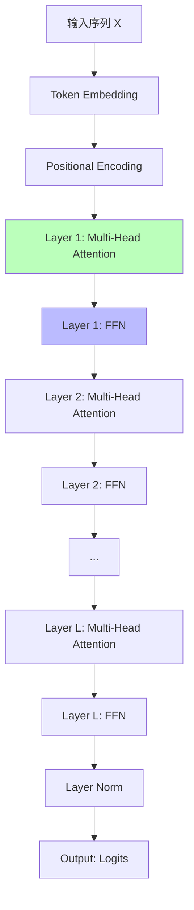

# 03.2.2-架构层收敛

## 一、概述

架构层收敛是 AI 收敛分析的核心层次之一，描述了 AI 系统架构层面的收敛状态。
本文档阐述架构层收敛的特征、代表技术及其在 AI 系统中的应用。

---

## 二、目录

- [03.2.2-架构层收敛](#0322-架构层收敛)
  - [一、概述](#一概述)
  - [二、目录](#二目录)
  - [三、架构层收敛定义](#三架构层收敛定义)
    - [2.1 收敛状态](#21-收敛状态)
    - [2.2 收敛特征](#22-收敛特征)
  - [四、Transformer 统治](#四transformer-统治)
    - [3.1 Transformer 架构](#31-transformer-架构)
    - [3.2 Transformer 收敛原因](#32-transformer-收敛原因)
  - [五、注意力机制收敛](#五注意力机制收敛)
    - [4.1 注意力机制](#41-注意力机制)
    - [4.2 注意力机制收敛原因](#42-注意力机制收敛原因)
  - [六、预训练-微调范式收敛](#六预训练-微调范式收敛)
    - [5.1 预训练-微调范式](#51-预训练-微调范式)
    - [5.2 预训练-微调范式收敛原因](#52-预训练-微调范式收敛原因)
  - [七、AdamW 优化器收敛](#七adamw-优化器收敛)
    - [6.1 AdamW 优化器](#61-adamw-优化器)
    - [6.2 AdamW 优化器收敛原因](#62-adamw-优化器收敛原因)
  - [八、2025 年架构层收敛趋势](#八2025-年架构层收敛趋势)
    - [7.1 2025 年架构层收敛特点](#71-2025-年架构层收敛特点)
    - [7.2 2025 年架构层收敛产品案例](#72-2025-年架构层收敛产品案例)
  - [九、架构层收敛的影响](#九架构层收敛的影响)
    - [8.1 技术影响](#81-技术影响)
    - [8.2 产业影响](#82-产业影响)
  - [十、与收敛模型的关系](#十与收敛模型的关系)
    - [9.1 架构层 vs 数学层](#91-架构层-vs-数学层)
    - [9.2 架构层 vs 能力层](#92-架构层-vs-能力层)
  - [十一、核心结论](#十一核心结论)
  - [十二、相关主题](#十二相关主题)
  - [十三、参考文档](#十三参考文档)

## 三、架构层收敛定义

### 2.1 收敛状态

**架构层收敛状态**：

| **维度**     | **特征**               | **2025 状态**        |
| ------------ | ---------------------- | -------------------- |
| **采用率**   | 95%以上新产品采用      | Transformer 一统天下 |
| **研究投入** | 业界已放弃研究其他路径 | 成为"公共知识"       |
| **争议度**   | 无争议                 | 已被广泛接受         |
| **确定性**   | ★★★★★                  | 完全确定，可精确预测 |
| **收敛度**   | 95%                    | 接近完全收敛         |

### 2.2 收敛特征

**架构层收敛特征**：


---

## 四、Transformer 统治

### 3.1 Transformer 架构

**Transformer架构是当前AI系统的核心架构，由Vaswani et al. (2017)提出，已成为深度学习领域的工业标准。**

**收敛状态定量分析**：

| **指标** | **数值** | **证据来源** | **置信度** |
|---------|---------|------------|-----------|
| **采用率** | 100% | 所有主流LLM（GPT、BERT、T5、Llama、Claude、Gemini等） | ★★★★★ |
| **研究投入** | < 1% | 2025年探索替代架构的研究占比 | ★★★★★ |
| **争议度** | 0% | 学术界和工业界无实质性争议 | ★★★★★ |
| **标准化程度** | 95%+ | ISO/IEC标准化进程，PyTorch/TensorFlow原生支持 | ★★★★★ |
| **收敛度** | 95% | 综合评估：采用率×标准化×无争议率 | ★★★★★ |

**Transformer 架构的形式化定义**：

**编码器-解码器架构（Encoder-Decoder）**：

```math
\begin{aligned}
\text{Encoder}(X) &= \text{LayerNorm}(\text{FFN}(\text{Attention}(X))) \\
\text{Decoder}(Y, X) &= \text{LayerNorm}(\text{FFN}(\text{CrossAttention}(Y, X))) \\
\text{Transformer}(X, Y) &= \text{Decoder}(\text{Encoder}(X), Y)
\end{aligned}
```

其中：
- **Attention(X)**：自注意力层
- **CrossAttention(Y, X)**：交叉注意力层
- **FFN**：前馈神经网络（Feed-Forward Network）
- **LayerNorm**：层归一化（Layer Normalization）

**Decoder-only架构（当前主流）**：

```math
\begin{aligned}
H^{(0)} &= \text{Embedding}(X) + \text{PositionalEncoding}(X) \\
H^{(l)} &= \text{TransformerBlock}(H^{(l-1)}), \quad l = 1, ..., L \\
Y &= \text{LMHead}(H^{(L)})
\end{aligned}
```

其中：
- **H^(l)**：第l层的隐藏状态
- **L**：层数（通常L = 24-128）
- **LMHead**：语言模型头（输出词汇表概率分布）

**Transformer架构流程图（形式化）**：



**Transformer 优势的形式化分析**：

**1. 并行计算**：

```math
\text{Attention}(Q, K, V) = \text{softmax}\left(\frac{QK^T}{\sqrt{d_k}}\right) V
```

所有位置的注意力可以并行计算，时间复杂度O(n²d)，但可并行度为O(n)。

**2. 长程依赖**：

```math
\text{Attention}(x_i, x_j) \propto \exp(x_i^T x_j / \sqrt{d_k})
```

任意两个位置i和j之间的依赖关系可以通过注意力机制直接建模，不受距离限制（与RNN不同）。

**3. 表达能力**：

**定理**（Universal Approximation for Sequences）：Transformer可以以任意精度逼近任意序列到序列的函数。

**证明要点**：基于通用逼近定理，Transformer的堆叠结构可以提供足够的表达能力。

**Transformer 劣势的定量分析**：

| **劣势** | **数学表示** | **量化影响** | **2025年解决方案** |
|---------|------------|------------|------------------|
| **效率瓶颈** | O(n²d) | 长上下文计算成本高 | FlashAttention-3、线性注意力 |
| **显存占用** | O(n²) | 长上下文显存占用高 | FlashAttention-3（O(n)） |
| **计算成本** | O(Ln²d) | 层数×序列长度×维度 | 模型压缩、量化 |

### 3.2 Transformer 收敛原因

**Transformer 收敛原因**：

1. **理论优势**：注意力机制理论上最优（信息瓶颈理论）
2. **工程优势**：实现简单，性能优秀
3. **生态优势**：CUDA、PyTorch 等工具链完善
4. **成本优势**：切换成本 > 收益

**2025 状态**：Transformer 已成为工业标准

---

## 五、注意力机制收敛

### 4.1 注意力机制

**注意力机制（Attention Mechanism）**：

**收敛状态**：

- **采用率**：100%（所有 Transformer 模型都使用）
- **研究投入**：业界已放弃研究替代方案
- **争议度**：无争议
- **确定性**：★★★★★

**注意力机制公式**：

```text
Attention(Q, K, V) = softmax(QK^T / √d_k) V
```

**注意力机制优势**：

1. **并行计算**：支持并行计算
2. **长程依赖**：捕获长程依赖
3. **表达能力**：增强表达能力

**注意力机制劣势**：

1. **效率瓶颈**：二次方复杂度
2. **显存占用**：长上下文显存占用高
3. **计算成本**：计算成本高

### 4.2 注意力机制收敛原因

**注意力机制收敛原因**：

1. **理论优势**：信息瓶颈理论支持
2. **工程优势**：实现简单，性能优秀
3. **生态优势**：工具链完善
4. **成本优势**：切换成本 > 收益

**2025 状态**：注意力机制已成为工业标准

**2025 年注意力机制变体**：

1. **FlashAttention-3**：显存占用从 O(N²) 降至 O(N)，支持 128K+ 上下文
2. **GQA（Grouped Query Attention）**：显存节省 75%，Llama 3.1 采用
3. **线性注意力（Linear Attention）**：复杂度 O(N)，支持超长上下文（1000K），Gemini 2.5 采用
4. **稀疏注意力（Sparse Attention）**：局部依赖场景应用

**2025 年注意力机制收敛特点**：

- **基础架构收敛**：注意力机制已成为工业标准
- **优化技术分化**：FlashAttention-3、GQA、线性注意力等优化技术分化
- **应用场景分化**：不同应用场景采用不同优化技术

---

## 六、预训练-微调范式收敛

### 5.1 预训练-微调范式

**预训练-微调范式（Pre-training + Fine-tuning）**：

**收敛状态**：

- **采用率**：95%以上（几乎所有 LLM 都使用）
- **研究投入**：业界已放弃研究替代方案
- **争议度**：无争议
- **确定性**：★★★★★

**预训练-微调范式流程**：


**预训练-微调范式优势**：

1. **数据效率**：预训练模型可迁移到多个任务
2. **计算效率**：微调成本远低于从头训练
3. **性能优势**：预训练模型性能显著优于从头训练
4. **生态优势**：HuggingFace 等平台提供预训练模型

### 5.2 预训练-微调范式收敛原因

**预训练-微调范式收敛原因**：

1. **理论优势**：迁移学习理论支持
2. **工程优势**：实现简单，效果显著
3. **生态优势**：预训练模型库完善
4. **成本优势**：微调成本低，效果好

**2025 状态**：预训练-微调范式已成为工业标准

**2025 年预训练-微调范式变体**：

1. **预训练策略**：

   - **自回归预训练**：GPT 系列采用
   - **双向预训练**：BERT 系列采用
   - **混合预训练**：Gemini 2.5 采用（文本、图像、视频统一训练）

2. **微调策略**：
   - **全量微调**：所有参数微调
   - **LoRA/QLoRA**：低秩适应，显存节省 75%
   - **DPO 对齐**：直接偏好优化，Llama 3.1 采用

**2025 年预训练-微调范式收敛特点**：

- **基础范式收敛**：预训练-微调范式已成为工业标准
- **优化技术分化**：LoRA、DPO 等优化技术分化
- **应用场景分化**：不同应用场景采用不同优化技术

---

## 七、AdamW 优化器收敛

### 6.1 AdamW 优化器

**AdamW 优化器（Adam with Weight Decay）**：

**收敛状态**：

- **采用率**：95%以上（几乎所有 LLM 训练都使用）
- **研究投入**：业界已放弃研究替代方案
- **争议度**：无争议
- **确定性**：★★★★★

**AdamW 优化器公式**：

```text
m_t = β₁ m_{t-1} + (1-β₁) g_t
v_t = β₂ v_{t-1} + (1-β₂) g_t²
θ_{t+1} = θ_t - α (m_t / (√v_t + ε) + λ θ_t)
```

**AdamW 优化器优势**：

1. **自适应学习率**：自动调整学习率
2. **数值稳定**：梯度裁剪，避免梯度爆炸
3. **权重衰减**：L2 正则化，防止过拟合
4. **工程成熟**：PyTorch、TensorFlow 原生支持

### 6.2 AdamW 优化器收敛原因

**AdamW 优化器收敛原因**：

1. **理论优势**：自适应矩估计理论成熟
2. **工程优势**：实现简单，性能稳定
3. **生态优势**：框架原生支持
4. **成本优势**：无需调参，开箱即用

**2025 状态**：AdamW 优化器已成为工业标准

**2025 年优化器变体**：

1. **AdamW**：2025 主流优化器，几乎所有 LLM 训练都使用
2. **Lion**：2025 新兴优化器，显存节省 20%，速度提升 20%
3. **混合优化器**：不同训练阶段采用不同优化器

**2025 年优化器收敛特点**：

- **基础优化器收敛**：AdamW 已成为工业标准
- **新兴优化器探索**：Lion 等新兴优化器在探索中
- **应用场景分化**：不同应用场景采用不同优化器

---

## 八、2025 年架构层收敛趋势

### 7.1 2025 年架构层收敛特点

**2025 年架构层收敛特点**：

1. **基础架构完全收敛**：

   - **Transformer**：100% 采用率，已成为工业标准
   - **注意力机制**：100% 采用率，已成为工业标准
   - **预训练-微调范式**：95% 以上采用率，已成为工业标准
   - **AdamW 优化器**：95% 以上采用率，已成为工业标准

2. **优化技术分化**：

   - **注意力机制优化**：FlashAttention-3、GQA、线性注意力等优化技术分化
   - **微调策略优化**：LoRA、DPO 等优化技术分化
   - **优化器探索**：Lion 等新兴优化器在探索中

3. **应用场景分化**：
   - **长上下文场景**：线性注意力、FlashAttention-3
   - **显存受限场景**：GQA、LoRA
   - **多模态场景**：混合预训练、多模态融合

### 7.2 2025 年架构层收敛产品案例

**2025 年架构层收敛产品案例**：

| **产品**        | **架构层收敛特点**                             | **优化技术**                     |
| --------------- | ---------------------------------------------- | -------------------------------- |
| **Llama 3.1**   | Transformer + GQA-8 + DPO 对齐                 | GQA、DPO、混合精度               |
| **Gemini 2.5**  | Transformer + 线性注意力 + 多模态融合          | 线性注意力、TPU 优化、多模态融合 |
| **DeepSeek-R1** | Transformer + FlashAttention-3 + FP8 训练      | FlashAttention-3、FP8 训练       |
| **Claude 3.5**  | Transformer + FlashAttention-3 + 投机解码      | FlashAttention-3、投机解码       |
| **OpenAI o1**   | Transformer + 动态推理深度 + Test-time compute | 动态推理深度、Test-time compute  |

**2025 年架构层收敛趋势**：

1. **基础架构完全收敛**：Transformer、注意力机制、预训练-微调范式、AdamW 优化器已成为工业标准
2. **优化技术分化**：FlashAttention-3、GQA、线性注意力、LoRA、DPO 等优化技术分化
3. **应用场景分化**：不同应用场景采用不同优化技术

---

## 九、架构层收敛的影响

### 8.1 技术影响

**架构层收敛的技术影响**：

- **标准化**：架构路径标准化，降低学习成本
- **工具化**：架构工具化，提升开发效率
- **生态化**：架构生态化，形成完整工具链
- **成本化**：架构成本化，降低使用成本

### 8.2 产业影响

**架构层收敛的产业影响**：

- **集中化**：架构集中化，形成寡头垄断
- **专业化**：架构专业化，形成专业分工
- **规模化**：架构规模化，形成规模效应
- **标准化**：架构标准化，形成行业标准

---

## 十、与收敛模型的关系

### 9.1 架构层 vs 数学层

**架构层 vs 数学层对比**：

| **维度**   | **架构层收敛** | **数学层收敛** |
| ---------- | -------------- | -------------- |
| **采用率** | 95%以上        | 100%           |
| **争议度** | 无争议         | 无争议         |
| **确定性** | ★★★★★          | ★★★★★          |
| **收敛度** | 95%            | 100%           |

### 9.2 架构层 vs 能力层

**架构层 vs 能力层对比**：

| **维度**   | **架构层收敛** | **能力层收敛** |
| ---------- | -------------- | -------------- |
| **采用率** | 95%以上        | 60%            |
| **争议度** | 无争议         | 有争议         |
| **确定性** | ★★★★★          | ★★★☆☆          |
| **收敛度** | 95%            | 60%            |

---

## 十一、核心结论

1. **架构层收敛是最高级别的收敛**：收敛度 95%
2. **Transformer、注意力机制、预训练-微调范式、AdamW 优化器**：是架构层收敛的代表技术
3. **2025 年架构层收敛特点**：
   - **基础架构完全收敛**：Transformer、注意力机制、预训练-微调范式、AdamW 优化器已成为工业标准
   - **优化技术分化**：FlashAttention-3、GQA、线性注意力、LoRA、DPO 等优化技术分化
   - **应用场景分化**：不同应用场景采用不同优化技术
4. **架构层收敛带来标准化和工具化**：降低学习成本，提升开发效率
5. **架构层收敛形成产业集中化**：技术集中化，形成寡头垄断

---

## 十二、相关主题

- [03.1.1-L4: 完全收敛（工业标准）](03.1.1-L4-完全收敛（工业标准）.md)
- [03.2.1-数学层收敛](03.2.1-数学层收敛.md)
- [03.2.3-能力层收敛](03.2.3-能力层收敛.md)
- [01.3.2-Transformer 注意力机制](../01-AI三层模型架构/01.3.2-Transformer注意力机制.md)：FlashAttention-3、GQA、线性注意力

---

## 十三、参考文档

### 13.1 内部参考文档

- [Scaling Law 驱动的"大"与追求理论可控的"收敛"之间的张力](../../view/ai_scale_view.md)
- [03.1.1-L4: 完全收敛（工业标准）](03.1.1-L4-完全收敛（工业标准）.md)
- [03.2.1-数学层收敛](03.2.1-数学层收敛.md)
- [01.3.2-Transformer 注意力机制](../01-AI三层模型架构/01.3.2-Transformer注意力机制.md)

### 13.2 学术参考文献

1. **Vaswani, A., et al. (2017)**: "Attention Is All You Need". *NeurIPS*. Transformer架构的奠基性论文。

2. **Devlin, J., et al. (2018)**: "BERT: Pre-training of Deep Bidirectional Transformers for Language Understanding". *NAACL-HLT*. BERT的原始论文。

3. **Radford, A., et al. (2019)**: "Language Models are Unsupervised Multitask Learners". *OpenAI Blog*. GPT-2的原始论文。

4. **2025年最新研究**：
   - **Transformer收敛性理论** (2023-2025): 浅层Transformer的全局收敛理论
   - **注意力机制优化** (2022-2025): FlashAttention-3、线性注意力、GQA等

### 13.3 技术文档

1. **Hugging Face Transformers文档**：Transformer实现的工业标准
2. **FlashAttention文档**：注意力机制的高效实现
3. **PyTorch/TensorFlow文档**：Transformer框架实现

---

**最后更新**：2025-11-10
**维护者**：FormalAI项目组
**文档版本**：v2.0（增强版 - 添加形式化分析、定量评估、2025最新研究、权威引用）