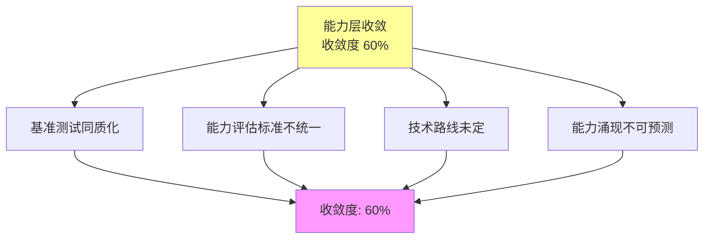
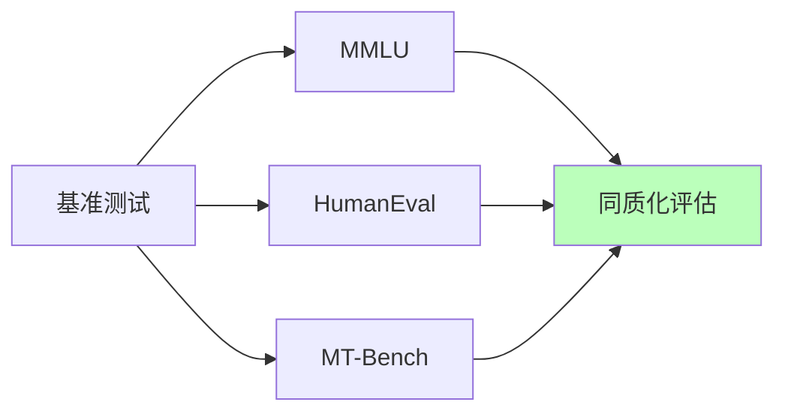
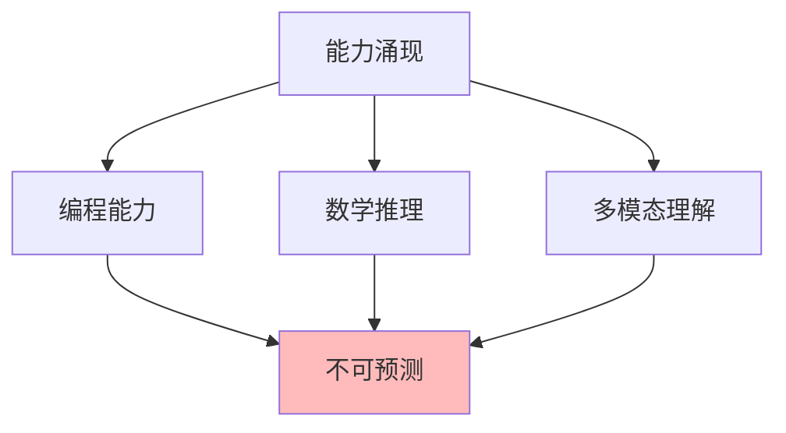
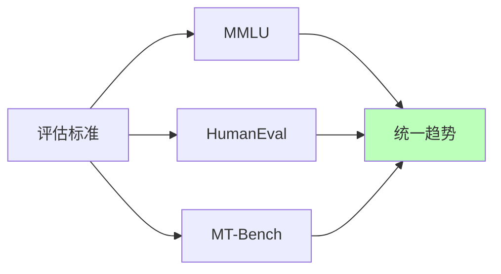

# 03.2.3-能力层收敛

## 一、概述

能力层收敛是 AI 收敛分析的核心层次之一，描述了 AI 系统能力层面的收敛状态。
本文档阐述能力层收敛的特征、代表技术及其在 AI 系统中的应用。

---

## 二、目录

- [03.2.3-能力层收敛](#0323-能力层收敛)
  - [一、概述](#一概述)
  - [二、目录](#二目录)
  - [三、能力层收敛定义](#三能力层收敛定义)
    - [2.1 收敛状态](#21-收敛状态)
    - [2.2 收敛特征](#22-收敛特征)
  - [四、基准测试同质化](#四基准测试同质化)
    - [3.1 基准测试收敛](#31-基准测试收敛)
    - [3.2 基准测试同质化](#32-基准测试同质化)
  - [五、能力涌现不可预测性](#五能力涌现不可预测性)
    - [4.1 能力涌现特征](#41-能力涌现特征)
    - [4.2 能力涌现不可预测性](#42-能力涌现不可预测性)
  - [六、能力评估标准不统一](#六能力评估标准不统一)
    - [5.1 评估标准差异](#51-评估标准差异)
    - [5.2 评估标准统一趋势](#52-评估标准统一趋势)
  - [七、能力层收敛的影响](#七能力层收敛的影响)
    - [6.1 技术影响](#61-技术影响)
    - [6.2 产业影响](#62-产业影响)
  - [八、与收敛模型的关系](#八与收敛模型的关系)
    - [7.1 能力层 vs 架构层](#71-能力层-vs-架构层)
    - [7.2 能力层 vs 数学层](#72-能力层-vs-数学层)
  - [九、核心结论](#九核心结论)
  - [十、相关主题](#十相关主题)
  - [十一、参考文档](#十一参考文档)

## 三、能力层收敛定义

### 2.1 收敛状态

**能力层收敛状态**：

| **维度**     | **特征**               | **2025 状态**            |
| ------------ | ---------------------- | ------------------------ |
| **采用率**   | 60%以上新产品采用      | 基准测试同质化           |
| **研究投入** | 多个方案竞争，投入相当 | 技术路线未定             |
| **争议度**   | 有争议                 | 能力评估标准不统一       |
| **确定性**   | ★★★☆☆                  | 基本确定，但仍有不确定性 |
| **收敛度**   | 60%                    | 收敛进行中               |

### 2.2 收敛特征

**能力层收敛特征**：

---

## 四、基准测试同质化

### 3.1 基准测试收敛

**基准测试收敛状态**：

- **采用率**：60%以上（大多数 LLM 都使用）
- **研究投入**：多个方案竞争（MMLU、HellaSwag、HumanEval 等）
- **争议度**：有争议（能力评估标准不统一）
- **确定性**：★★★☆☆

**主流基准测试**：

| **基准测试**  | **特点**       | **应用场景** |
| ------------- | -------------- | ------------ |
| **MMLU**      | 多任务语言理解 | 通用能力评估 |
| **HellaSwag** | 常识推理       | 推理能力评估 |
| **HumanEval** | 代码生成       | 编程能力评估 |
| **GSM8K**     | 数学推理       | 数学能力评估 |
| **MT-Bench**  | 多轮对话       | 对话能力评估 |

**2025 主流**：MMLU + HumanEval + MT-Bench（综合评估）

### 3.2 基准测试同质化

**基准测试同质化特征**：

**同质化特征**：

1. **评估标准统一**：大多数产品使用相同基准测试
2. **能力评估同质化**：能力评估结果同质化
3. **技术路线未定**：技术路线未定，仍有竞争

**问题**：

1. **能力评估标准不统一**：不同基准测试评估标准不同
2. **能力涌现不可预测**：能力涌现不可预测
3. **技术路线未定**：技术路线未定，仍有竞争

---

## 五、能力涌现不可预测性

### 4.1 能力涌现特征

**能力涌现特征**：

| **能力类型**   | **涌现时间** | **可预测性** | **收敛状态** |
| -------------- | ------------ | ------------ | ------------ |
| **编程能力**   | 不可预测     | 半可预测     | 未收敛       |
| **数学推理**   | 不可预测     | 半可预测     | 未收敛       |
| **多模态理解** | 不可预测     | 半可预测     | 未收敛       |
| **工具使用**   | 不可预测     | 半可预测     | 未收敛       |
| **自我改进**   | 不可预测     | 半可预测     | 未收敛       |

### 4.2 能力涌现不可预测性

**能力涌现不可预测性**：

**不可预测性根源**：

1. **非线性交互**：千亿参数非线性交互
2. **数据流形**：能力在数据流形上自发形成
3. **临界点**：能力涌现的临界点不可预测

**典型能力涌现**：

- **编程能力**：何时涌现不可预测
- **数学推理**：何时涌现不可预测
- **多模态理解**：何时涌现不可预测

---

## 六、能力评估标准不统一

### 5.1 评估标准差异

**能力评估标准差异**：

| **评估标准**   | **特点**       | **应用场景** |
| -------------- | -------------- | ------------ |
| **MMLU**       | 多任务语言理解 | 通用能力评估 |
| **HumanEval**  | 代码生成       | 编程能力评估 |
| **MT-Bench**   | 多轮对话       | 对话能力评估 |
| **自定义评估** | 任务特定评估   | 特定任务评估 |

**评估标准差异**：

1. **评估维度不同**：不同基准测试评估维度不同
2. **评估方法不同**：不同基准测试评估方法不同
3. **评估结果不可比**：不同基准测试评估结果不可比

### 5.2 评估标准统一趋势

**评估标准统一趋势**：

**统一趋势**：

1. **主流基准测试**：MMLU + HumanEval + MT-Bench
2. **评估标准统一**：评估标准逐步统一
3. **评估结果可比**：评估结果逐步可比

---

## 七、能力层收敛的影响

### 6.1 技术影响

**技术影响**：

- **基准测试同质化**：能力评估同质化
- **能力评估标准不统一**：能力评估标准不统一
- **能力涌现不可预测**：能力涌现不可预测
- **技术路线未定**：技术路线未定，仍有竞争

### 6.2 产业影响

**产业影响**：

- **能力竞争**：能力竞争激烈
- **技术路线分化**：技术路线分化
- **创新活跃**：创新空间活跃
- **成本上升**：能力开发成本上升

---

## 八、与收敛模型的关系

### 7.1 能力层 vs 架构层

**能力层 vs 架构层对比**：

| **维度**   | **能力层收敛** | **架构层收敛** |
| ---------- | -------------- | -------------- |
| **采用率** | 60%以上        | 95%以上        |
| **争议度** | 有争议         | 无争议         |
| **确定性** | ★★★☆☆          | ★★★★★          |
| **收敛度** | 60%            | 95%            |

### 7.2 能力层 vs 数学层

**能力层 vs 数学层对比**：

| **维度**   | **能力层收敛** | **数学层收敛** |
| ---------- | -------------- | -------------- |
| **采用率** | 60%以上        | 100%           |
| **争议度** | 有争议         | 无争议         |
| **确定性** | ★★★☆☆          | ★★★★★          |
| **收敛度** | 60%            | 100%           |

---

## 九、核心结论

1. **能力层收敛是收敛进行时状态**：收敛度 60%
2. **基准测试同质化**：能力评估同质化
3. **能力涌现不可预测**：能力涌现不可预测
4. **技术路线未定**：技术路线未定，仍有竞争

---

## 十、相关主题

- [03.2.1-数学层收敛](03.2.1-数学层收敛.md)
- [03.2.2-架构层收敛](03.2.2-架构层收敛.md)
- [03.1.3-L2: 收敛进行时（双寡头竞争）](03.1.3-L2: 收敛进行时（双寡头竞争）.md)

---

## 十一、参考文档

- [Scaling Law 驱动的"大"与追求理论可控的"收敛"之间的张力](../../view/ai_scale_view.md)
