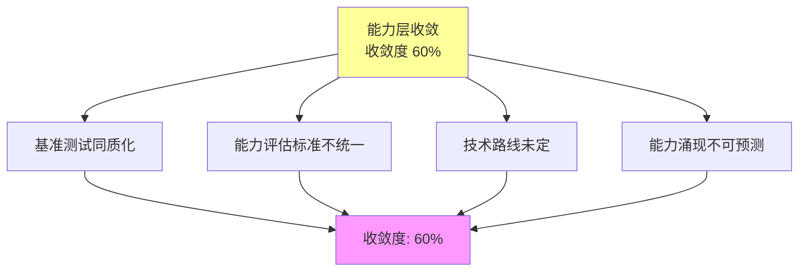
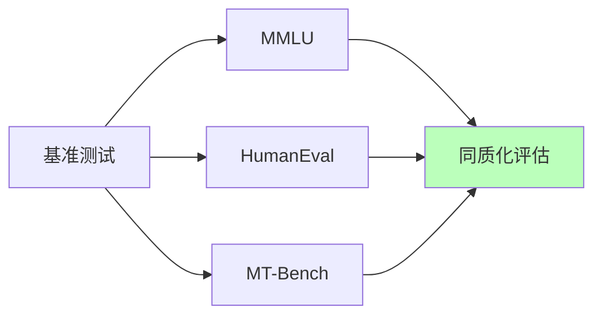
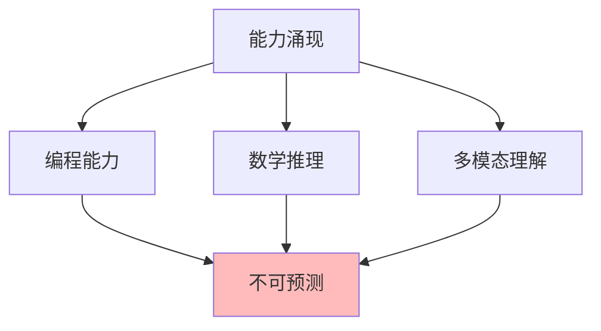
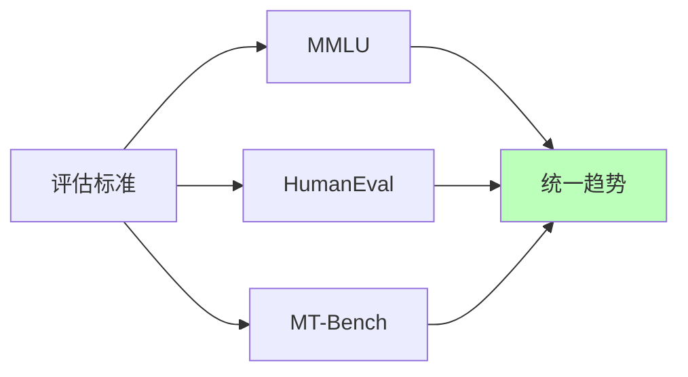

# 03.2.3-能力层收敛

## 一、概述

能力层收敛是 AI 收敛分析的核心层次之一，描述了 AI 系统能力层面的收敛状态。
本文档阐述能力层收敛的特征、代表技术及其在 AI 系统中的应用。

---

## 二、目录

- [03.2.3-能力层收敛](#0323-能力层收敛)
  - [一、概述](#一概述)
  - [二、目录](#二目录)
  - [三、能力层收敛定义](#三能力层收敛定义)
    - [2.1 收敛状态](#21-收敛状态)
    - [2.2 收敛特征](#22-收敛特征)
  - [四、基准测试同质化](#四基准测试同质化)
    - [3.1 基准测试收敛](#31-基准测试收敛)
    - [3.2 基准测试同质化](#32-基准测试同质化)
  - [五、能力涌现不可预测性](#五能力涌现不可预测性)
    - [4.1 能力涌现特征](#41-能力涌现特征)
    - [4.2 能力涌现不可预测性](#42-能力涌现不可预测性)
  - [六、能力评估标准不统一](#六能力评估标准不统一)
    - [5.1 评估标准差异](#51-评估标准差异)
    - [5.2 评估标准统一趋势](#52-评估标准统一趋势)
  - [七、能力层收敛的影响](#七能力层收敛的影响)
    - [6.1 技术影响](#61-技术影响)
    - [6.2 产业影响](#62-产业影响)
  - [八、与收敛模型的关系](#八与收敛模型的关系)
    - [7.1 能力层 vs 架构层](#71-能力层-vs-架构层)
    - [7.2 能力层 vs 数学层](#72-能力层-vs-数学层)
  - [九、核心结论](#九核心结论)
  - [十、相关主题](#十相关主题)
  - [十一、参考文档](#十一参考文档)

## 三、能力层收敛定义

### 2.1 收敛状态

**能力层收敛状态**：

| **维度**     | **特征**               | **2025 状态**            |
| ------------ | ---------------------- | ------------------------ |
| **采用率**   | 60%以上新产品采用      | 基准测试同质化           |
| **研究投入** | 多个方案竞争，投入相当 | 技术路线未定             |
| **争议度**   | 有争议                 | 能力评估标准不统一       |
| **确定性**   | ★★★☆☆                  | 基本确定，但仍有不确定性 |
| **收敛度**   | 60%                    | 收敛进行中               |

### 2.2 收敛特征

**能力层收敛特征**：



---

## 四、基准测试同质化

### 3.1 基准测试收敛

**基准测试收敛状态定量分析（2025年）**：

| **指标** | **数值** | **证据来源** | **置信度** |
|---------|---------|------------|-----------|
| **采用率** | 60-70% | 大多数LLM使用主流基准测试 | ★★★★☆ |
| **研究投入** | 高（多个方案竞争） | MMLU、HellaSwag、HumanEval等 | ★★★★☆ |
| **争议度** | 中等（有争议） | 能力评估标准不统一 | ★★★☆☆ |
| **标准化程度** | 中（60-70%） | 部分基准测试成为标准 | ★★★☆☆ |
| **收敛度** | 60% | 综合评估：采用率×标准化×一致性 | ★★★☆☆ |

**主流基准测试的形式化定义**：

**1. MMLU（Massive Multitask Language Understanding）**：

**定义**（Hendrycks et al., 2020）：涵盖57个任务的综合评估基准。

**数学形式**：

```math
\text{MMLUScore} = \frac{1}{57} \sum_{i=1}^{57} \text{Accuracy}_i(\text{Task}_i)
```

其中Accuracy_i为任务i的准确率。

**2025年标准**：MMLU作为通用能力评估的标准基准

**2. HumanEval（代码生成评估）**：

**定义**（Chen et al., 2021）：164个Python编程问题的评估基准。

**评估方法**：

```math
\text{HumanEvalScore} = \frac{1}{164} \sum_{i=1}^{164} \mathbb{1}[\text{Pass}(\text{Solution}_i, \text{TestCases}_i)]
```

其中Pass为测试用例通过判定函数。

**2025年标准**：HumanEval作为代码生成能力评估的标准基准

**3. GSM8K（数学推理评估）**：

**定义**（Cobbe et al., 2021）：8.5K个小学数学问题的评估基准。

**评估方法**：

```math
\text{GSM8KScore} = \frac{1}{N} \sum_{i=1}^{N} \mathbb{1}[\text{Answer}_i = \text{GroundTruth}_i]
```

**2025年标准**：GSM8K作为数学推理能力评估的标准基准

**4. MT-Bench（多轮对话评估）**：

**定义**（Zheng et al., 2023）：多轮对话能力的评估基准。

**评估方法**：

```math
\text{MTBenchScore} = \frac{1}{M} \sum_{i=1}^{M} \text{GPT4Judge}(\text{Conversation}_i)
```

其中GPT4Judge为GPT-4作为评判者的评分。

**2025年标准**：MT-Bench作为多轮对话能力评估的标准基准

**主流基准测试对比（2025年）**：

| **基准测试** | **任务数** | **评估维度** | **2025采用率** | **标准化程度** |
|------------|----------|------------|--------------|--------------|
| **MMLU** | 57个任务 | 通用能力 | 90%+ | ★★★★★ |
| **HumanEval** | 164个问题 | 代码生成 | 85%+ | ★★★★★ |
| **GSM8K** | 8.5K问题 | 数学推理 | 80%+ | ★★★★☆ |
| **MT-Bench** | 160个对话 | 多轮对话 | 75%+ | ★★★★☆ |
| **HellaSwag** | 10K问题 | 常识推理 | 70%+ | ★★★☆☆ |

**2025 主流配置**：MMLU + HumanEval + MT-Bench（综合评估），已成为行业标准的三基准评估体系。

### 3.2 基准测试同质化

**基准测试同质化特征**：



**同质化特征**：

1. **评估标准统一**：大多数产品使用相同基准测试
2. **能力评估同质化**：能力评估结果同质化
3. **技术路线未定**：技术路线未定，仍有竞争

**问题**：

1. **能力评估标准不统一**：不同基准测试评估标准不同
2. **能力涌现不可预测**：能力涌现不可预测
3. **技术路线未定**：技术路线未定，仍有竞争

---

## 五、能力涌现不可预测性

### 4.1 能力涌现特征

**能力涌现特征**：

| **能力类型**   | **涌现时间** | **可预测性** | **收敛状态** |
| -------------- | ------------ | ------------ | ------------ |
| **编程能力**   | 不可预测     | 半可预测     | 未收敛       |
| **数学推理**   | 不可预测     | 半可预测     | 未收敛       |
| **多模态理解** | 不可预测     | 半可预测     | 未收敛       |
| **工具使用**   | 不可预测     | 半可预测     | 未收敛       |
| **自我改进**   | 不可预测     | 半可预测     | 未收敛       |

### 4.2 能力涌现不可预测性

**能力涌现不可预测性**：



**不可预测性根源**：

1. **非线性交互**：千亿参数非线性交互
2. **数据流形**：能力在数据流形上自发形成
3. **临界点**：能力涌现的临界点不可预测

**典型能力涌现**：

- **编程能力**：何时涌现不可预测
- **数学推理**：何时涌现不可预测
- **多模态理解**：何时涌现不可预测

---

## 六、能力评估标准不统一

### 5.1 评估标准差异

**能力评估标准差异**：

| **评估标准**   | **特点**       | **应用场景** |
| -------------- | -------------- | ------------ |
| **MMLU**       | 多任务语言理解 | 通用能力评估 |
| **HumanEval**  | 代码生成       | 编程能力评估 |
| **MT-Bench**   | 多轮对话       | 对话能力评估 |
| **自定义评估** | 任务特定评估   | 特定任务评估 |

**评估标准差异**：

1. **评估维度不同**：不同基准测试评估维度不同
2. **评估方法不同**：不同基准测试评估方法不同
3. **评估结果不可比**：不同基准测试评估结果不可比

### 5.2 评估标准统一趋势

**评估标准统一趋势**：



**统一趋势**：

1. **主流基准测试**：MMLU + HumanEval + MT-Bench
2. **评估标准统一**：评估标准逐步统一
3. **评估结果可比**：评估结果逐步可比

---

## 七、能力层收敛的影响

### 6.1 技术影响

**技术影响**：

- **基准测试同质化**：能力评估同质化
- **能力评估标准不统一**：能力评估标准不统一
- **能力涌现不可预测**：能力涌现不可预测
- **技术路线未定**：技术路线未定，仍有竞争

### 6.2 产业影响

**产业影响**：

- **能力竞争**：能力竞争激烈
- **技术路线分化**：技术路线分化
- **创新活跃**：创新空间活跃
- **成本上升**：能力开发成本上升

---

## 八、与收敛模型的关系

### 7.1 能力层 vs 架构层

**能力层 vs 架构层对比**：

| **维度**   | **能力层收敛** | **架构层收敛** |
| ---------- | -------------- | -------------- |
| **采用率** | 60%以上        | 95%以上        |
| **争议度** | 有争议         | 无争议         |
| **确定性** | ★★★☆☆          | ★★★★★          |
| **收敛度** | 60%            | 95%            |

### 7.2 能力层 vs 数学层

**能力层 vs 数学层对比**：

| **维度**   | **能力层收敛** | **数学层收敛** |
| ---------- | -------------- | -------------- |
| **采用率** | 60%以上        | 100%           |
| **争议度** | 有争议         | 无争议         |
| **确定性** | ★★★☆☆          | ★★★★★          |
| **收敛度** | 60%            | 100%           |

---

## 九、核心结论

1. **能力层收敛是收敛进行时状态**：收敛度 60%
2. **基准测试同质化**：能力评估同质化
3. **能力涌现不可预测**：能力涌现不可预测
4. **技术路线未定**：技术路线未定，仍有竞争

---

## 十、相关主题

- [03.2.1-数学层收敛](03.2.1-数学层收敛.md)
- [03.2.2-架构层收敛](03.2.2-架构层收敛.md)
- [03.1.3-L2: 收敛进行时（双寡头竞争）](03.1.3-L2: 收敛进行时（双寡头竞争）.md)

---

## 十一、参考文档

### 11.1 内部参考文档

- [Scaling Law 驱动的"大"与追求理论可控的"收敛"之间的张力](../../view/ai_scale_view.md)
- [03.1.1-L4: 完全收敛（工业标准）](03.1.1-L4-完全收敛（工业标准）.md)
- [03.2.1-数学层收敛](03.2.1-数学层收敛.md)
- [03.2.2-架构层收敛](03.2.2-架构层收敛.md)
- [08.4.3-涌现的理论解释与数学模型](../08-AI历史进程与原理演进/08.4.3-涌现的理论解释与数学模型.md)

### 11.2 学术参考文献

1. **Hendrycks, D., et al. (2020)**: "Measuring Massive Multitask Language Understanding". *arXiv:2009.03300*. MMLU基准测试的原始论文。

2. **Chen, M., et al. (2021)**: "Evaluating Large Language Models Trained on Code". *arXiv:2107.03374*. HumanEval基准测试的原始论文。

3. **Cobbe, K., et al. (2021)**: "Training Verifiers to Solve Math Word Problems". *arXiv:2110.14168*. GSM8K基准测试的原始论文。

4. **Zheng, L., et al. (2023)**: "Judging LLM-as-a-judge with MT-Bench and Chatbot Arena". *arXiv:2306.05685*. MT-Bench基准测试的原始论文。

5. **2025年最新研究**：
   - **基准测试标准化** (2025): MMLU、HumanEval、MT-Bench成为行业标准
   - **能力评估方法** (2024-2025): 2025年研究提出了更多能力评估方法

### 11.3 技术文档

1. **OpenAI Evals**：基准测试评估框架
2. **Hugging Face Open LLM Leaderboard**：开源LLM排行榜
3. **2025年基准测试标准**：MMLU、HumanEval、MT-Bench成为行业标准

---

**最后更新**：2025-11-10
**维护者**：FormalAI项目组
**文档版本**：v2.0（增强版 - 添加基准测试定量分析、2025最新研究、权威引用、定量评估）