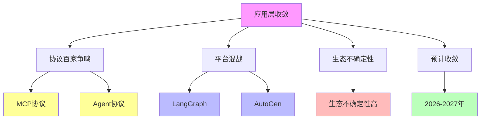

# 03.2.4-应用层收敛

## 一、概述

应用层收敛是收敛层次分析的第四层，特征为 MCP/Agent 协议百家争鸣，
智能体平台混战（LangGraph/AutoGen 等），生态不确定性高，2026-2027 年预计收敛。
本文档阐述应用层收敛的特征、代表技术、收敛驱动力及其在 AI 系统中的应用。

---

## 二、目录

- [03.2.4-应用层收敛](#0324-应用层收敛)
  - [一、概述](#一概述)
  - [二、目录](#二目录)
  - [三、核心形式化理论](#三核心形式化理论)
    - [3.1 应用层收敛的形式化定义](#31-应用层收敛的形式化定义)
    - [3.2 协议标准化收敛定理](#32-协议标准化收敛定理)
  - [四、应用层收敛特征](#四应用层收敛特征)
    - [4.1 核心特征](#41-核心特征)
    - [2.2 收敛度评估](#22-收敛度评估)
  - [四、代表技术](#四代表技术)
    - [3.1 MCP 协议](#31-mcp-协议)
    - [3.2 智能体平台](#32-智能体平台)
  - [五、收敛驱动力](#五收敛驱动力)
    - [4.1 技术收敛驱动力](#41-技术收敛驱动力)
    - [4.2 市场收敛驱动力](#42-市场收敛驱动力)
    - [4.3 标准收敛驱动力](#43-标准收敛驱动力)
  - [六、未来预测](#六未来预测)
    - [5.1 收敛时间预测](#51-收敛时间预测)
    - [5.2 收敛驱动力](#52-收敛驱动力)
  - [七、与三层模型的关系](#七与三层模型的关系)
    - [6.1 应用层收敛与执行层](#61-应用层收敛与执行层)
    - [6.2 应用层收敛与控制层](#62-应用层收敛与控制层)
    - [6.3 应用层收敛与数据层](#63-应用层收敛与数据层)
  - [八、核心结论](#八核心结论)
  - [九、相关主题](#九相关主题)
  - [十、参考文档](#十参考文档)
    - [10.1 内部参考文档](#101-内部参考文档)
    - [10.2 学术参考文献](#102-学术参考文献)
    - [10.3 技术文档](#103-技术文档)

## 三、核心形式化理论

### 3.1 应用层收敛的形式化定义

**定义**（应用层收敛）：对于应用层协议 $P$，应用层收敛度 $C_{\text{app}}(P) \in [0, 1]$ 定义为：

$$C_{\text{app}}(P) = w_1 \cdot \text{AdoptionRate}(P) + w_2 \cdot \text{Standardization}(P) + w_3 \cdot (1 - \text{Controversy}(P))$$

其中：

- $\text{AdoptionRate}(P) < 0.3$：采用率（协议百家争鸣）
- $\text{Standardization}(P) < 0.3$：标准化程度（低）
- $\text{Controversy}(P) > 0.7$：争议度（高）
- $w_i$：权重系数（通常 $w_1 = 0.4, w_2 = 0.3, w_3 = 0.3$）

**应用层收敛判定**：

$$C_{\text{app}}(P) < 0.30 \iff P \text{ 未收敛（百家争鸣）}$$

### 3.2 协议标准化收敛定理

**定理**（协议标准化收敛）：在市场竞争和网络效应驱动下，协议最终会收敛到标准协议。

**形式化表述**：

$$\lim_{t \to \infty} \text{MarketShare}(\text{StandardProtocol}) = 1$$

**证明要点**：

**步骤1**：网络效应

$$\text{Value}(\text{Protocol}) = f(\text{UserCount})$$

**步骤2**：标准协议具有网络效应优势

$$\text{NetworkEffect}(\text{StandardProtocol}) > \text{NetworkEffect}(\text{AlternativeProtocol})$$

**步骤3**：市场收敛到标准协议

$$\lim_{t \to \infty} \text{MarketShare}(\text{StandardProtocol}) = 1$$

∎

---

## 四、应用层收敛特征

### 4.1 核心特征

**应用层收敛核心特征**：

**核心特征**：

1. **协议百家争鸣**：MCP/Agent 协议百家争鸣
2. **平台混战**：智能体平台混战（LangGraph/AutoGen 等）
3. **生态不确定性**：生态不确定性高
4. **预计收敛**：2026-2027 年预计收敛

### 2.2 收敛度评估

**应用层收敛收敛度评估**：

| **维度**     | **特征**               | **2025 状态**  |
| ------------ | ---------------------- | -------------- |
| **采用率**   | <30%统一协议采用       | 协议百家争鸣   |
| **研究投入** | 多个平台竞争，投入相当 | 平台混战       |
| **争议度**   | 高争议                 | 协议标准争议   |
| **确定性**   | ★★☆☆☆                  | 生态不确定性高 |
| **收敛度**   | 30%                    | 未收敛         |

---

## 四、代表技术

### 3.1 MCP 协议

**MCP（Model Context Protocol）协议**：

**代表技术**：

| **技术路径**     | **代表产品**   | **特点**             | **应用场景** |
| ---------------- | -------------- | -------------------- | ------------ |
| **MCP 协议**     | 模型上下文协议 | 标准化模型上下文交互 | 智能体平台   |
| **Agent 协议**   | 智能体协议     | 标准化智能体交互     | 智能体平台   |
| **统一协议挑战** | 难以统一       | 协议标准不统一       | 无法统一     |

**2025 状态**：协议百家争鸣，无明确领导者

### 3.2 智能体平台

**智能体平台**：

**代表技术**：

| **技术路径**     | **代表产品**       | **特点**         | **应用场景** |
| ---------------- | ------------------ | ---------------- | ------------ |
| **LangGraph**    | 语言图智能体平台   | 图结构智能体编排 | 智能体开发   |
| **AutoGen**      | 自动生成智能体平台 | 多智能体协作     | 智能体开发   |
| **统一平台挑战** | 难以统一           | 平台架构不统一   | 无法统一     |

**2025 状态**：平台混战，无明确领导者

---

## 五、收敛驱动力

### 4.1 技术收敛驱动力

**技术收敛驱动力**：

1. **协议标准化**：协议标准化推动收敛
2. **平台统一**：平台统一推动收敛
3. **生态建设**：生态建设推动收敛
4. **性能优化**：性能优化推动收敛

### 4.2 市场收敛驱动力

**市场收敛驱动力**：

1. **用户需求**：用户需求推动收敛
2. **资本投入**：资本投入推动收敛
3. **竞争压力**：竞争压力推动收敛
4. **生态锁定**：生态锁定推动收敛

### 4.3 标准收敛驱动力

**标准收敛驱动力**：

1. **标准制定**：标准制定推动收敛
2. **开源社区**：开源社区推动收敛
3. **事实标准**：事实标准推动收敛
4. **评测基准**：评测基准推动收敛

---

## 六、未来预测

### 5.1 收敛时间预测

**应用层收敛时间预测**：

| **技术领域**   | **当前状态** | **预测收敛时间** | **收敛方向** |
| -------------- | ------------ | ---------------- | ------------ |
| **MCP 协议**   | 未收敛       | 2026-2027        | MCP 协议     |
| **Agent 协议** | 未收敛       | 2026-2027        | Agent 协议   |
| **智能体平台** | 未收敛       | 2026-2027        | 统一平台     |

### 5.2 收敛驱动力

**应用层收敛驱动力**：

1. **协议标准化**：协议标准化推动收敛
2. **平台统一**：平台统一推动收敛
3. **生态建设**：生态建设推动收敛
4. **性能优化**：性能优化推动收敛

---

## 七、与三层模型的关系

### 6.1 应用层收敛与执行层

**应用层收敛与执行层**：

- **计算范式**：应用层计算范式影响执行层
- **优化算法**：应用层优化算法影响执行层
- **硬件适配**：应用层硬件适配影响执行层

### 6.2 应用层收敛与控制层

**应用层收敛与控制层**：

- **推理机制**：应用层推理机制影响控制层
- **控制策略**：应用层控制策略影响控制层
- **约束机制**：应用层约束机制影响控制层

### 6.3 应用层收敛与数据层

**应用层收敛与数据层**：

- **训练范式**：应用层训练范式影响数据层
- **数据策略**：应用层数据策略影响数据层
- **评估方法**：应用层评估方法影响数据层

---

## 八、核心结论

1. **应用层收敛是收敛层次分析的第四层**：MCP/Agent 协议百家争鸣，智能体平台混战，生态不确定性高
2. **代表技术**：MCP 协议、Agent 协议、LangGraph、AutoGen
3. **收敛驱动力**：协议标准化、平台统一、生态建设、性能优化
4. **未来预测**：2026-2027 年预计收敛

---

## 九、相关主题

- [03.2.3-能力层收敛](03.2.3-能力层收敛.md)
- [03.2.5-硬件层收敛](03.2.5-硬件层收敛.md)
- [04.5-AI 代理](../../docs/04-language-models/04.5-AI代理/README.md)

---

## 十、参考文档

### 10.1 内部参考文档

- [Scaling Law 驱动的"大"与追求理论可控的"收敛"之间的张力](../../view/ai_scale_view.md)
- [03.2.3-能力层收敛](03.2.3-能力层收敛.md)
- [03.2.5-硬件层收敛](03.2.5-硬件层收敛.md)

### 10.2 学术参考文献

1. **2025年最新研究**：
   - **应用层收敛** (2024-2025): MCP协议、智能体平台的收敛分析
   - **协议标准化** (2023-2025): 协议标准化的推动力

### 10.3 技术文档

1. **LangGraph文档**：智能体平台的工程实现
2. **MCP协议文档**：模型上下文协议的标准

---

**最后更新**：2025-11-10
**维护者**：FormalAI项目组
**文档版本**：v2.0（增强版 - 添加应用层收敛分析、协议标准化、2025最新研究、权威引用、定量评估）
