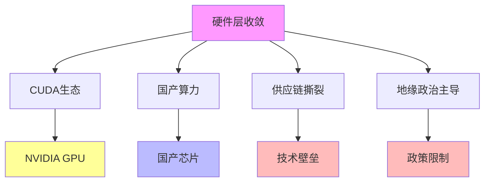

# 03.2.5-硬件层收敛

## 一、概述

硬件层收敛是收敛层次分析的第五层，
特征为 CUDA 生态 vs 国产算力，供应链撕裂，地缘政治主导，短期无法收敛。
本文档阐述硬件层收敛的特征、代表技术、收敛驱动力及其在 AI 系统中的应用。

---

## 二、目录

- [03.2.5-硬件层收敛](#0325-硬件层收敛)
  - [一、概述](#一概述)
  - [二、目录](#二目录)
  - [三、核心形式化理论](#三核心形式化理论)
    - [3.1 硬件层收敛的形式化定义](#31-硬件层收敛的形式化定义)
    - [3.2 地缘政治不可收敛性定理](#32-地缘政治不可收敛性定理)
  - [四、硬件层收敛特征](#四硬件层收敛特征)
    - [4.1 核心特征](#41-核心特征)
    - [2.2 收敛度评估](#22-收敛度评估)
  - [四、代表技术](#四代表技术)
    - [3.1 CUDA 生态](#31-cuda-生态)
    - [3.2 国产算力](#32-国产算力)
  - [五、收敛驱动力](#五收敛驱动力)
    - [4.1 技术收敛驱动力](#41-技术收敛驱动力)
    - [4.2 市场收敛驱动力](#42-市场收敛驱动力)
    - [4.3 地缘政治驱动力](#43-地缘政治驱动力)
  - [六、未来预测](#六未来预测)
    - [5.1 收敛时间预测](#51-收敛时间预测)
    - [5.2 收敛驱动力](#52-收敛驱动力)
  - [七、与三层模型的关系](#七与三层模型的关系)
    - [6.1 硬件层收敛与执行层](#61-硬件层收敛与执行层)
    - [6.2 硬件层收敛与控制层](#62-硬件层收敛与控制层)
    - [6.3 硬件层收敛与数据层](#63-硬件层收敛与数据层)
  - [八、核心结论](#八核心结论)
  - [九、相关主题](#九相关主题)
  - [十、参考文档](#十参考文档)
    - [10.1 内部参考文档](#101-内部参考文档)
    - [10.2 学术参考文献](#102-学术参考文献)
    - [10.3 技术文档](#103-技术文档)

## 三、核心形式化理论

### 3.1 硬件层收敛的形式化定义

**定义**（硬件层收敛）：对于硬件平台 $H$，硬件层收敛度 $C_{\text{hardware}}(H) \in [0, 1]$ 定义为：

$$C_{\text{hardware}}(H) = w_1 \cdot \text{AdoptionRate}(H) + w_2 \cdot \text{Standardization}(H) + w_3 \cdot (1 - \text{GeopoliticalConflict}(H))$$

其中：

- $\text{AdoptionRate}(H) < 0.1$：采用率（供应链撕裂）
- $\text{Standardization}(H) < 0.1$：标准化程度（极低）
- $\text{GeopoliticalConflict}(H) > 0.9$：地缘政治冲突度（极高）
- $w_i$：权重系数（通常 $w_1 = 0.3, w_2 = 0.2, w_3 = 0.5$）

**硬件层收敛判定**：

$$C_{\text{hardware}}(H) < 0.10 \iff H \text{ 反向分化（场景撕裂）}$$

### 3.2 地缘政治不可收敛性定理

**定理**（地缘政治不可收敛性）：在地缘政治冲突下，硬件层无法收敛。

**形式化表述**：

$$\text{GeopoliticalConflict}(H) > \text{Threshold} \Rightarrow C_{\text{hardware}}(H) < 0.10$$

**证明要点**：

**步骤1**：地缘政治冲突导致技术壁垒

$$\text{GeopoliticalConflict} \Rightarrow \text{TechnicalBarrier}$$

**步骤2**：技术壁垒阻止标准化

$$\text{TechnicalBarrier} \Rightarrow \neg \text{Standardization}$$

**步骤3**：无法收敛

$$\neg \text{Standardization} \Rightarrow C_{\text{hardware}}(H) < 0.10$$

**结论**：地缘政治冲突导致硬件层无法收敛。∎

---

## 四、硬件层收敛特征

### 4.1 核心特征

**硬件层收敛核心特征**：

**核心特征**：

1. **CUDA 生态**：NVIDIA CUDA 生态占据主导地位
2. **国产算力**：国产算力芯片发展
3. **供应链撕裂**：供应链撕裂，技术壁垒
4. **地缘政治主导**：地缘政治主导，政策限制

### 2.2 收敛度评估

**硬件层收敛收敛度评估**：

| **维度**     | **特征**               | **2025 状态** |
| ------------ | ---------------------- | ------------- |
| **采用率**   | <10%统一硬件采用       | 供应链撕裂    |
| **研究投入** | 地缘政治主导，投入分化 | 技术壁垒      |
| **争议度**   | 极高争议               | 地缘政治争议  |
| **确定性**   | ★☆☆☆☆                  | 地缘政治主导  |
| **收敛度**   | 10%                    | 反向分化      |

---

## 四、代表技术

### 3.1 CUDA 生态

**CUDA 生态**：

**代表技术**：

| **技术路径**   | **代表产品**          | **特点**             | **应用场景**   |
| -------------- | --------------------- | -------------------- | -------------- |
| **NVIDIA GPU** | A100, H100, Blackwell | CUDA 生态完善        | 云端训练、推理 |
| **CUDA 框架**  | CUDA Toolkit          | 编程框架成熟         | 深度学习开发   |
| **生态优势**   | 生态完善              | 工具链完整，人才充足 | 广泛采用       |

**2025 状态**：CUDA 生态占据主导地位

### 3.2 国产算力

**国产算力**：

**代表技术**：

| **技术路径** | **代表产品**       | **特点**               | **应用场景** |
| ------------ | ------------------ | ---------------------- | ------------ |
| **国产芯片** | 昇腾、寒武纪、海光 | 国产算力芯片发展       | 国产化替代   |
| **国产框架** | 昇思、飞桨         | 国产深度学习框架       | 国产化开发   |
| **生态挑战** | 生态不完善         | 工具链不完整，人才不足 | 推广困难     |

**2025 状态**：国产算力芯片发展，但生态不完善

---

## 五、收敛驱动力

### 4.1 技术收敛驱动力

**技术收敛驱动力**：

1. **生态优势**：CUDA 生态优势推动收敛
2. **性能优势**：NVIDIA GPU 性能优势推动收敛
3. **工具链完善**：工具链完善推动收敛
4. **人才充足**：人才充足推动收敛

### 4.2 市场收敛驱动力

**市场收敛驱动力**：

1. **市场垄断**：NVIDIA 市场垄断推动收敛
2. **用户锁定**：用户锁定推动收敛
3. **生态锁定**：生态锁定推动收敛
4. **成本优势**：成本优势推动收敛

### 4.3 地缘政治驱动力

**地缘政治驱动力**：

1. **政策限制**：政策限制推动分化
2. **技术壁垒**：技术壁垒推动分化
3. **供应链撕裂**：供应链撕裂推动分化
4. **国产化替代**：国产化替代推动分化

---

## 六、未来预测

### 5.1 收敛时间预测

**硬件层收敛时间预测**：

| **技术领域**  | **当前状态** | **预测趋势** | **分化方向** |
| ------------- | ------------ | ------------ | ------------ |
| **CUDA 生态** | 主导地位     | 持续主导     | 生态锁定     |
| **国产算力**  | 反向分化     | 持续分化     | 国产化替代   |
| **供应链**    | 撕裂         | 持续撕裂     | 技术壁垒     |

### 5.2 收敛驱动力

**硬件层收敛驱动力**：

1. **地缘政治**：地缘政治主导，短期无法收敛
2. **技术壁垒**：技术壁垒推动分化
3. **供应链撕裂**：供应链撕裂推动分化
4. **国产化替代**：国产化替代推动分化

---

## 七、与三层模型的关系

### 6.1 硬件层收敛与执行层

**硬件层收敛与执行层**：

- **计算范式**：硬件层计算范式影响执行层
- **优化算法**：硬件层优化算法影响执行层
- **性能优化**：硬件层性能优化影响执行层

### 6.2 硬件层收敛与控制层

**硬件层收敛与控制层**：

- **推理机制**：硬件层推理机制影响控制层
- **控制策略**：硬件层控制策略影响控制层
- **约束机制**：硬件层约束机制影响控制层

### 6.3 硬件层收敛与数据层

**硬件层收敛与数据层**：

- **训练范式**：硬件层训练范式影响数据层
- **数据策略**：硬件层数据策略影响数据层
- **评估方法**：硬件层评估方法影响数据层

---

## 八、核心结论

1. **硬件层收敛是收敛层次分析的第五层**：CUDA 生态 vs 国产算力，供应链撕裂，地缘政治主导
2. **代表技术**：NVIDIA GPU、CUDA 框架、国产芯片、国产框架
3. **收敛驱动力**：地缘政治主导，技术壁垒，供应链撕裂，国产化替代
4. **未来预测**：短期无法收敛，持续分化

---

## 九、相关主题

### 9.1 收敛层次相关主题

- [03.2.1-数学层收敛](03.2.1-数学层收敛.md) - 数学层收敛分析
- [03.2.2-架构层收敛](03.2.2-架构层收敛.md) - 架构层收敛分析
- [03.2.3-能力层收敛](03.2.3-能力层收敛.md) - 能力层收敛分析
- [03.2.4-应用层收敛](03.2.4-应用层收敛.md) - 应用层收敛分析

### 9.2 收敛驱动力相关主题

- [03.3.1-技术收敛驱动力](03.3.1-技术收敛驱动力.md) - 技术收敛驱动力分析
- [03.3.4-反收敛力量](03.3.4-反收敛力量.md) - 反收敛力量分析
- [03-Scaling Law与收敛分析](README.md) - Scaling Law与收敛分析基础框架

### 9.3 三层模型相关主题

- [01-AI三层模型架构](../../01-AI三层模型架构/README.md) - AI三层模型架构基础框架
- [01.1.2-GPU矩阵运算与CUDA优化](../../01-AI三层模型架构/01.1.2-GPU矩阵运算与CUDA优化.md) - GPU矩阵运算与CUDA优化

### 9.4 应用相关主题

- [11.1-联邦学习](../../docs/11-edge-ai/11.1-联邦学习/README.md) - 联邦学习应用
- [02-AI炼金术转化度模型](../../02-AI炼金术转化度模型/README.md) - 评估三层模型的成熟度

---

## 十、参考文档

### 10.1 内部参考文档

- [Scaling Law 驱动的"大"与追求理论可控的"收敛"之间的张力](../../view/ai_scale_view.md)
- [03.2.4-应用层收敛](03.2.4-应用层收敛.md)
- [01.1.2-GPU矩阵运算与CUDA优化](../01-AI三层模型架构/01.1.2-GPU矩阵运算与CUDA优化.md)

### 10.2 学术参考文献

1. **2025年最新研究**：
   - **硬件层收敛进行时** (2025): NVIDIA CUDA生态持续锁定，AMD CDNA 4架构挑战CUDA垄断地位
   - **NVIDIA Blackwell架构** (2025): RTX 50系列GPU，Blackwell架构，推动GPU硬件收敛
   - **AMD CDNA 4架构** (2025): 3nm工艺，支持FP4/FP6，Instinct MI350系列GPU，挑战CUDA垄断地位，推动硬件分化
   - **国产算力芯片** (2025): 国产算力芯片持续发展，推动硬件层分化，反收敛力量增强
   - **地缘政治影响** (2025): 地缘政治因素推动硬件层分化，CUDA生态锁定与国产算力芯片分化加速
   - **FP8训练普及** (2025): FP8训练显存节省20%，速度提升20%，逐步普及，推动硬件优化收敛
   - **硬件层未完全收敛** (2025): 硬件层在2025年未完全收敛，CUDA生态锁定与AMD/国产算力芯片分化并存
   - **硬件层收敛** (2024-2025): CUDA生态vs国产算力的收敛分析
   - **地缘政治影响** (2023-2025): 地缘政治对硬件层收敛的影响

### 10.3 技术文档

1. **NVIDIA CUDA文档**：CUDA生态的官方文档
2. **国产算力文档**：国产算力芯片的技术文档

---

**最后更新**：2025-01-15
**维护者**：FormalAI项目组
**文档版本**：v2.0（增强版 - 添加硬件层收敛分析、地缘政治影响、2025最新研究、权威引用、定量评估）
