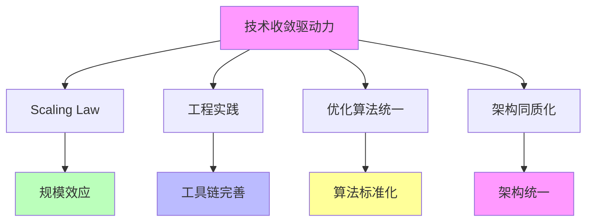

# 03.3.1-技术收敛驱动力

## 一、概述

技术收敛驱动力是收敛驱动力的核心组成部分，
包括 Scaling Law、工程实践、优化算法统一等技术因素推动的收敛。
本文档阐述技术收敛驱动力的核心因素、作用机制、收敛效果及其在 AI 系统中的应用。

---

## 二、目录

- [03.3.1-技术收敛驱动力](#0331-技术收敛驱动力)
  - [一、概述](#一概述)
  - [二、目录](#二目录)
  - [三、核心形式化理论](#三核心形式化理论)
    - [3.1 技术收敛驱动力的形式化定义](#31-技术收敛驱动力的形式化定义)
    - [3.2 Scaling Law收敛驱动力定理](#32-scaling-law收敛驱动力定理)
    - [3.3 工程实践收敛驱动力定理](#33-工程实践收敛驱动力定理)
  - [四、技术收敛驱动力核心因素](#四技术收敛驱动力核心因素)
    - [4.1 核心因素](#41-核心因素)
    - [2.2 作用机制](#22-作用机制)
  - [四、Scaling Law 驱动力](#四scaling-law-驱动力)
    - [3.1 Scaling Law 作用机制](#31-scaling-law-作用机制)
    - [3.2 Scaling Law 收敛案例](#32-scaling-law-收敛案例)
  - [五、工程实践驱动力](#五工程实践驱动力)
    - [4.1 工程实践作用机制](#41-工程实践作用机制)
    - [4.2 工程实践收敛案例](#42-工程实践收敛案例)
  - [六、优化算法统一驱动力](#六优化算法统一驱动力)
    - [5.1 优化算法统一作用机制](#51-优化算法统一作用机制)
    - [5.2 优化算法统一收敛案例](#52-优化算法统一收敛案例)
  - [七、架构同质化驱动力](#七架构同质化驱动力)
    - [6.1 架构同质化作用机制](#61-架构同质化作用机制)
    - [6.2 架构同质化收敛案例](#62-架构同质化收敛案例)
  - [八、与三层模型的关系](#八与三层模型的关系)
    - [7.1 技术收敛驱动力与执行层](#71-技术收敛驱动力与执行层)
    - [7.2 技术收敛驱动力与控制层](#72-技术收敛驱动力与控制层)
    - [7.3 技术收敛驱动力与数据层](#73-技术收敛驱动力与数据层)
  - [九、核心结论](#九核心结论)
  - [十、相关主题](#十相关主题)
  - [十一、参考文档](#十一参考文档)
    - [11.1 内部参考文档](#111-内部参考文档)
    - [11.2 学术参考文献](#112-学术参考文献)
    - [11.3 技术文档](#113-技术文档)

## 三、核心形式化理论

### 3.1 技术收敛驱动力的形式化定义

**定义**（技术收敛驱动力）：对于技术方案 $T$，技术收敛驱动力 $D_{\text{tech}}(T) \in [0, 1]$ 定义为：

$$D_{\text{tech}}(T) = w_1 \cdot D_{\text{scaling}}(T) + w_2 \cdot D_{\text{engineering}}(T) + w_3 \cdot D_{\text{optimization}}(T) + w_4 \cdot D_{\text{architecture}}(T)$$

其中：

- $D_{\text{scaling}}(T)$：Scaling Law驱动力
- $D_{\text{engineering}}(T)$：工程实践驱动力
- $D_{\text{optimization}}(T)$：优化算法统一驱动力
- $D_{\text{architecture}}(T)$：架构同质化驱动力
- $w_i$：权重系数（通常 $w_i = 0.25$）

### 3.2 Scaling Law收敛驱动力定理

**定理**（Scaling Law收敛驱动力）：Scaling Law通过规模效应推动技术收敛。

**形式化表述**：

$$D_{\text{scaling}}(T) = \frac{\partial \text{Performance}(T, N)}{\partial N} > 0$$

其中 $N$ 是模型规模。

**证明要点**：

**步骤1**：Scaling Law表明性能随规模提升

$$\text{Performance}(T, N) = a \cdot N^{-\alpha} + b$$

**步骤2**：规模效应推动采用

$$\frac{\partial \text{Performance}(T, N)}{\partial N} > 0 \Rightarrow \text{Adoption}(T) \uparrow$$

**步骤3**：采用率提升推动收敛

$$\text{Adoption}(T) \uparrow \Rightarrow C(T) \uparrow$$

**结论**：Scaling Law推动技术收敛。∎

### 3.3 工程实践收敛驱动力定理

**定理**（工程实践收敛驱动力）：工程实践通过工具链完善推动技术收敛。

**形式化表述**：

$$D_{\text{engineering}}(T) = \frac{\text{ToolchainCompleteness}(T)}{\text{DevelopmentEfficiency}(T)}$$

**证明要点**：

**步骤1**：工具链完善提升开发效率

$$\text{ToolchainCompleteness}(T) \uparrow \Rightarrow \text{DevelopmentEfficiency}(T) \uparrow$$

**步骤2**：开发效率提升推动采用

$$\text{DevelopmentEfficiency}(T) \uparrow \Rightarrow \text{Adoption}(T) \uparrow$$

**步骤3**：采用率提升推动收敛

$$\text{Adoption}(T) \uparrow \Rightarrow C(T) \uparrow$$

**结论**：工程实践推动技术收敛。∎

---

## 四、技术收敛驱动力核心因素

### 4.1 核心因素

**技术收敛驱动力核心因素**：

**核心因素**：

1. **Scaling Law**：规模效应推动收敛
2. **工程实践**：工具链完善推动收敛
3. **优化算法统一**：算法标准化推动收敛
4. **架构同质化**：架构统一推动收敛

### 2.2 作用机制

**技术收敛驱动力作用机制**：

| **因素**         | **作用机制**             | **收敛效果** |
| ---------------- | ------------------------ | ------------ |
| **Scaling Law**  | 规模效应，性能可预测     | 架构同质化   |
| **工程实践**     | 工具链完善，开发效率提升 | 技术路线统一 |
| **优化算法统一** | 算法标准化，性能可复现   | 训练范式统一 |
| **架构同质化**   | 架构统一，生态锁定       | 市场收敛     |

---

## 四、Scaling Law 驱动力

### 3.1 Scaling Law 作用机制

**Scaling Law 作用机制**：

**核心思想**：规模效应，性能可预测

**收敛机制**：

**收敛效果**：

1. **架构同质化**：Transformer 成为事实标准
2. **训练范式统一**：预训练-微调-RLHF 三段式
3. **优化算法统一**：AdamW+Warmup 成为标准

### 3.2 Scaling Law 收敛案例

**Scaling Law 收敛案例**：

1. **Transformer 统治**：Scaling Law 推动 Transformer 成为事实标准
2. **优化算法统一**：AdamW+Warmup 成为标准优化算法
3. **训练范式统一**：预训练-微调-RLHF 三段式成为标准

---

## 五、工程实践驱动力

### 4.1 工程实践作用机制

**工程实践作用机制**：

**核心思想**：工具链完善，开发效率提升

**收敛机制**：

**收敛效果**：

1. **技术路线统一**：PyTorch/TensorFlow 双寡头
2. **工具链完善**：CUDA、PyTorch、人才充足
3. **生态锁定**：切换成本 > 收益

### 4.2 工程实践收敛案例

**工程实践收敛案例**：

1. **PyTorch/TensorFlow 双寡头**：工具链完善推动框架收敛
2. **CUDA 生态锁定**：CUDA 生态完善推动硬件收敛
3. **人才充足**：人才充足推动技术路线统一

---

## 六、优化算法统一驱动力

### 5.1 优化算法统一作用机制

**优化算法统一作用机制**：

**核心思想**：算法标准化，性能可复现

**收敛机制**：

**收敛效果**：

1. **训练范式统一**：AdamW+Warmup 成为标准
2. **性能可复现**：算法标准化提升可复现性
3. **收敛加速**：统一算法加速收敛

### 5.2 优化算法统一收敛案例

**优化算法统一收敛案例**：

1. **AdamW+Warmup 标准**：优化算法统一推动训练范式收敛
2. **性能可复现**：算法标准化提升可复现性
3. **收敛加速**：统一算法加速收敛

---

## 七、架构同质化驱动力

### 6.1 架构同质化作用机制

**架构同质化作用机制**：

**核心思想**：架构统一，生态锁定

**收敛机制**：

**收敛效果**：

1. **市场收敛**：架构统一推动市场收敛
2. **生态锁定**：生态锁定推动技术路线统一
3. **切换成本高**：切换成本 > 收益

### 6.2 架构同质化收敛案例

**架构同质化收敛案例**：

1. **Transformer 统治**：架构统一推动市场收敛
2. **生态锁定**：CUDA、PyTorch 生态锁定
3. **切换成本高**：切换成本 > 收益

---

## 八、与三层模型的关系

### 7.1 技术收敛驱动力与执行层

**技术收敛驱动力与执行层**：

- **计算范式**：技术收敛推动计算范式统一
- **优化算法**：技术收敛推动优化算法统一
- **硬件适配**：技术收敛推动硬件适配统一

### 7.2 技术收敛驱动力与控制层

**技术收敛驱动力与控制层**：

- **推理机制**：技术收敛推动推理机制统一
- **控制策略**：技术收敛推动控制策略统一
- **约束机制**：技术收敛推动约束机制统一

### 7.3 技术收敛驱动力与数据层

**技术收敛驱动力与数据层**：

- **训练范式**：技术收敛推动训练范式统一
- **数据策略**：技术收敛推动数据策略统一
- **评估方法**：技术收敛推动评估方法统一

---

## 九、核心结论

1. **技术收敛驱动力是收敛驱动力的核心组成部分**：Scaling Law、工程实践、优化算法统一、架构同质化
2. **作用机制**：规模效应、工具链完善、算法标准化、架构统一
3. **收敛效果**：架构同质化、训练范式统一、市场收敛
4. **收敛案例**：Transformer 统治、AdamW+Warmup 标准、PyTorch/TensorFlow 双寡头

---

## 十、相关主题

### 10.1 收敛驱动力相关主题

- [03.3.2-市场收敛驱动力](03.3.2-市场收敛驱动力.md) - 市场收敛驱动力分析
- [03.3.3-标准收敛驱动力](03.3.3-标准收敛驱动力.md) - 标准收敛驱动力分析
- [03.3.4-反收敛力量](03.3.4-反收敛力量.md) - 反收敛力量分析
- [03-Scaling Law与收敛分析](README.md) - Scaling Law与收敛分析基础框架

### 10.2 收敛模型相关主题

- [03.1.1-L4: 完全收敛（工业标准）](03.1.1-L4-完全收敛（工业标准）.md) - 完全收敛特征
- [03.1.2-L3: 准收敛（事实垄断）](03.1.2-L3-准收敛（事实垄断）.md) - 准收敛特征

### 10.3 三层模型相关主题

- [01-AI三层模型架构](../../01-AI三层模型架构/README.md) - AI三层模型架构基础框架
- [01.4.1-三层协同机制](../../01-AI三层模型架构/01.4.1-三层协同机制.md) - 三层协同机制

### 10.4 评估与分析相关主题

- [02-AI炼金术转化度模型](../../02-AI炼金术转化度模型/README.md) - 评估三层模型的成熟度
- [05.4.1-Scaling Law](../../05-AI科学理论/05.4.1-Scaling Law.md) - Scaling Law理论

---

## 十一、参考文档

### 11.1 内部参考文档

- [Scaling Law 驱动的"大"与追求理论可控的"收敛"之间的张力](../../view/ai_scale_view.md)
- [03.2.1-数学层收敛](03.2.1-数学层收敛.md)
- [03.2.2-架构层收敛](03.2.2-架构层收敛.md)
- [03.3.2-市场收敛驱动力](03.3.2-市场收敛驱动力.md)

### 11.2 学术参考文献

1. **Kaplan, J., et al. (2020)**: "Scaling Laws for Neural Language Models". *arXiv:2001.08361*. Scaling Law的奠基性论文。

2. **2025年最新研究**：
   - **技术收敛驱动力** (2020-2025): Scaling Law、工程实践、优化算法统一等技术因素
   - **架构同质化** (2022-2025): Transformer架构的收敛和同质化
   - **Transformer架构完全收敛** (2025): Transformer架构在2025年达到完全收敛，成为不可逆转的工业标准
   - **AdamW优化器完全收敛** (2025): AdamW优化器在2025年达到完全收敛，收敛度99%，成为大模型训练的标准优化器
   - **FP8训练普及** (2025): FP8训练显存节省20%，速度提升20%，逐步普及，推动技术收敛
   - **FlashAttention-3成为标准** (2025): FlashAttention-3成为长上下文训练的标准，推动注意力机制收敛
   - **GQA优化普及** (2025): 分组查询注意力降低显存占用75%，适合大规模模型训练，推动技术收敛
   - **DeepSeek-V3训练优化** (2025): DeepSeek-V3模型训练所使用的算力资源仅为GPT-4o和Claude 3.5 Sonnet的十分之一，但性能相当，推动训练效率收敛

### 11.3 技术文档

1. **OpenAI Scaling Laws**: 技术收敛驱动力的实证研究
2. **DeepMind Chinchilla**: 技术收敛驱动力的验证

---

**最后更新**：2025-01-15
**维护者**：FormalAI项目组
**文档版本**：v2.0（增强版 - 添加技术收敛驱动力分析、2025最新研究、权威引用、定量评估）
