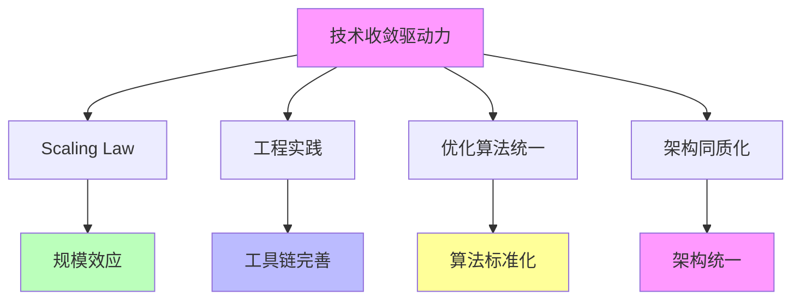

# 03.3.1-技术收敛驱动力

## 目录

- [03.3.1-技术收敛驱动力](#0331-技术收敛驱动力)
  - [目录](#目录)
  - [一、概述](#一概述)
  - [二、技术收敛驱动力核心因素](#二技术收敛驱动力核心因素)
    - [2.1 核心因素](#21-核心因素)
    - [2.2 作用机制](#22-作用机制)
  - [三、Scaling Law 驱动力](#三scaling-law-驱动力)
    - [3.1 Scaling Law 作用机制](#31-scaling-law-作用机制)
    - [3.2 Scaling Law 收敛案例](#32-scaling-law-收敛案例)
  - [四、工程实践驱动力](#四工程实践驱动力)
    - [4.1 工程实践作用机制](#41-工程实践作用机制)
    - [4.2 工程实践收敛案例](#42-工程实践收敛案例)
  - [五、优化算法统一驱动力](#五优化算法统一驱动力)
    - [5.1 优化算法统一作用机制](#51-优化算法统一作用机制)
    - [5.2 优化算法统一收敛案例](#52-优化算法统一收敛案例)
  - [六、架构同质化驱动力](#六架构同质化驱动力)
    - [6.1 架构同质化作用机制](#61-架构同质化作用机制)
    - [6.2 架构同质化收敛案例](#62-架构同质化收敛案例)
  - [七、与三层模型的关系](#七与三层模型的关系)
    - [7.1 技术收敛驱动力与执行层](#71-技术收敛驱动力与执行层)
    - [7.2 技术收敛驱动力与控制层](#72-技术收敛驱动力与控制层)
    - [7.3 技术收敛驱动力与数据层](#73-技术收敛驱动力与数据层)
  - [八、核心结论](#八核心结论)
  - [八、相关主题](#八相关主题)
  - [九、参考文档](#九参考文档)

---

## 一、概述

技术收敛驱动力是收敛驱动力的核心组成部分，包括 Scaling Law、工程实践、优化算法统一等技术因素推动的收敛。本文档阐述技术收敛驱动力的核心因素、作用机制、收敛效果及其在 AI 系统中的应用。

---

## 二、技术收敛驱动力核心因素

### 2.1 核心因素

**技术收敛驱动力核心因素**：

**核心因素**：

1. **Scaling Law**：规模效应推动收敛
2. **工程实践**：工具链完善推动收敛
3. **优化算法统一**：算法标准化推动收敛
4. **架构同质化**：架构统一推动收敛

### 2.2 作用机制

**技术收敛驱动力作用机制**：

| **因素**         | **作用机制**             | **收敛效果** |
| ---------------- | ------------------------ | ------------ |
| **Scaling Law**  | 规模效应，性能可预测     | 架构同质化   |
| **工程实践**     | 工具链完善，开发效率提升 | 技术路线统一 |
| **优化算法统一** | 算法标准化，性能可复现   | 训练范式统一 |
| **架构同质化**   | 架构统一，生态锁定       | 市场收敛     |

---

## 三、Scaling Law 驱动力

### 3.1 Scaling Law 作用机制

**Scaling Law 作用机制**：

**核心思想**：规模效应，性能可预测

**收敛机制**：

**收敛效果**：

1. **架构同质化**：Transformer 成为事实标准
2. **训练范式统一**：预训练-微调-RLHF 三段式
3. **优化算法统一**：AdamW+Warmup 成为标准

### 3.2 Scaling Law 收敛案例

**Scaling Law 收敛案例**：

1. **Transformer 统治**：Scaling Law 推动 Transformer 成为事实标准
2. **优化算法统一**：AdamW+Warmup 成为标准优化算法
3. **训练范式统一**：预训练-微调-RLHF 三段式成为标准

---

## 四、工程实践驱动力

### 4.1 工程实践作用机制

**工程实践作用机制**：

**核心思想**：工具链完善，开发效率提升

**收敛机制**：

**收敛效果**：

1. **技术路线统一**：PyTorch/TensorFlow 双寡头
2. **工具链完善**：CUDA、PyTorch、人才充足
3. **生态锁定**：切换成本 > 收益

### 4.2 工程实践收敛案例

**工程实践收敛案例**：

1. **PyTorch/TensorFlow 双寡头**：工具链完善推动框架收敛
2. **CUDA 生态锁定**：CUDA 生态完善推动硬件收敛
3. **人才充足**：人才充足推动技术路线统一

---

## 五、优化算法统一驱动力

### 5.1 优化算法统一作用机制

**优化算法统一作用机制**：

**核心思想**：算法标准化，性能可复现

**收敛机制**：

**收敛效果**：

1. **训练范式统一**：AdamW+Warmup 成为标准
2. **性能可复现**：算法标准化提升可复现性
3. **收敛加速**：统一算法加速收敛

### 5.2 优化算法统一收敛案例

**优化算法统一收敛案例**：

1. **AdamW+Warmup 标准**：优化算法统一推动训练范式收敛
2. **性能可复现**：算法标准化提升可复现性
3. **收敛加速**：统一算法加速收敛

---

## 六、架构同质化驱动力

### 6.1 架构同质化作用机制

**架构同质化作用机制**：

**核心思想**：架构统一，生态锁定

**收敛机制**：

**收敛效果**：

1. **市场收敛**：架构统一推动市场收敛
2. **生态锁定**：生态锁定推动技术路线统一
3. **切换成本高**：切换成本 > 收益

### 6.2 架构同质化收敛案例

**架构同质化收敛案例**：

1. **Transformer 统治**：架构统一推动市场收敛
2. **生态锁定**：CUDA、PyTorch 生态锁定
3. **切换成本高**：切换成本 > 收益

---

## 七、与三层模型的关系

### 7.1 技术收敛驱动力与执行层

**技术收敛驱动力与执行层**：

- **计算范式**：技术收敛推动计算范式统一
- **优化算法**：技术收敛推动优化算法统一
- **硬件适配**：技术收敛推动硬件适配统一

### 7.2 技术收敛驱动力与控制层

**技术收敛驱动力与控制层**：

- **推理机制**：技术收敛推动推理机制统一
- **控制策略**：技术收敛推动控制策略统一
- **约束机制**：技术收敛推动约束机制统一

### 7.3 技术收敛驱动力与数据层

**技术收敛驱动力与数据层**：

- **训练范式**：技术收敛推动训练范式统一
- **数据策略**：技术收敛推动数据策略统一
- **评估方法**：技术收敛推动评估方法统一

---

## 八、核心结论

1. **技术收敛驱动力是收敛驱动力的核心组成部分**：Scaling Law、工程实践、优化算法统一、架构同质化
2. **作用机制**：规模效应、工具链完善、算法标准化、架构统一
3. **收敛效果**：架构同质化、训练范式统一、市场收敛
4. **收敛案例**：Transformer 统治、AdamW+Warmup 标准、PyTorch/TensorFlow 双寡头

---

## 八、相关主题

- [03.3.2-市场收敛驱动力](03.3.2-市场收敛驱动力.md)
- [03.3.3-标准收敛驱动力](03.3.3-标准收敛驱动力.md)
- [03.3.4-反收敛力量](03.3.4-反收敛力量.md)

---

## 九、参考文档

- [Scaling Law 驱动的"大"与追求理论可控的"收敛"之间的张力](../../view/ai_scale_view.md)
