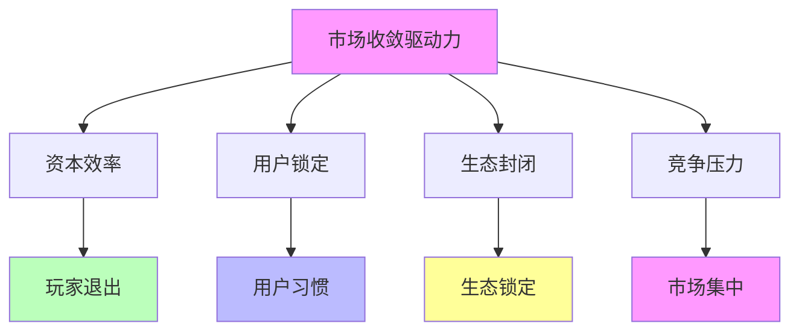
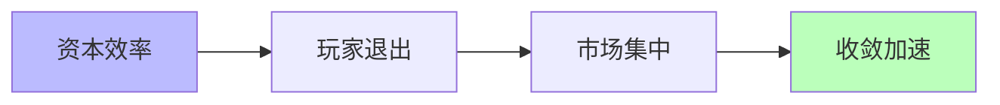
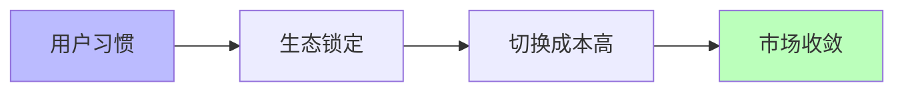
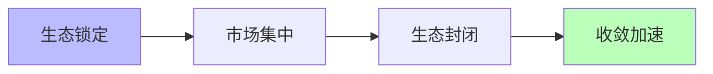
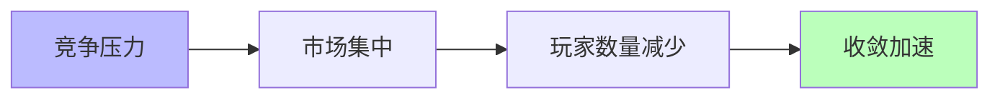

# 03.3.2-市场收敛驱动力

## 目录

- [03.3.2-市场收敛驱动力](#0332-市场收敛驱动力)
  - [目录](#目录)
  - [一、概述](#一概述)
  - [二、市场收敛驱动力核心因素](#二市场收敛驱动力核心因素)
    - [2.1 核心因素](#21-核心因素)
    - [2.2 作用机制](#22-作用机制)
  - [三、资本效率驱动力](#三资本效率驱动力)
    - [3.1 资本效率作用机制](#31-资本效率作用机制)
    - [3.2 资本效率收敛案例](#32-资本效率收敛案例)
  - [四、用户锁定驱动力](#四用户锁定驱动力)
    - [4.1 用户锁定作用机制](#41-用户锁定作用机制)
    - [4.2 用户锁定收敛案例](#42-用户锁定收敛案例)
  - [五、生态封闭驱动力](#五生态封闭驱动力)
    - [5.1 生态封闭作用机制](#51-生态封闭作用机制)
    - [5.2 生态封闭收敛案例](#52-生态封闭收敛案例)
  - [六、竞争压力驱动力](#六竞争压力驱动力)
    - [6.1 竞争压力作用机制](#61-竞争压力作用机制)
    - [6.2 竞争压力收敛案例](#62-竞争压力收敛案例)
  - [七、与三层模型的关系](#七与三层模型的关系)
    - [7.1 市场收敛驱动力与执行层](#71-市场收敛驱动力与执行层)
    - [7.2 市场收敛驱动力与控制层](#72-市场收敛驱动力与控制层)
    - [7.3 市场收敛驱动力与数据层](#73-市场收敛驱动力与数据层)
  - [八、核心结论](#八核心结论)
  - [九、相关主题](#九相关主题)
  - [十、参考文档](#十参考文档)

---

## 一、概述

市场收敛驱动力是收敛驱动力的核心组成部分，包括资本效率、用户锁定、生态封闭等市场因素推动的收敛。本文档阐述市场收敛驱动力的核心因素、作用机制、收敛效果及其在 AI 系统中的应用。

---

## 二、市场收敛驱动力核心因素

### 2.1 核心因素

**市场收敛驱动力核心因素**：

**核心因素**：

1. **资本效率**：资本效率推动玩家退出
2. **用户锁定**：用户习惯推动生态锁定
3. **生态封闭**：生态锁定推动市场集中
4. **竞争压力**：竞争压力推动市场收敛

### 2.2 作用机制

**市场收敛驱动力作用机制**：

| **因素**     | **作用机制**         | **收敛效果** |
| ------------ | -------------------- | ------------ |
| **资本效率** | 资本效率推动玩家退出 | 市场集中     |
| **用户锁定** | 用户习惯推动生态锁定 | 生态封闭     |
| **生态封闭** | 生态锁定推动市场集中 | 市场收敛     |
| **竞争压力** | 竞争压力推动市场集中 | 玩家数量减少 |

---

## 三、资本效率驱动力

### 3.1 资本效率作用机制

**资本效率作用机制**：

**核心思想**：资本效率推动玩家退出

**收敛机制**：

**收敛效果**：

1. **玩家退出**：资本效率低导致玩家退出
2. **市场集中**：市场集中度提升
3. **收敛加速**：收敛速度加快

### 3.2 资本效率收敛案例

**资本效率收敛案例**：

1. **2023-2025 市场收敛**：从 200+玩家收敛至 15 家主流
2. **玩家退出**：资本效率低导致玩家退出
3. **市场集中**：市场集中度提升

---

## 四、用户锁定驱动力

### 4.1 用户锁定作用机制

**用户锁定作用机制**：

**核心思想**：用户习惯推动生态锁定

**收敛机制**：

**收敛效果**：

1. **生态锁定**：用户习惯推动生态锁定
2. **切换成本高**：切换成本 > 收益
3. **市场收敛**：市场收敛加速

### 4.2 用户锁定收敛案例

**用户锁定收敛案例**：

1. **CUDA 生态锁定**：用户习惯推动 CUDA 生态锁定
2. **PyTorch 生态锁定**：用户习惯推动 PyTorch 生态锁定
3. **切换成本高**：切换成本 > 收益

---

## 五、生态封闭驱动力

### 5.1 生态封闭作用机制

**生态封闭作用机制**：

**核心思想**：生态锁定推动市场集中

**收敛机制**：

**收敛效果**：

1. **市场集中**：生态锁定推动市场集中
2. **生态封闭**：生态封闭加速收敛
3. **收敛加速**：收敛速度加快

### 5.2 生态封闭收敛案例

**生态封闭收敛案例**：

1. **CUDA 生态封闭**：CUDA 生态封闭推动市场集中
2. **PyTorch 生态封闭**：PyTorch 生态封闭推动市场集中
3. **收敛加速**：收敛速度加快

---

## 六、竞争压力驱动力

### 6.1 竞争压力作用机制

**竞争压力作用机制**：

**核心思想**：竞争压力推动市场集中

**收敛机制**：

**收敛效果**：

1. **市场集中**：竞争压力推动市场集中
2. **玩家数量减少**：玩家数量减少
3. **收敛加速**：收敛速度加快

### 6.2 竞争压力收敛案例

**竞争压力收敛案例**：

1. **2023-2025 市场收敛**：从 200+玩家收敛至 15 家主流
2. **玩家数量减少**：竞争压力导致玩家数量减少
3. **收敛加速**：收敛速度加快

---

## 七、与三层模型的关系

### 7.1 市场收敛驱动力与执行层

**市场收敛驱动力与执行层**：

- **硬件收敛**：市场收敛推动硬件收敛
- **计算范式**：市场收敛推动计算范式统一
- **优化算法**：市场收敛推动优化算法统一

### 7.2 市场收敛驱动力与控制层

**市场收敛驱动力与控制层**：

- **推理机制**：市场收敛推动推理机制统一
- **控制策略**：市场收敛推动控制策略统一
- **约束机制**：市场收敛推动约束机制统一

### 7.3 市场收敛驱动力与数据层

**市场收敛驱动力与数据层**：

- **训练范式**：市场收敛推动训练范式统一
- **数据策略**：市场收敛推动数据策略统一
- **评估方法**：市场收敛推动评估方法统一

---

## 八、核心结论

1. **市场收敛驱动力是收敛驱动力的核心组成部分**：资本效率、用户锁定、生态封闭、竞争压力
2. **作用机制**：玩家退出、生态锁定、市场集中、收敛加速
3. **收敛效果**：市场集中、生态封闭、玩家数量减少
4. **收敛案例**：2023-2025 市场收敛、CUDA 生态锁定、PyTorch 生态锁定

---

## 九、相关主题

- [03.3.1-技术收敛驱动力](03.3.1-技术收敛驱动力.md)
- [03.3.3-标准收敛驱动力](03.3.3-标准收敛驱动力.md)
- [03.3.4-反收敛力量](03.3.4-反收敛力量.md)

---

## 十、参考文档

- [Scaling Law 驱动的"大"与追求理论可控的"收敛"之间的张力](../../view/ai_scale_view.md)
