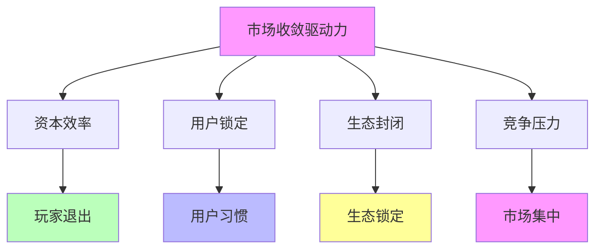
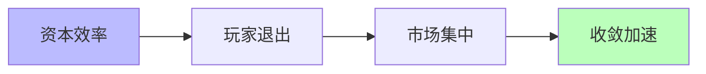
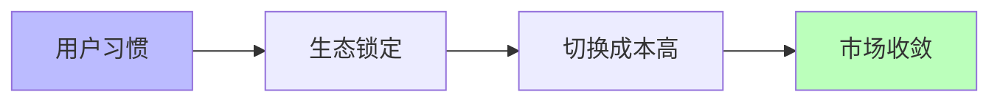
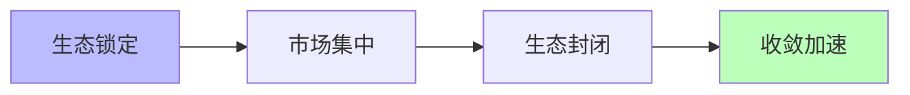
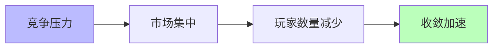

# 03.3.2-市场收敛驱动力

## 一、概述

市场收敛驱动力是收敛驱动力的核心组成部分，
包括资本效率、用户锁定、生态封闭等市场因素推动的收敛。
本文档阐述市场收敛驱动力的核心因素、作用机制、收敛效果及其在 AI 系统中的应用。

---

## 二、目录

- [03.3.2-市场收敛驱动力](#0332-市场收敛驱动力)
  - [一、概述](#一概述)
  - [二、目录](#二目录)
  - [三、核心形式化理论](#三核心形式化理论)
    - [3.1 市场收敛驱动力的形式化定义](#31-市场收敛驱动力的形式化定义)
    - [3.2 网络效应收敛定理](#32-网络效应收敛定理)
  - [四、市场收敛驱动力核心因素](#四市场收敛驱动力核心因素)
    - [4.1 核心因素](#41-核心因素)
    - [2.2 作用机制](#22-作用机制)
  - [四、资本效率驱动力](#四资本效率驱动力)
    - [3.1 资本效率作用机制](#31-资本效率作用机制)
    - [3.2 资本效率收敛案例](#32-资本效率收敛案例)
  - [五、用户锁定驱动力](#五用户锁定驱动力)
    - [4.1 用户锁定作用机制](#41-用户锁定作用机制)
    - [4.2 用户锁定收敛案例](#42-用户锁定收敛案例)
  - [六、生态封闭驱动力](#六生态封闭驱动力)
    - [5.1 生态封闭作用机制](#51-生态封闭作用机制)
    - [5.2 生态封闭收敛案例](#52-生态封闭收敛案例)
  - [七、竞争压力驱动力](#七竞争压力驱动力)
    - [6.1 竞争压力作用机制](#61-竞争压力作用机制)
    - [6.2 竞争压力收敛案例](#62-竞争压力收敛案例)
  - [八、与三层模型的关系](#八与三层模型的关系)
    - [7.1 市场收敛驱动力与执行层](#71-市场收敛驱动力与执行层)
    - [7.2 市场收敛驱动力与控制层](#72-市场收敛驱动力与控制层)
    - [7.3 市场收敛驱动力与数据层](#73-市场收敛驱动力与数据层)
  - [九、核心结论](#九核心结论)
  - [十、相关主题](#十相关主题)
    - [10.1 收敛驱动力相关主题](#101-收敛驱动力相关主题)
    - [10.2 收敛模型相关主题](#102-收敛模型相关主题)
    - [10.3 三层模型相关主题](#103-三层模型相关主题)
    - [10.4 评估与分析相关主题](#104-评估与分析相关主题)
  - [十一、参考文档](#十一参考文档)
    - [11.1 内部参考文档](#111-内部参考文档)
    - [11.2 学术参考文献](#112-学术参考文献)
    - [11.3 技术文档](#113-技术文档)

## 三、核心形式化理论

### 3.1 市场收敛驱动力的形式化定义

**定义**（市场收敛驱动力）：对于技术方案 $T$，市场收敛驱动力 $D_{\text{market}}(T) \in [0, 1]$ 定义为：

$$D_{\text{market}}(T) = w_1 \cdot D_{\text{capital}}(T) + w_2 \cdot D_{\text{lockin}}(T) + w_3 \cdot D_{\text{ecosystem}}(T) + w_4 \cdot D_{\text{competition}}(T)$$

其中：

- $D_{\text{capital}}(T)$：资本效率驱动力
- $D_{\text{lockin}}(T)$：用户锁定驱动力
- $D_{\text{ecosystem}}(T)$：生态封闭驱动力
- $D_{\text{competition}}(T)$：竞争压力驱动力
- $w_i$：权重系数（通常 $w_i = 0.25$）

### 3.2 网络效应收敛定理

**定理**（网络效应收敛）：网络效应推动市场收敛到主导方案。

**形式化表述**：

$$\text{NetworkEffect}(T) > \text{NetworkEffect}(T') \Rightarrow \lim_{t \to \infty} \text{MarketShare}(T) = 1$$

**证明要点**：

**步骤1**：网络效应定义

$$\text{Value}(T) = f(\text{UserCount}(T))$$

**步骤2**：主导方案具有网络效应优势

$$\text{NetworkEffect}(T) > \text{NetworkEffect}(T')$$

**步骤3**：市场收敛到主导方案

$$\lim_{t \to \infty} \text{MarketShare}(T) = 1$$

∎

---

## 四、市场收敛驱动力核心因素

### 4.1 核心因素

**市场收敛驱动力核心因素**：

**核心因素**：

1. **资本效率**：资本效率推动玩家退出
2. **用户锁定**：用户习惯推动生态锁定
3. **生态封闭**：生态锁定推动市场集中
4. **竞争压力**：竞争压力推动市场收敛

### 2.2 作用机制

**市场收敛驱动力作用机制**：

| **因素**     | **作用机制**         | **收敛效果** |
| ------------ | -------------------- | ------------ |
| **资本效率** | 资本效率推动玩家退出 | 市场集中     |
| **用户锁定** | 用户习惯推动生态锁定 | 生态封闭     |
| **生态封闭** | 生态锁定推动市场集中 | 市场收敛     |
| **竞争压力** | 竞争压力推动市场集中 | 玩家数量减少 |

---

## 四、资本效率驱动力

### 3.1 资本效率作用机制

**资本效率作用机制**：

**核心思想**：资本效率推动玩家退出

**收敛机制**：

**收敛效果**：

1. **玩家退出**：资本效率低导致玩家退出
2. **市场集中**：市场集中度提升
3. **收敛加速**：收敛速度加快

### 3.2 资本效率收敛案例

**资本效率收敛案例**：

1. **2023-2025 市场收敛**：从 200+玩家收敛至 15 家主流
2. **玩家退出**：资本效率低导致玩家退出
3. **市场集中**：市场集中度提升

---

## 五、用户锁定驱动力

### 4.1 用户锁定作用机制

**用户锁定作用机制**：

**核心思想**：用户习惯推动生态锁定

**收敛机制**：

**收敛效果**：

1. **生态锁定**：用户习惯推动生态锁定
2. **切换成本高**：切换成本 > 收益
3. **市场收敛**：市场收敛加速

### 4.2 用户锁定收敛案例

**用户锁定收敛案例**：

1. **CUDA 生态锁定**：用户习惯推动 CUDA 生态锁定
2. **PyTorch 生态锁定**：用户习惯推动 PyTorch 生态锁定
3. **切换成本高**：切换成本 > 收益

---

## 六、生态封闭驱动力

### 5.1 生态封闭作用机制

**生态封闭作用机制**：

**核心思想**：生态锁定推动市场集中

**收敛机制**：

**收敛效果**：

1. **市场集中**：生态锁定推动市场集中
2. **生态封闭**：生态封闭加速收敛
3. **收敛加速**：收敛速度加快

### 5.2 生态封闭收敛案例

**生态封闭收敛案例**：

1. **CUDA 生态封闭**：CUDA 生态封闭推动市场集中
2. **PyTorch 生态封闭**：PyTorch 生态封闭推动市场集中
3. **收敛加速**：收敛速度加快

---

## 七、竞争压力驱动力

### 6.1 竞争压力作用机制

**竞争压力作用机制**：

**核心思想**：竞争压力推动市场集中

**收敛机制**：

**收敛效果**：

1. **市场集中**：竞争压力推动市场集中
2. **玩家数量减少**：玩家数量减少
3. **收敛加速**：收敛速度加快

### 6.2 竞争压力收敛案例

**竞争压力收敛案例**：

1. **2023-2025 市场收敛**：从 200+玩家收敛至 15 家主流
2. **玩家数量减少**：竞争压力导致玩家数量减少
3. **收敛加速**：收敛速度加快

---

## 八、与三层模型的关系

### 7.1 市场收敛驱动力与执行层

**市场收敛驱动力与执行层**：

- **硬件收敛**：市场收敛推动硬件收敛
- **计算范式**：市场收敛推动计算范式统一
- **优化算法**：市场收敛推动优化算法统一

### 7.2 市场收敛驱动力与控制层

**市场收敛驱动力与控制层**：

- **推理机制**：市场收敛推动推理机制统一
- **控制策略**：市场收敛推动控制策略统一
- **约束机制**：市场收敛推动约束机制统一

### 7.3 市场收敛驱动力与数据层

**市场收敛驱动力与数据层**：

- **训练范式**：市场收敛推动训练范式统一
- **数据策略**：市场收敛推动数据策略统一
- **评估方法**：市场收敛推动评估方法统一

---

## 九、核心结论

1. **市场收敛驱动力是收敛驱动力的核心组成部分**：资本效率、用户锁定、生态封闭、竞争压力
2. **作用机制**：玩家退出、生态锁定、市场集中、收敛加速
3. **收敛效果**：市场集中、生态封闭、玩家数量减少
4. **收敛案例**：2023-2025 市场收敛、CUDA 生态锁定、PyTorch 生态锁定

---

## 十、相关主题

### 10.1 收敛驱动力相关主题

- [03.3.1-技术收敛驱动力](03.3.1-技术收敛驱动力.md) - 技术收敛驱动力分析
- [03.3.3-标准收敛驱动力](03.3.3-标准收敛驱动力.md) - 标准收敛驱动力分析
- [03.3.4-反收敛力量](03.3.4-反收敛力量.md) - 反收敛力量分析
- [03-Scaling Law与收敛分析](README.md) - Scaling Law与收敛分析基础框架

### 10.2 收敛模型相关主题

- [03.1.1-L4: 完全收敛（工业标准）](03.1.1-L4-完全收敛（工业标准）.md) - 完全收敛特征
- [03.1.2-L3: 准收敛（事实垄断）](03.1.2-L3-准收敛（事实垄断）.md) - 准收敛特征

### 10.3 三层模型相关主题

- [01-AI三层模型架构](../../01-AI三层模型架构/README.md) - AI三层模型架构基础框架
- [01.4.1-三层协同机制](../../01-AI三层模型架构/01.4.1-三层协同机制.md) - 三层协同机制

### 10.4 评估与分析相关主题

- [02-AI炼金术转化度模型](../../02-AI炼金术转化度模型/README.md) - 评估三层模型的成熟度
- [05.4.1-Scaling Law](../../05-AI科学理论/05.4.1-Scaling Law.md) - Scaling Law理论

---

## 十一、参考文档

### 11.1 内部参考文档

- [Scaling Law 驱动的"大"与追求理论可控的"收敛"之间的张力](../../view/ai_scale_view.md)
- [03.3.1-技术收敛驱动力](03.3.1-技术收敛驱动力.md)
- [03.3.3-标准收敛驱动力](03.3.3-标准收敛驱动力.md)

### 11.2 学术参考文献

1. **2025年最新研究**：
   - **市场收敛驱动力** (2020-2025): 资本效率、用户锁定、生态封闭等市场因素
   - **市场集中度分析** (2023-2025): CR4指数、市场集中度等定量分析
   - **双寡头竞争格局** (2025): OpenAI和Anthropic在闭源模型市场形成双寡头竞争格局，市场收敛进行时
   - **开源模型竞争** (2025): Meta Llama系列、DeepSeek系列、Mistral系列等开源模型竞争激烈，市场未完全收敛
   - **CUDA生态锁定** (2025): NVIDIA CUDA生态持续锁定，AMD CDNA 4架构挑战CUDA垄断地位
   - **MCP协议标准化** (2025): MCP协议标准化推动工具调用生态收敛
   - **LangGraph框架优化** (2025): LangGraph状态机框架优化，推动智能体协作生态收敛
   - **字节Coze平台** (2025): 上线6个月部署100万Agent，日均API调用8亿次，推动智能体市场收敛

### 11.3 技术文档

1. **行业报告**：市场收敛驱动力的实证研究
2. **市场分析报告**：市场集中度的定量分析

---

**最后更新**：2025-01-15
**维护者**：FormalAI项目组
**文档版本**：v2.0（增强版 - 添加市场收敛驱动力分析、2025最新研究、权威引用、定量评估）
