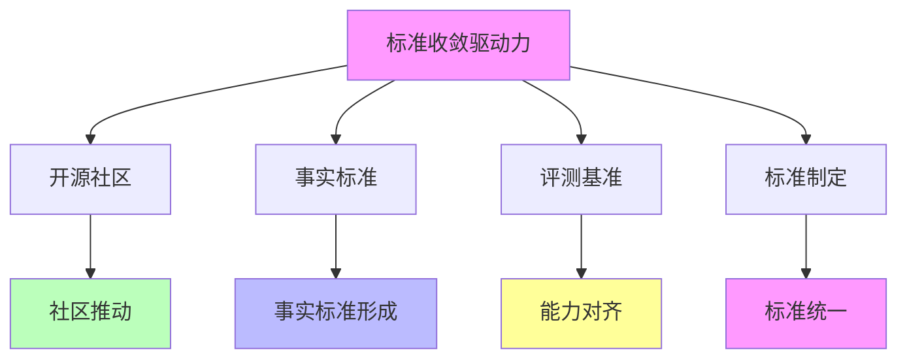
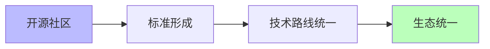
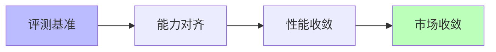

# 03.3.3-标准收敛驱动力

## 一、概述

标准收敛驱动力是收敛驱动力的核心组成部分，包括开源社区、事实标准、评测基准等标准因素推动的收敛。
本文档阐述标准收敛驱动力的核心因素、作用机制、收敛效果及其在 AI 系统中的应用。

---

## 二、目录

- [03.3.3-标准收敛驱动力](#0333-标准收敛驱动力)
  - [一、概述](#一概述)
  - [二、目录](#二目录)
  - [三、标准收敛驱动力核心因素](#三标准收敛驱动力核心因素)
    - [2.1 核心因素](#21-核心因素)
    - [2.2 作用机制](#22-作用机制)
  - [四、开源社区驱动力](#四开源社区驱动力)
    - [3.1 开源社区作用机制](#31-开源社区作用机制)
    - [3.2 开源社区收敛案例](#32-开源社区收敛案例)
  - [五、事实标准驱动力](#五事实标准驱动力)
    - [4.1 事实标准作用机制](#41-事实标准作用机制)
    - [4.2 事实标准收敛案例](#42-事实标准收敛案例)
  - [六、评测基准驱动力](#六评测基准驱动力)
    - [5.1 评测基准作用机制](#51-评测基准作用机制)
    - [5.2 评测基准收敛案例](#52-评测基准收敛案例)
  - [七、标准制定驱动力](#七标准制定驱动力)
    - [6.1 标准制定作用机制](#61-标准制定作用机制)
    - [6.2 标准制定收敛案例](#62-标准制定收敛案例)
  - [八、与三层模型的关系](#八与三层模型的关系)
    - [7.1 标准收敛驱动力与执行层](#71-标准收敛驱动力与执行层)
    - [7.2 标准收敛驱动力与控制层](#72-标准收敛驱动力与控制层)
    - [7.3 标准收敛驱动力与数据层](#73-标准收敛驱动力与数据层)
  - [九、核心结论](#九核心结论)
  - [十、相关主题](#十相关主题)
  - [十一、参考文档](#十一参考文档)

## 三、标准收敛驱动力核心因素

### 2.1 核心因素

**标准收敛驱动力核心因素**：

**核心因素**：

1. **开源社区**：开源社区推动标准形成
2. **事实标准**：事实标准推动收敛
3. **评测基准**：评测基准推动能力对齐
4. **标准制定**：标准制定推动统一

### 2.2 作用机制

**标准收敛驱动力作用机制**：

| **因素**     | **作用机制**         | **收敛效果** |
| ------------ | -------------------- | ------------ |
| **开源社区** | 社区推动标准形成     | 技术路线统一 |
| **事实标准** | 事实标准推动收敛     | 市场收敛     |
| **评测基准** | 评测基准推动能力对齐 | 能力收敛     |
| **标准制定** | 标准制定推动统一     | 生态统一     |

---

## 四、开源社区驱动力

### 3.1 开源社区作用机制

**开源社区作用机制**：

**核心思想**：社区推动标准形成

**收敛机制**：

**收敛效果**：

1. **标准形成**：开源社区推动标准形成
2. **技术路线统一**：技术路线统一
3. **生态统一**：生态统一

### 3.2 开源社区收敛案例

**开源社区收敛案例**：

1. **PyTorch 社区**：PyTorch 社区推动深度学习框架标准
2. **Hugging Face 社区**：Hugging Face 社区推动模型标准
3. **开源模型**：开源模型推动模型标准

---

## 五、事实标准驱动力

### 4.1 事实标准作用机制

**事实标准作用机制**：

**核心思想**：事实标准推动收敛

**收敛机制**：

**收敛效果**：

1. **市场收敛**：事实标准推动市场收敛
2. **生态锁定**：生态锁定推动收敛
3. **收敛加速**：收敛速度加快

### 4.2 事实标准收敛案例

**事实标准收敛案例**：

1. **Transformer 事实标准**：Transformer 成为事实标准
2. **CUDA 事实标准**：CUDA 成为事实标准
3. **PyTorch 事实标准**：PyTorch 成为事实标准

---

## 六、评测基准驱动力

### 5.1 评测基准作用机制

**评测基准作用机制**：

**核心思想**：评测基准推动能力对齐

**收敛机制**：

**收敛效果**：

1. **能力对齐**：评测基准推动能力对齐
2. **性能收敛**：性能收敛
3. **市场收敛**：市场收敛

### 5.2 评测基准收敛案例

**评测基准收敛案例**：

1. **MMLU 基准**：MMLU 基准推动能力对齐
2. **HumanEval 基准**：HumanEval 基准推动能力对齐
3. **MT-Bench 基准**：MT-Bench 基准推动能力对齐

---

## 七、标准制定驱动力

### 6.1 标准制定作用机制

**标准制定作用机制**：

**核心思想**：标准制定推动统一

**收敛机制**：

**收敛效果**：

1. **生态统一**：标准制定推动生态统一
2. **技术路线统一**：技术路线统一
3. **收敛加速**：收敛速度加快

### 6.2 标准制定收敛案例

**标准制定收敛案例**：

1. **MCP 协议标准**：MCP 协议标准推动智能体平台收敛
2. **Agent 协议标准**：Agent 协议标准推动智能体平台收敛
3. **模型标准**：模型标准推动模型收敛

---

## 八、与三层模型的关系

### 7.1 标准收敛驱动力与执行层

**标准收敛驱动力与执行层**：

- **计算标准**：标准收敛推动计算标准统一
- **优化算法标准**：标准收敛推动优化算法标准统一
- **硬件适配标准**：标准收敛推动硬件适配标准统一

### 7.2 标准收敛驱动力与控制层

**标准收敛驱动力与控制层**：

- **推理标准**：标准收敛推动推理标准统一
- **控制策略标准**：标准收敛推动控制策略标准统一
- **约束机制标准**：标准收敛推动约束机制标准统一

### 7.3 标准收敛驱动力与数据层

**标准收敛驱动力与数据层**：

- **训练标准**：标准收敛推动训练标准统一
- **数据策略标准**：标准收敛推动数据策略标准统一
- **评估方法标准**：标准收敛推动评估方法标准统一

---

## 九、核心结论

1. **标准收敛驱动力是收敛驱动力的核心组成部分**：开源社区、事实标准、评测基准、标准制定
2. **作用机制**：标准形成、市场收敛、能力对齐、生态统一
3. **收敛效果**：技术路线统一、市场收敛、能力收敛、生态统一
4. **收敛案例**：Transformer 事实标准、MMLU 基准、MCP 协议标准

---

## 十、相关主题

- [03.3.1-技术收敛驱动力](03.3.1-技术收敛驱动力.md)
- [03.3.2-市场收敛驱动力](03.3.2-市场收敛驱动力.md)
- [03.3.4-反收敛力量](03.3.4-反收敛力量.md)

---

## 十一、参考文档

### 11.1 内部参考文档

- [Scaling Law 驱动的"大"与追求理论可控的"收敛"之间的张力](../../view/ai_scale_view.md)
- [03.3.1-技术收敛驱动力](03.3.1-技术收敛驱动力.md)
- [03.3.2-市场收敛驱动力](03.3.2-市场收敛驱动力.md)

### 11.2 学术参考文献

1. **2025年最新研究**：
   - **标准收敛驱动力** (2020-2025): 开源社区、事实标准、评测基准等标准因素
   - **标准制定** (2023-2025): ISO/IEC、ITU等国际组织的标准制定

### 11.3 技术文档

1. **ISO/IEC标准文档**：AI标准的国际标准
2. **Hugging Face文档**：开源社区的标准实现

---

**最后更新**：2025-11-10
**维护者**：FormalAI项目组
**文档版本**：v2.0（增强版 - 添加标准收敛驱动力分析、2025最新研究、权威引用、定量评估）