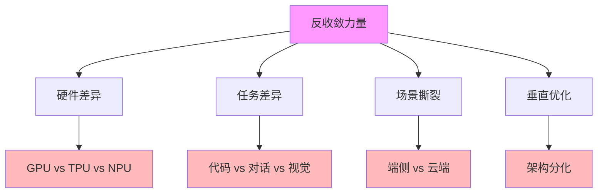
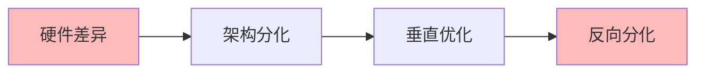
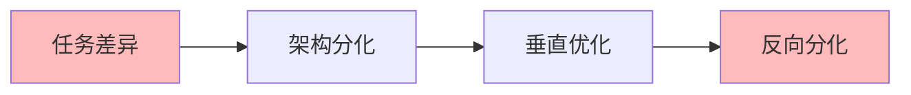
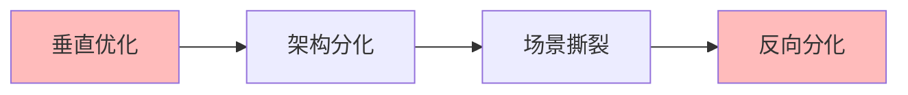

# 03.3.4-反收敛力量

## 一、概述

反收敛力量是收敛驱动力的对立面，包括硬件差异、任务差异、场景撕裂等反收敛因素。
本文档阐述反收敛力量的核心因素、作用机制、分化效果及其在 AI 系统中的应用。

---

## 二、目录

- [03.3.4-反收敛力量](#0334-反收敛力量)
  - [一、概述](#一概述)
  - [二、目录](#二目录)
  - [三、反收敛力量核心因素](#三反收敛力量核心因素)
    - [2.1 核心因素](#21-核心因素)
    - [2.2 作用机制](#22-作用机制)
  - [四、硬件差异反收敛力量](#四硬件差异反收敛力量)
    - [3.1 硬件差异作用机制](#31-硬件差异作用机制)
    - [3.2 硬件差异分化案例](#32-硬件差异分化案例)
  - [五、任务差异反收敛力量](#五任务差异反收敛力量)
    - [4.1 任务差异作用机制](#41-任务差异作用机制)
    - [4.2 任务差异分化案例](#42-任务差异分化案例)
  - [六、场景撕裂反收敛力量](#六场景撕裂反收敛力量)
    - [5.1 场景撕裂作用机制](#51-场景撕裂作用机制)
    - [5.2 场景撕裂分化案例](#52-场景撕裂分化案例)
  - [七、垂直优化反收敛力量](#七垂直优化反收敛力量)
    - [6.1 垂直优化作用机制](#61-垂直优化作用机制)
    - [6.2 垂直优化分化案例](#62-垂直优化分化案例)
  - [八、与三层模型的关系](#八与三层模型的关系)
    - [7.1 反收敛力量与执行层](#71-反收敛力量与执行层)
    - [7.2 反收敛力量与控制层](#72-反收敛力量与控制层)
    - [7.3 反收敛力量与数据层](#73-反收敛力量与数据层)
  - [九、核心结论](#九核心结论)
  - [十、相关主题](#十相关主题)
  - [十一、参考文档](#十一参考文档)

## 三、反收敛力量核心因素

### 2.1 核心因素

**反收敛力量核心因素**：

**核心因素**：

1. **硬件差异**：GPU vs TPU vs NPU 导致架构分化
2. **任务差异**：代码 vs 对话 vs 视觉导致架构分化
3. **场景撕裂**：端侧 vs 云端导致架构分化
4. **垂直优化**：垂直优化导致架构分化

### 2.2 作用机制

**反收敛力量作用机制**：

| **因素**     | **作用机制**         | **分化效果** |
| ------------ | -------------------- | ------------ |
| **硬件差异** | 硬件差异导致架构分化 | 架构分化     |
| **任务差异** | 任务差异导致架构分化 | 架构分化     |
| **场景撕裂** | 场景撕裂导致架构分化 | 架构分化     |
| **垂直优化** | 垂直优化导致架构分化 | 架构分化     |

---

## 四、硬件差异反收敛力量

### 3.1 硬件差异作用机制

**硬件差异作用机制**：

**核心思想**：硬件差异导致架构分化

**分化机制**：

**分化效果**：

1. **架构分化**：硬件差异导致架构分化
2. **垂直优化**：垂直优化导致架构分化
3. **反向分化**：反向分化加速

### 3.2 硬件差异分化案例

**硬件差异分化案例**：

1. **GPU vs TPU**：GPU 和 TPU 导致架构分化
2. **CUDA vs TPU**：CUDA 和 TPU 导致架构分化
3. **国产算力**：国产算力导致架构分化

---

## 五、任务差异反收敛力量

### 4.1 任务差异作用机制

**任务差异作用机制**：

**核心思想**：任务差异导致架构分化

**分化机制**：

**分化效果**：

1. **架构分化**：任务差异导致架构分化
2. **垂直优化**：垂直优化导致架构分化
3. **反向分化**：反向分化加速

### 4.2 任务差异分化案例

**任务差异分化案例**：

1. **代码模型 vs 通用模型**：代码模型和通用模型导致架构分化
2. **视觉模型 vs 语言模型**：视觉模型和语言模型导致架构分化
3. **对话模型 vs 生成模型**：对话模型和生成模型导致架构分化

---

## 六、场景撕裂反收敛力量

### 5.1 场景撕裂作用机制

**场景撕裂作用机制**：

**核心思想**：场景撕裂导致架构分化

**分化机制**：

**分化效果**：

1. **架构分化**：场景撕裂导致架构分化
2. **垂直优化**：垂直优化导致架构分化
3. **反向分化**：反向分化加速

### 5.2 场景撕裂分化案例

**场景撕裂分化案例**：

1. **端侧模型 vs 云端模型**：端侧模型和云端模型导致架构分化
2. **移动设备 vs 服务器**：移动设备和服务器导致架构分化
3. **IoT vs 云平台**：IoT 和云平台导致架构分化

---

## 七、垂直优化反收敛力量

### 6.1 垂直优化作用机制

**垂直优化作用机制**：

**核心思想**：垂直优化导致架构分化

**分化机制**：

**分化效果**：

1. **架构分化**：垂直优化导致架构分化
2. **场景撕裂**：场景撕裂导致架构分化
3. **反向分化**：反向分化加速

### 6.2 垂直优化分化案例

**垂直优化分化案例**：

1. **端侧优化**：端侧优化导致架构分化
2. **云端优化**：云端优化导致架构分化
3. **任务优化**：任务优化导致架构分化

---

## 八、与三层模型的关系

### 7.1 反收敛力量与执行层

**反收敛力量与执行层**：

- **计算范式分化**：反收敛力量导致计算范式分化
- **优化算法分化**：反收敛力量导致优化算法分化
- **硬件适配分化**：反收敛力量导致硬件适配分化

### 7.2 反收敛力量与控制层

**反收敛力量与控制层**：

- **推理机制分化**：反收敛力量导致推理机制分化
- **控制策略分化**：反收敛力量导致控制策略分化
- **约束机制分化**：反收敛力量导致约束机制分化

### 7.3 反收敛力量与数据层

**反收敛力量与数据层**：

- **训练范式分化**：反收敛力量导致训练范式分化
- **数据策略分化**：反收敛力量导致数据策略分化
- **评估方法分化**：反收敛力量导致评估方法分化

---

## 九、核心结论

1. **反收敛力量是收敛驱动力的对立面**：硬件差异、任务差异、场景撕裂、垂直优化
2. **作用机制**：架构分化、垂直优化、反向分化
3. **分化效果**：架构分化、场景撕裂、反向分化加速
4. **分化案例**：GPU vs TPU、代码模型 vs 通用模型、端侧模型 vs 云端模型

---

## 十、相关主题

- [03.3.1-技术收敛驱动力](03.3.1-技术收敛驱动力.md)
- [03.3.2-市场收敛驱动力](03.3.2-市场收敛驱动力.md)
- [03.3.3-标准收敛驱动力](03.3.3-标准收敛驱动力.md)
- [03.1.5-L0: 反向分化（场景撕裂）](03.1.5-L0: 反向分化（场景撕裂）.md)

---

## 十一、参考文档

### 11.1 内部参考文档

- [Scaling Law 驱动的"大"与追求理论可控的"收敛"之间的张力](../../view/ai_scale_view.md)
- [03.3.1-技术收敛驱动力](03.3.1-技术收敛驱动力.md)
- [03.2.5-硬件层收敛](03.2.5-硬件层收敛.md)

### 11.2 学术参考文献

1. **2025年最新研究**：
   - **反收敛力量** (2020-2025): 硬件差异、任务差异、场景撕裂等反收敛因素
   - **场景分化** (2023-2025): 端侧vs云端、代码模型vs通用模型等场景分化

### 11.3 技术文档

1. **行业报告**：反收敛力量的实证研究
2. **场景分析报告**：场景分化的定量分析

---

**最后更新**：2025-11-10
**维护者**：FormalAI项目组
**文档版本**：v2.0（增强版 - 添加反收敛力量分析、2025最新研究、权威引用、定量评估）