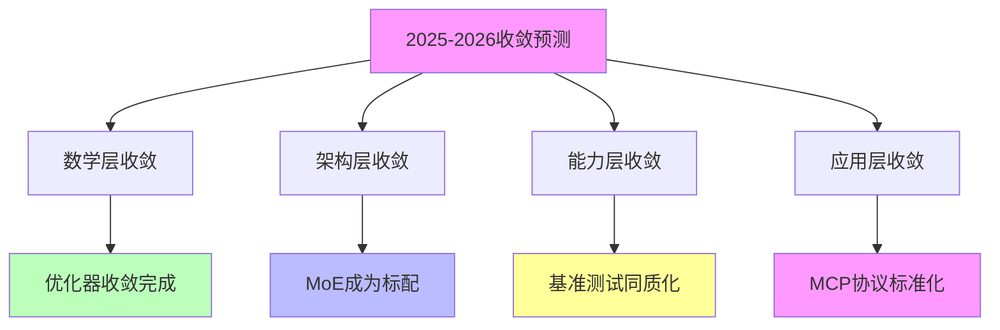

# 03.4.1-2025-2026 预测

## 一、概述

2025-2026 预测是收敛时间表的核心组成部分，预测 2025-2026 年 AI 收敛的关键趋势和时间节点。本文档阐述 2025-2026 年收敛预测的核心趋势、关键时间节点、收敛方向及其在 AI 系统中的应用。

---

## 二、目录

- [03.4.1-2025-2026 预测](#0341-2025-2026-预测)
  - [一、概述](#一概述)
  - [二、目录](#二目录)
  - [三、2025-2026 收敛预测核心趋势](#三2025-2026-收敛预测核心趋势)
    - [2.1 核心趋势](#21-核心趋势)
    - [2.2 时间节点](#22-时间节点)
  - [四、数学层收敛预测](#四数学层收敛预测)
    - [3.1 优化器收敛](#31-优化器收敛)
    - [3.2 损失函数理论化](#32-损失函数理论化)
  - [五、架构层收敛预测](#五架构层收敛预测)
    - [4.1 MoE 成为标配](#41-moe-成为标配)
    - [4.2 新架构挑战者](#42-新架构挑战者)
  - [六、能力层收敛预测](#六能力层收敛预测)
    - [5.1 基准测试同质化](#51-基准测试同质化)
    - [5.2 隐性能力评测标准](#52-隐性能力评测标准)
  - [七、应用层收敛预测](#七应用层收敛预测)
    - [6.1 MCP 协议标准化](#61-mcp-协议标准化)
    - [6.2 Agent 生态收敛](#62-agent-生态收敛)
  - [八、Test-time Scaling 预测](#八test-time-scaling-预测)
    - [7.1 Test-time Scaling Law](#71-test-time-scaling-law)
    - [7.2 推理算力需求](#72-推理算力需求)
  - [九、与三层模型的关系](#九与三层模型的关系)
    - [8.1 2025-2026 预测与执行层](#81-2025-2026-预测与执行层)
    - [8.2 2025-2026 预测与控制层](#82-2025-2026-预测与控制层)
    - [8.3 2025-2026 预测与数据层](#83-2025-2026-预测与数据层)
  - [十、核心结论](#十核心结论)
  - [十一、相关主题](#十一相关主题)
  - [十二、参考文档](#十二参考文档)

## 三、2025-2026 收敛预测核心趋势

### 2.1 核心趋势

**2025-2026 收敛预测核心趋势**：

**核心趋势**：

1. **数学层收敛**：优化器收敛完成，损失函数理论化
2. **架构层收敛**：MoE 成为标配，新架构挑战者出现
3. **能力层收敛**：基准测试同质化，隐性能力评测标准建立
4. **应用层收敛**：MCP 协议标准化，Agent 生态收敛

### 2.2 时间节点

**2025-2026 关键时间节点**：

| **时间节点** | **预测事件**                       | **收敛方向** |
| ------------ | ---------------------------------- | ------------ |
| **2025 Q2**  | 损失函数理论化完成                 | 数学层收敛   |
| **2025 Q4**  | MoE 成为标配                       | 架构层收敛   |
| **2026 Q2**  | MCP 协议成为事实标准               | 应用层收敛   |
| **2026 Q4**  | Test-time Scaling 证明 Scaling Law | 能力层收敛   |

---

## 四、数学层收敛预测

### 3.1 优化器收敛

**优化器收敛预测**：

**当前状态**：优化器收敛已完成（2024）

**2025-2026 预测**：

1. **损失函数理论化**：2025 Q2 完成损失函数理论化
2. **优化算法统一**：AdamW+Warmup 成为标准
3. **收敛加速**：收敛速度加快

**收敛方向**：数学层完全收敛

### 3.2 损失函数理论化

**损失函数理论化预测**：

**当前状态**：损失函数理论化进行中

**2025-2026 预测**：

1. **理论框架建立**：2025 Q2 建立理论框架
2. **数学形式化**：数学形式化完成
3. **可证明性**：可证明性提升

**收敛方向**：数学层完全收敛

---

## 五、架构层收敛预测

### 4.1 MoE 成为标配

**MoE 成为标配预测**：

**当前状态**：MoE 成为标配进行中

**2025-2026 预测**：

1. **MoE 成为标配**：2025 Q4 MoE 成为标配
2. **动态路由稳定性**：动态路由稳定性提升
3. **架构统一**：架构统一加速

**收敛方向**：架构层收敛

### 4.2 新架构挑战者

**新架构挑战者预测**：

**当前状态**：新架构挑战者出现

**2025-2026 预测**：

1. **新架构挑战者**：2026 Q2 新架构挑战者出现
2. **架构竞争**：架构竞争加剧
3. **收敛延迟**：收敛可能延迟

**收敛方向**：架构层收敛延迟

---

## 六、能力层收敛预测

### 5.1 基准测试同质化

**基准测试同质化预测**：

**当前状态**：基准测试同质化进行中

**2025-2026 预测**：

1. **基准测试同质化**：2025 Q4 基准测试同质化完成
2. **能力评估标准**：能力评估标准统一
3. **性能收敛**：性能收敛加速

**收敛方向**：能力层收敛

### 5.2 隐性能力评测标准

**隐性能力评测标准预测**：

**当前状态**：隐性能力评测标准建立中

**2025-2026 预测**：

1. **隐性能力评测标准**：2026 Q2 隐性能力评测标准建立
2. **能力评估提升**：能力评估提升
3. **收敛加速**：收敛速度加快

**收敛方向**：能力层收敛

---

## 七、应用层收敛预测

### 6.1 MCP 协议标准化

**MCP 协议标准化预测**：

**当前状态**：MCP 协议标准化进行中

**2025-2026 预测**：

1. **MCP 协议标准化**：2026 Q2 MCP 协议成为事实标准
2. **智能体平台收敛**：智能体平台收敛加速
3. **生态统一**：生态统一加速

**收敛方向**：应用层收敛

### 6.2 Agent 生态收敛

**Agent 生态收敛预测**：

**当前状态**：Agent 生态收敛进行中

**2025-2026 预测**：

1. **Agent 生态收敛**：2026 Q4 Agent 生态收敛
2. **平台统一**：平台统一加速
3. **标准统一**：标准统一加速

**收敛方向**：应用层收敛

---

## 八、Test-time Scaling 预测

### 7.1 Test-time Scaling Law

**Test-time Scaling Law 预测**：

**当前状态**：Test-time Scaling Law 证明中

**2025-2026 预测**：

1. **Test-time Scaling Law**：2026 Q4 证明 Test-time Scaling Law
2. **推理算力需求**：推理算力需求超过训练算力
3. **收敛加速**：收敛速度加快

**收敛方向**：能力层收敛

### 7.2 推理算力需求

**推理算力需求预测**：

**当前状态**：推理算力需求增长中

**2025-2026 预测**：

1. **推理算力需求**：2026 Q4 推理算力需求超过训练算力
2. **算力分配变化**：算力分配发生变化
3. **收敛加速**：收敛速度加快

**收敛方向**：能力层收敛

---

## 九、与三层模型的关系

### 8.1 2025-2026 预测与执行层

**2025-2026 预测与执行层**：

- **计算范式**：计算范式统一加速
- **优化算法**：优化算法统一加速
- **硬件适配**：硬件适配统一加速

### 8.2 2025-2026 预测与控制层

**2025-2026 预测与控制层**：

- **推理机制**：推理机制统一加速
- **控制策略**：控制策略统一加速
- **约束机制**：约束机制统一加速

### 8.3 2025-2026 预测与数据层

**2025-2026 预测与数据层**：

- **训练范式**：训练范式统一加速
- **数据策略**：数据策略统一加速
- **评估方法**：评估方法统一加速

---

## 十、核心结论

1. **2025-2026 预测是收敛时间表的核心组成部分**：数学层收敛、架构层收敛、能力层收敛、应用层收敛
2. **关键时间节点**：2025 Q2 损失函数理论化、2025 Q4 MoE 成为标配、2026 Q2 MCP 协议标准化、2026 Q4 Test-time Scaling Law 证明
3. **收敛方向**：数学层完全收敛、架构层收敛、能力层收敛、应用层收敛
4. **收敛加速**：收敛速度加快，市场集中度提升

---

## 十一、相关主题

- [03.4.2-2026-2027 预测](03.4.2-2026-2027预测.md)
- [03.4.3-长期趋势分析](03.4.3-长期趋势分析.md)
- [03.3.1-技术收敛驱动力](03.3.1-技术收敛驱动力.md)

---

## 十二、参考文档

- [Scaling Law 驱动的"大"与追求理论可控的"收敛"之间的张力](../../view/ai_scale_view.md)
