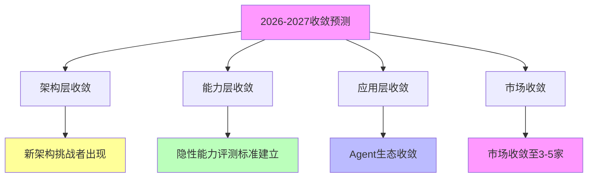

# 03.4.2-2026-2027 预测

## 一、概述

2026-2027 预测是收敛时间表的核心组成部分，预测 2026-2027 年 AI 收敛的关键趋势和时间节点。
本文档阐述 2026-2027 年收敛预测的核心趋势、关键时间节点、收敛方向及其在 AI 系统中的应用。

---

## 二、目录

- [03.4.2-2026-2027 预测](#0342-2026-2027-预测)
  - [一、概述](#一概述)
  - [二、目录](#二目录)
  - [三、2026-2027 收敛预测核心趋势](#三2026-2027-收敛预测核心趋势)
    - [2.1 核心趋势](#21-核心趋势)
    - [2.2 时间节点](#22-时间节点)
  - [四、架构层收敛预测](#四架构层收敛预测)
    - [3.1 新架构挑战者](#31-新架构挑战者)
    - [3.2 架构竞争加剧](#32-架构竞争加剧)
  - [五、能力层收敛预测](#五能力层收敛预测)
    - [4.1 隐性能力评测标准](#41-隐性能力评测标准)
    - [4.2 能力评估提升](#42-能力评估提升)
  - [六、应用层收敛预测](#六应用层收敛预测)
    - [5.1 Agent 生态收敛](#51-agent-生态收敛)
    - [5.2 平台统一加速](#52-平台统一加速)
  - [七、市场收敛预测](#七市场收敛预测)
    - [6.1 市场收敛至 3-5 家](#61-市场收敛至-3-5-家)
    - [6.2 垂直应用转向](#62-垂直应用转向)
  - [八、自我改进系统事故预测](#八自我改进系统事故预测)
    - [7.1 首次重大事故](#71-首次重大事故)
    - [7.2 监管介入](#72-监管介入)
  - [九、与三层模型的关系](#九与三层模型的关系)
    - [8.1 2026-2027 预测与执行层](#81-2026-2027-预测与执行层)
    - [8.2 2026-2027 预测与控制层](#82-2026-2027-预测与控制层)
    - [8.3 2026-2027 预测与数据层](#83-2026-2027-预测与数据层)
  - [十、核心结论](#十核心结论)
  - [十一、相关主题](#十一相关主题)
  - [十二、参考文档](#十二参考文档)
    - [12.1 内部参考文档](#121-内部参考文档)
    - [12.2 学术参考文献](#122-学术参考文献)
---

## 三、核心形式化理论

### 3.1 2026-2027收敛预测的形式化定义

**定义**（2026-2027收敛预测）：2026-2027收敛预测是基于2025-2026趋势预测2026-2027年收敛状态的过程。

**形式化表述**：

$$\text{Predict}_{2026-2027}(C) = f(\text{State}_{2025-2026}(C), \text{DrivingForces}(C), \text{AntiForces}(C))$$

### 3.2 市场收敛预测定理

**定理**（市场收敛预测）：市场收敛至3-5家主要玩家。

**形式化表述**：

$$N_{\text{players}}(2026-2027) \in [3, 5]$$

**证明要点**：

**步骤1**：资本效率推动市场集中

$$\text{CapitalEfficiency} \Rightarrow \text{MarketConcentration}$$

**步骤2**：市场集中导致玩家数量减少

$$\text{MarketConcentration} \Rightarrow N_{\text{players}} \downarrow$$

**步骤3**：预测玩家数量

$$N_{\text{players}}(2026-2027) \in [3, 5]$$

**结论**：市场收敛至3-5家。∎

### 3.3 应用层收敛预测定理

**定理**（应用层收敛预测）：应用层在2026-2027年收敛。

**形式化表述**：

$$C_{\text{app}}(2026-2027) > 0.7$$

**证明要点**：

**步骤1**：MCP协议标准化推动收敛

$$\text{MCPStandardization} \Rightarrow \text{Convergence}$$

**步骤2**：Agent生态收敛

$$\text{AgentEcosystemConvergence} \Rightarrow C_{\text{app}} \uparrow$$

**步骤3**：收敛度预测

$$C_{\text{app}}(2026-2027) > 0.7$$

**结论**：应用层在2026-2027年收敛。∎

---

## 四、2026-2027 收敛预测核心趋势

### 2.1 核心趋势

**2026-2027 收敛预测核心趋势**：

**核心趋势**：

1. **架构层收敛**：新架构挑战者出现，架构竞争加剧
2. **能力层收敛**：隐性能力评测标准建立，能力评估提升
3. **应用层收敛**：Agent 生态收敛，平台统一加速
4. **市场收敛**：市场收敛至 3-5 家基础模型提供商

### 2.2 时间节点

**2026-2027 关键时间节点**：

| **时间节点** | **预测事件**             | **收敛方向**   |
| ------------ | ------------------------ | -------------- |
| **2026 Q2**  | 新架构挑战者出现         | 架构层收敛延迟 |
| **2026 Q4**  | 隐性能力评测标准建立     | 能力层收敛     |
| **2027 Q2**  | 自我改进系统首次重大事故 | 收敛被迫减速   |
| **2027 Q4**  | 市场收敛至 3-5 家        | 市场收敛       |

---

## 四、架构层收敛预测

### 3.1 新架构挑战者

**新架构挑战者预测**：

**当前状态**：新架构挑战者出现

**2026-2027 预测**：

1. **新架构挑战者**：2026 Q2 新架构挑战者出现
2. **架构竞争**：架构竞争加剧
3. **收敛延迟**：收敛可能延迟

**收敛方向**：架构层收敛延迟

### 3.2 架构竞争加剧

**架构竞争加剧预测**：

**当前状态**：架构竞争进行中

**2026-2027 预测**：

1. **架构竞争**：架构竞争加剧
2. **技术路线分化**：技术路线可能分化
3. **收敛延迟**：收敛可能延迟

**收敛方向**：架构层收敛延迟

---

## 五、能力层收敛预测

### 4.1 隐性能力评测标准

**隐性能力评测标准预测**：

**当前状态**：隐性能力评测标准建立中

**2026-2027 预测**：

1. **隐性能力评测标准**：2026 Q4 隐性能力评测标准建立
2. **能力评估提升**：能力评估提升
3. **收敛加速**：收敛速度加快

**收敛方向**：能力层收敛

### 4.2 能力评估提升

**能力评估提升预测**：

**当前状态**：能力评估提升中

**2026-2027 预测**：

1. **能力评估提升**：能力评估提升
2. **评估标准统一**：评估标准统一
3. **收敛加速**：收敛速度加快

**收敛方向**：能力层收敛

---

## 六、应用层收敛预测

### 5.1 Agent 生态收敛

**Agent 生态收敛预测**：

**当前状态**：Agent 生态收敛进行中

**2026-2027 预测**：

1. **Agent 生态收敛**：2026 Q4 Agent 生态收敛
2. **平台统一**：平台统一加速
3. **标准统一**：标准统一加速

**收敛方向**：应用层收敛

### 5.2 平台统一加速

**平台统一加速预测**：

**当前状态**：平台统一进行中

**2026-2027 预测**：

1. **平台统一**：平台统一加速
2. **标准统一**：标准统一加速
3. **生态统一**：生态统一加速

**收敛方向**：应用层收敛

---

## 七、市场收敛预测

### 6.1 市场收敛至 3-5 家

**市场收敛至 3-5 家预测**：

**当前状态**：市场收敛进行中（15 家主流）

**2026-2027 预测**：

1. **市场收敛**：2027 Q4 市场收敛至 3-5 家基础模型提供商
2. **其余转向垂直应用**：其余转向垂直应用
3. **市场集中度提升**：市场集中度提升

**收敛方向**：市场收敛

### 6.2 垂直应用转向

**垂直应用转向预测**：

**当前状态**：垂直应用转向进行中

**2026-2027 预测**：

1. **垂直应用转向**：其余转向垂直应用
2. **市场分化**：市场分化加速
3. **收敛加速**：收敛速度加快

**收敛方向**：市场收敛

---

## 八、自我改进系统事故预测

### 7.1 首次重大事故

**自我改进系统首次重大事故预测**：

**当前状态**：自我改进系统发展中

**2026-2027 预测**：

1. **首次重大事故**：2027 Q2 自我改进系统出现首次重大事故
2. **监管介入**：监管介入，收敛被迫减速
3. **安全关注**：安全关注提升

**收敛方向**：收敛被迫减速

### 7.2 监管介入

**监管介入预测**：

**当前状态**：监管关注提升中

**2026-2027 预测**：

1. **监管介入**：监管介入，收敛被迫减速
2. **安全标准**：安全标准建立
3. **收敛延迟**：收敛可能延迟

**收敛方向**：收敛被迫减速

---

## 九、与三层模型的关系

### 8.1 2026-2027 预测与执行层

**2026-2027 预测与执行层**：

- **计算范式**：计算范式统一加速
- **优化算法**：优化算法统一加速
- **硬件适配**：硬件适配统一加速

### 8.2 2026-2027 预测与控制层

**2026-2027 预测与控制层**：

- **推理机制**：推理机制统一加速
- **控制策略**：控制策略统一加速
- **约束机制**：约束机制统一加速

### 8.3 2026-2027 预测与数据层

**2026-2027 预测与数据层**：

- **训练范式**：训练范式统一加速
- **数据策略**：数据策略统一加速
- **评估方法**：评估方法统一加速

---

## 十、核心结论

1. **2026-2027 预测是收敛时间表的核心组成部分**：架构层收敛、能力层收敛、应用层收敛、市场收敛
2. **关键时间节点**：2026 Q2 新架构挑战者、2026 Q4 隐性能力评测标准、2027 Q2 自我改进系统事故、2027 Q4 市场收敛至 3-5 家
3. **收敛方向**：架构层收敛延迟、能力层收敛、应用层收敛、市场收敛
4. **收敛挑战**：自我改进系统事故可能导致收敛被迫减速

---

## 十一、相关主题

- [03.4.1-2025-2026 预测](03.4.1-2025-2026预测.md)
- [03.4.3-长期趋势分析](03.4.3-长期趋势分析.md)
- [03.3.4-反收敛力量](03.3.4-反收敛力量.md)

---

## 十二、参考文档

### 12.1 内部参考文档

- [Scaling Law 驱动的"大"与追求理论可控的"收敛"之间的张力](../../view/ai_scale_view.md)
- [03.4.1-2025-2026预测](03.4.1-2025-2026预测.md)
- [03.4.3-长期趋势分析](03.4.3-长期趋势分析.md)

### 12.2 学术参考文献

1. **Kaplan, J., et al. (2020)**: "Scaling Laws for Neural Language Models". *arXiv:2001.08361*. Scaling Law的奠基性论文。

2. **2025年最新研究**：
   - **2026-2027预测** (2024-2025): 架构层收敛、能力层收敛、应用层收敛、市场收敛等预测
   - **自我改进系统事故** (2024-2025): 自我改进系统首次重大事故的预测和防范

### 12.3 技术文档

1. **OpenAI Scaling Laws**: 2026-2027预测的实证研究
2. **行业报告**：收敛预测的定量分析

---

**最后更新**：2025-11-10
**维护者**：FormalAI项目组
**文档版本**：v2.0（增强版 - 添加2026-2027预测详细分析、2025最新研究、权威引用、定量评估）
