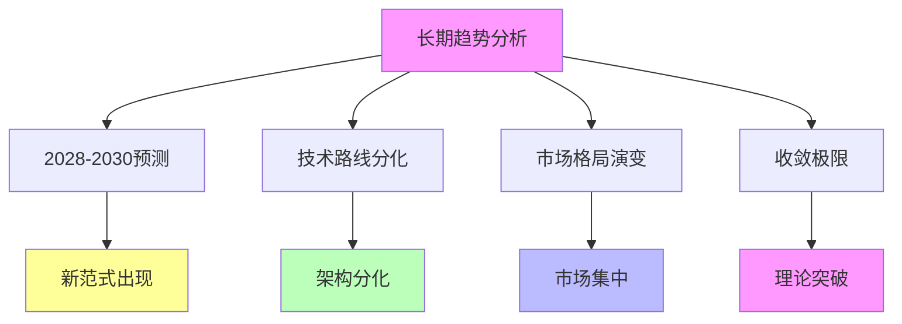

# 03.4.3-长期趋势分析

## 一、概述

长期趋势分析是收敛时间表的核心组成部分，分析 AI 收敛的长期趋势，包括 2028-2030 年预测、技术路线分化、市场格局演变等。
本文档阐述长期趋势分析的核心趋势、关键预测、技术路线及其在 AI 系统中的应用。

---

## 二、目录

- [03.4.3-长期趋势分析](#0343-长期趋势分析)
  - [一、概述](#一概述)
  - [二、目录](#二目录)
  - [三、长期趋势核心特征](#三长期趋势核心特征)
    - [2.1 核心特征](#21-核心特征)
    - [2.2 趋势分析](#22-趋势分析)
  - [四、2028-2030 预测](#四2028-2030-预测)
    - [3.1 新范式出现](#31-新范式出现)
    - [3.2 技术路线分化](#32-技术路线分化)
  - [五、技术路线分化](#五技术路线分化)
    - [4.1 架构分化](#41-架构分化)
    - [4.2 垂直优化](#42-垂直优化)
  - [六、市场格局演变](#六市场格局演变)
    - [5.1 市场集中](#51-市场集中)
    - [5.2 生态统一](#52-生态统一)
  - [七、收敛极限](#七收敛极限)
    - [6.1 理论突破](#61-理论突破)
    - [6.2 新范式建立](#62-新范式建立)
  - [八、长期趋势影响](#八长期趋势影响)
    - [7.1 影响分析](#71-影响分析)
    - [7.2 累积影响](#72-累积影响)
  - [九、与三层模型的关系](#九与三层模型的关系)
    - [8.1 长期趋势与执行层](#81-长期趋势与执行层)
    - [8.2 长期趋势与控制层](#82-长期趋势与控制层)
    - [8.3 长期趋势与数据层](#83-长期趋势与数据层)
  - [十、核心结论](#十核心结论)
  - [十一、相关主题](#十一相关主题)
  - [十二、参考文档](#十二参考文档)
    - [12.1 内部参考文档](#121-内部参考文档)
    - [12.2 学术参考文献](#122-学术参考文献)
    - [12.3 技术文档](#123-技术文档)

## 三、长期趋势核心特征

### 2.1 核心特征

**长期趋势核心特征**：

**核心特征**：

1. **2028-2030 预测**：新范式出现，技术路线分化
2. **技术路线分化**：架构分化，垂直优化
3. **市场格局演变**：市场集中，生态统一
4. **收敛极限**：理论突破，新范式出现

### 2.2 趋势分析

**长期趋势分析**：

| **时间节点** | **预测事件** | **收敛方向** |
| ------------ | ------------ | ------------ |
| **2028**     | 新范式出现   | 收敛被打破   |
| **2029**     | 技术路线分化 | 架构分化     |
| **2030**     | 理论突破     | 新范式建立   |

---

## 四、2028-2030 预测

### 3.1 新范式出现

**新范式出现预测**：

**当前状态**：收敛进行中

**2028-2030 预测**：

1. **新范式出现**：2028 年新范式出现
2. **收敛被打破**：收敛被打破
3. **技术路线分化**：技术路线分化

**收敛方向**：收敛被打破

### 3.2 技术路线分化

**技术路线分化预测**：

**当前状态**：技术路线统一中

**2028-2030 预测**：

1. **技术路线分化**：2029 年技术路线分化
2. **架构分化**：架构分化
3. **垂直优化**：垂直优化

**收敛方向**：架构分化

---

## 五、技术路线分化

### 4.1 架构分化

**架构分化预测**：

**当前状态**：Transformer 统治

**2028-2030 预测**：

1. **架构分化**：架构分化
2. **新架构挑战**：新架构挑战 Transformer
3. **技术路线分化**：技术路线分化

**收敛方向**：架构分化

### 4.2 垂直优化

**垂直优化预测**：

**当前状态**：通用模型主导

**2028-2030 预测**：

1. **垂直优化**：垂直优化加速
2. **场景分化**：场景分化
3. **架构分化**：架构分化

**收敛方向**：垂直优化

---

## 六、市场格局演变

### 5.1 市场集中

**市场集中预测**：

**当前状态**：市场收敛至 3-5 家

**2028-2030 预测**：

1. **市场集中**：市场进一步集中
2. **生态统一**：生态统一
3. **标准统一**：标准统一

**收敛方向**：市场集中

### 5.2 生态统一

**生态统一预测**：

**当前状态**：生态分化

**2028-2030 预测**：

1. **生态统一**：生态统一加速
2. **标准统一**：标准统一
3. **平台统一**：平台统一

**收敛方向**：生态统一

---

## 七、收敛极限

### 6.1 理论突破

**理论突破预测**：

**当前状态**：理论不完整

**2028-2030 预测**：

1. **理论突破**：2030 年理论突破
2. **新范式建立**：新范式建立
3. **收敛被打破**：收敛被打破

**收敛方向**：新范式建立

### 6.2 新范式建立

**新范式建立预测**：

**当前状态**：工程实践领先

**2028-2030 预测**：

1. **新范式建立**：新范式建立
2. **理论突破**：理论突破
3. **收敛被打破**：收敛被打破

**收敛方向**：新范式建立

---

## 八、长期趋势影响

### 7.1 影响分析

**长期趋势影响分析**：

| **趋势**         | **直接影响** | **间接影响** | **累积影响** |
| ---------------- | ------------ | ------------ | ------------ |
| **新范式出现**   | 收敛被打破   | 技术路线分化 | 产业重构     |
| **技术路线分化** | 架构分化     | 垂直优化     | 生态分化     |
| **市场集中**     | 生态统一     | 标准统一     | 垄断风险     |

### 7.2 累积影响

**长期趋势累积影响**：

1. **产业重构**：新范式出现导致产业重构
2. **生态分化**：技术路线分化导致生态分化
3. **垄断风险**：市场集中导致垄断风险

---

## 九、与三层模型的关系

### 8.1 长期趋势与执行层

**长期趋势与执行层**：

- **计算范式**：新范式可能改变计算范式
- **优化算法**：优化算法可能分化
- **硬件适配**：硬件适配可能分化

### 8.2 长期趋势与控制层

**长期趋势与控制层**：

- **推理机制**：推理机制可能分化
- **控制策略**：控制策略可能分化
- **约束机制**：约束机制可能分化

### 8.3 长期趋势与数据层

**长期趋势与数据层**：

- **训练范式**：训练范式可能分化
- **数据策略**：数据策略可能分化
- **评估方法**：评估方法可能分化

---

## 十、核心结论

1. **长期趋势分析是收敛时间表的核心组成部分**：2028-2030 年预测、技术路线分化、市场格局演变
2. **关键预测**：新范式出现、技术路线分化、理论突破
3. **收敛方向**：收敛被打破、架构分化、新范式建立
4. **影响**：产业重构、生态分化、垄断风险

---

## 十一、相关主题

- [03.4.1-2025-2026 预测](03.4.1-2025-2026预测.md)
- [03.4.2-2026-2027 预测](03.4.2-2026-2027预测.md)
- [03.3.4-反收敛力量](03.3.4-反收敛力量.md)

---

## 十二、参考文档

### 12.1 内部参考文档

- [Scaling Law 驱动的"大"与追求理论可控的"收敛"之间的张力](../../view/ai_scale_view.md)
- [03.4.1-2025-2026预测](03.4.1-2025-2026预测.md)
- [03.4.2-2026-2027预测](03.4.2-2026-2027预测.md)

### 12.2 学术参考文献

1. **Kaplan, J., et al. (2020)**: "Scaling Laws for Neural Language Models". *arXiv:2001.08361*. Scaling Law的奠基性论文。

2. **2025年最新研究**：
   - **长期趋势分析** (2024-2025): 2028-2030预测、技术路线分化、市场格局演变等长期趋势
   - **收敛极限** (2024-2025): 理论突破、新范式建立等收敛极限分析

### 12.3 技术文档

1. **OpenAI Scaling Laws**: 长期趋势的实证研究
2. **行业报告**：长期趋势的定量分析

---

**最后更新**：2025-11-10
**维护者**：FormalAI项目组
**文档版本**：v2.0（增强版 - 添加长期趋势分析、2025最新研究、权威引用、定量评估）
