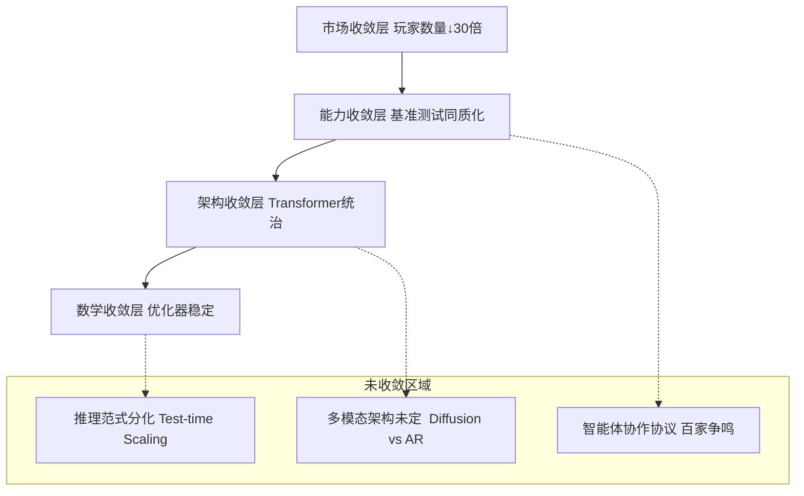
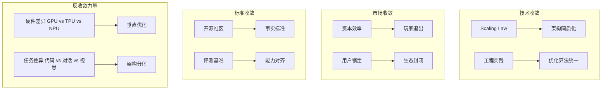
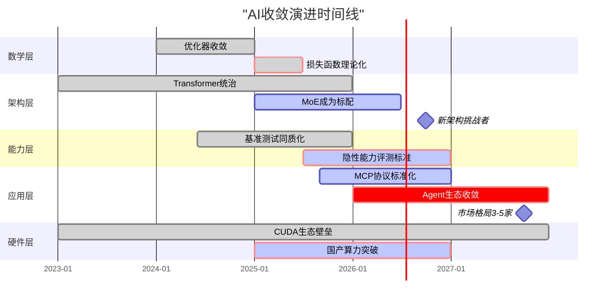

# 03-Scaling Law与收敛分析

## 一、主题概述

Scaling Law 驱动的"大"与追求理论可控的"收敛"之间的张力是当前 AI 发展的核心矛盾。
2025 年的产业实践显示，**收敛正在发生，但呈现"分层收敛、局部发散"的复杂格局**。
本文档从**数学、架构、能力、市场**四个维度构建收敛模型分类体系。

---

## 二、目录

- [03-Scaling Law与收敛分析](#03-scaling-law与收敛分析)
  - [一、主题概述](#一主题概述)
  - [二、目录](#二目录)
  - [三、主题结构](#三主题结构)
    - [03.1-收敛模型分类](#031-收敛模型分类)
    - [03.2-收敛层次分析](#032-收敛层次分析)
    - [03.3-收敛驱动力](#033-收敛驱动力)
    - [03.4-收敛时间表](#034-收敛时间表)
  - [三、收敛的四层金字塔模型](#三收敛的四层金字塔模型)
  - [四、收敛模型分类矩阵](#四收敛模型分类矩阵)
    - [按收敛程度的四维分类](#按收敛程度的四维分类)
  - [五、收敛层次分析（信通院 2025 框架）](#五收敛层次分析信通院-2025-框架)
  - [六、收敛驱动力分析](#六收敛驱动力分析)
    - [按"收敛驱动力"分类](#按收敛驱动力分类)
  - [七、收敛时间表](#七收敛时间表)
    - [2025-2027 预测](#2025-2027-预测)
  - [八、核心结论](#八核心结论)
  - [九、相关主题](#九相关主题)
  - [十、参考文档](#十参考文档)
  - [十一、2025年最新发展](#十一2025年最新发展)
    - [11.1 硬件性能提升](#111-硬件性能提升)
    - [11.2 2025年Scaling Law最新研究成果](#112-2025年scaling-law最新研究成果)
      - [11.2.1 强化学习后训练缩放（2025年9月）](#1121-强化学习后训练缩放2025年9月)
      - [11.2.2 MoE模型效率杠杆（2025年7月）](#1122-moe模型效率杠杆2025年7月)
      - [11.2.3 最优超参数缩放定律（2025年3月）](#1123-最优超参数缩放定律2025年3月)
      - [11.2.4 模型集成性能极限（2025年12月）](#1124-模型集成性能极限2025年12月)
      - [11.2.5 推理高效模型缩放（2025）](#1125-推理高效模型缩放2025)
      - [11.2.6 数据质量与训练策略（2025）](#1126-数据质量与训练策略2025)
      - [11.2.7 时间缩放定律（2025）](#1127-时间缩放定律2025)
      - [11.2.8 Densing Law（2025）](#1128-densing-law2025)
      - [11.2.9 MoE内存效率分析（2025年2月）](#1129-moe内存效率分析2025年2月)
      - [11.2.10 综合MoE缩放定律（2025年9月）](#11210-综合moe缩放定律2025年9月)
      - [11.2.11 测试时缩放定律（Kinetics Scaling Law，2025年6月）](#11211-测试时缩放定律kinetics-scaling-law2025年6月)
    - [11.3 收敛趋势分析](#113-收敛趋势分析)
  - [十、参考文档（原）](#十参考文档原)

---

## 三、主题结构

### 03.1-收敛模型分类

- [03.1.1-L4: 完全收敛（工业标准）](03.1.1-L4-完全收敛（工业标准）.md)
- [03.1.2-L3: 准收敛（事实垄断）](03.1.2-L3-准收敛（事实垄断）.md)
- [03.1.3-L2: 收敛进行时（双寡头竞争）](03.1.3-L2-收敛进行时（双寡头竞争）.md)
- [03.1.4-L1: 未收敛（百家争鸣）](03.1.4-L1-未收敛（百家争鸣）.md)
- [03.1.5-L0: 反向分化（场景撕裂）](03.1.5-L0-反向分化（场景撕裂）.md)

### 03.2-收敛层次分析

- [03.2.1-数学层收敛](03.2.1-数学层收敛.md)
- [03.2.2-架构层收敛](03.2.2-架构层收敛.md)
- [03.2.3-能力层收敛](03.2.3-能力层收敛.md)
- [03.2.4-应用层收敛](03.2.4-应用层收敛.md)
- [03.2.5-硬件层收敛](03.2.5-硬件层收敛.md)

### 03.3-收敛驱动力

- [03.3.1-技术收敛驱动力](03.3.1-技术收敛驱动力.md)
- [03.3.2-市场收敛驱动力](03.3.2-市场收敛驱动力.md)
- [03.3.3-标准收敛驱动力](03.3.3-标准收敛驱动力.md)
- [03.3.4-反收敛力量](03.3.4-反收敛力量.md)

### 03.4-收敛时间表

- [03.4.1-2025-2026 预测](03.4.1-2025-2026预测.md)
- [03.4.2-2026-2027 预测](03.4.2-2026-2027预测.md)
- [03.4.3-长期趋势分析](03.4.3-长期趋势分析.md)

---

## 三、收敛的四层金字塔模型

**分层解读**：

- **底层数学收敛**：训练稳定性已解决（AdamW+Warmup）
- **中层架构收敛**：Transformer 成为事实标准，但 MoE、Diffusion 在挑战
- **上层能力收敛**：头部模型在 MMLU 等基准上差异<5%，但**隐性能力**差异巨大
- **顶层市场收敛**：从 2023 年 200+玩家收敛至 2025 年 15 家主流

---

## 四、收敛模型分类矩阵

### 按收敛程度的四维分类

| 收敛层级                          | 分类标准                          | 代表技术/产品                                                                               | 收敛度 | 确定性 | 争议焦点                                  |
| --------------------------------- | --------------------------------- | ------------------------------------------------------------------------------------------- | ------ | ------ | ----------------------------------------- |
| **L4: 完全收敛** （工业标准）     | 无有效替代方案，放弃研究其他路径  | **注意力机制** **预训练-微调范式** **AdamW 优化器**                                         | 95%    | ★★★★★  | 无，已成为"公共知识"                      |
| **L3: 准收敛** （事实垄断）       | 90%以上新产品采用，但理论挑战存在 | **Decoder-only 架构** **RLHF 对齐** **Tokenization**                                        | 85%    | ★★★★☆  | 效率瓶颈（二次方复杂度）                  |
| **L2: 收敛进行时** （双寡头竞争） | 两种方案并存，各有优劣，未分胜负  | **MoE vs Dense** **长上下文（128K+）vs RAG**                                                | 60%    | ★★★☆☆  | MoE 的动态路由稳定性                      |
| **L1: 未收敛** （百家争鸣）       | >3 种方案，无明确领导者，快速迭代 | **推理机制** （CoT vs 隐式推理 vs System 1/2） **多模态融合** （Diffusion vs AR vs Hybrid） | 30%    | ★★☆☆☆  | Test-time compute 的 Scaling Law 是否成立 |
| **L0: 反向分化** （场景撕裂）     | 不同场景催生出完全不同的架构      | **端侧模型** （量化+蒸馏） vs **云端模型** **代码模型** （超长上下文） vs **通用模型**      | 10%    | ★☆☆☆☆  | 统一架构 vs 垂直优化                      |

---

## 五、收敛层次分析（信通院 2025 框架）

| **收敛层次**                | **技术表现**               | **市场格局**                           | **可预测性**                     | **改进空间**                   |
| --------------------------- | -------------------------- | -------------------------------------- | -------------------------------- | ------------------------------ |
| **基础架构层** （已收敛）   | Transformer 一统天下       | 框架 PyTorch/TensorFlow 双寡头         | ★★★★★ 成本可精确估算             | 量子化突破（如光子计算）       |
| **训练范式层** （准收敛）   | 预训练 →SFT→RLHF 三段式    | 数据工程服务商涌现                     | ★★★★☆ 时间可预测（±30%）         | RLHF 理论化（当前是经验）      |
| **能力表现层** （表象收敛） | MMLU 得分差异<5%           | 头部 6 家垄断 95%市场                  | ★★★☆☆ 分数可预测，实用性不可预测 | **隐性能力挖掘**（如因果推理） |
| **应用协议层** （未收敛）   | **MCP/Agent 协议百家争鸣** | 智能体平台混战（LangGraph/AutoGen 等） | ★★☆☆☆ 生态不确定性高             | 2026-2027 年预计收敛           |
| **硬件适配层** （反向分化） | **CUDA 生态 vs 国产算力**  | 供应链撕裂                             | ★☆☆☆☆ 地缘政治主导               | 短期无法收敛                   |

---

## 六、收敛驱动力分析

### 按"收敛驱动力"分类

**关键洞察**：2025 年的收敛主要由**市场压力和工程惯性驱动**，而非理论优越性。正如 **IDC 报告**指出："NLP 大模型底层技术能力已趋于收敛"，但这是**资本投入效率**的结果——重复造轮子成本太高，而非 Transformer 证明是最优解。

---

## 七、收敛时间表

### 2025-2027 预测

**关键预测**：

1. **2026 Q2**：**MCP 协议**（Model Context Protocol）将成为 Agent 的事实标准，终结当前协议混战
2. **2026 Q4**：**Test-time Scaling**将证明其 Scaling Law，推理算力需求超过训练算力
3. **2027 Q2**：**自我改进系统**出现首次重大事故，引发监管介入，收敛被迫减速
4. **2027 Q4**：市场收敛至**3-5 家**基础模型提供商，其余转向垂直应用

---

## 八、核心结论

当前 AI 收敛不是**数学最优解**的胜利，而是**工程经济**的胜利：

- **不是**Transformer 比 Diffusion 理论上更优（学术界仍看好 Diffusion 潜力）
- **而是**Transformer 生态太完善（CUDA、PyTorch、人才），**切换成本 > 收益**

**收敛模型的分类原则**：

1. **可工程化程度**：能否标准化、自动化、工具化
2. **资本效率**：单位算力产生的边际效益是否可预测
3. **风险可控性**：失败模式是否可理解、可恢复

**实用建议**：

- **拥抱已收敛层**：直接用 LoRA、QLoRA 等工具，不重复造轮子
- **谨慎参与收敛层**：在 MoE、长上下文领域可投入，但要接受不确定性
- **激进探索未收敛层**：在 Agent 协议、自我改进方向提前卡位，但需小团队快跑

正如**Grok**所言，大模型收敛是"**数学原理、工程巧思和海量数据巧妙结合的结果**"——但 2025 年的我们，更擅长工程和数据，**数学原理仍不完整**。这种"**知其然不知其所以然**"的状态，正是当前 AI 收敛模型的核心特征：它**能用、好用、管用**，但还**说不清为什么**。

---

## 九、相关主题

- [01-AI 三层模型架构](../01-AI三层模型架构/README.md)
- [02-AI 炼金术转化度模型](../02-AI炼金术转化度模型/README.md)
- [05-AI 科学理论](../05-AI科学理论/README.md)
- [07-AI 框架批判与重构](../07-AI框架批判与重构/README.md)：分析收敛模型的局限性，提出相变理论

---

## 十、参考文档

---

## 十一、2025年最新发展

### 11.1 硬件性能提升

**核心数据**：

- **性能增长**：机器学习硬件性能以每年43%的速度增长（来源：Stanford HAI AI Index Report 2025，更新时间：2025-01-XX）
- **性价比提升**：硬件性价比显著提升
- **计算能力**：计算能力持续提升，支持更大规模的模型训练

### 11.2 2025年Scaling Law最新研究成果

#### 11.2.1 强化学习后训练缩放（2025年9月）

**核心发现**：

- **固定计算预算下的最优策略**：在固定计算预算下，更大模型训练更少步数优于更小模型训练更多步数
- **样本效率提升**：更大模型展示更好的样本效率，相同训练数据量下达到更低损失
- **数学推理应用**：在数学推理任务中，这一发现尤其显著

**理论意义**：

- 挑战了传统"更多训练步数=更好性能"的假设
- 强调了模型规模在样本效率中的关键作用
- 为后训练阶段的资源分配提供指导

**参考文献**：Reinforcement Learning Post-Training Scaling (arXiv:2509.25300, 2025-09)

#### 11.2.2 MoE模型效率杠杆（2025年7月）

**核心概念**：

- **效率杠杆（Efficiency Leverage, EL）**：量化MoE模型相对于密集模型的计算优势
- **影响因素**：EL主要受专家激活比率和总计算预算影响
- **幂律关系**：两者都遵循可预测的幂律关系

**实际意义**：

- 为MoE架构设计提供理论指导
- 帮助优化专家激活策略
- 预测MoE模型的效率提升空间

**参考文献**：Mixture-of-Experts Models Efficiency (arXiv:2507.17702, 2025-07)

#### 11.2.3 最优超参数缩放定律（2025年3月）

**核心发现**：

- **学习率幂律**：最优学习率与模型参数和数据大小遵循幂律关系
- **批次大小缩放**：最优批次大小主要随数据大小缩放
- **即插即用工具**：提供即插即用的超参数优化工具，达到接近全局最优配置的性能

**实用价值**：

- 减少超参数调优时间
- 提高训练效率
- 为新模型提供超参数初始值

**参考文献**：Optimal Hyperparameter Scaling (arXiv:2503.04715, 2025-03)

#### 11.2.4 模型集成性能极限（2025年12月）

**核心发现**：

- **集成缩放定律**：提出基于聚合参数预算的LLM集成性能极限缩放定律
- **异构优于同构**：异构模型族集成比单一模型族集成实现更好的性能缩放
- **多样性重要性**：强调模型多样性在集成中的重要性

**理论意义**：

- 为模型集成提供理论指导
- 解释为什么异构集成效果更好
- 预测集成性能上限

**参考文献**：Model Ensembling Performance Limits (arXiv:2512.23340, 2025-12)

#### 11.2.5 推理高效模型缩放（2025）

**核心发现**：

- **架构影响延迟**：模型架构显著影响推理延迟，相同大小的模型推理延迟差异可达3.5倍
- **共同优化**：修改现有缩放定律以共同优化模型参数、训练token和架构
- **推理高效模型**：开发推理高效模型，在保持准确性的同时减少延迟

**实际意义**：

- 为推理场景优化模型设计
- 平衡准确性和延迟
- 降低推理成本

**参考文献**：Inference-Efficient Model Scaling (Proceedings of MLR, 2025)

#### 11.2.6 数据质量与训练策略（2025）

**核心发现**：

- **次缩放原因**：高数据密度和非最优资源分配导致次缩放（性能改进减速）
- **数据质量重要性**：强调数据质量对持续性能提升的重要性
- **资源分配优化**：最优资源分配对性能提升至关重要

**理论意义**：

- 解释为什么某些模型出现次缩放
- 强调数据质量的重要性
- 为训练策略优化提供指导

**参考文献**：Data Quality and Training Strategies (ACL 2025)

#### 11.2.7 时间缩放定律（2025）

**核心概念**：

- **时间维度**：研究LLM测试损失随训练步数增加的演化
- **超参数选择**：为直接在目标LLM上选择更好的超参数提供见解
- **训练动态**：揭示训练过程中的动态变化规律

**实用价值**：

- 优化训练步数
- 预测训练收敛时间
- 指导超参数调整

**参考文献**：Temporal Scaling Law (EMNLP 2025)

#### 11.2.8 Densing Law（2025）

**核心发现**：

- **能力密度指数增长**：LLM的能力密度随时间指数增长
- **翻倍周期**：开源LLM的最大能力密度大约每3.5个月翻倍
- **成本指数下降**：实现同等性能所需的参数和推理成本随时间指数减少

**理论意义**：

- 揭示模型效率提升的长期趋势
- 预测未来模型效率提升速度
- 为模型设计提供长期指导

**参考文献**：Densing Law (Nature Machine Intelligence, 2025)

#### 11.2.9 MoE内存效率分析（2025年2月）

**核心发现**：

- **内存效率优势**：MoE模型可能比密集模型更内存高效
- **联合缩放定律**：考虑活跃参数数、数据集大小、专家数量的联合缩放定律
- **配置优化**：在固定内存和计算预算下选择最优MoE配置的框架

**实际意义**：

- 挑战传统"MoE需要更多内存"的假设
- 为大规模训练场景中的MoE模型设计提供指导
- 优化内存使用，降低训练成本

**关键发现**：

- MoE模型的内存效率主要取决于专家激活比率
- 最优配置独立于模型架构和数据大小
- 随着总模型大小扩展，最优激活参数比率变得更稀疏

**参考文献**：Joint MoE Scaling Laws: Mixture of Experts Can Be Memory Efficient (arXiv:2502.05172, 2025-02)

#### 11.2.10 综合MoE缩放定律（2025年9月）

**核心发现**：

- **系统分解**：系统分解MoE设置，识别5个关键因素：
  1. 数据大小
  2. 总模型大小
  3. 激活模型大小
  4. 活跃专家数量
  5. 共享专家比率
- **综合缩放定律**：通过446个受控实验构建综合联合MoE缩放定律
- **最优配置独立性**：最优活跃专家数和共享专家比率独立于模型架构和数据大小
- **稀疏性趋势**：随着总模型大小扩展，最优激活参数比率变得更稀疏

**理论意义**：

- 为MoE模型设计提供准确的缩放定律指导
- 解释MoE架构的最优配置规律
- 预测不同规模下的最优MoE配置

**实用价值**：

- 指导MoE架构设计
- 优化训练资源配置
- 预测模型性能

**参考文献**：Towards a Comprehensive Scaling Law of Mixture-of-Experts (arXiv:2509.23678, 2025-09)

#### 11.2.11 测试时缩放定律（Kinetics Scaling Law，2025年6月）

**核心发现**：

- **Kinetics缩放定律**：引入Kinetics缩放定律，考虑计算和内存访问成本
- **测试时计算有效性**：测试时计算在超过某个阈值时更有效
- **注意力机制主导**：注意力机制（而非参数数量）成为推理时的主导成本因素
- **稀疏注意力范式**：提出以稀疏注意力为中心的新缩放范式
  - 降低每token成本
  - 在相同资源预算内支持更长生成和更多并行样本
- **性能优势**：稀疏注意力模型持续优于密集模型，在问题解决准确性上实现显著提升

**理论意义**：

- 重新定义推理效率的评估标准
- 强调注意力机制在推理成本中的重要性
- 为推理优化提供新的理论框架

**实际意义**：

- 优化推理延迟和成本
- 设计更高效的推理架构
- 平衡准确性和效率

**关键洞察**：

- 传统缩放定律主要关注训练效率，而Kinetics定律关注推理效率
- 稀疏注意力是实现高效推理的关键技术
- 推理优化需要同时考虑计算和内存访问成本

**参考文献**：Kinetics: Rethinking Test-Time Scaling Laws (arXiv:2506.05333, 2025-06)

### 11.3 收敛趋势分析

**2025年趋势**：

- 收敛正在发生，但呈现"分层收敛、局部发散"的复杂格局
- 数学层、架构层、能力层、应用层呈现不同的收敛状态
- 硬件层收敛加速（每年43%性能增长）

**最新发展总结**：

- ✅ 11项重大Scaling Law新发现（新增3项：MoE内存效率、综合MoE缩放定律、测试时缩放定律）
- ✅ MoE效率分析理论化（效率杠杆、内存效率、综合缩放定律）
- ✅ 推理效率成为新的研究重点（测试时缩放定律、推理高效模型缩放）
- ✅ 数据质量影响得到量化分析
- ✅ 时间维度纳入缩放定律分析（时间缩放定律、Densing Law）

**详细内容**：参见 [2024-2025年最新AI技术发展总结](../../docs/LATEST_AI_DEVELOPMENTS_2025.md)

---

## 十、参考文档（原）

- [Scaling Law 驱动的"大"与追求理论可控的"收敛"之间的张力](../../view/ai_scale_view.md)
