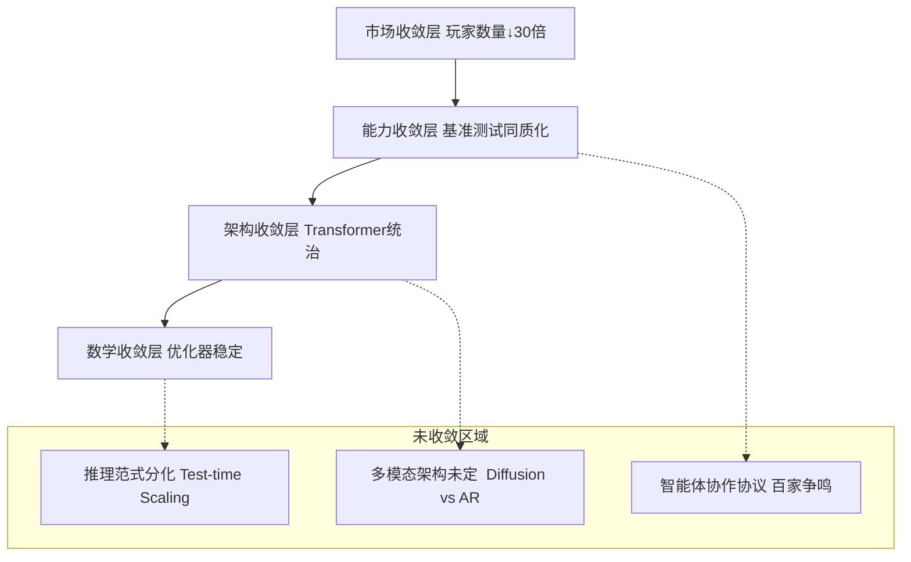
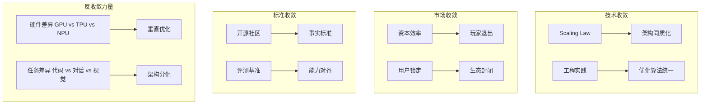
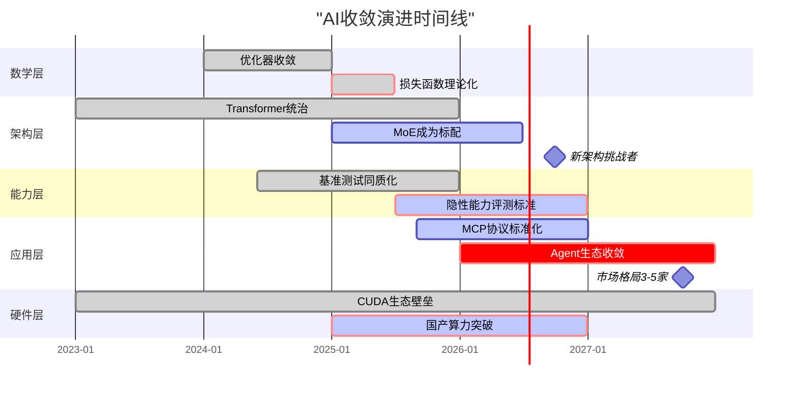

# 03-Scaling Law 与收敛分析

## 一、主题概述

Scaling Law 驱动的"大"与追求理论可控的"收敛"之间的张力是当前 AI 发展的核心矛盾。
2025 年的产业实践显示，**收敛正在发生，但呈现"分层收敛、局部发散"的复杂格局**。
本文档从**数学、架构、能力、市场**四个维度构建收敛模型分类体系。

---

## 二、目录

- [03-Scaling Law 与收敛分析](#03-scaling-law-与收敛分析)
  - [一、主题概述](#一主题概述)
  - [二、目录](#二目录)
  - [三、主题结构](#三主题结构)
    - [03.1-收敛模型分类](#031-收敛模型分类)
    - [03.2-收敛层次分析](#032-收敛层次分析)
    - [03.3-收敛驱动力](#033-收敛驱动力)
    - [03.4-收敛时间表](#034-收敛时间表)
  - [三、收敛的四层金字塔模型](#三收敛的四层金字塔模型)
  - [四、收敛模型分类矩阵](#四收敛模型分类矩阵)
    - [按收敛程度的四维分类](#按收敛程度的四维分类)
  - [五、收敛层次分析（信通院 2025 框架）](#五收敛层次分析信通院-2025-框架)
  - [六、收敛驱动力分析](#六收敛驱动力分析)
    - [按"收敛驱动力"分类](#按收敛驱动力分类)
  - [七、收敛时间表](#七收敛时间表)
    - [2025-2027 预测](#2025-2027-预测)
  - [八、核心结论](#八核心结论)
  - [九、相关主题](#九相关主题)
  - [十、参考文档](#十参考文档)

---

## 三、主题结构

### 03.1-收敛模型分类

- [03.1.1-L4: 完全收敛（工业标准）](03.1.1-L4-完全收敛（工业标准）.md)
- [03.1.2-L3: 准收敛（事实垄断）](03.1.2-L3-准收敛（事实垄断）.md)
- [03.1.3-L2: 收敛进行时（双寡头竞争）](03.1.3-L2-收敛进行时（双寡头竞争）.md)
- [03.1.4-L1: 未收敛（百家争鸣）](03.1.4-L1-未收敛（百家争鸣）.md)
- [03.1.5-L0: 反向分化（场景撕裂）](03.1.5-L0-反向分化（场景撕裂）.md)

### 03.2-收敛层次分析

- [03.2.1-数学层收敛](03.2.1-数学层收敛.md)
- [03.2.2-架构层收敛](03.2.2-架构层收敛.md)
- [03.2.3-能力层收敛](03.2.3-能力层收敛.md)
- [03.2.4-应用层收敛](03.2.4-应用层收敛.md)
- [03.2.5-硬件层收敛](03.2.5-硬件层收敛.md)

### 03.3-收敛驱动力

- [03.3.1-技术收敛驱动力](03.3.1-技术收敛驱动力.md)
- [03.3.2-市场收敛驱动力](03.3.2-市场收敛驱动力.md)
- [03.3.3-标准收敛驱动力](03.3.3-标准收敛驱动力.md)
- [03.3.4-反收敛力量](03.3.4-反收敛力量.md)

### 03.4-收敛时间表

- [03.4.1-2025-2026 预测](03.4.1-2025-2026预测.md)
- [03.4.2-2026-2027 预测](03.4.2-2026-2027预测.md)
- [03.4.3-长期趋势分析](03.4.3-长期趋势分析.md)

---

## 三、收敛的四层金字塔模型

**分层解读**：

- **底层数学收敛**：训练稳定性已解决（AdamW+Warmup）
- **中层架构收敛**：Transformer 成为事实标准，但 MoE、Diffusion 在挑战
- **上层能力收敛**：头部模型在 MMLU 等基准上差异<5%，但**隐性能力**差异巨大
- **顶层市场收敛**：从 2023 年 200+玩家收敛至 2025 年 15 家主流

---

## 四、收敛模型分类矩阵

### 按收敛程度的四维分类

| 收敛层级                          | 分类标准                          | 代表技术/产品                                                                               | 收敛度 | 确定性 | 争议焦点                                  |
| --------------------------------- | --------------------------------- | ------------------------------------------------------------------------------------------- | ------ | ------ | ----------------------------------------- |
| **L4: 完全收敛** （工业标准）     | 无有效替代方案，放弃研究其他路径  | **注意力机制** **预训练-微调范式** **AdamW 优化器**                                         | 95%    | ★★★★★  | 无，已成为"公共知识"                      |
| **L3: 准收敛** （事实垄断）       | 90%以上新产品采用，但理论挑战存在 | **Decoder-only 架构** **RLHF 对齐** **Tokenization**                                        | 85%    | ★★★★☆  | 效率瓶颈（二次方复杂度）                  |
| **L2: 收敛进行时** （双寡头竞争） | 两种方案并存，各有优劣，未分胜负  | **MoE vs Dense** **长上下文（128K+）vs RAG**                                                | 60%    | ★★★☆☆  | MoE 的动态路由稳定性                      |
| **L1: 未收敛** （百家争鸣）       | >3 种方案，无明确领导者，快速迭代 | **推理机制** （CoT vs 隐式推理 vs System 1/2） **多模态融合** （Diffusion vs AR vs Hybrid） | 30%    | ★★☆☆☆  | Test-time compute 的 Scaling Law 是否成立 |
| **L0: 反向分化** （场景撕裂）     | 不同场景催生出完全不同的架构      | **端侧模型** （量化+蒸馏） vs **云端模型** **代码模型** （超长上下文） vs **通用模型**      | 10%    | ★☆☆☆☆  | 统一架构 vs 垂直优化                      |

---

## 五、收敛层次分析（信通院 2025 框架）

| **收敛层次**                | **技术表现**               | **市场格局**                           | **可预测性**                     | **改进空间**                   |
| --------------------------- | -------------------------- | -------------------------------------- | -------------------------------- | ------------------------------ |
| **基础架构层** （已收敛）   | Transformer 一统天下       | 框架 PyTorch/TensorFlow 双寡头         | ★★★★★ 成本可精确估算             | 量子化突破（如光子计算）       |
| **训练范式层** （准收敛）   | 预训练 →SFT→RLHF 三段式    | 数据工程服务商涌现                     | ★★★★☆ 时间可预测（±30%）         | RLHF 理论化（当前是经验）      |
| **能力表现层** （表象收敛） | MMLU 得分差异<5%           | 头部 6 家垄断 95%市场                  | ★★★☆☆ 分数可预测，实用性不可预测 | **隐性能力挖掘**（如因果推理） |
| **应用协议层** （未收敛）   | **MCP/Agent 协议百家争鸣** | 智能体平台混战（LangGraph/AutoGen 等） | ★★☆☆☆ 生态不确定性高             | 2026-2027 年预计收敛           |
| **硬件适配层** （反向分化） | **CUDA 生态 vs 国产算力**  | 供应链撕裂                             | ★☆☆☆☆ 地缘政治主导               | 短期无法收敛                   |

---

## 六、收敛驱动力分析

### 按"收敛驱动力"分类

**关键洞察**：2025 年的收敛主要由**市场压力和工程惯性驱动**，而非理论优越性。正如 **IDC 报告**指出："NLP 大模型底层技术能力已趋于收敛"，但这是**资本投入效率**的结果——重复造轮子成本太高，而非 Transformer 证明是最优解。

---

## 七、收敛时间表

### 2025-2027 预测

**关键预测**：

1. **2026 Q2**：**MCP 协议**（Model Context Protocol）将成为 Agent 的事实标准，终结当前协议混战
2. **2026 Q4**：**Test-time Scaling**将证明其 Scaling Law，推理算力需求超过训练算力
3. **2027 Q2**：**自我改进系统**出现首次重大事故，引发监管介入，收敛被迫减速
4. **2027 Q4**：市场收敛至**3-5 家**基础模型提供商，其余转向垂直应用

---

## 八、核心结论

当前 AI 收敛不是**数学最优解**的胜利，而是**工程经济**的胜利：

- **不是**Transformer 比 Diffusion 理论上更优（学术界仍看好 Diffusion 潜力）
- **而是**Transformer 生态太完善（CUDA、PyTorch、人才），**切换成本 > 收益**

**收敛模型的分类原则**：

1. **可工程化程度**：能否标准化、自动化、工具化
2. **资本效率**：单位算力产生的边际效益是否可预测
3. **风险可控性**：失败模式是否可理解、可恢复

**实用建议**：

- **拥抱已收敛层**：直接用 LoRA、QLoRA 等工具，不重复造轮子
- **谨慎参与收敛层**：在 MoE、长上下文领域可投入，但要接受不确定性
- **激进探索未收敛层**：在 Agent 协议、自我改进方向提前卡位，但需小团队快跑

正如**Grok**所言，大模型收敛是"**数学原理、工程巧思和海量数据巧妙结合的结果**"——但 2025 年的我们，更擅长工程和数据，**数学原理仍不完整**。这种"**知其然不知其所以然**"的状态，正是当前 AI 收敛模型的核心特征：它**能用、好用、管用**，但还**说不清为什么**。

---

## 九、相关主题

- [01-AI 三层模型架构](../01-AI三层模型架构/README.md)
- [02-AI 炼金术转化度模型](../02-AI炼金术转化度模型/README.md)
- [05-AI 科学理论](../05-AI科学理论/README.md)
- [07-AI 框架批判与重构](../07-AI框架批判与重构/README.md)：分析收敛模型的局限性，提出相变理论

---

## 十、参考文档

- [Scaling Law 驱动的"大"与追求理论可控的"收敛"之间的张力](../../view/ai_scale_view.md)
