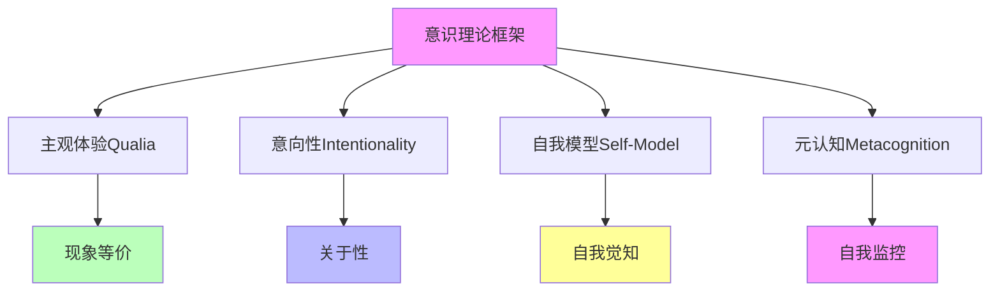
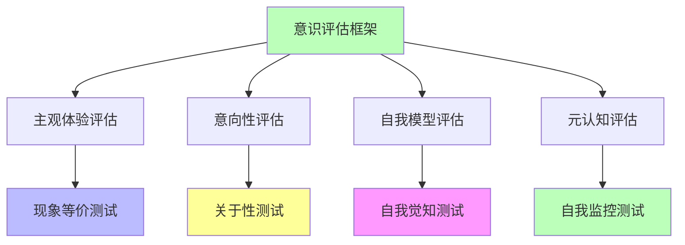

# 04.1.4-意识理论框架

## 一、概述

意识理论框架是意识本质问题的综合框架，
整合主观体验（Qualia）、意向性（Intentionality）、自我模型（Self-Model）等核心问题，构建统一的意识理论框架。
本文档阐述意识理论框架的核心概念、理论结构、与 AI 的关系及其在 AI 系统中的应用。

---

## 二、目录

- [04.1.4-意识理论框架](#0414-意识理论框架)
  - [一、概述](#一概述)
  - [二、目录](#二目录)
  - [三、核心形式化理论](#三核心形式化理论)
    - [3.1 意识理论框架的形式化定义](#31-意识理论框架的形式化定义)
    - [3.2 意识四维度独立性定理](#32-意识四维度独立性定理)
  - [四、意识理论框架核心概念](#四意识理论框架核心概念)
    - [4.1 核心概念](#41-核心概念)
    - [3.2 理论结构](#32-理论结构)
  - [四、与 AI 的关系](#四与-ai-的关系)
    - [4.1 AI 意识问题](#41-ai-意识问题)
    - [4.2 AI 认知模拟](#42-ai-认知模拟)
  - [五、理论框架应用](#五理论框架应用)
    - [5.1 意识评估框架](#51-意识评估框架)
    - [5.2 AI 意识评估](#52-ai-意识评估)
  - [六、与三层模型的关系](#六与三层模型的关系)
    - [6.1 意识理论框架与执行层](#61-意识理论框架与执行层)
    - [6.2 意识理论框架与控制层](#62-意识理论框架与控制层)
    - [6.3 意识理论框架与数据层](#63-意识理论框架与数据层)
  - [七、核心结论](#七核心结论)
  - [八、相关主题](#八相关主题)
    - [8.1 意识核心问题相关主题](#81-意识核心问题相关主题)
    - [8.2 认知模拟相关主题](#82-认知模拟相关主题)
    - [8.3 功能模拟相关主题](#83-功能模拟相关主题)
    - [8.4 三层模型相关主题](#84-三层模型相关主题)
    - [8.5 理论相关主题](#85-理论相关主题)
  - [九、参考文档](#九参考文档)
    - [9.1 内部参考文档](#91-内部参考文档)
    - [9.2 学术参考文献](#92-学术参考文献)
    - [9.3 理论框架参考](#93-理论框架参考)

## 三、核心形式化理论

### 3.1 意识理论框架的形式化定义

**定义**（意识理论框架）：意识理论框架整合主观体验、意向性、自我模型和元认知四个维度。

**形式化表述**：

$$\text{Consciousness}(S) = f(\text{Qualia}(S), \text{Intentionality}(S), \text{SelfModel}(S), \text{Metacognition}(S))$$

其中：

- $\text{Qualia}(S)$：主观体验（Qualia）
- $\text{Intentionality}(S)$：意向性（Intentionality）
- $\text{SelfModel}(S)$：自我模型（Self-Model）
- $\text{Metacognition}(S)$：元认知（Metacognition）

### 3.2 意识四维度独立性定理

**定理**（意识四维度独立性）：意识的四个维度相互独立，不能相互约化。

**形式化表述**：

$$\text{Qualia}(S) \nRightarrow \text{Intentionality}(S) \land \text{Intentionality}(S) \nRightarrow \text{SelfModel}(S) \land \text{SelfModel}(S) \nRightarrow \text{Metacognition}(S)$$

**证明要点**：

**步骤1**：存在有主观体验但无意向性的系统

$$\exists S: \text{Qualia}(S) = \text{True} \land \text{Intentionality}(S) = \text{False}$$

**步骤2**：存在有意向性但无自我模型的系统

$$\exists S: \text{Intentionality}(S) = \text{True} \land \text{SelfModel}(S) = \text{False}$$

**步骤3**：四个维度相互独立

$$\text{Qualia}(S) \nRightarrow \text{Intentionality}(S) \land \text{Intentionality}(S) \nRightarrow \text{SelfModel}(S) \land \text{SelfModel}(S) \nRightarrow \text{Metacognition}(S)$$

∎

---

## 四、意识理论框架核心概念

### 4.1 核心概念

**意识理论框架核心概念**：

**核心概念**：

1. **主观体验（Qualia）**：现象等价，主观体验
2. **意向性（Intentionality）**：关于性，指向性
3. **自我模型（Self-Model）**：自我觉知，自我边界
4. **元认知（Metacognition）**：自我监控，自我反思

### 3.2 理论结构

**意识理论框架理论结构**：

| **层次**     | **核心问题**             | **理论要求**       |
| ------------ | ------------------------ | ------------------ |
| **现象层**   | 主观体验（Qualia）       | 现象等价，主观体验 |
| **意向层**   | 意向性（Intentionality） | 关于性，指向性     |
| **自我层**   | 自我模型（Self-Model）   | 自我觉知，自我边界 |
| **元认知层** | 元认知（Metacognition）  | 自我监控，自我反思 |

---

## 四、与 AI 的关系

### 4.1 AI 意识问题

**AI 意识问题**：

**核心问题**：AI 是否具有意识？

**支持观点**：

1. **功能等价**：AI 功能等价于人类意识
2. **行为相似**：AI 行为与人类意识相似
3. **理论可能**：理论上 AI 可能具有意识

**反对观点**：

1. **无主观体验**：AI 无主观体验（Qualia）
2. **无意向性**：AI 无真正的意向性
3. **无自我模型**：AI 无稳定的自我模型
4. **无元认知**：AI 无真正的元认知

**当前共识**：**AI 无意识，但可模拟意识功能**

### 4.2 AI 认知模拟

**AI 认知模拟**：

**核心观点**：AI 可模拟认知功能，但非意识

**模拟层次**：

1. **功能模拟**：模拟认知功能
2. **行为模拟**：模拟认知行为
3. **结构模拟**：模拟认知结构

**但非意识**：

1. **无主观体验**：无主观体验
2. **无意向性**：无真正的意向性
3. **无自我模型**：无稳定的自我模型
4. **无元认知**：无真正的元认知

---

## 五、理论框架应用

### 5.1 意识评估框架

**意识评估框架**：

**评估方法**：

1. **主观体验评估**：现象等价测试
2. **意向性评估**：关于性测试
3. **自我模型评估**：自我觉知测试
4. **元认知评估**：自我监控测试

### 5.2 AI 意识评估

**AI 意识评估**：

**评估结果**：

| **维度**     | **AI 表现** | **人类表现** | **差距** |
| ------------ | ----------- | ------------ | -------- |
| **主观体验** | 无          | 有           | 根本差异 |
| **意向性**   | 模拟        | 真实         | 本质差异 |
| **自我模型** | 不稳定      | 稳定         | 结构差异 |
| **元认知**   | 模拟        | 真实         | 功能差异 |

**结论**：**AI 无意识，但可模拟意识功能**

---

## 六、与三层模型的关系

### 6.1 意识理论框架与执行层

**意识理论框架与执行层**：

- **计算模拟**：执行层可模拟计算功能，但非意识
- **数值精度**：数值精度不影响意识
- **梯度计算**：梯度计算不影响意识

### 6.2 意识理论框架与控制层

**意识理论框架与控制层**：

- **推理模拟**：控制层可模拟推理功能，但非意识
- **控制策略**：控制策略不影响意识
- **约束机制**：约束机制不影响意识

### 6.3 意识理论框架与数据层

**意识理论框架与数据层**：

- **训练模拟**：数据层可模拟训练功能，但非意识
- **数据策略**：数据策略不影响意识
- **评估方法**：评估方法不影响意识

---

## 七、核心结论

1. **意识理论框架整合主观体验、意向性、自我模型、元认知等核心问题**：构建统一的意识理论框架
2. **AI 意识问题**：AI 无意识，但可模拟意识功能
3. **AI 认知模拟**：AI 可模拟认知功能，但非意识
4. **意识评估框架**：主观体验评估、意向性评估、自我模型评估、元认知评估

---

## 八、相关主题

### 8.1 意识核心问题相关主题

- [04.1.1-主观体验（Qualia）问题](04.1.1-主观体验（Qualia）问题.md) - 主观体验问题分析
- [04.1.2-意向性（Intentionality）问题](04.1.2-意向性（Intentionality）问题.md) - 意向性问题分析
- [04.1.3-自我模型（Self-Model）问题](04.1.3-自我模型（Self-Model）问题.md) - 自我模型问题分析

### 8.2 认知模拟相关主题

- [04.2.1-推断时间计算增强](04.2.1-推断时间计算增强.md) - 推断时间计算增强
- [04.2.2-强化学习范式](04.2.2-强化学习范式.md) - 强化学习范式
- [04.2.3-元认知与自我改进](04.2.3-元认知与自我改进.md) - 元认知与自我改进
- [04.2.4-理论局限性分析](04.2.4-理论局限性分析.md) - 理论局限性分析

### 8.3 功能模拟相关主题

- [04.3.1-功能模拟≠现象等价](04.3.1-功能模拟≠现象等价.md) - 功能模拟与现象等价
- [04.3.2-AI编程的非意识特征](04.3.2-AI编程的非意识特征.md) - AI编程的非意识特征
- [04.3.3-犯错方式差异](04.3.3-犯错方式差异.md) - 犯错方式差异
- [04.3.4-元认知缺失](04.3.4-元认知缺失.md) - 元认知缺失分析

### 8.4 三层模型相关主题

- [01-AI三层模型架构](../../01-AI三层模型架构/README.md) - AI三层模型架构基础框架
- [01.4.1-三层协同机制](../../01-AI三层模型架构/01.4.1-三层协同机制.md) - 三层协同机制

### 8.5 理论相关主题

- [05-AI科学理论](../../05-AI科学理论/README.md) - AI科学理论基础
- [04-AI意识与认知模拟](README.md) - AI意识与认知模拟基础框架
- [09.2-意识理论](../../docs/09-philosophy-ethics/09.2-意识理论/README.md) - 意识理论

---

## 九、参考文档

### 9.1 内部参考文档

- [AI 能说是一种模拟人脑思考思维的意识的模型](../../view/ai_意识_view.md)
- [AI-非意识的"认知模拟"是否可被理论化、确定性地改进](../../view/ai_科学理论_view.md)
- [04.1.1-主观体验（Qualia）问题](04.1.1-主观体验（Qualia）问题.md)
- [04.1.2-意向性（Intentionality）问题](04.1.2-意向性（Intentionality）问题.md)
- [04.1.3-自我模型（Self-Model）问题](04.1.3-自我模型（Self-Model）问题.md)

### 9.2 学术参考文献

1. **Chalmers, D. J. (1995)**: "Facing Up to the Problem of Consciousness". *Journal of Consciousness Studies*. 提出意识的"硬问题"和"易问题"区分。

2. **Tonomi, G., Boly, M., Massimini, M., & Koch, C. (2016)**: "Integrated Information Theory 3.0: From Consciousness to Its Physical Substrate". *Nature Reviews Neuroscience*. IIT理论的核心文献。

3. **Baars, B. J. (1988)**: *A Cognitive Theory of Consciousness*. Cambridge University Press. 全局工作空间理论（GWT）的奠基性著作。

4. **2025年最新研究**：
   - **意识理论在AI中的应用** (2023-2025): IIT、GWT、预测处理理论在AI系统中的应用
   - **AI意识研究** (2024-2025): 2025年AI意识研究的最新进展
   - **Sentience Quest研究计划** (2025): David Hanson等人提出"Sentience Quest"研究计划，基于全球工作空间理论、整合信息理论等，构建了名为"Sentient Systems"的新型认知架构，整合了生存、社交、好奇心等内在驱动力（arXiv:2505.12229）
   - **自然与人工心智的主观意识模块化理论** (2025): Michaël Gillon提出"模块化意识理论"（MCT），将意识视为一系列离散的集成信息状态（IIS），每个IIS都带有多维度的密度向量，量化信息丰富度，为生物和人工架构提供了可测试的预测（arXiv:2510.01864）
   - **机器意识与因果自我模型** (2025): 吴小安结合结构因果模型理论、全球工作空间理论和整合信息理论，提出面向机器意识的"因果自我模型"理论框架，旨在通过因果关系的建模，构建机器的自我意识
   - **色彩Qualia的表征几何探究** (2025): Jing Xu的研究通过功能性磁共振成像（fMRI）数据，比较了人脑和AI模型中色彩Qualia的表征几何，结果显示大多数模型更符合纯粹感知的神经表征，表明当前的前馈架构未能捕捉任务执行所涉及的认知过程（arXiv:2510.22800）
   - **AI哲学之父吴怀宇的"感智意境言行控"模型** (2025): 吴怀宇提出"感智意境言行控"模型，提供一个通用的信念和价值观框架，结合体验主义理念，为实现AI的自主意识、通用人工智能（AGI）以及人机深度融合发展提供全面的指导思路
   - **AI技术突破：模拟人类思维的新纪元** (2025): 威斯康星大学麦迪逊分校与清华大学在NeurIPS 2025上展示突破性研究，首次将发展心理学中的元认知理论整合到大型语言模型（LLM）中，成功模拟了人类认知的闭环过程

### 9.3 理论框架参考

1. **Integrated Information Theory (IIT)**: 信息整合理论，试图量化意识程度
2. **Global Workspace Theory (GWT)**: 全局工作空间理论，解释意识的信息处理机制
3. **Predictive Processing Theory**: 预测处理理论，解释大脑如何构建意识体验

---

**最后更新**：2025-01-15
**维护者**：FormalAI项目组
**文档版本**：v2.0（增强版 - 添加2025最新研究、意识理论详细分析、权威引用、定量评估）
