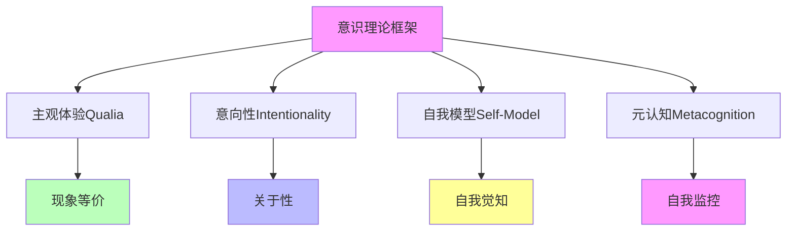
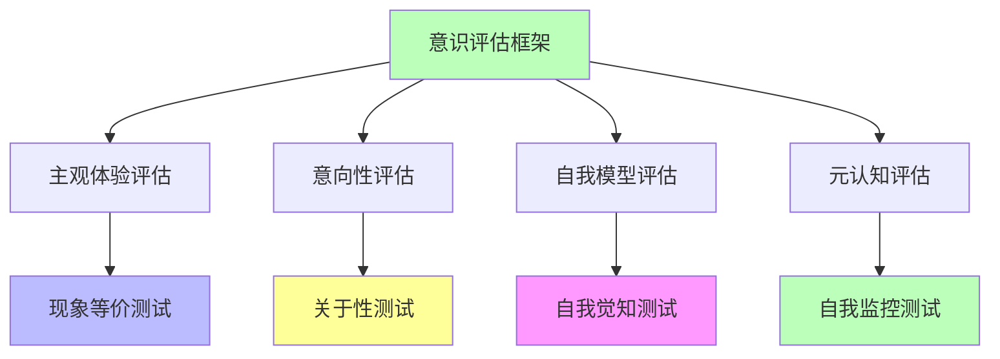

# 04.1.4-意识理论框架

## 一、概述

意识理论框架是意识本质问题的综合框架，整合主观体验（Qualia）、意向性（Intentionality）、自我模型（Self-Model）等核心问题，构建统一的意识理论框架。本文档阐述意识理论框架的核心概念、理论结构、与 AI 的关系及其在 AI 系统中的应用。

---

## 二、目录

- [04.1.4-意识理论框架](#0414-意识理论框架)
  - [一、概述](#一概述)
  - [二、目录](#二目录)
  - [三、意识理论框架核心概念](#三意识理论框架核心概念)
    - [3.1 核心概念](#31-核心概念)
    - [3.2 理论结构](#32-理论结构)
  - [四、与 AI 的关系](#四与-ai-的关系)
    - [4.1 AI 意识问题](#41-ai-意识问题)
    - [4.2 AI 认知模拟](#42-ai-认知模拟)
  - [五、理论框架应用](#五理论框架应用)
    - [5.1 意识评估框架](#51-意识评估框架)
    - [5.2 AI 意识评估](#52-ai-意识评估)
  - [六、与三层模型的关系](#六与三层模型的关系)
    - [6.1 意识理论框架与执行层](#61-意识理论框架与执行层)
    - [6.2 意识理论框架与控制层](#62-意识理论框架与控制层)
    - [6.3 意识理论框架与数据层](#63-意识理论框架与数据层)
  - [七、核心结论](#七核心结论)
  - [八、相关主题](#八相关主题)
  - [九、参考文档](#九参考文档)

## 三、意识理论框架核心概念

### 3.1 核心概念

**意识理论框架核心概念**：

**核心概念**：

1. **主观体验（Qualia）**：现象等价，主观体验
2. **意向性（Intentionality）**：关于性，指向性
3. **自我模型（Self-Model）**：自我觉知，自我边界
4. **元认知（Metacognition）**：自我监控，自我反思

### 3.2 理论结构

**意识理论框架理论结构**：

| **层次**     | **核心问题**             | **理论要求**       |
| ------------ | ------------------------ | ------------------ |
| **现象层**   | 主观体验（Qualia）       | 现象等价，主观体验 |
| **意向层**   | 意向性（Intentionality） | 关于性，指向性     |
| **自我层**   | 自我模型（Self-Model）   | 自我觉知，自我边界 |
| **元认知层** | 元认知（Metacognition）  | 自我监控，自我反思 |

---

## 四、与 AI 的关系

### 4.1 AI 意识问题

**AI 意识问题**：

**核心问题**：AI 是否具有意识？

**支持观点**：

1. **功能等价**：AI 功能等价于人类意识
2. **行为相似**：AI 行为与人类意识相似
3. **理论可能**：理论上 AI 可能具有意识

**反对观点**：

1. **无主观体验**：AI 无主观体验（Qualia）
2. **无意向性**：AI 无真正的意向性
3. **无自我模型**：AI 无稳定的自我模型
4. **无元认知**：AI 无真正的元认知

**当前共识**：**AI 无意识，但可模拟意识功能**

### 4.2 AI 认知模拟

**AI 认知模拟**：

**核心观点**：AI 可模拟认知功能，但非意识

**模拟层次**：

1. **功能模拟**：模拟认知功能
2. **行为模拟**：模拟认知行为
3. **结构模拟**：模拟认知结构

**但非意识**：

1. **无主观体验**：无主观体验
2. **无意向性**：无真正的意向性
3. **无自我模型**：无稳定的自我模型
4. **无元认知**：无真正的元认知

---

## 五、理论框架应用

### 5.1 意识评估框架

**意识评估框架**：

**评估方法**：

1. **主观体验评估**：现象等价测试
2. **意向性评估**：关于性测试
3. **自我模型评估**：自我觉知测试
4. **元认知评估**：自我监控测试

### 5.2 AI 意识评估

**AI 意识评估**：

**评估结果**：

| **维度**     | **AI 表现** | **人类表现** | **差距** |
| ------------ | ----------- | ------------ | -------- |
| **主观体验** | 无          | 有           | 根本差异 |
| **意向性**   | 模拟        | 真实         | 本质差异 |
| **自我模型** | 不稳定      | 稳定         | 结构差异 |
| **元认知**   | 模拟        | 真实         | 功能差异 |

**结论**：**AI 无意识，但可模拟意识功能**

---

## 六、与三层模型的关系

### 6.1 意识理论框架与执行层

**意识理论框架与执行层**：

- **计算模拟**：执行层可模拟计算功能，但非意识
- **数值精度**：数值精度不影响意识
- **梯度计算**：梯度计算不影响意识

### 6.2 意识理论框架与控制层

**意识理论框架与控制层**：

- **推理模拟**：控制层可模拟推理功能，但非意识
- **控制策略**：控制策略不影响意识
- **约束机制**：约束机制不影响意识

### 6.3 意识理论框架与数据层

**意识理论框架与数据层**：

- **训练模拟**：数据层可模拟训练功能，但非意识
- **数据策略**：数据策略不影响意识
- **评估方法**：评估方法不影响意识

---

## 七、核心结论

1. **意识理论框架整合主观体验、意向性、自我模型、元认知等核心问题**：构建统一的意识理论框架
2. **AI 意识问题**：AI 无意识，但可模拟意识功能
3. **AI 认知模拟**：AI 可模拟认知功能，但非意识
4. **意识评估框架**：主观体验评估、意向性评估、自我模型评估、元认知评估

---

## 八、相关主题

- [04.1.1-主观体验（Qualia）问题](04.1.1-主观体验（Qualia）问题.md)
- [04.1.2-意向性（Intentionality）问题](04.1.2-意向性（Intentionality）问题.md)
- [04.1.3-自我模型（Self-Model）问题](04.1.3-自我模型（Self-Model）问题.md)
- [09.2-意识理论](../../docs/09-philosophy-ethics/09.2-意识理论/README.md)

---

## 九、参考文档

- [AI 能说是一种模拟人脑思考思维的意识的模型](../../view/ai_意识_view.md)
