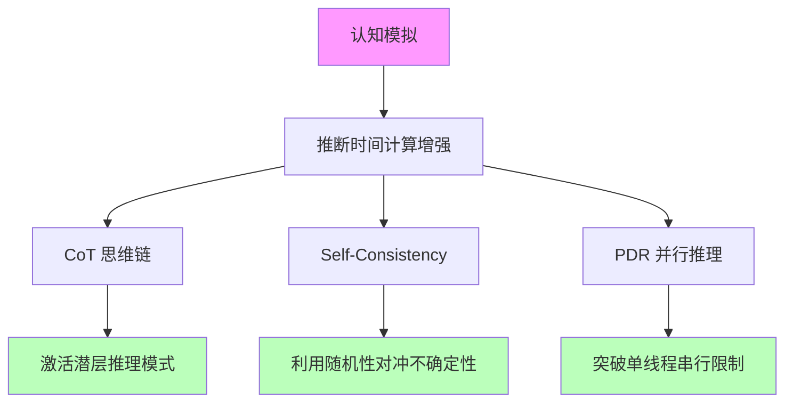
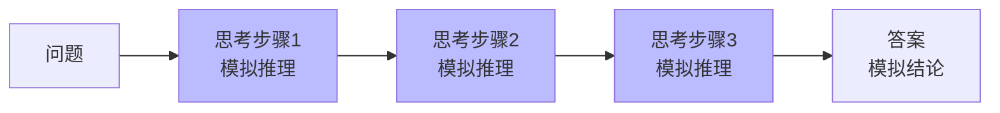
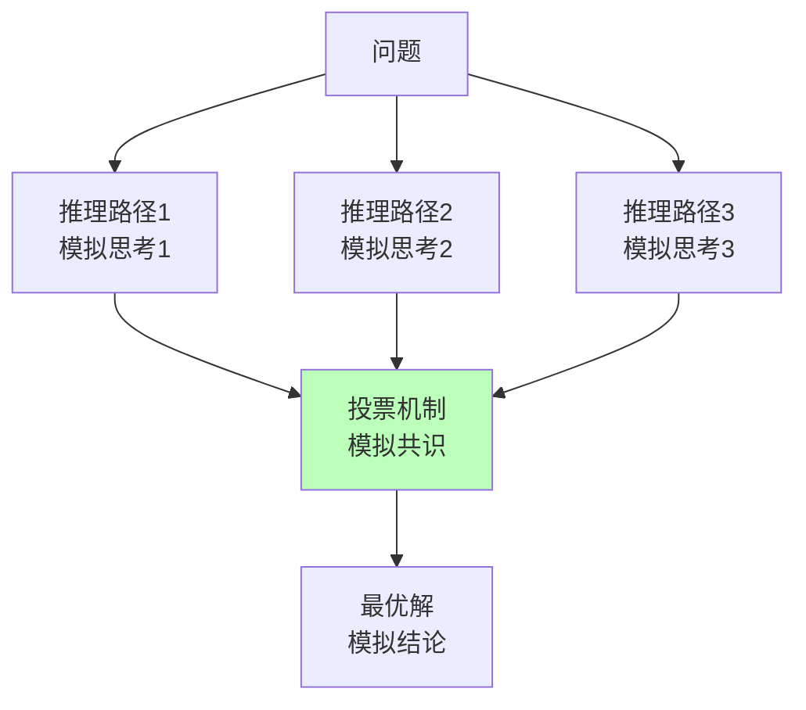
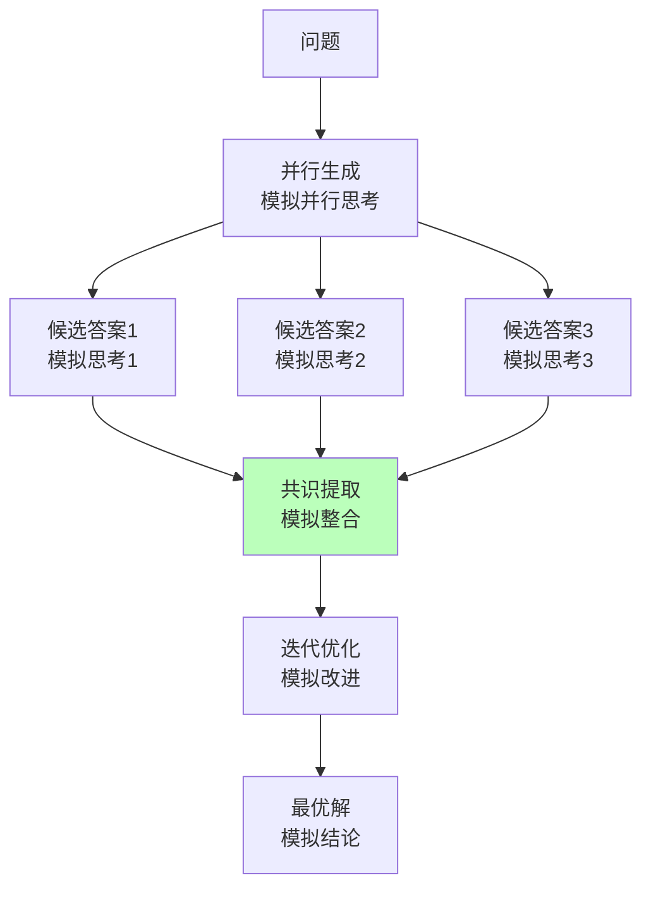

# 04.2.1-推断时间计算增强

## 一、概述

推断时间计算增强（Inference-Time Scaling）是认知模拟理论化的核心技术之一，通过增加推理时的计算资源（更多 token、多次采样）激发模型的潜在能力，而不改变模型权重。本文档阐述推断时间计算增强在认知模拟中的应用及其理论意义。

---

## 二、目录

- [04.2.1-推断时间计算增强](#0421-推断时间计算增强)
  - [一、概述](#一概述)
  - [二、目录](#二目录)
  - [三、推断时间计算增强与认知模拟](#三推断时间计算增强与认知模拟)
    - [2.1 理论核心](#21-理论核心)
    - [2.2 认知模拟意义](#22-认知模拟意义)
  - [四、CoT 与认知模拟](#四cot-与认知模拟)
    - [3.1 CoT 的认知模拟](#31-cot-的认知模拟)
    - [3.2 CoT 的认知意义](#32-cot-的认知意义)
  - [五、Self-Consistency 与认知模拟](#五self-consistency-与认知模拟)
    - [4.1 Self-Consistency 的认知模拟](#41-self-consistency-的认知模拟)
    - [4.2 Self-Consistency 的认知意义](#42-self-consistency-的认知意义)
  - [六、PDR 与认知模拟](#六pdr-与认知模拟)
    - [5.1 PDR 的认知模拟](#51-pdr-的认知模拟)
    - [5.2 PDR 的认知意义](#52-pdr-的认知意义)
  - [七、推断时间计算增强的认知模拟局限](#七推断时间计算增强的认知模拟局限)
    - [6.1 理论局限](#61-理论局限)
    - [6.2 认知模拟局限](#62-认知模拟局限)
  - [八、与三层模型的关系](#八与三层模型的关系)
    - [7.1 控制层 → 数据层](#71-控制层--数据层)
    - [7.2 数据层 → 执行层](#72-数据层--执行层)
    - [7.3 执行层 → 控制层](#73-执行层--控制层)
  - [九、核心结论](#九核心结论)
  - [十、相关主题](#十相关主题)
  - [十一、参考文档](#十一参考文档)

## 三、推断时间计算增强与认知模拟

### 2.1 理论核心

**推断时间计算增强的理论核心**：**思维即计算，计算可换性能**

**在认知模拟中的应用**：

**核心观点**：

- **计算资源**：增加推理时的计算资源可提升认知能力
- **不改变权重**：无需重新训练模型
- **激发潜力**：通过计算激发模型的潜在认知能力

### 2.2 认知模拟意义

**推断时间计算增强的认知模拟意义**：

1. **模拟推理过程**：CoT 模拟人类推理过程
2. **模拟不确定性**：Self-Consistency 模拟人类不确定性
3. **模拟并行思考**：PDR 模拟人类并行思考

---

## 四、CoT 与认知模拟

### 3.1 CoT 的认知模拟

**CoT（Chain of Thought）的认知模拟**：

**核心思想**：强制模型生成中间步骤，模拟人类推理过程

**认知模拟流程**：

**认知模拟特征**：

1. **显式推理**：显式生成推理步骤
2. **可解释性**：推理过程可解释
3. **可验证性**：推理步骤可验证

### 3.2 CoT 的认知意义

**CoT 的认知意义**：

- **模拟工作记忆**：中间步骤模拟工作记忆
- **模拟推理过程**：推理步骤模拟人类推理过程
- **模拟元认知**：推理过程模拟元认知

**但非意识**：

- **无主观体验**：推理过程无主观体验
- **无自我觉知**：推理过程无自我觉知
- **无内在动机**：推理过程无内在动机

---

## 五、Self-Consistency 与认知模拟

### 4.1 Self-Consistency 的认知模拟

**Self-Consistency 的认知模拟**：

**核心思想**：对同一问题采样多条推理路径，模拟人类不确定性

**认知模拟流程**：

**认知模拟特征**：

1. **不确定性**：模拟人类不确定性
2. **共识机制**：投票机制模拟共识
3. **鲁棒性**：利用随机性对冲不确定性

### 4.2 Self-Consistency 的认知意义

**Self-Consistency 的认知意义**：

- **模拟不确定性**：多条路径模拟人类不确定性
- **模拟共识**：投票机制模拟人类共识
- **模拟鲁棒性**：随机性模拟人类鲁棒性

**但非意识**：

- **无主观体验**：不确定性无主观体验
- **无自我觉知**：共识无自我觉知
- **无内在动机**：鲁棒性无内在动机

---

## 六、PDR 与认知模拟

### 5.1 PDR 的认知模拟

**PDR（Parallel-Draft-Refine）的认知模拟**：

**核心思想**：并行生成多个候选答案，模拟人类并行思考

**认知模拟流程**：

**认知模拟特征**：

1. **并行思考**：模拟人类并行思考
2. **共识提取**：模拟人类整合过程
3. **迭代优化**：模拟人类改进过程

### 5.2 PDR 的认知意义

**PDR 的认知意义**：

- **模拟并行思考**：并行生成模拟人类并行思考
- **模拟整合**：共识提取模拟人类整合过程
- **模拟改进**：迭代优化模拟人类改进过程

**但非意识**：

- **无主观体验**：并行思考无主观体验
- **无自我觉知**：整合无自我觉知
- **无内在动机**：改进无内在动机

---

## 七、推断时间计算增强的认知模拟局限

### 6.1 理论局限

**推断时间计算增强的认知模拟局限**：

| **维度**     | **特征**         | **局限**                       |
| ------------ | ---------------- | ------------------------------ |
| **确定性**   | 弱               | 更像启发式策略，无严格收敛保证 |
| **任务依赖** | 效果依赖任务类型 | 跨任务失效                     |
| **随机性**   | 采样引入随机性   | 结果不确定                     |
| **可预测性** | 效果不可预测     | 无理论保证                     |

### 6.2 认知模拟局限

**推断时间计算增强的认知模拟局限**：

1. **无主观体验**：推理过程无主观体验
2. **无自我觉知**：推理过程无自我觉知
3. **无内在动机**：推理过程无内在动机
4. **无元认知**：推理过程无元认知

---

## 八、与三层模型的关系

### 7.1 控制层 → 数据层

- **CoT 模板**：控制层生成 CoT 模板
- **采样策略**：控制层控制采样策略
- **投票机制**：控制层实现投票机制

### 7.2 数据层 → 执行层

- **概率采样**：数据层进行概率采样
- **并行推理**：数据层并行生成多个候选
- **共识提取**：数据层提取共识

### 7.3 执行层 → 控制层

- **计算资源**：执行层提供计算资源
- **延迟约束**：执行层延迟限制计算复杂度
- **成本反馈**：执行层成本影响计算策略

---

## 九、核心结论

1. **推断时间计算增强是认知模拟的核心技术**：通过计算激发模型认知能力
2. **CoT、Self-Consistency、PDR**：模拟人类推理、不确定性、并行思考
3. **但非意识**：推理过程无主观体验、无自我觉知、无内在动机
4. **理论局限**：确定性弱，更像启发式策略

---

## 十、相关主题

- [04.2.2-强化学习范式](04.2.2-强化学习范式.md)
- [04.2.3-元认知与自我改进](04.2.3-元认知与自我改进.md)
- [05.1.1-推断时间计算增强](../05-AI科学理论/05.1.1-推断时间计算增强.md)

---

## 十一、参考文档

- [AI-非意识的"认知模拟"是否可被理论化、确定性地改进](../../view/ai_科学理论_view.md)
- [AI 能说是一种模拟人脑思考思维的意识的模型](../../view/ai_意识_view.md)
