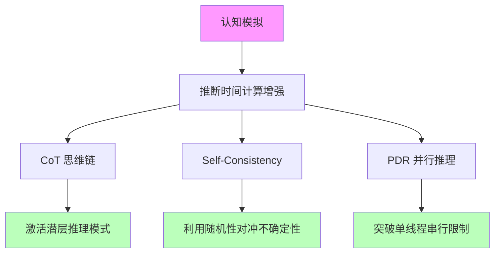
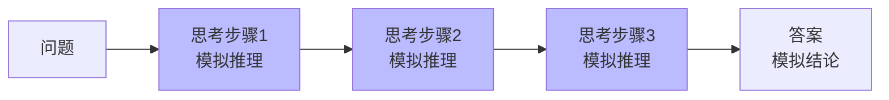
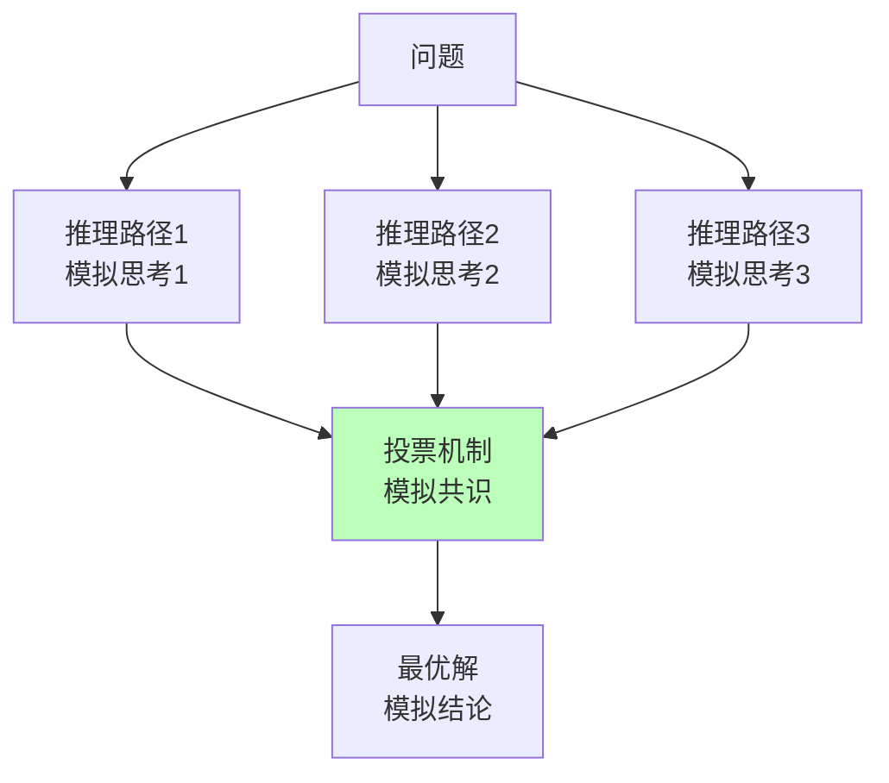
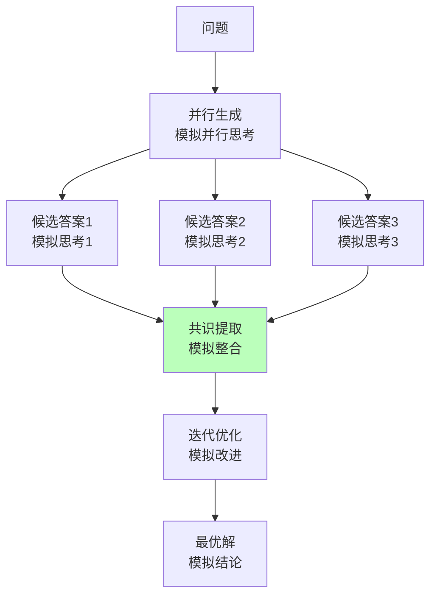

# 04.2.1-推断时间计算增强

## 一、概述

推断时间计算增强（Inference-Time Scaling）是认知模拟理论化的核心技术之一，
通过增加推理时的计算资源（更多 token、多次采样）激发模型的潜在能力，而不改变模型权重。
本文档阐述推断时间计算增强在认知模拟中的应用及其理论意义。

---

## 二、目录

- [04.2.1-推断时间计算增强](#0421-推断时间计算增强)
  - [一、概述](#一概述)
  - [二、目录](#二目录)
  - [三、推断时间计算增强与认知模拟](#三推断时间计算增强与认知模拟)
    - [2.1 理论核心](#21-理论核心)
    - [2.2 认知模拟意义](#22-认知模拟意义)
  - [四、CoT 与认知模拟](#四cot-与认知模拟)
    - [3.1 CoT 的认知模拟](#31-cot-的认知模拟)
    - [3.2 CoT 的认知意义](#32-cot-的认知意义)
  - [五、Self-Consistency 与认知模拟](#五self-consistency-与认知模拟)
    - [4.1 Self-Consistency 的认知模拟](#41-self-consistency-的认知模拟)
    - [4.2 Self-Consistency 的认知意义](#42-self-consistency-的认知意义)
  - [六、PDR 与认知模拟](#六pdr-与认知模拟)
    - [5.1 PDR 的认知模拟](#51-pdr-的认知模拟)
    - [5.2 PDR 的认知意义](#52-pdr-的认知意义)
  - [七、2025 年最新推断时间计算增强技术](#七2025-年最新推断时间计算增强技术)
    - [7.1 Test-time Compute](#71-test-time-compute)
    - [7.2 动态推理深度](#72-动态推理深度)
    - [7.3 过程奖励模型（PRM）](#73-过程奖励模型prm)
    - [7.4 元思维链（Meta-CoT）](#74-元思维链meta-cot)
    - [7.5 2025 年推断时间计算增强技术对比](#75-2025-年推断时间计算增强技术对比)
  - [八、推断时间计算增强的认知模拟局限](#八推断时间计算增强的认知模拟局限)
    - [8.1 理论局限](#81-理论局限)
    - [8.2 认知模拟局限](#82-认知模拟局限)
  - [九、与三层模型的关系](#九与三层模型的关系)
    - [9.1 控制层 → 数据层](#91-控制层-数据层)
    - [9.2 数据层 → 执行层](#92-数据层-执行层)
    - [9.3 执行层 → 控制层](#93-执行层-控制层)
  - [十、核心结论](#十核心结论)
  - [十一、相关主题](#十一相关主题)
  - [十二、参考文档](#十二参考文档)

## 三、推断时间计算增强与认知模拟

### 2.1 理论核心

**推断时间计算增强的理论核心**：**思维即计算，计算可换性能**

**在认知模拟中的应用**：

**核心观点**：

- **计算资源**：增加推理时的计算资源可提升认知能力
- **不改变权重**：无需重新训练模型
- **激发潜力**：通过计算激发模型的潜在认知能力

### 2.2 认知模拟意义

**推断时间计算增强的认知模拟意义**：

1. **模拟推理过程**：CoT 模拟人类推理过程
2. **模拟不确定性**：Self-Consistency 模拟人类不确定性
3. **模拟并行思考**：PDR 模拟人类并行思考

---

## 四、CoT 与认知模拟

### 3.1 CoT 的认知模拟

**CoT（Chain of Thought）的认知模拟**：

**核心思想**：强制模型生成中间步骤，模拟人类推理过程

**认知模拟流程**：

**认知模拟特征**：

1. **显式推理**：显式生成推理步骤
2. **可解释性**：推理过程可解释
3. **可验证性**：推理步骤可验证

### 3.2 CoT 的认知意义

**CoT 的认知意义**：

- **模拟工作记忆**：中间步骤模拟工作记忆
- **模拟推理过程**：推理步骤模拟人类推理过程
- **模拟元认知**：推理过程模拟元认知

**但非意识**：

- **无主观体验**：推理过程无主观体验
- **无自我觉知**：推理过程无自我觉知
- **无内在动机**：推理过程无内在动机

---

## 五、Self-Consistency 与认知模拟

### 4.1 Self-Consistency 的认知模拟

**Self-Consistency 的认知模拟**：

**核心思想**：对同一问题采样多条推理路径，模拟人类不确定性

**认知模拟流程**：

**认知模拟特征**：

1. **不确定性**：模拟人类不确定性
2. **共识机制**：投票机制模拟共识
3. **鲁棒性**：利用随机性对冲不确定性

### 4.2 Self-Consistency 的认知意义

**Self-Consistency 的认知意义**：

- **模拟不确定性**：多条路径模拟人类不确定性
- **模拟共识**：投票机制模拟人类共识
- **模拟鲁棒性**：随机性模拟人类鲁棒性

**但非意识**：

- **无主观体验**：不确定性无主观体验
- **无自我觉知**：共识无自我觉知
- **无内在动机**：鲁棒性无内在动机

---

## 六、PDR 与认知模拟

### 5.1 PDR 的认知模拟

**PDR（Parallel-Draft-Refine）的认知模拟**：

**核心思想**：并行生成多个候选答案，模拟人类并行思考

**认知模拟流程**：

**认知模拟特征**：

1. **并行思考**：模拟人类并行思考
2. **共识提取**：模拟人类整合过程
3. **迭代优化**：模拟人类改进过程

### 5.2 PDR 的认知意义

**PDR 的认知意义**：

- **模拟并行思考**：并行生成模拟人类并行思考
- **模拟整合**：共识提取模拟人类整合过程
- **模拟改进**：迭代优化模拟人类改进过程

**但非意识**：

- **无主观体验**：并行思考无主观体验
- **无自我觉知**：整合无自我觉知
- **无内在动机**：改进无内在动机

---

## 七、2025 年最新推断时间计算增强技术

### 7.1 Test-time Compute

**Test-time Compute（推理时计算扩展）**：

**核心思想**：在推理时动态扩展计算资源，不改变模型权重即可提升能力

**技术特点**：

1. **动态计算扩展**：根据问题复杂度动态调整计算资源
2. **无需重新训练**：无需重新训练模型，即可提升能力
3. **推理能力提升**：推理能力显著提升，支持复杂推理任务

**2025 应用**：

- **OpenAI o1**：通过 Test-time compute 提升推理能力，支持复杂推理任务
- **DeepSeek-R1**：通过 Test-time compute 提升推理能力，推理速度提升 3x

**认知模拟意义**：

- **模拟深度思考**：动态计算扩展模拟人类深度思考
- **模拟自适应推理**：根据问题复杂度自适应调整推理深度
- **模拟推理能力提升**：推理能力提升模拟人类学习过程

**但非意识**：

- **无主观体验**：推理过程无主观体验
- **无自我觉知**：推理过程无自我觉知
- **无内在动机**：推理过程无内在动机

### 7.2 动态推理深度

**动态推理深度（Dynamic Reasoning Depth）**：

**核心思想**：根据问题复杂度自适应调整推理深度

**技术特点**：

1. **自适应推理深度**：根据问题复杂度自适应调整推理深度
2. **推理效率提升**：简单问题快速推理，复杂问题深度推理
3. **推理能力提升**：推理能力显著提升，支持复杂推理任务

**2025 应用**：

- **OpenAI o1**：通过动态推理深度提升推理能力，支持复杂推理任务
- **DeepSeek-R1**：通过动态推理深度提升推理能力，推理速度提升 3x

**认知模拟意义**：

- **模拟自适应推理**：根据问题复杂度自适应调整推理深度
- **模拟推理效率**：简单问题快速推理，复杂问题深度推理
- **模拟推理能力提升**：推理能力提升模拟人类学习过程

**但非意识**：

- **无主观体验**：推理过程无主观体验
- **无自我觉知**：推理过程无自我觉知
- **无内在动机**：推理过程无内在动机

### 7.3 过程奖励模型（PRM）

**过程奖励模型（Process Reward Model, PRM）**：

**核心思想**：奖励推理过程，而非仅奖励最终结果

**技术特点**：

1. **过程奖励**：奖励推理过程，提升可解释性和可控性
2. **可解释性提升**：推理过程可解释，提升可解释性
3. **可控性提升**：推理过程可控，提升可控性

**2025 应用**：

- **清华团队**：通过 PRM 提升推理过程可解释性和可控性
- **研究探索**：PRM 在研究中探索，尚未大规模应用

**认知模拟意义**：

- **模拟过程思考**：过程奖励模拟人类过程思考
- **模拟可解释性**：推理过程可解释模拟人类可解释性
- **模拟可控性**：推理过程可控模拟人类可控性

**但非意识**：

- **无主观体验**：推理过程无主观体验
- **无自我觉知**：推理过程无自我觉知
- **无内在动机**：推理过程无内在动机

### 7.4 元思维链（Meta-CoT）

**元思维链（Meta-CoT）**：

**核心思想**：模拟"如何思考"的元过程，支持回溯与验证

**技术特点**：

1. **元过程模拟**：模拟"如何思考"的元过程
2. **回溯与验证**：支持回溯与验证，提升推理质量
3. **推理质量提升**：推理质量显著提升，支持复杂推理任务

**2025 应用**：

- **研究探索**：Meta-CoT 在研究中探索，尚未大规模应用
- **未来方向**：Meta-CoT 是未来推断时间计算增强的重要方向

**认知模拟意义**：

- **模拟元认知**：元过程模拟模拟人类元认知
- **模拟回溯与验证**：回溯与验证模拟人类回溯与验证
- **模拟推理质量提升**：推理质量提升模拟人类学习过程

**但非意识**：

- **无主观体验**：推理过程无主观体验
- **无自我觉知**：推理过程无自我觉知
- **无内在动机**：推理过程无内在动机

### 7.5 2025 年推断时间计算增强技术对比

**2025 年推断时间计算增强技术对比**：

| **技术**              | **特点**       | **优势**                 | **劣势**         | **2025 应用** |
| --------------------- | -------------- | ------------------------ | ---------------- | ------------- |
| **CoT**               | 思维链推理     | 提升推理能力             | 效果依赖任务类型 | 广泛应用      |
| **Self-Consistency**  | 自我一致性     | 利用随机性对冲不确定性   | 计算成本高       | 广泛应用      |
| **PDR**               | 并行推理       | 突破单线程串行限制       | 计算成本高       | 研究探索      |
| **Test-time Compute** | 推理时计算扩展 | 无需重新训练即可提升能力 | 计算成本高       | OpenAI o1     |
| **动态推理深度**      | 自适应推理深度 | 推理效率提升             | 实现复杂         | OpenAI o1     |
| **PRM**               | 过程奖励模型   | 可解释性和可控性提升     | 标注成本高       | 研究探索      |
| **Meta-CoT**          | 元思维链       | 支持回溯与验证           | 实现复杂         | 研究探索      |

**2025 年推断时间计算增强技术趋势**：

1. **Test-time Compute 成为新重点**：OpenAI o1 通过 Test-time compute 提升推理能力
2. **动态推理深度成为新方向**：根据问题复杂度自适应调整推理深度
3. **过程奖励模型在探索中**：PRM 在研究中探索，尚未大规模应用
4. **元思维链是未来方向**：Meta-CoT 是未来推断时间计算增强的重要方向

---

## 八、推断时间计算增强的认知模拟局限

### 8.1 理论局限

**推断时间计算增强的认知模拟局限**：

| **维度**     | **特征**         | **局限**                       |
| ------------ | ---------------- | ------------------------------ |
| **确定性**   | 弱               | 更像启发式策略，无严格收敛保证 |
| **任务依赖** | 效果依赖任务类型 | 跨任务失效                     |
| **随机性**   | 采样引入随机性   | 结果不确定                     |
| **可预测性** | 效果不可预测     | 无理论保证                     |

### 8.2 认知模拟局限

**推断时间计算增强的认知模拟局限**：

1. **无主观体验**：推理过程无主观体验
2. **无自我觉知**：推理过程无自我觉知
3. **无内在动机**：推理过程无内在动机
4. **无元认知**：推理过程无元认知

---

## 九、与三层模型的关系

### 9.1 控制层 → 数据层

- **CoT 模板**：控制层生成 CoT 模板
- **采样策略**：控制层控制采样策略
- **投票机制**：控制层实现投票机制

### 9.2 数据层 → 执行层

- **概率采样**：数据层进行概率采样
- **并行推理**：数据层并行生成多个候选
- **共识提取**：数据层提取共识

### 9.3 执行层 → 控制层

- **计算资源**：执行层提供计算资源
- **延迟约束**：执行层延迟限制计算复杂度
- **成本反馈**：执行层成本影响计算策略

---

## 十、核心结论

1. **推断时间计算增强是认知模拟的核心技术**：通过计算激发模型认知能力
2. **CoT、Self-Consistency、PDR**：模拟人类推理、不确定性、并行思考
3. **2025 年最新技术**：
   - **Test-time Compute**：推理时计算扩展，无需重新训练即可提升能力
   - **动态推理深度**：根据问题复杂度自适应调整推理深度
   - **过程奖励模型（PRM）**：奖励推理过程，提升可解释性和可控性
   - **元思维链（Meta-CoT）**：模拟"如何思考"的元过程，支持回溯与验证
4. **但非意识**：推理过程无主观体验、无自我觉知、无内在动机
5. **理论局限**：确定性弱，更像启发式策略

---

## 十一、相关主题

- [04.2.2-强化学习范式](04.2.2-强化学习范式.md)
- [04.2.3-元认知与自我改进](04.2.3-元认知与自我改进.md)
- [05.1.1-推断时间计算增强](../05-AI科学理论/05.1.1-推断时间计算增强.md)
- [01.2.2-Prompt 工程与 ReAct 循环](../01-AI三层模型架构/01.2.2-Prompt工程与ReAct循环.md)：Test-time Compute、动态推理深度

---

## 十二、参考文档

- [AI-非意识的"认知模拟"是否可被理论化、确定性地改进](../../view/ai_科学理论_view.md)
- [AI 能说是一种模拟人脑思考思维的意识的模型](../../view/ai_意识_view.md)

------

**最后更新**：2025-01-XX
**维护者**：FormalAI项目组