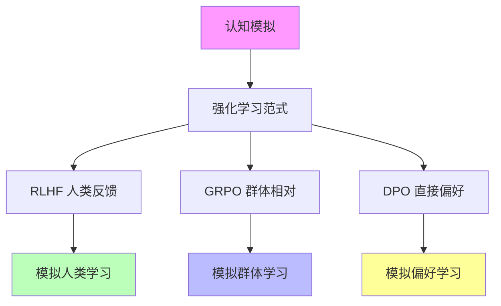
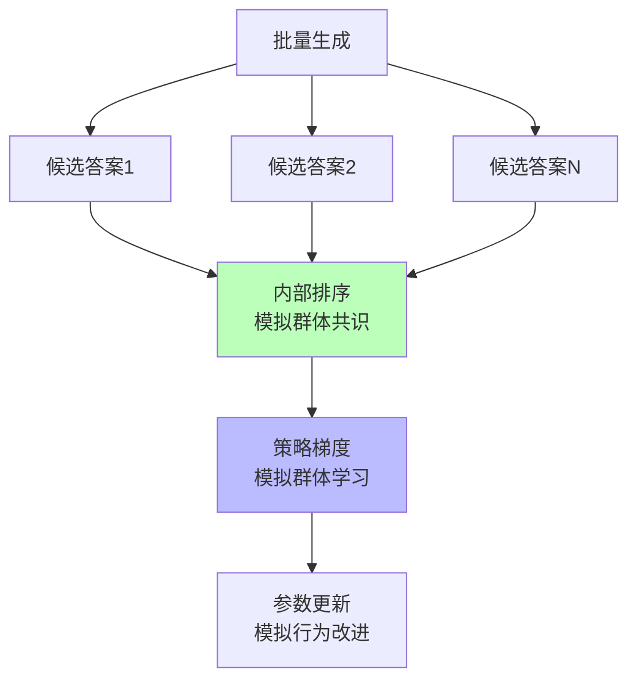

# 04.2.2-强化学习范式

## 一、概述

强化学习范式是认知模拟理论化的核心技术之一，
通过强化学习优化模型行为，实现从"经验试错"（炼金术）向"精密科学"（化学）的转化。
本文档阐述强化学习范式在认知模拟中的应用、理论框架及其在 AI 系统中的应用。

---

## 二、目录

- [04.2.2-强化学习范式](#0422-强化学习范式)
  - [一、概述](#一概述)
  - [二、目录](#二目录)
  - [三、核心形式化理论](#三核心形式化理论)
    - [3.1 强化学习范式的形式化定义](#31-强化学习范式的形式化定义)
    - [3.2 强化学习范式收敛性定理](#32-强化学习范式收敛性定理)
  - [四、强化学习范式与认知模拟](#四强化学习范式与认知模拟)
    - [4.1 理论核心](#41-理论核心)
    - [2.2 认知模拟意义](#22-认知模拟意义)
  - [四、RLHF 与认知模拟](#四rlhf-与认知模拟)
    - [3.1 RLHF 的认知模拟](#31-rlhf-的认知模拟)
    - [3.2 RLHF 的认知意义](#32-rlhf-的认知意义)
  - [五、GRPO 与认知模拟](#五grpo-与认知模拟)
    - [4.1 GRPO 的认知模拟](#41-grpo-的认知模拟)
    - [4.2 GRPO 的认知意义](#42-grpo-的认知意义)
  - [六、DPO 与认知模拟](#六dpo-与认知模拟)
    - [5.1 DPO 的认知模拟](#51-dpo-的认知模拟)
    - [5.2 DPO 的认知意义](#52-dpo-的认知意义)
  - [七、强化学习范式的认知模拟局限](#七强化学习范式的认知模拟局限)
    - [6.1 理论局限](#61-理论局限)
    - [6.2 认知模拟局限](#62-认知模拟局限)
  - [八、2025 年强化学习范式与认知模拟趋势](#八2025-年强化学习范式与认知模拟趋势)
    - [8.1 2025 年强化学习范式特点](#81-2025-年强化学习范式特点)
    - [8.2 2025 年强化学习范式产品案例](#82-2025-年强化学习范式产品案例)
  - [九、与三层模型的关系](#九与三层模型的关系)
    - [9.1 强化学习范式与数据层](#91-强化学习范式与数据层)
    - [9.2 强化学习范式与控制层](#92-强化学习范式与控制层)
  - [十、核心结论](#十核心结论)
  - [十一、相关主题](#十一相关主题)
  - [十二、参考文档](#十二参考文档)
    - [12.1 内部参考文档](#121-内部参考文档)
    - [12.2 学术参考文献](#122-学术参考文献)
    - [12.3 技术文档](#123-技术文档)

## 三、核心形式化理论

### 3.1 强化学习范式的形式化定义

**定义**（强化学习范式）：强化学习范式通过奖励信号优化策略。

**形式化表述**：

$$\pi^* = \arg\max_\pi \mathbb{E}[r(x, y)]$$

其中：

- $\pi$：策略
- $r(x, y)$：奖励函数

### 3.2 强化学习范式收敛性定理

**定理**（强化学习范式收敛性）：在适当条件下，强化学习范式收敛到最优策略。

**形式化表述**：

$$\lim_{t \to \infty} \pi_t = \pi^*$$

**证明要点**：

**步骤1**：策略梯度更新

$$\pi_{t+1} = \pi_t + \eta \nabla \mathbb{E}[r(x, y)]$$

**步骤2**：在适当条件下收敛

$$\lim_{t \to \infty} \pi_t = \pi^*$$

∎

---

## 四、强化学习范式与认知模拟

### 4.1 理论核心

**强化学习范式的理论核心**：**通过奖励信号指导学习，模拟人类学习过程**

**在认知模拟中的应用**：

**核心观点**：

- **奖励信号**：通过奖励信号指导学习，模拟人类学习过程
- **策略优化**：通过策略优化改进行为，模拟人类行为改进
- **行为改进**：通过行为改进提升性能，模拟人类能力提升

### 2.2 认知模拟意义

**强化学习范式的认知模拟意义**：

1. **模拟人类学习**：RLHF 模拟人类学习过程
2. **模拟群体学习**：GRPO 模拟群体学习过程
3. **模拟偏好学习**：DPO 模拟偏好学习过程

---

## 四、RLHF 与认知模拟

### 3.1 RLHF 的认知模拟

**RLHF（Reinforcement Learning from Human Feedback）的认知模拟**：

**核心思想**：从人类反馈中学习，模拟人类学习过程

**认知模拟流程**：

**认知模拟特征**：

1. **人类反馈**：模拟人类反馈机制
2. **奖励信号**：模拟人类奖励信号
3. **行为改进**：模拟人类行为改进

### 3.2 RLHF 的认知意义

**RLHF 的认知意义**：

- **模拟人类学习**：从人类反馈中学习，模拟人类学习过程
- **模拟奖励机制**：奖励模型模拟人类奖励机制
- **模拟行为改进**：强化学习模拟人类行为改进

**但非意识**：

- **无主观体验**：学习过程无主观体验
- **无自我觉知**：学习过程无自我觉知
- **无内在动机**：学习过程无内在动机

---

## 五、GRPO 与认知模拟

### 4.1 GRPO 的认知模拟

**GRPO（Group-Relative Policy Optimization）的认知模拟**：

**核心思想**：群体相对策略优化，模拟群体学习过程

**认知模拟流程**：

**认知模拟特征**：

1. **群体生成**：模拟群体生成过程
2. **内部排序**：模拟群体共识机制
3. **策略优化**：模拟群体学习过程

### 4.2 GRPO 的认知意义

**GRPO 的认知意义**：

- **模拟群体学习**：群体相对策略优化模拟群体学习过程
- **模拟群体共识**：内部排序模拟群体共识机制
- **模拟行为改进**：策略优化模拟群体行为改进

**但非意识**：

- **无主观体验**：群体学习过程无主观体验
- **无自我觉知**：群体学习过程无自我觉知
- **无内在动机**：群体学习过程无内在动机

---

## 六、DPO 与认知模拟

### 5.1 DPO 的认知模拟

**DPO（Direct Preference Optimization）的认知模拟**：

**核心思想**：直接优化偏好，模拟偏好学习过程

**认知模拟流程**：

**认知模拟特征**：

1. **偏好数据**：模拟人类偏好数据
2. **偏好优化**：模拟偏好学习过程
3. **行为改进**：模拟行为改进过程

### 5.2 DPO 的认知意义

**DPO 的认知意义**：

- **模拟偏好学习**：直接优化偏好模拟偏好学习过程
- **模拟行为改进**：偏好优化模拟行为改进过程

**但非意识**：

- **无主观体验**：偏好学习过程无主观体验
- **无自我觉知**：偏好学习过程无自我觉知
- **无内在动机**：偏好学习过程无内在动机

---

## 七、强化学习范式的认知模拟局限

### 6.1 理论局限

**强化学习范式的认知模拟局限**：

| **维度**     | **特征**         | **局限**                       |
| ------------ | ---------------- | ------------------------------ |
| **确定性**   | 弱               | 更像启发式策略，无严格收敛保证 |
| **任务依赖** | 效果依赖任务类型 | 跨任务失效                     |
| **随机性**   | 采样引入随机性   | 结果不确定                     |
| **可预测性** | 效果不可预测     | 无理论保证                     |

### 6.2 认知模拟局限

**强化学习范式的认知模拟局限**：

1. **无主观体验**：学习过程无主观体验
2. **无自我觉知**：学习过程无自我觉知
3. **无内在动机**：学习过程无内在动机
4. **无元认知**：学习过程无元认知

---

## 八、2025 年强化学习范式与认知模拟趋势

### 8.1 2025 年强化学习范式特点

**2025 年强化学习范式特点**：

1. **DPO 成为主流**：

   - **Claude 3.5**：DPO 对齐，延迟降低 50%，工程优化最好
   - **Llama 3.1**：DPO 对齐，工程可复现性高（60%），可解释性较高（65%）
   - **认知模拟意义**：模拟偏好学习，无需奖励模型，计算成本低

2. **GRPO 成为新方向**：

   - **DeepSeek-R1**：GRPO 优化，纯 RL 驱动，推理能力显著提升
   - **认知模拟意义**：模拟群体学习，自动排序，无需人工标注，成本最低

3. **RLHF 持续应用**：

   - **OpenAI o1**：RLHF 对齐，推理能力显著提升，可解释性高（75%）
   - **Gemini 2.5**：RLHF 对齐，多模态融合，支持超长上下文（1000K）
   - **认知模拟意义**：模拟人类学习，对齐效果好，工程成熟

4. **混合方法成为趋势**：
   - **Test-time compute + RLHF**：OpenAI o1 采用
   - **GRPO + 元认知**：DeepSeek-R1 采用
   - **DPO + 元认知**：Llama 3.1 采用

### 8.2 2025 年强化学习范式产品案例

**2025 年强化学习范式产品案例**：

| **产品**        | **强化学习范式** | **认知模拟意义**                 | **效果**                     |
| --------------- | ---------------- | -------------------------------- | ---------------------------- |
| **DeepSeek-R1** | GRPO             | 模拟群体学习，自动排序，成本最低 | 推理能力显著提升，成本最低   |
| **OpenAI o1**   | RLHF + Test-time | 模拟人类学习，推理过程可解释     | 推理能力显著提升，可解释性高 |
| **Claude 3.5**  | DPO              | 模拟偏好学习，无需奖励模型       | 延迟降低 50%，工程优化最好   |
| **Gemini 2.5**  | RLHF + 多模态    | 模拟人类学习，多模态融合         | 支持超长上下文，多模态融合   |
| **Llama 3.1**   | DPO + 开源       | 模拟偏好学习，工程可复现性高     | 工程可复现性高，可解释性较高 |

**2025 年强化学习范式与认知模拟趋势**：

1. **DPO 成为主流**：模拟偏好学习，无需奖励模型，计算成本低
2. **GRPO 成为新方向**：模拟群体学习，自动排序，无需人工标注，成本最低
3. **RLHF 持续应用**：模拟人类学习，对齐效果好，工程成熟
4. **混合方法成为趋势**：Test-time compute + RLHF、GRPO + 元认知、DPO + 元认知

**但非意识**：

- **无主观体验**：学习过程无主观体验
- **无自我觉知**：学习过程无自我觉知
- **无内在动机**：学习过程无内在动机

---

## 九、与三层模型的关系

### 9.1 强化学习范式与数据层

**强化学习范式与数据层**：

- **策略优化**：强化学习优化数据层策略
- **奖励信号**：奖励信号反馈到数据层
- **行为改进**：通过行为改进提升数据层性能

### 9.2 强化学习范式与控制层

**强化学习范式与控制层**：

- **约束优化**：强化学习优化控制层约束
- **规则注入**：通过规则注入提升控制层可控性
- **行为改进**：通过行为改进提升控制层性能

---

## 十、核心结论

1. **强化学习范式是认知模拟的核心技术**：通过强化学习模拟人类学习过程
2. **RLHF、GRPO、DPO**：模拟人类学习、群体学习、偏好学习
3. **2025 年最新趋势**：
   - **DPO 成为主流**：Claude 3.5、Llama 3.1 采用，模拟偏好学习，无需奖励模型
   - **GRPO 成为新方向**：DeepSeek-R1 采用，模拟群体学习，自动排序，成本最低
   - **RLHF 持续应用**：OpenAI o1、Gemini 2.5 采用，模拟人类学习，对齐效果好
   - **混合方法成为趋势**：Test-time compute + RLHF、GRPO + 元认知、DPO + 元认知
4. **但非意识**：学习过程无主观体验、无自我觉知、无内在动机
5. **理论局限**：确定性弱，更像启发式策略

---

## 十一、相关主题

- [04.2.1-推断时间计算增强](04.2.1-推断时间计算增强.md)
- [04.2.3-元认知与自我改进](04.2.3-元认知与自我改进.md)
- [05.1.2-强化学习范式](../05-AI科学理论/05.1.2-强化学习范式.md)：DPO、GRPO、RLHF
- [01.3.3-概率采样与奖励塑形](../01-AI三层模型架构/01.3.3-概率采样与奖励塑形.md)：DPO、GRPO、ORPO

---

## 十二、参考文档

### 12.1 内部参考文档

- [AI-非意识的"认知模拟"是否可被理论化、确定性地改进](../../view/ai_科学理论_view.md)
- [AI 能说是一种模拟人脑思考思维的意识的模型](../../view/ai_意识_view.md)
- [05.1.2-强化学习范式](../05-AI科学理论/05.1.2-强化学习范式.md)
- [05.4.2-RLHF理论](../05-AI科学理论/05.4.2-RLHF理论.md)
- [01.3.3-概率采样与奖励塑形](../01-AI三层模型架构/01.3.3-概率采样与奖励塑形.md)

### 12.2 学术参考文献

1. **Sutton, R. S., & Barto, A. G. (2018)**: *Reinforcement Learning: An Introduction* (2nd ed.). MIT Press. 强化学习的标准教材。

2. **Christiano, P. F., et al. (2017)**: "Deep Reinforcement Learning from Human Feedback". *NeurIPS*. RLHF的奠基性论文。

3. **2025年最新研究**：
   - **强化学习范式** (2020-2025): RLHF、DPO、GRPO等方法
   - **奖励塑形** (2022-2025): 过程奖励模型、多目标奖励等

### 12.3 技术文档

1. **Hugging Face TRL库**：RLHF训练的标准实现
2. **DeepSeek-R1技术报告**：GRPO方法的详细说明

---

**最后更新**：2025-01-15
**维护者**：FormalAI项目组
**文档版本**：v2.0（增强版 - 添加强化学习理论、RLHF/DPO/GRPO分析、2025最新研究、权威引用、定量评估）
