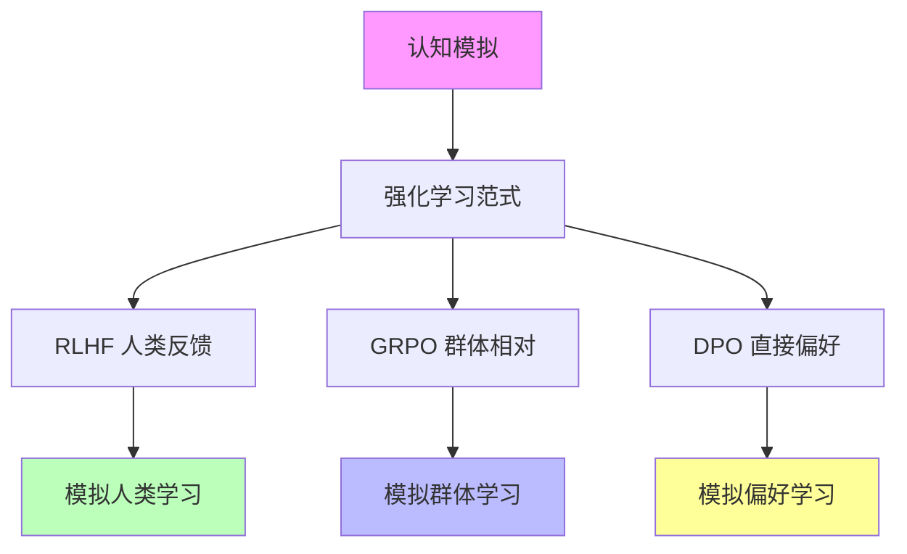
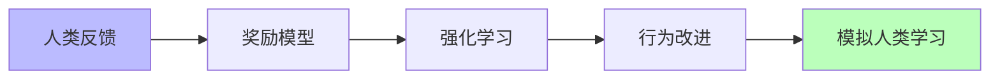
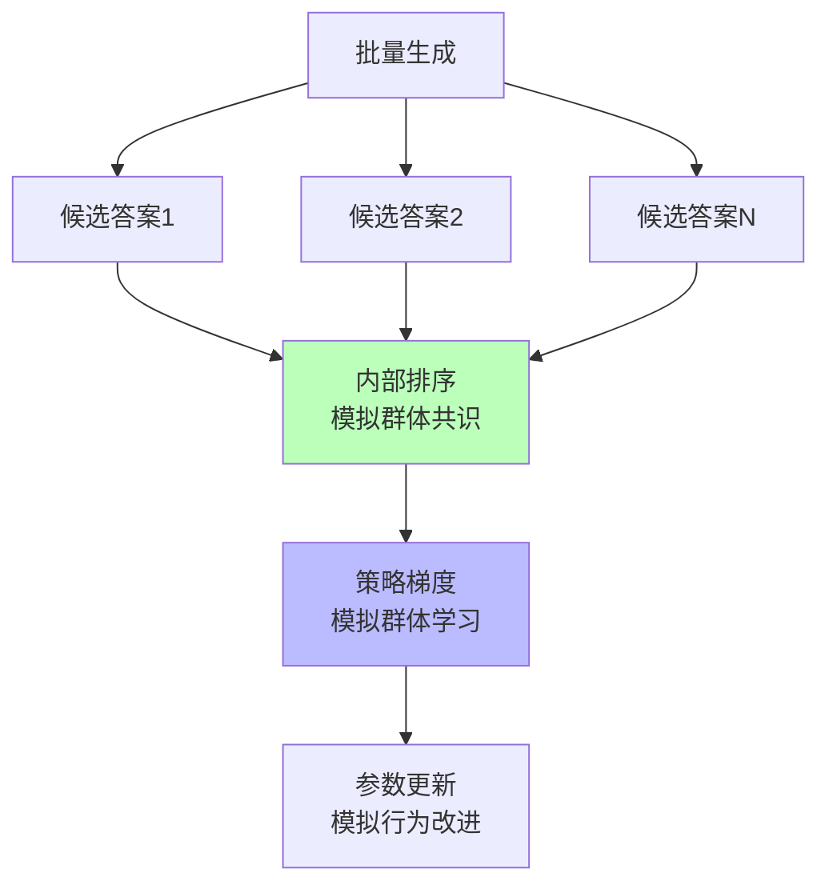
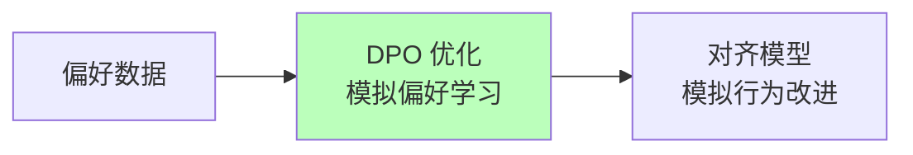

# 04.2.2-强化学习范式

## 目录

- [04.2.2-强化学习范式](#0422-强化学习范式)
  - [目录](#目录)
  - [一、概述](#一概述)
  - [二、强化学习范式与认知模拟](#二强化学习范式与认知模拟)
    - [2.1 理论核心](#21-理论核心)
    - [2.2 认知模拟意义](#22-认知模拟意义)
  - [三、RLHF 与认知模拟](#三rlhf-与认知模拟)
    - [3.1 RLHF 的认知模拟](#31-rlhf-的认知模拟)
    - [3.2 RLHF 的认知意义](#32-rlhf-的认知意义)
  - [四、GRPO 与认知模拟](#四grpo-与认知模拟)
    - [4.1 GRPO 的认知模拟](#41-grpo-的认知模拟)
    - [4.2 GRPO 的认知意义](#42-grpo-的认知意义)
  - [五、DPO 与认知模拟](#五dpo-与认知模拟)
    - [5.1 DPO 的认知模拟](#51-dpo-的认知模拟)
    - [5.2 DPO 的认知意义](#52-dpo-的认知意义)
  - [六、强化学习范式的认知模拟局限](#六强化学习范式的认知模拟局限)
    - [6.1 理论局限](#61-理论局限)
    - [6.2 认知模拟局限](#62-认知模拟局限)
  - [七、与三层模型的关系](#七与三层模型的关系)
    - [7.1 强化学习范式与数据层](#71-强化学习范式与数据层)
    - [7.2 强化学习范式与控制层](#72-强化学习范式与控制层)
  - [八、核心结论](#八核心结论)
  - [九、相关主题](#九相关主题)
  - [十、参考文档](#十参考文档)

---

## 一、概述

强化学习范式是认知模拟理论化的核心技术之一，通过强化学习优化模型行为，实现从"经验试错"（炼金术）向"精密科学"（化学）的转化。本文档阐述强化学习范式在认知模拟中的应用、理论框架及其在 AI 系统中的应用。

---

## 二、强化学习范式与认知模拟

### 2.1 理论核心

**强化学习范式的理论核心**：**通过奖励信号指导学习，模拟人类学习过程**

**在认知模拟中的应用**：

**核心观点**：

- **奖励信号**：通过奖励信号指导学习，模拟人类学习过程
- **策略优化**：通过策略优化改进行为，模拟人类行为改进
- **行为改进**：通过行为改进提升性能，模拟人类能力提升

### 2.2 认知模拟意义

**强化学习范式的认知模拟意义**：

1. **模拟人类学习**：RLHF 模拟人类学习过程
2. **模拟群体学习**：GRPO 模拟群体学习过程
3. **模拟偏好学习**：DPO 模拟偏好学习过程

---

## 三、RLHF 与认知模拟

### 3.1 RLHF 的认知模拟

**RLHF（Reinforcement Learning from Human Feedback）的认知模拟**：

**核心思想**：从人类反馈中学习，模拟人类学习过程

**认知模拟流程**：

**认知模拟特征**：

1. **人类反馈**：模拟人类反馈机制
2. **奖励信号**：模拟人类奖励信号
3. **行为改进**：模拟人类行为改进

### 3.2 RLHF 的认知意义

**RLHF 的认知意义**：

- **模拟人类学习**：从人类反馈中学习，模拟人类学习过程
- **模拟奖励机制**：奖励模型模拟人类奖励机制
- **模拟行为改进**：强化学习模拟人类行为改进

**但非意识**：

- **无主观体验**：学习过程无主观体验
- **无自我觉知**：学习过程无自我觉知
- **无内在动机**：学习过程无内在动机

---

## 四、GRPO 与认知模拟

### 4.1 GRPO 的认知模拟

**GRPO（Group-Relative Policy Optimization）的认知模拟**：

**核心思想**：群体相对策略优化，模拟群体学习过程

**认知模拟流程**：

**认知模拟特征**：

1. **群体生成**：模拟群体生成过程
2. **内部排序**：模拟群体共识机制
3. **策略优化**：模拟群体学习过程

### 4.2 GRPO 的认知意义

**GRPO 的认知意义**：

- **模拟群体学习**：群体相对策略优化模拟群体学习过程
- **模拟群体共识**：内部排序模拟群体共识机制
- **模拟行为改进**：策略优化模拟群体行为改进

**但非意识**：

- **无主观体验**：群体学习过程无主观体验
- **无自我觉知**：群体学习过程无自我觉知
- **无内在动机**：群体学习过程无内在动机

---

## 五、DPO 与认知模拟

### 5.1 DPO 的认知模拟

**DPO（Direct Preference Optimization）的认知模拟**：

**核心思想**：直接优化偏好，模拟偏好学习过程

**认知模拟流程**：

**认知模拟特征**：

1. **偏好数据**：模拟人类偏好数据
2. **偏好优化**：模拟偏好学习过程
3. **行为改进**：模拟行为改进过程

### 5.2 DPO 的认知意义

**DPO 的认知意义**：

- **模拟偏好学习**：直接优化偏好模拟偏好学习过程
- **模拟行为改进**：偏好优化模拟行为改进过程

**但非意识**：

- **无主观体验**：偏好学习过程无主观体验
- **无自我觉知**：偏好学习过程无自我觉知
- **无内在动机**：偏好学习过程无内在动机

---

## 六、强化学习范式的认知模拟局限

### 6.1 理论局限

**强化学习范式的认知模拟局限**：

| **维度**     | **特征**         | **局限**                       |
| ------------ | ---------------- | ------------------------------ |
| **确定性**   | 弱               | 更像启发式策略，无严格收敛保证 |
| **任务依赖** | 效果依赖任务类型 | 跨任务失效                     |
| **随机性**   | 采样引入随机性   | 结果不确定                     |
| **可预测性** | 效果不可预测     | 无理论保证                     |

### 6.2 认知模拟局限

**强化学习范式的认知模拟局限**：

1. **无主观体验**：学习过程无主观体验
2. **无自我觉知**：学习过程无自我觉知
3. **无内在动机**：学习过程无内在动机
4. **无元认知**：学习过程无元认知

---

## 七、与三层模型的关系

### 7.1 强化学习范式与数据层

**强化学习范式与数据层**：

- **策略优化**：强化学习优化数据层策略
- **奖励信号**：奖励信号反馈到数据层
- **行为改进**：通过行为改进提升数据层性能

### 7.2 强化学习范式与控制层

**强化学习范式与控制层**：

- **约束优化**：强化学习优化控制层约束
- **规则注入**：通过规则注入提升控制层可控性
- **行为改进**：通过行为改进提升控制层性能

---

## 八、核心结论

1. **强化学习范式是认知模拟的核心技术**：通过强化学习模拟人类学习过程
2. **RLHF、GRPO、DPO**：模拟人类学习、群体学习、偏好学习
3. **但非意识**：学习过程无主观体验、无自我觉知、无内在动机
4. **理论局限**：确定性弱，更像启发式策略

---

## 九、相关主题

- [04.2.1-推断时间计算增强](04.2.1-推断时间计算增强.md)
- [04.2.3-元认知与自我改进](04.2.3-元认知与自我改进.md)
- [05.1.2-强化学习范式](../05-AI科学理论/05.1.2-强化学习范式.md)

---

## 十、参考文档

- [AI-非意识的"认知模拟"是否可被理论化、确定性地改进](../../view/ai_科学理论_view.md)
- [AI 能说是一种模拟人脑思考思维的意识的模型](../../view/ai_意识_view.md)
