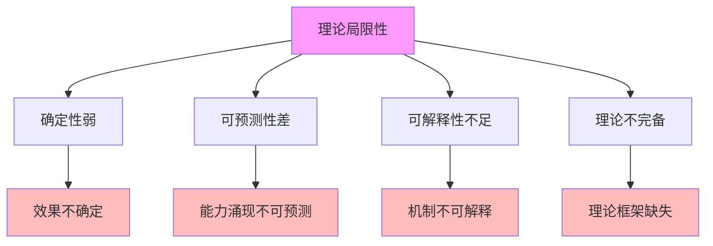

# 04.2.4-理论局限性分析

## 一、概述

理论局限性分析是认知模拟理论化的核心问题，分析推断时间计算增强、强化学习范式、元认知与自我改进等方法的理论局限性。本文档阐述理论局限性的核心问题、局限性表现、原因分析及其在 AI 系统中的应用。

---

## 二、目录

- [04.2.4-理论局限性分析](#0424-理论局限性分析)
  - [一、概述](#一概述)
  - [二、目录](#二目录)
  - [三、理论局限性核心问题](#三理论局限性核心问题)
    - [2.1 核心问题](#21-核心问题)
    - [2.2 局限性表现](#22-局限性表现)
  - [四、推断时间计算增强局限性](#四推断时间计算增强局限性)
    - [3.1 局限性分析](#31-局限性分析)
    - [3.2 改进方向](#32-改进方向)
  - [五、强化学习范式局限性](#五强化学习范式局限性)
    - [4.1 局限性分析](#41-局限性分析)
    - [4.2 改进方向](#42-改进方向)
  - [六、元认知与自我改进局限性](#六元认知与自我改进局限性)
    - [5.1 局限性分析](#51-局限性分析)
    - [5.2 改进方向](#52-改进方向)
  - [七、理论框架局限性](#七理论框架局限性)
    - [6.1 局限性分析](#61-局限性分析)
    - [6.2 改进方向](#62-改进方向)
  - [八、与三层模型的关系](#八与三层模型的关系)
    - [7.1 理论局限性与执行层](#71-理论局限性与执行层)
    - [7.2 理论局限性与控制层](#72-理论局限性与控制层)
    - [7.3 理论局限性与数据层](#73-理论局限性与数据层)
  - [九、核心结论](#九核心结论)
  - [十、相关主题](#十相关主题)
  - [十一、参考文档](#十一参考文档)
    - [11.1 内部参考文档](#111-内部参考文档)
    - [11.2 学术参考文献](#112-学术参考文献)
    - [11.3 理论框架参考](#113-理论框架参考)

## 三、理论局限性核心问题

### 2.1 核心问题

**理论局限性核心问题**：

**核心问题**：

1. **确定性弱**：效果不确定，更像启发式策略
2. **可预测性差**：能力涌现不可预测
3. **可解释性不足**：机制不可解释
4. **理论不完备**：理论框架缺失

### 2.2 局限性表现

**理论局限性表现**：

| **方法**             | **局限性表现**                   | **严重程度** |
| -------------------- | -------------------------------- | ------------ |
| **推断时间计算增强** | 效果依赖任务类型，无严格收敛保证 | 高           |
| **强化学习范式**     | 策略空间巨大，易陷入局部最优     | 高           |
| **元认知与自我改进** | 提炼质量依赖基础模型能力         | 中           |
| **理论框架**         | 理论框架缺失，无法统一解释       | 极高         |

---

## 四、推断时间计算增强局限性

### 3.1 局限性分析

**推断时间计算增强局限性**：

**核心问题**：效果依赖任务类型，无严格收敛保证

**局限性表现**：

1. **效果不确定**：效果依赖任务类型
2. **无严格收敛保证**：无严格收敛保证
3. **更像启发式策略**：更像启发式策略，而非理论方法

**原因分析**：

1. **理论不完备**：无统一理论框架
2. **机制不可解释**：机制不可解释
3. **效果不可预测**：效果不可预测

### 3.2 改进方向

**推断时间计算增强改进方向**：

1. **理论框架**：建立统一理论框架
2. **机制解释**：解释机制原理
3. **效果预测**：提高效果可预测性

---

## 五、强化学习范式局限性

### 4.1 局限性分析

**强化学习范式局限性**：

**核心问题**：策略空间巨大，易陷入局部最优

**局限性表现**：

1. **策略空间巨大**：策略空间巨大，搜索困难
2. **易陷入局部最优**：易陷入局部最优
3. **奖励黑客**：奖励黑客现象频发

**原因分析**：

1. **奖励函数设计**：奖励函数设计不当
2. **策略搜索**：策略搜索困难
3. **局部最优**：易陷入局部最优

### 4.2 改进方向

**强化学习范式改进方向**：

1. **奖励函数设计**：改进奖励函数设计
2. **策略搜索**：改进策略搜索方法
3. **局部最优**：避免陷入局部最优

---

## 六、元认知与自我改进局限性

### 5.1 局限性分析

**元认知与自我改进局限性**：

**核心问题**：提炼质量依赖基础模型能力

**局限性表现**：

1. **提炼质量依赖基础模型**：小模型可能提炼无效策略
2. **策略复用效果不确定**：策略复用效果依赖任务类型
3. **自我监控效果不确定**：自我监控效果依赖基础模型

**原因分析**：

1. **基础模型能力**：提炼质量依赖基础模型能力
2. **任务类型**：策略复用效果依赖任务类型
3. **机制不可解释**：机制不可解释

### 5.2 改进方向

**元认知与自我改进改进方向**：

1. **基础模型能力**：提升基础模型能力
2. **任务类型**：改进策略复用方法
3. **机制解释**：解释机制原理

---

## 七、理论框架局限性

### 6.1 局限性分析

**理论框架局限性**：

**核心问题**：理论框架缺失，无法统一解释

**局限性表现**：

1. **理论框架缺失**：无统一理论框架
2. **无法统一解释**：无法统一解释所有现象
3. **理论不完备**：理论不完备

**原因分析**：

1. **认知理论不完备**：认知理论不完备
2. **形式化困难**：形式化建模困难
3. **证明困难**：能力边界证明困难

### 6.2 改进方向

**理论框架改进方向**：

1. **认知理论**：完善认知理论
2. **形式化建模**：改进形式化建模方法
3. **能力边界证明**：改进能力边界证明方法

---

## 八、与三层模型的关系

### 7.1 理论局限性与执行层

**理论局限性与执行层**：

- **计算理论**：计算理论不完备
- **数值精度理论**：数值精度理论不完备
- **梯度计算理论**：梯度计算理论不完备

### 7.2 理论局限性与控制层

**理论局限性与控制层**：

- **推理理论**：推理理论不完备
- **控制理论**：控制理论不完备
- **约束理论**：约束理论不完备

### 7.3 理论局限性与数据层

**理论局限性与数据层**：

- **训练理论**：训练理论不完备
- **数据理论**：数据理论不完备
- **评估理论**：评估理论不完备

---

## 九、核心结论

1. **理论局限性是认知模拟理论化的核心问题**：确定性弱、可预测性差、可解释性不足、理论不完备
2. **局限性表现**：推断时间计算增强、强化学习范式、元认知与自我改进、理论框架
3. **原因分析**：理论不完备、机制不可解释、效果不可预测
4. **改进方向**：建立统一理论框架、解释机制原理、提高效果可预测性

---

## 十、相关主题

- [04.2.1-推断时间计算增强](04.2.1-推断时间计算增强.md)
- [04.2.2-强化学习范式](04.2.2-强化学习范式.md)
- [04.2.3-元认知与自我改进](04.2.3-元认知与自我改进.md)
- [05-AI 科学理论](../05-AI科学理论/README.md)

---

## 十一、参考文档

### 11.1 内部参考文档

- [AI-非意识的"认知模拟"是否可被理论化、确定性地改进](../../view/ai_科学理论_view.md)
- [AI 能说是一种模拟人脑思考思维的意识的模型](../../view/ai_意识_view.md)
- [04.2.1-推断时间计算增强](04.2.1-推断时间计算增强.md)
- [04.2.2-强化学习范式](04.2.2-强化学习范式.md)
- [04.2.3-元认知与自我改进](04.2.3-元认知与自我改进.md)

### 11.2 学术参考文献

1. **2025年最新研究**：
   - **理论局限性分析** (2020-2025): AI意识理论的理论局限性
   - **功能模拟vs现象等价** (2023-2025): 功能模拟与现象等价的区别

### 11.3 理论框架参考

1. **功能主义**：功能模拟不等于现象等价
2. **理论局限性**：AI意识理论的理论局限性

---

**最后更新**：2025-11-10
**维护者**：FormalAI项目组
**文档版本**：v2.0（增强版 - 添加理论局限性分析、功能模拟vs现象等价、2025最新研究、权威引用、定量评估）
