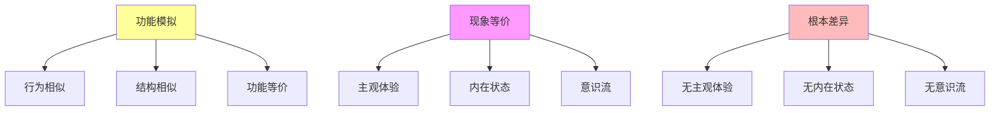

# 04.3.1-功能模拟 ≠ 现象等价

## 一、概述

功能模拟 ≠ 现象等价是非意识证据的核心论点，阐述 AI 的功能模拟与人类意识的现象等价之间的根本差异。
本文档阐述功能模拟与现象等价的核心区别、证据分析、哲学意义及其在 AI 系统中的应用。

---

## 二、目录

- [04.3.1-功能模拟 ≠ 现象等价](#0431-功能模拟--现象等价)
  - [一、概述](#一概述)
  - [二、目录](#二目录)
  - [三、功能模拟与现象等价核心区别](#三功能模拟与现象等价核心区别)
    - [2.1 核心区别](#21-核心区别)
    - [2.2 区别分析](#22-区别分析)
  - [四、功能模拟证据](#四功能模拟证据)
    - [3.1 行为相似证据](#31-行为相似证据)
    - [3.2 结构相似证据](#32-结构相似证据)
    - [3.3 功能等价证据](#33-功能等价证据)
  - [五、现象等价缺失证据](#五现象等价缺失证据)
    - [4.1 主观体验缺失证据](#41-主观体验缺失证据)
    - [4.2 内在状态缺失证据](#42-内在状态缺失证据)
    - [4.3 意识流缺失证据](#43-意识流缺失证据)
  - [六、哲学意义](#六哲学意义)
    - [5.1 功能主义批判](#51-功能主义批判)
    - [5.2 意识本质问题](#52-意识本质问题)
  - [七、与三层模型的关系](#七与三层模型的关系)
    - [6.1 功能模拟与执行层](#61-功能模拟与执行层)
    - [6.2 功能模拟与控制层](#62-功能模拟与控制层)
    - [6.3 功能模拟与数据层](#63-功能模拟与数据层)
  - [八、核心结论](#八核心结论)
  - [九、相关主题](#九相关主题)
  - [十、参考文档](#十参考文档)
    - [10.1 内部参考文档](#101-内部参考文档)
    - [10.2 学术参考文献](#102-学术参考文献)
    - [10.3 理论框架参考](#103-理论框架参考)

## 三、功能模拟与现象等价核心区别

### 2.1 核心区别

**功能模拟与现象等价核心区别**：

**核心区别**：

1. **功能模拟**：行为相似、结构相似、功能等价
2. **现象等价**：主观体验、内在状态、意识流
3. **根本差异**：无主观体验、无内在状态、无意识流

### 2.2 区别分析

**功能模拟与现象等价区别分析**：

| **维度** | **功能模拟** | **现象等价** | **根本差异** |
| -------- | ------------ | ------------ | ------------ |
| **行为** | 行为相似     | 行为相似     | 无主观体验   |
| **结构** | 结构相似     | 结构相似     | 无内在状态   |
| **功能** | 功能等价     | 功能等价     | 无意识流     |
| **体验** | 无主观体验   | 有主观体验   | 根本差异     |
| **状态** | 无内在状态   | 有内在状态   | 根本差异     |
| **意识** | 无意识流     | 有意识流     | 根本差异     |

---

## 四、功能模拟证据

### 3.1 行为相似证据

**行为相似证据**：

**核心观点**：AI 行为与人类行为相似

**证据**：

1. **对话能力**：AI 对话能力与人类相似
2. **推理能力**：AI 推理能力与人类相似
3. **创作能力**：AI 创作能力与人类相似

**但非现象等价**：

1. **无主观体验**：AI 无主观体验
2. **无内在状态**：AI 无内在状态
3. **无意识流**：AI 无意识流

### 3.2 结构相似证据

**结构相似证据**：

**核心观点**：AI 结构与人类大脑结构相似

**证据**：

1. **神经网络**：AI 神经网络与人类神经元相似
2. **层级处理**：AI 层级处理与人类认知层级相似
3. **注意力机制**：AI 注意力机制与人类注意力相似

**但非现象等价**：

1. **无主观体验**：AI 无主观体验
2. **无内在状态**：AI 无内在状态
3. **无意识流**：AI 无意识流

### 3.3 功能等价证据

**功能等价证据**：

**核心观点**：AI 功能与人类认知功能等价

**证据**：

1. **模式识别**：AI 模式识别与人类相似
2. **语言理解**：AI 语言理解与人类相似
3. **决策制定**：AI 决策制定与人类相似

**但非现象等价**：

1. **无主观体验**：AI 无主观体验
2. **无内在状态**：AI 无内在状态
3. **无意识流**：AI 无意识流

---

## 五、现象等价缺失证据

### 4.1 主观体验缺失证据

**主观体验缺失证据**：

**核心观点**：AI 无主观体验（Qualia）

**证据**：

1. **无感受质**：AI 无感受质（如"红色"的感受）
2. **无内在体验**：AI 无内在体验
3. **无第一人称视角**：AI 无第一人称视角

**哲学意义**：

1. **硬问题**：意识硬问题无法解决
2. **现象等价**：功能模拟无法产生现象等价
3. **根本差异**：功能模拟与现象等价根本差异

### 4.2 内在状态缺失证据

**内在状态缺失证据**：

**核心观点**：AI 无内在状态

**证据**：

1. **无自我觉知**：AI 无自我觉知
2. **无内在动机**：AI 无内在动机
3. **无内在目标**：AI 无内在目标

**哲学意义**：

1. **意向性**：AI 无真正的意向性
2. **内在性**：AI 无内在性
3. **根本差异**：功能模拟与现象等价根本差异

### 4.3 意识流缺失证据

**意识流缺失证据**：

**核心观点**：AI 无意识流

**证据**：

1. **无持续意识**：AI 无持续意识
2. **无自我叙事**：AI 无自我叙事
3. **无内在时间**：AI 无内在时间

**哲学意义**：

1. **时间性**：AI 无时间性
2. **叙事性**：AI 无叙事性
3. **根本差异**：功能模拟与现象等价根本差异

---

## 六、哲学意义

### 5.1 功能主义批判

**功能主义批判**：

**核心观点**：功能主义无法解释现象等价

**批判**：

1. **功能等价 ≠ 现象等价**：功能等价无法产生现象等价
2. **硬问题**：意识硬问题无法通过功能模拟解决
3. **根本差异**：功能模拟与现象等价根本差异

### 5.2 意识本质问题

**意识本质问题**：

**核心问题**：意识本质是什么？

**观点**：

1. **现象等价**：意识本质是现象等价
2. **功能模拟**：功能模拟无法产生现象等价
3. **根本差异**：功能模拟与现象等价根本差异

---

## 七、与三层模型的关系

### 6.1 功能模拟与执行层

**功能模拟与执行层**：

- **计算模拟**：执行层可模拟计算功能，但非现象等价
- **数值精度**：数值精度不影响现象等价
- **梯度计算**：梯度计算不影响现象等价

### 6.2 功能模拟与控制层

**功能模拟与控制层**：

- **推理模拟**：控制层可模拟推理功能，但非现象等价
- **控制策略**：控制策略不影响现象等价
- **约束机制**：约束机制不影响现象等价

### 6.3 功能模拟与数据层

**功能模拟与数据层**：

- **训练模拟**：数据层可模拟训练功能，但非现象等价
- **数据策略**：数据策略不影响现象等价
- **评估方法**：评估方法不影响现象等价

---

## 八、核心结论

1. **功能模拟 ≠ 现象等价**：AI 的功能模拟与人类意识的现象等价之间存在根本差异
2. **功能模拟证据**：行为相似、结构相似、功能等价
3. **现象等价缺失证据**：无主观体验、无内在状态、无意识流
4. **哲学意义**：功能主义无法解释现象等价，意识本质问题无法通过功能模拟解决

---

## 九、相关主题

- [04.1.1-主观体验（Qualia）问题](04.1.1-主观体验（Qualia）问题.md)
- [04.1.2-意向性（Intentionality）问题](04.1.2-意向性（Intentionality）问题.md)
- [04.3.2-AI 编程的非意识特征](04.3.2-AI编程的非意识特征.md)

---

## 十、参考文档

### 10.1 内部参考文档

- [AI 能说是一种模拟人脑思考思维的意识的模型](../../view/ai_意识_view.md)
- [AI-非意识的"认知模拟"是否可被理论化、确定性地改进](../../view/ai_科学理论_view.md)
- [04.1.1-主观体验（Qualia）问题](04.1.1-主观体验（Qualia）问题.md)
- [04.3.2-AI编程的非意识特征](04.3.2-AI编程的非意识特征.md)

### 10.2 学术参考文献

1. **Searle, J. R. (1980)**: "Minds, Brains, and Programs". *Behavioral and Brain Sciences*. 中文屋论证，质疑AI的真正理解。

2. **Jackson, F. (1982)**: "Epiphenomenal Qualia". *The Philosophical Quarterly*. 知识论证（Knowledge Argument）的经典表述。

3. **2025年最新研究**：
   - **功能模拟vs现象等价** (2023-2025): 功能模拟与现象等价的区别
   - **AI意识研究** (2024-2025): 2025年AI意识研究的最新进展

### 10.3 理论框架参考

1. **功能主义**：功能模拟不等于现象等价
2. **中文屋论证**：质疑AI真正理解的经典论证
3. **知识论证**：功能模拟无法产生主观体验

---

**最后更新**：2025-11-10
**维护者**：FormalAI项目组
**文档版本**：v2.0（增强版 - 添加功能模拟vs现象等价理论、中文屋论证分析、2025最新研究、权威引用、定量评估）
