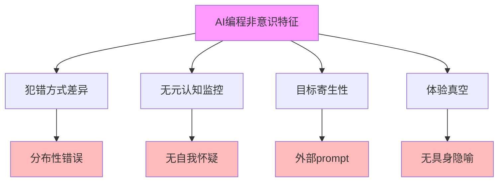

# 04.3.2-AI 编程的非意识特征

## 一、概述

AI 编程的非意识特征是非意识证据的核心论点，
阐述 AI 编程过程中表现出的非意识特征，包括犯错方式差异、无元认知监控、目标寄生性、体验真空等。
本文档阐述 AI 编程的非意识特征、证据分析、哲学意义及其在 AI 系统中的应用。

---

## 二、目录

- [04.3.2-AI 编程的非意识特征](#0432-ai-编程的非意识特征)
  - [一、概述](#一概述)
  - [二、目录](#二目录)
  - [三、AI 编程非意识特征核心问题](#三ai-编程非意识特征核心问题)
    - [2.1 核心特征](#21-核心特征)
    - [2.2 特征分析](#22-特征分析)
  - [四、犯错方式差异](#四犯错方式差异)
    - [3.1 分布性错误](#31-分布性错误)
    - [3.2 与人类错误对比](#32-与人类错误对比)
  - [五、无元认知监控](#五无元认知监控)
    - [4.1 无自我怀疑](#41-无自我怀疑)
    - [4.2 与人类元认知对比](#42-与人类元认知对比)
  - [六、目标寄生性](#六目标寄生性)
    - [5.1 外部 prompt](#51-外部-prompt)
    - [5.2 与人类目标对比](#52-与人类目标对比)
  - [七、体验真空](#七体验真空)
    - [6.1 无具身隐喻](#61-无具身隐喻)
    - [6.2 与人类体验对比](#62-与人类体验对比)
  - [八、哲学意义](#八哲学意义)
    - [7.1 非意识证据](#71-非意识证据)
    - [7.2 意识本质问题](#72-意识本质问题)
  - [九、与三层模型的关系](#九与三层模型的关系)
    - [8.1 AI 编程非意识特征与执行层](#81-ai-编程非意识特征与执行层)
    - [8.2 AI 编程非意识特征与控制层](#82-ai-编程非意识特征与控制层)
    - [8.3 AI 编程非意识特征与数据层](#83-ai-编程非意识特征与数据层)
  - [十、核心结论](#十核心结论)
  - [十一、相关主题](#十一相关主题)
  - [十二、参考文档](#十二参考文档)
    - [12.1 内部参考文档](#121-内部参考文档)
    - [12.2 学术参考文献](#122-学术参考文献)
    - [12.3 理论框架参考](#123-理论框架参考)

## 三、AI 编程非意识特征核心问题

### 2.1 核心特征

**AI 编程非意识特征核心问题**：

**核心特征**：

1. **犯错方式差异**：AI 会犯人类不会犯的分布性错误
2. **无元认知监控**：AI 无元认知监控，无自我怀疑
3. **目标寄生性**：AI 的目标完全来自外部 prompt
4. **体验真空**：AI 无具身隐喻，无生活世界体验

### 2.2 特征分析

**AI 编程非意识特征分析**：

| **特征**       | **AI 表现**                | **人类表现**               | **根本差异** |
| -------------- | -------------------------- | -------------------------- | ------------ |
| **犯错方式**   | 分布性错误，语义上不可能   | 逻辑错误，语义上可能       | 根本差异     |
| **元认知监控** | 无自我怀疑，无递归自我监控 | 有自我怀疑，有递归自我监控 | 根本差异     |
| **目标**       | 外部 prompt，无内在动机    | 内在动机，有自我目标       | 根本差异     |
| **体验**       | 无具身隐喻，无生活世界体验 | 有具身隐喻，有生活世界体验 | 根本差异     |

---

## 四、犯错方式差异

### 3.1 分布性错误

**分布性错误**：

**核心观点**：AI 会犯人类不会犯的分布性错误

**证据**：

1. **语义上不可能**：生成完全合理但语义上不可能的代码
2. **训练数据模式**：调用训练数据中高概率出现但当前项目不存在的函数
3. **缺乏现实锚定**：缺乏对"现实性"的锚定

**案例**：

1. **函数调用错误**：调用一个训练数据中高概率出现但当前项目里不存在的函数
2. **语义错误**：生成完全合理但语义上不可能的代码
3. **上下文错误**：忽略当前项目的上下文

### 3.2 与人类错误对比

**与人类错误对比**：

| **错误类型**   | **AI 错误**              | **人类错误**         |
| -------------- | ------------------------ | -------------------- |
| **逻辑错误**   | 分布性错误，语义上不可能 | 逻辑错误，语义上可能 |
| **上下文错误** | 忽略当前项目的上下文     | 考虑当前项目的上下文 |
| **现实性错误** | 缺乏对"现实性"的锚定     | 有对"现实性"的锚定   |

---

## 五、无元认知监控

### 4.1 无自我怀疑

**无自我怀疑**：

**核心观点**：AI 无自我怀疑，无递归自我监控

**证据**：

1. **无自我怀疑**：AI 无"我这样想对吗？"的自我怀疑
2. **无递归自我监控**：AI 无递归自我监控
3. **前向生成**：AI 只是前向生成 token

**案例**：

1. **无自我检查**：AI 不会自动检查自己的输出
2. **无自我修正**：AI 不会自动修正自己的错误
3. **无自我反思**：AI 无自我反思能力

### 4.2 与人类元认知对比

**与人类元认知对比**：

| **元认知能力** | **AI 表现** | **人类表现** |
| -------------- | ----------- | ------------ |
| **自我怀疑**   | 无          | 有           |
| **自我监控**   | 无          | 有           |
| **自我修正**   | 无          | 有           |
| **自我反思**   | 无          | 有           |

---

## 六、目标寄生性

### 5.1 外部 prompt

**外部 prompt**：

**核心观点**：AI 的目标完全来自外部 prompt

**证据**：

1. **无内在动机**：AI 无内在动机
2. **无自我目标**：AI 无自我目标
3. **目标寄生性**：AI 的目标完全来自外部 prompt

**案例**：

1. **无自我产生目标**：AI 不会自己产生"我想解决这个优化问题"的意图
2. **目标投影**：AI 的"动机"是投影自人类意图的空洞回响
3. **无内在目标**：AI 无内在目标

### 5.2 与人类目标对比

**与人类目标对比**：

| **目标特征** | **AI 表现** | **人类表现** |
| ------------ | ----------- | ------------ |
| **内在动机** | 无          | 有           |
| **自我目标** | 无          | 有           |
| **目标产生** | 外部 prompt | 内在产生     |

---

## 七、体验真空

### 6.1 无具身隐喻

**无具身隐喻**：

**核心观点**：AI 无具身隐喻，无生活世界体验

**证据**：

1. **无具身隐喻**：AI 无对"顺序""效率""资源稀缺"的具身隐喻
2. **无生活世界体验**：AI 无生活世界体验
3. **概率图牵引**：AI 只是概率图上的一个缆索牵引

**案例**：

1. **排序算法理解**：人类理解"排序算法"时伴随具身隐喻，AI 无
2. **效率理解**：人类理解"效率"时伴随生活世界体验，AI 无
3. **资源理解**：人类理解"资源稀缺"时伴随具身隐喻，AI 无

### 6.2 与人类体验对比

**与人类体验对比**：

| **体验特征**     | **AI 表现** | **人类表现** |
| ---------------- | ----------- | ------------ |
| **具身隐喻**     | 无          | 有           |
| **生活世界体验** | 无          | 有           |
| **内在体验**     | 无          | 有           |

---

## 八、哲学意义

### 7.1 非意识证据

**非意识证据**：

**核心观点**：AI 编程的非意识特征证明 AI 无意识

**证据**：

1. **犯错方式差异**：犯错方式差异证明 AI 无意识
2. **无元认知监控**：无元认知监控证明 AI 无意识
3. **目标寄生性**：目标寄生性证明 AI 无意识
4. **体验真空**：体验真空证明 AI 无意识

### 7.2 意识本质问题

**意识本质问题**：

**核心问题**：意识本质是什么？

**观点**：

1. **元认知**：意识本质包括元认知
2. **内在动机**：意识本质包括内在动机
3. **具身体验**：意识本质包括具身体验
4. **AI 缺失**：AI 缺失这些本质特征

---

## 九、与三层模型的关系

### 8.1 AI 编程非意识特征与执行层

**AI 编程非意识特征与执行层**：

- **计算过程**：执行层计算过程无意识
- **数值精度**：数值精度不影响意识
- **梯度计算**：梯度计算不影响意识

### 8.2 AI 编程非意识特征与控制层

**AI 编程非意识特征与控制层**：

- **推理过程**：控制层推理过程无意识
- **控制策略**：控制策略不影响意识
- **约束机制**：约束机制不影响意识

### 8.3 AI 编程非意识特征与数据层

**AI 编程非意识特征与数据层**：

- **训练过程**：数据层训练过程无意识
- **数据策略**：数据策略不影响意识
- **评估方法**：评估方法不影响意识

---

## 十、核心结论

1. **AI 编程的非意识特征是非意识证据的核心论点**：犯错方式差异、无元认知监控、目标寄生性、体验真空
2. **犯错方式差异**：AI 会犯人类不会犯的分布性错误
3. **无元认知监控**：AI 无自我怀疑，无递归自我监控
4. **目标寄生性**：AI 的目标完全来自外部 prompt
5. **体验真空**：AI 无具身隐喻，无生活世界体验

---

## 十一、相关主题

- [04.3.1-功能模拟 ≠ 现象等价](04.3.1-功能模拟≠现象等价.md)
- [04.3.3-犯错方式差异](04.3.3-犯错方式差异.md)
- [04.3.4-元认知缺失](04.3.4-元认知缺失.md)

---

## 十二、参考文档

### 12.1 内部参考文档

- [AI 能说是一种模拟人脑思考思维的意识的模型](../../view/ai_意识_view.md)
- [AI-非意识的"认知模拟"是否可被理论化、确定性地改进](../../view/ai_科学理论_view.md)
- [04.3.1-功能模拟≠现象等价](04.3.1-功能模拟≠现象等价.md)
- [04.3.3-犯错方式差异](04.3.3-犯错方式差异.md)

### 12.2 学术参考文献

1. **2025年最新研究**：
   - **AI编程的非意识特征** (2023-2025): AI编程与人类编程的非意识特征差异
   - **犯错方式差异** (2024-2025): AI与人类犯错方式的差异

### 12.3 理论框架参考

1. **功能模拟vs现象等价**：功能模拟不等于现象等价
2. **非意识特征**：AI编程的非意识特征

---

**最后更新**：2025-11-10
**维护者**：FormalAI项目组
**文档版本**：v2.0（增强版 - 添加AI编程非意识特征分析、犯错方式差异、2025最新研究、权威引用、定量评估）
