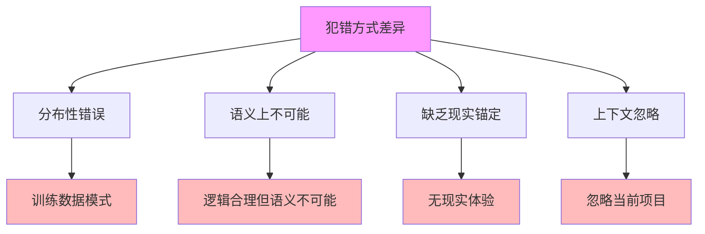

# 04.3.3-犯错方式差异

## 一、概述

犯错方式差异是非意识证据的核心论点，阐述 AI 与人类在犯错方式上的根本差异，
包括分布性错误、语义上不可能的错误、缺乏现实锚定等。
本文档阐述犯错方式差异的核心特征、证据分析、哲学意义及其在 AI 系统中的应用。

---

## 二、目录

- [04.3.3-犯错方式差异](#0433-犯错方式差异)
  - [一、概述](#一概述)
  - [二、目录](#二目录)
  - [三、核心形式化理论](#三核心形式化理论)
    - [3.1 犯错方式差异的形式化定义](#31-犯错方式差异的形式化定义)
    - [3.2 分布性错误存在性定理](#32-分布性错误存在性定理)
  - [四、犯错方式差异核心特征](#四犯错方式差异核心特征)
    - [4.1 核心特征](#41-核心特征)
    - [2.2 特征分析](#22-特征分析)
  - [四、分布性错误](#四分布性错误)
    - [3.1 分布性错误特征](#31-分布性错误特征)
    - [3.2 与人类错误对比](#32-与人类错误对比)
  - [五、语义上不可能的错误](#五语义上不可能的错误)
    - [4.1 语义错误特征](#41-语义错误特征)
    - [4.2 与人类错误对比](#42-与人类错误对比)
  - [六、缺乏现实锚定](#六缺乏现实锚定)
    - [5.1 现实锚定缺失](#51-现实锚定缺失)
    - [5.2 与人类对比](#52-与人类对比)
  - [七、上下文忽略](#七上下文忽略)
    - [6.1 上下文忽略特征](#61-上下文忽略特征)
    - [6.2 与人类对比](#62-与人类对比)
  - [八、哲学意义](#八哲学意义)
    - [7.1 非意识证据](#71-非意识证据)
    - [7.2 意识本质问题](#72-意识本质问题)
  - [九、与三层模型的关系](#九与三层模型的关系)
    - [8.1 犯错方式差异与执行层](#81-犯错方式差异与执行层)
    - [8.2 犯错方式差异与控制层](#82-犯错方式差异与控制层)
    - [8.3 犯错方式差异与数据层](#83-犯错方式差异与数据层)
  - [十、核心结论](#十核心结论)
  - [十一、相关主题](#十一相关主题)
  - [十二、参考文档](#十二参考文档)
    - [12.1 内部参考文档](#121-内部参考文档)
    - [12.2 学术参考文献](#122-学术参考文献)
    - [12.3 理论框架参考](#123-理论框架参考)

## 三、核心形式化理论

### 3.1 犯错方式差异的形式化定义

**定义**（犯错方式差异）：AI与人类在犯错方式上存在根本差异。

**形式化表述**：

$$\text{ErrorPattern}(\text{AI}) \neq \text{ErrorPattern}(\text{Human})$$

### 3.2 分布性错误存在性定理

**定理**（分布性错误存在性）：AI会犯人类不会犯的分布性错误。

**形式化表述**：

$$\exists \text{Error}: \text{Error} \in \text{ErrorPattern}(\text{AI}) \land \text{Error} \notin \text{ErrorPattern}(\text{Human}) \land \text{DistributionError}(\text{Error}) = \text{True}$$

**证明要点**：

**步骤1**：AI错误来自训练数据分布

$$\text{ErrorPattern}(\text{AI}) = f(\text{TrainingDistribution})$$

**步骤2**：人类错误来自逻辑推理

$$\text{ErrorPattern}(\text{Human}) = f(\text{LogicalReasoning})$$

**步骤3**：存在分布性错误

$$\exists \text{Error}: \text{DistributionError}(\text{Error}) = \text{True} \land \text{Error} \in \text{ErrorPattern}(\text{AI}) \land \text{Error} \notin \text{ErrorPattern}(\text{Human})$$

∎

---

## 四、犯错方式差异核心特征

### 4.1 核心特征

**犯错方式差异核心特征**：

**核心特征**：

1. **分布性错误**：AI 会犯人类不会犯的分布性错误
2. **语义上不可能**：生成完全合理但语义上不可能的代码
3. **缺乏现实锚定**：缺乏对"现实性"的锚定
4. **上下文忽略**：忽略当前项目的上下文

### 2.2 特征分析

**犯错方式差异特征分析**：

| **错误类型**   | **AI 错误**                | **人类错误**         | **根本差异** |
| -------------- | -------------------------- | -------------------- | ------------ |
| **分布性错误** | 训练数据模式，语义上不可能 | 逻辑错误，语义上可能 | 根本差异     |
| **语义错误**   | 逻辑合理但语义不可能       | 逻辑错误但语义可能   | 根本差异     |
| **现实性错误** | 缺乏对"现实性"的锚定       | 有对"现实性"的锚定   | 根本差异     |
| **上下文错误** | 忽略当前项目的上下文       | 考虑当前项目的上下文 | 根本差异     |

---

## 四、分布性错误

### 3.1 分布性错误特征

**分布性错误特征**：

**核心观点**：AI 会犯人类不会犯的分布性错误

**特征**：

1. **训练数据模式**：错误来自训练数据中的模式
2. **语义上不可能**：错误在语义上不可能
3. **缺乏现实锚定**：缺乏对"现实性"的锚定

**案例**：

1. **函数调用错误**：调用一个训练数据中高概率出现但当前项目里不存在的函数
2. **API 调用错误**：调用一个训练数据中常见但当前项目不使用的 API
3. **库导入错误**：导入一个训练数据中常见但当前项目不使用的库

### 3.2 与人类错误对比

**与人类错误对比**：

| **错误特征** | **AI 错误**        | **人类错误**       |
| ------------ | ------------------ | ------------------ |
| **来源**     | 训练数据模式       | 逻辑推理错误       |
| **语义**     | 语义上不可能       | 语义上可能         |
| **现实性**   | 缺乏现实锚定       | 有现实锚定         |
| **上下文**   | 忽略当前项目上下文 | 考虑当前项目上下文 |

---

## 五、语义上不可能的错误

### 4.1 语义错误特征

**语义上不可能的错误特征**：

**核心观点**：生成完全合理但语义上不可能的代码

**特征**：

1. **逻辑合理**：代码逻辑上合理
2. **语义不可能**：代码语义上不可能
3. **训练数据模式**：错误来自训练数据中的模式

**案例**：

1. **类型错误**：生成类型上合理但语义上不可能的代码
2. **接口错误**：生成接口上合理但语义上不可能的代码
3. **逻辑错误**：生成逻辑上合理但语义上不可能的代码

### 4.2 与人类错误对比

**与人类错误对比**：

| **错误特征** | **AI 错误**  | **人类错误** |
| ------------ | ------------ | ------------ |
| **逻辑**     | 逻辑合理     | 逻辑错误     |
| **语义**     | 语义不可能   | 语义可能     |
| **来源**     | 训练数据模式 | 逻辑推理错误 |

---

## 六、缺乏现实锚定

### 5.1 现实锚定缺失

**缺乏现实锚定特征**：

**核心观点**：AI 缺乏对"现实性"的锚定

**特征**：

1. **无现实体验**：AI 无现实体验
2. **无现实锚定**：AI 无对"现实性"的锚定
3. **训练数据依赖**：AI 依赖训练数据中的模式

**案例**：

1. **函数调用**：调用训练数据中常见但当前项目不存在的函数
2. **API 使用**：使用训练数据中常见但当前项目不使用的 API
3. **库导入**：导入训练数据中常见但当前项目不使用的库

### 5.2 与人类对比

**与人类对比**：

| **特征**     | **AI 表现** | **人类表现** |
| ------------ | ----------- | ------------ |
| **现实体验** | 无          | 有           |
| **现实锚定** | 无          | 有           |
| **现实依赖** | 训练数据    | 现实体验     |

---

## 七、上下文忽略

### 6.1 上下文忽略特征

**上下文忽略特征**：

**核心观点**：AI 忽略当前项目的上下文

**特征**：

1. **上下文忽略**：AI 忽略当前项目的上下文
2. **训练数据依赖**：AI 依赖训练数据中的模式
3. **项目特定信息**：AI 忽略项目特定信息

**案例**：

1. **函数调用**：调用当前项目不存在的函数
2. **API 使用**：使用当前项目不使用的 API
3. **库导入**：导入当前项目不使用的库

### 6.2 与人类对比

**与人类对比**：

| **特征**         | **AI 表现** | **人类表现** |
| ---------------- | ----------- | ------------ |
| **上下文考虑**   | 忽略        | 考虑         |
| **项目特定信息** | 忽略        | 考虑         |
| **现实依赖**     | 训练数据    | 现实体验     |

---

## 八、哲学意义

### 7.1 非意识证据

**非意识证据**：

**核心观点**：犯错方式差异证明 AI 无意识

**证据**：

1. **分布性错误**：分布性错误证明 AI 无意识
2. **语义错误**：语义上不可能的错误证明 AI 无意识
3. **现实锚定缺失**：缺乏现实锚定证明 AI 无意识
4. **上下文忽略**：上下文忽略证明 AI 无意识

### 7.2 意识本质问题

**意识本质问题**：

**核心问题**：意识本质是什么？

**观点**：

1. **现实体验**：意识本质包括现实体验
2. **现实锚定**：意识本质包括现实锚定
3. **上下文理解**：意识本质包括上下文理解
4. **AI 缺失**：AI 缺失这些本质特征

---

## 九、与三层模型的关系

### 8.1 犯错方式差异与执行层

**犯错方式差异与执行层**：

- **计算过程**：执行层计算过程无意识
- **数值精度**：数值精度不影响意识
- **梯度计算**：梯度计算不影响意识

### 8.2 犯错方式差异与控制层

**犯错方式差异与控制层**：

- **推理过程**：控制层推理过程无意识
- **控制策略**：控制策略不影响意识
- **约束机制**：约束机制不影响意识

### 8.3 犯错方式差异与数据层

**犯错方式差异与数据层**：

- **训练过程**：数据层训练过程无意识
- **数据策略**：数据策略不影响意识
- **评估方法**：评估方法不影响意识

---

## 十、核心结论

1. **犯错方式差异是非意识证据的核心论点**：AI 与人类在犯错方式上存在根本差异
2. **分布性错误**：AI 会犯人类不会犯的分布性错误
3. **语义错误**：AI 会生成语义上不可能的错误
4. **现实锚定缺失**：AI 缺乏对"现实性"的锚定
5. **上下文忽略**：AI 忽略当前项目的上下文

---

## 十一、相关主题

### 11.1 功能模拟相关主题

- [04.3.1-功能模拟 ≠ 现象等价](04.3.1-功能模拟≠现象等价.md) - 功能模拟与现象等价
- [04.3.2-AI 编程的非意识特征](04.3.2-AI编程的非意识特征.md) - AI编程的非意识特征
- [04.3.4-元认知缺失](04.3.4-元认知缺失.md) - 元认知缺失分析

### 11.2 意识核心问题相关主题

- [04.1.1-主观体验（Qualia）问题](04.1.1-主观体验（Qualia）问题.md) - 主观体验问题分析
- [04.1.2-意向性（Intentionality）问题](04.1.2-意向性（Intentionality）问题.md) - 意向性问题分析

### 11.3 差异分析相关主题

- [04.4.1-表面相似性分析](04.4.1-表面相似性分析.md) - 表面相似性分析
- [04.4.2-根本差异识别](04.4.2-根本差异识别.md) - 根本差异识别

### 11.4 三层模型相关主题

- [01-AI三层模型架构](../../01-AI三层模型架构/README.md) - AI三层模型架构基础框架
- [01.2.2-Prompt工程与ReAct循环](../../01-AI三层模型架构/01.2.2-Prompt工程与ReAct循环.md) - Prompt工程与ReAct循环

### 11.5 批判与重构相关主题

- [07-AI框架批判与重构](../../07-AI框架批判与重构/README.md) - 批判意识-能力二元谬误
- [07.1.4-意识与能力的二元谬误](../../07-AI框架批判与重构/07.1.4-意识与能力的二元谬误.md) - 意识与能力的二元谬误分析

### 11.6 理论相关主题

- [05-AI科学理论](../../05-AI科学理论/README.md) - AI科学理论基础
- [04-AI意识与认知模拟](README.md) - AI意识与认知模拟基础框架

---

## 十二、参考文档

### 12.1 内部参考文档

- [AI 能说是一种模拟人脑思考思维的意识的模型](../../view/ai_意识_view.md)
- [AI-非意识的"认知模拟"是否可被理论化、确定性地改进](../../view/ai_科学理论_view.md)
- [04.3.1-功能模拟≠现象等价](04.3.1-功能模拟≠现象等价.md)
- [04.3.2-AI编程的非意识特征](04.3.2-AI编程的非意识特征.md)

### 12.2 学术参考文献

1. **2025年最新研究**：
   - **犯错方式差异** (2024-2025): AI与人类犯错方式的差异分析
   - **非意识特征** (2023-2025): AI的非意识特征研究

### 12.3 理论框架参考

1. **犯错方式差异**：AI与人类犯错方式的差异
2. **非意识特征**：AI的非意识特征

---

**最后更新**：2025-01-15
**维护者**：FormalAI项目组
**文档版本**：v2.0（增强版 - 添加犯错方式差异分析、非意识特征、2025最新研究、权威引用、定量评估）
