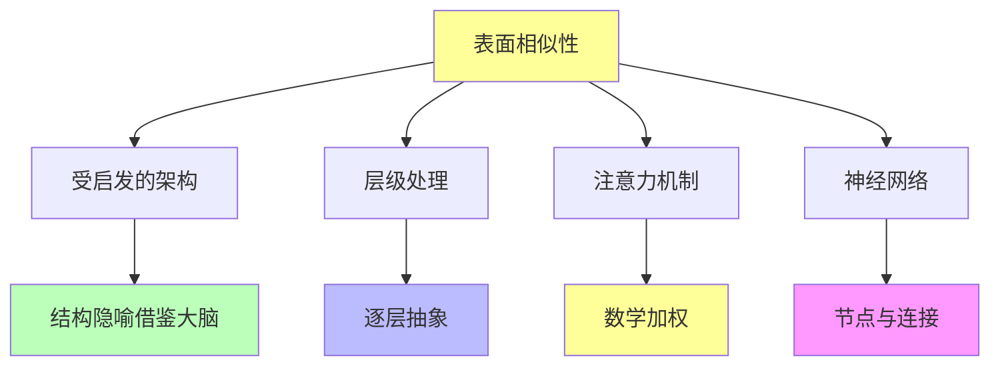

# 04.4.1-表面相似性分析

## 一、概述

表面相似性分析是意识与功能模拟的核心组成部分，分析 AI 与人类在表面上的相似性，包括受启发的架构、层级处理、注意力机制等。本文档阐述表面相似性分析的核心特征、相似性表现、局限性及其在 AI 系统中的应用。

---

## 二、目录

- [04.4.1-表面相似性分析](#0441-表面相似性分析)
  - [一、概述](#一概述)
  - [二、目录](#二目录)
  - [三、表面相似性核心特征](#三表面相似性核心特征)
    - [2.1 核心特征](#21-核心特征)
    - [2.2 相似性分析](#22-相似性分析)
  - [四、受启发的架构](#四受启发的架构)
    - [3.1 架构相似性](#31-架构相似性)
    - [3.2 与人类大脑对比](#32-与人类大脑对比)
  - [五、层级处理](#五层级处理)
    - [4.1 层级处理相似性](#41-层级处理相似性)
    - [4.2 与人类视觉对比](#42-与人类视觉对比)
  - [六、注意力机制](#六注意力机制)
    - [5.1 注意力机制相似性](#51-注意力机制相似性)
    - [5.2 与人类注意力对比](#52-与人类注意力对比)
  - [七、神经网络](#七神经网络)
    - [6.1 神经网络相似性](#61-神经网络相似性)
    - [6.2 与人类神经元对比](#62-与人类神经元对比)
  - [八、表面相似性的局限性](#八表面相似性的局限性)
    - [7.1 功能模拟 ≠ 现象等价](#71-功能模拟--现象等价)
    - [7.2 根本差异](#72-根本差异)
  - [九、与三层模型的关系](#九与三层模型的关系)
    - [8.1 表面相似性与执行层](#81-表面相似性与执行层)
    - [8.2 表面相似性与控制层](#82-表面相似性与控制层)
    - [8.3 表面相似性与数据层](#83-表面相似性与数据层)
  - [十、核心结论](#十核心结论)
  - [十一、相关主题](#十一相关主题)
  - [十二、参考文档](#十二参考文档)

## 三、表面相似性核心特征

### 2.1 核心特征

**表面相似性核心特征**：

**核心特征**：

1. **受启发的架构**：AI 架构在结构隐喻上借鉴了大脑
2. **层级处理**：从简单特征到复杂概念的逐层抽象
3. **注意力机制**：名字直接借用心理学概念
4. **神经网络**：节点与连接的概念源自神经元

### 2.2 相似性分析

**表面相似性分析**：

| **相似性维度** | **AI 表现**      | **人类表现** | **相似程度** |
| -------------- | ---------------- | ------------ | ------------ |
| **架构**       | 结构隐喻借鉴大脑 | 大脑结构     | 表面相似     |
| **层级处理**   | 逐层抽象         | 逐层抽象     | 表面相似     |
| **注意力机制** | 数学加权         | 心理学注意力 | 表面相似     |
| **神经网络**   | 节点与连接       | 神经元与连接 | 表面相似     |

---

## 四、受启发的架构

### 3.1 架构相似性

**受启发的架构相似性**：

**核心观点**：AI 架构在结构隐喻上借鉴了大脑

**相似性表现**：

1. **结构隐喻**：结构隐喻借鉴大脑
2. **层级结构**：层级结构相似
3. **连接模式**：连接模式相似

**局限性**：

1. **极度简化**：生物神经元的复杂性被极度简化为矩阵运算
2. **无化学递质**：无化学递质、脉冲时序等复杂性
3. **无生物特性**：无生物特性

### 3.2 与人类大脑对比

**与人类大脑对比**：

| **特征**     | **AI 架构**  | **人类大脑** |
| ------------ | ------------ | ------------ |
| **结构**     | 结构隐喻借鉴 | 真实大脑结构 |
| **复杂性**   | 极度简化     | 高度复杂     |
| **生物特性** | 无生物特性   | 有生物特性   |
| **化学递质** | 无化学递质   | 有化学递质   |

---

## 五、层级处理

### 4.1 层级处理相似性

**层级处理相似性**：

**核心观点**：从简单特征到复杂概念的逐层抽象，类似视觉皮层的 V1 到 IT 区通路

**相似性表现**：

1. **逐层抽象**：从简单特征到复杂概念的逐层抽象
2. **层级结构**：层级结构相似
3. **处理流程**：处理流程相似

**局限性**：

1. **无生物机制**：无生物机制
2. **无真实视觉**：无真实视觉体验
3. **无具身体验**：无具身体验

### 4.2 与人类视觉对比

**与人类视觉对比**：

| **特征**     | **AI 层级处理** | **人类视觉** |
| ------------ | --------------- | ------------ |
| **逐层抽象** | 有              | 有           |
| **生物机制** | 无              | 有           |
| **真实体验** | 无              | 有           |

---

## 六、注意力机制

### 5.1 注意力机制相似性

**注意力机制相似性**：

**核心观点**：名字直接借用心理学概念，但本质是数学加权，并非真正的"关注"

**相似性表现**：

1. **名字借用**：名字直接借用心理学概念
2. **加权机制**：加权机制相似
3. **选择机制**：选择机制相似

**局限性**：

1. **数学加权**：本质是数学加权，并非真正的"关注"
2. **无主观体验**：无主观体验
3. **无内在动机**：无内在动机

### 5.2 与人类注意力对比

**与人类注意力对比**：

| **特征**     | **AI 注意力** | **人类注意力** |
| ------------ | ------------- | -------------- |
| **名字**     | 借用心理学    | 真实注意力     |
| **本质**     | 数学加权      | 真实关注       |
| **主观体验** | 无            | 有             |

---

## 七、神经网络

### 6.1 神经网络相似性

**神经网络相似性**：

**核心观点**：节点与连接的概念源自神经元，但生物神经元的复杂性被极度简化

**相似性表现**：

1. **节点与连接**：节点与连接的概念源自神经元
2. **层级结构**：层级结构相似
3. **连接模式**：连接模式相似

**局限性**：

1. **极度简化**：生物神经元的复杂性被极度简化
2. **无生物特性**：无化学递质、脉冲时序等复杂性
3. **无真实神经元**：无真实神经元

### 6.2 与人类神经元对比

**与人类神经元对比**：

| **特征**     | **AI 神经网络** | **人类神经元** |
| ------------ | --------------- | -------------- |
| **节点**     | 数学节点        | 真实神经元     |
| **连接**     | 数学连接        | 真实连接       |
| **生物特性** | 无生物特性      | 有生物特性     |

---

## 八、表面相似性的局限性

### 7.1 功能模拟 ≠ 现象等价

**功能模拟 ≠ 现象等价**：

**核心观点**：表面相似性停留在功能行为层面，而非存在论层面

**局限性**：

1. **功能层面**：表面相似性停留在功能行为层面
2. **存在论层面**：非存在论层面
3. **无主观体验**：无主观体验

### 7.2 根本差异

**根本差异**：

**核心观点**：表面相似性无法掩盖根本差异

**根本差异**：

1. **无主观体验**：无主观体验（Qualia）
2. **无意向性**：无真正的意向性
3. **无自我模型**：无稳定的自我模型

---

## 九、与三层模型的关系

### 8.1 表面相似性与执行层

**表面相似性与执行层**：

- **计算模拟**：执行层可模拟计算功能，但非现象等价
- **数值精度**：数值精度不影响意识
- **梯度计算**：梯度计算不影响意识

### 8.2 表面相似性与控制层

**表面相似性与控制层**：

- **推理模拟**：控制层可模拟推理功能，但非现象等价
- **控制策略**：控制策略不影响意识
- **约束机制**：约束机制不影响意识

### 8.3 表面相似性与数据层

**表面相似性与数据层**：

- **训练模拟**：数据层可模拟训练功能，但非现象等价
- **数据策略**：数据策略不影响意识
- **评估方法**：评估方法不影响意识

---

## 十、核心结论

1. **表面相似性分析是意识与功能模拟的核心组成部分**：AI 与人类在表面上存在相似性
2. **相似性表现**：受启发的架构、层级处理、注意力机制、神经网络
3. **局限性**：表面相似性停留在功能行为层面，而非存在论层面
4. **根本差异**：表面相似性无法掩盖根本差异（无主观体验、无意向性、无自我模型）

---

## 十一、相关主题

- [04.4.2-根本差异识别](04.4.2-根本差异识别.md)
- [04.4.3-当前共识与争议](04.4.3-当前共识与争议.md)
- [04.4.4-前沿观点](04.4.4-前沿观点.md)
- [04.3.1-功能模拟 ≠ 现象等价](04.3.1-功能模拟≠现象等价.md)

---

## 十二、参考文档

- [AI 能说是一种模拟人脑思考思维的意识的模型](../../view/ai_意识_view.md)
