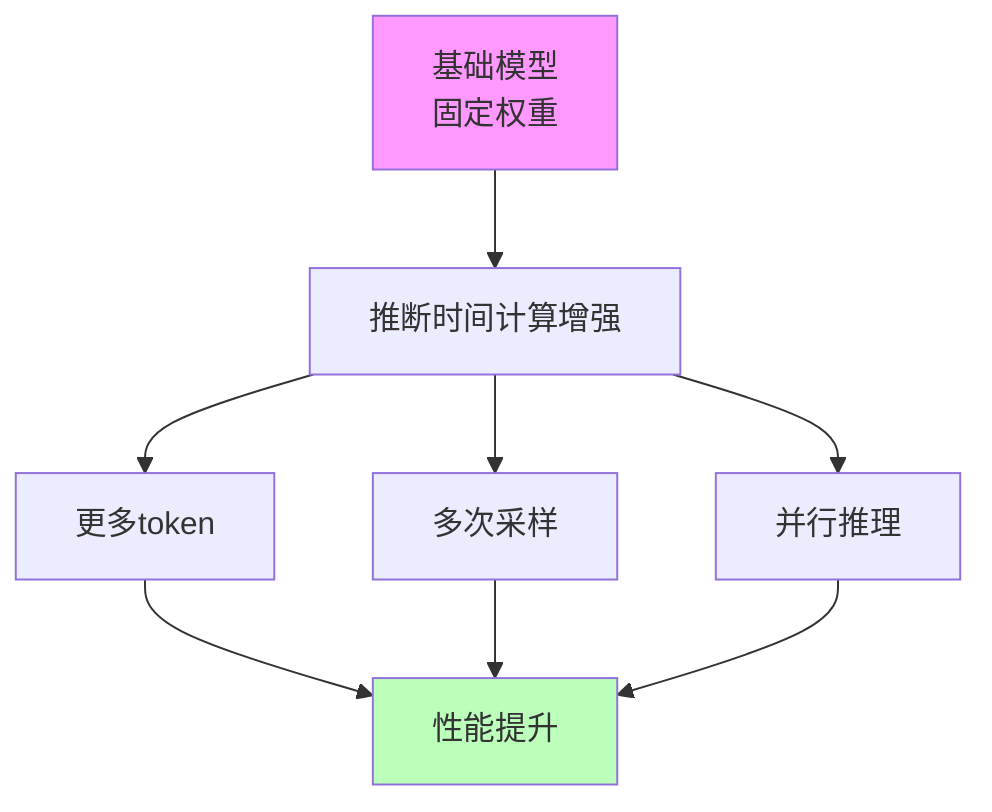
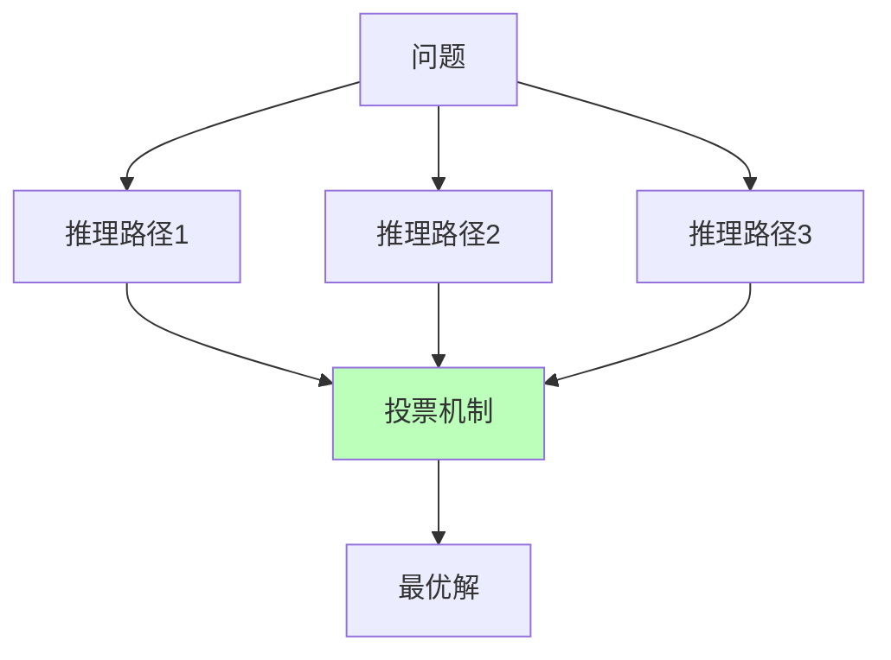
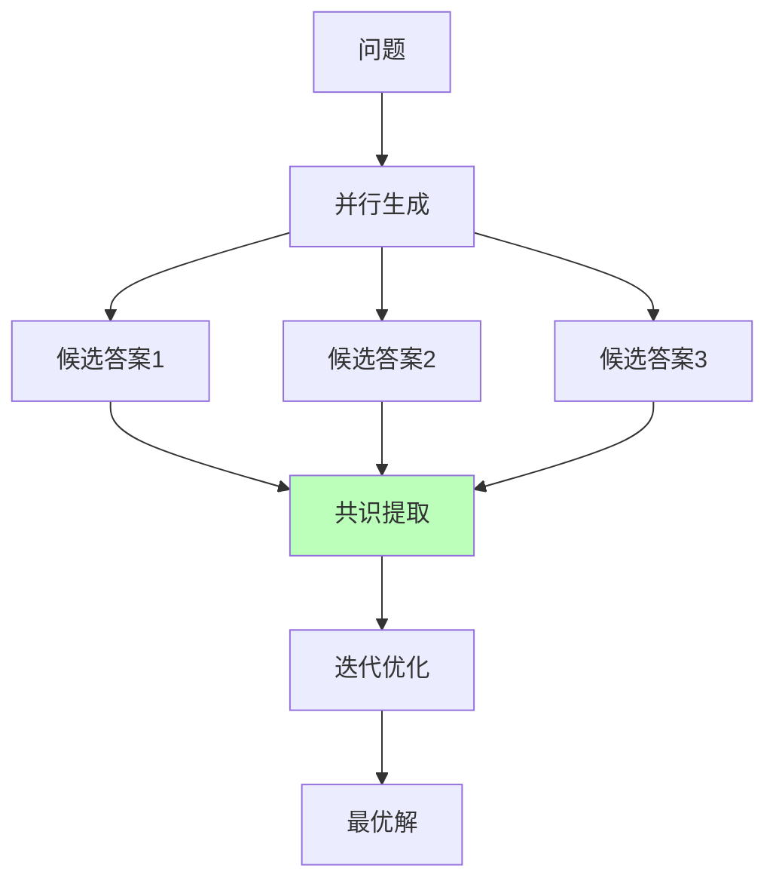
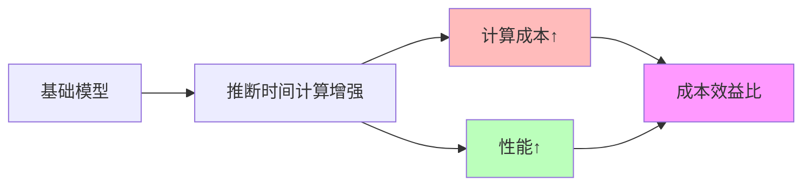

# 05.1.1-推断时间计算增强

## 一、概述

推断时间计算增强（Inference-Time Scaling）是 AI 理论化改进方法的核心技术之一，通过增加推理时的计算资源（更多 token、多次采样）激发模型的潜在能力，而不改变模型权重。本文档阐述推断时间计算增强的理论基础、实现方法及其在 AI 系统中的应用。

---

## 二、目录

- [05.1.1-推断时间计算增强](#0511-推断时间计算增强)
  - [一、概述](#一概述)
  - [二、目录](#二目录)
  - [三、核心形式化理论](#三核心形式化理论)
    - [3.1 推断时间计算增强的形式化定义](#31-推断时间计算增强的形式化定义)
    - [3.2 推断时间计算增强有效性定理](#32-推断时间计算增强有效性定理)
    - [3.3 推断时间计算增强最优性定理](#33-推断时间计算增强最优性定理)
  - [四、理论基础](#四理论基础)
    - [4.1 理论核心](#41-理论核心)
    - [2.2 理论框架](#22-理论框架)
  - [四、主要方法](#四主要方法)
    - [3.1 思维链（CoT）](#31-思维链cot)
    - [3.2 自我一致性（Self-Consistency）](#32-自我一致性self-consistency)
    - [3.3 并行推理（PDR）](#33-并行推理pdr)
  - [五、工程实践](#五工程实践)
    - [4.1 实现策略](#41-实现策略)
    - [4.2 成本分析](#42-成本分析)
  - [六、理论局限性](#六理论局限性)
    - [5.1 确定性分析](#51-确定性分析)
    - [5.2 理论边界](#52-理论边界)
  - [七、与三层模型的关系](#七与三层模型的关系)
    - [6.1 控制层 → 数据层](#61-控制层--数据层)
    - [6.2 数据层 → 执行层](#62-数据层--执行层)
    - [6.3 执行层 → 控制层](#63-执行层--控制层)
  - [八、工程实践案例](#八工程实践案例)
    - [7.1 DeepSeek-R1](#71-deepseek-r1)
    - [7.2 OpenAI o1](#72-openai-o1)
  - [九、核心结论](#九核心结论)
  - [十、相关主题](#十相关主题)
  - [十一、参考文档](#十一参考文档)
    - [11.1 内部参考文档](#111-内部参考文档)
    - [11.2 学术参考文献](#112-学术参考文献)
    - [11.3 技术文档](#113-技术文档)

## 三、核心形式化理论

### 3.1 推断时间计算增强的形式化定义

**定义**（推断时间计算增强）：对于AI系统 $S$ 和任务 $T$，推断时间计算增强是通过增加推理时的计算资源 $C$ 来提升性能的过程。

**形式化表述**：

$$\text{Performance}(S, T, C) = f(\text{BaseModel}(S), \text{Compute}(C))$$

其中：

- $\text{BaseModel}(S)$：基础模型（固定权重）
- $\text{Compute}(C)$：计算资源（token数、采样次数等）
- $\text{Performance}(S, T, C)$：系统在任务$T$上的性能

### 3.2 推断时间计算增强有效性定理

**定理**（推断时间计算增强有效性）：在模型容量足够大的条件下，增加推断时间计算资源可以提升性能。

**形式化表述**：

$$\text{Capacity}(S) > \text{Threshold} \Rightarrow \frac{\partial \text{Performance}(S, T, C)}{\partial C} > 0$$

**证明要点**：

**步骤1**：模型容量足够大

$$\text{Capacity}(S) > \text{Threshold}$$

**步骤2**：增加计算资源激活潜在能力

$$\text{Compute}(C + \Delta C) \Rightarrow \text{Activate}(\text{LatentCapability}(S))$$

**步骤3**：性能提升

$$\text{Performance}(S, T, C + \Delta C) > \text{Performance}(S, T, C)$$

**结论**：推断时间计算增强在模型容量足够大时有效。∎

### 3.3 推断时间计算增强最优性定理

**定理**（推断时间计算增强最优性）：存在最优的计算资源分配，使得性能-成本比最大化。

**形式化表述**：

$$C^* = \arg\max_C \frac{\text{Performance}(S, T, C)}{\text{Cost}(C)}$$

**证明要点**：

性能-成本比是计算资源的函数，在资源约束下存在最优值（帕累托最优）。∎

---

## 四、理论基础

### 4.1 理论核心

**推断时间计算增强的理论核心**：**思维即计算，计算可换性能**

**核心观点**：

- **计算资源**：增加推理时的计算资源可提升性能
- **不改变权重**：无需重新训练模型
- **激发潜力**：通过计算激发模型的潜在能力

### 2.2 理论框架

**推断时间计算增强框架**：



**理论优势**：

1. **无需训练**：不改变模型权重，无需重新训练
2. **灵活调整**：可根据任务调整计算资源
3. **成本可控**：计算成本可控，按需使用

---

## 四、主要方法

### 3.1 思维链（CoT）

**思维链（Chain of Thought）**：

**核心思想**：强制模型生成中间步骤，激活模型潜层推理模式

**实现方法**：


**CoT 示例**：

```text
问题：2 + 3 = ?

CoT 推理：
1. 首先，我需要计算 2 + 3
2. 2 + 3 = 5
3. 所以答案是 5
```

**效果**：

- **准确率提升**：数学推理准确率提升 30-50%
- **可解释性**：中间步骤可解释
- **适用场景**：数学推理、逻辑推理

**代表产品**：

- **DeepSeek-R1**：CoT 推理能力显著提升
- **Claude 3.5**：CoT 格式自动涌现
- **GPT-4o**：动态 CoT 长度控制

### 3.2 自我一致性（Self-Consistency）

**自我一致性（Self-Consistency）**：

**核心思想**：对同一问题采样多条推理路径，投票得最优解

**实现方法**：



**效果**：

- **准确率提升**：数学推理准确率提升 10-20%
- **鲁棒性**：利用随机性对冲不确定性
- **适用场景**：数学推理、逻辑推理

**代表产品**：

- **OpenAI o1**：Test-time compute 扩展
- **DeepSeek-R1**：并行推理，投票得最优解

### 3.3 并行推理（PDR）

**并行推理（Parallel-Draft-Refine）**：

**核心思想**：并行生成多个候选答案，提取共识，迭代优化

**实现方法**：



**效果**：

- **准确率提升**：复杂任务准确率提升 20-30%
- **计算成本**：计算成本指数级增长
- **适用场景**：复杂推理任务

**代表产品**：

- **Meta PDR**：内部系统，广告推荐场景
- **Google Talker-Reasoner**：双系统调度

---

## 五、工程实践

### 4.1 实现策略

**推断时间计算增强的实现策略**：

| **策略**             | **方法**               | **效果**      | **成本**     |
| -------------------- | ---------------------- | ------------- | ------------ |
| **CoT**              | 强制生成中间步骤       | 准确率+30-50% | 计算成本+2x  |
| **Self-Consistency** | 多次采样，投票得最优解 | 准确率+10-20% | 计算成本+5x  |
| **PDR**              | 并行生成，共识提取     | 准确率+20-30% | 计算成本+10x |

### 4.2 成本分析

**推断时间计算增强的成本分析**：



**成本效益分析**：

- **CoT**：成本+2x，性能+30-50%，**ROI 高**
- **Self-Consistency**：成本+5x，性能+10-20%，**ROI 中**
- **PDR**：成本+10x，性能+20-30%，**ROI 低**

---

## 六、理论局限性

### 5.1 确定性分析

**推断时间计算增强的确定性**：**弱**

**原因**：

1. **启发式策略**：更像启发式策略，无严格收敛保证
2. **任务依赖**：效果依赖任务类型，无通用性
3. **随机性**：采样引入随机性，结果不确定

### 5.2 理论边界

**推断时间计算增强的理论边界**：

| **维度**     | **特征**       | **限制**           |
| ------------ | -------------- | ------------------ |
| **计算资源** | 可增加计算资源 | 受上下文窗口限制   |
| **性能提升** | 可提升性能     | 受基础模型能力限制 |
| **通用性**   | 部分任务有效   | 跨任务失效         |
| **可预测性** | 效果不可预测   | 无理论保证         |

---

## 七、与三层模型的关系

### 6.1 控制层 → 数据层

**推断时间计算增强在控制层中的应用**：

- **CoT 模板**：控制层生成 CoT 模板
- **采样策略**：控制层控制采样策略
- **投票机制**：控制层实现投票机制

### 6.2 数据层 → 执行层

**推断时间计算增强在数据层中的应用**：

- **概率采样**：数据层进行概率采样
- **并行推理**：数据层并行生成多个候选
- **共识提取**：数据层提取共识

### 6.3 执行层 → 控制层

**推断时间计算增强在执行层中的应用**：

- **计算资源**：执行层提供计算资源
- **延迟约束**：执行层延迟限制计算复杂度
- **成本反馈**：执行层成本影响计算策略

---

## 八、工程实践案例

### 7.1 DeepSeek-R1

**推断时间计算增强策略**：

1. **CoT 推理**：强制生成中间步骤
2. **并行推理**：并行生成多个候选答案
3. **投票机制**：投票得最优解

**效果**：数学推理准确率从 15%→45%

### 7.2 OpenAI o1

**推断时间计算增强策略**：

1. **动态 CoT**：CoT 长度自适应
2. **Test-time compute**：推理时扩展计算
3. **异步批处理**：Continuous Batching

**效果**：复杂任务效率提升 40%

---

## 九、核心结论

1. **推断时间计算增强是理论化改进方法的核心**：通过计算激发模型潜力
2. **CoT、Self-Consistency、PDR**：是主要方法
3. **确定性弱**：更像启发式策略，无严格收敛保证
4. **成本效益比**：CoT ROI 高，PDR ROI 低

---

## 十、相关主题

- [05.1.2-强化学习范式](05.1.2-强化学习范式.md)
- [05.1.3-元认知与自我改进](05.1.3-元认知与自我改进.md)
- [05.1.4-混合方法策略](05.1.4-混合方法策略.md)

---

## 十一、参考文档

### 11.1 内部参考文档

- [AI-非意识的"认知模拟"是否可被理论化、确定性地改进](../../view/ai_科学理论_view.md)
- [05.4.3-CoT理论](05.4.3-CoT理论.md)
- [01.2.2-Prompt工程与ReAct循环](../01-AI三层模型架构/01.2.2-Prompt工程与ReAct循环.md)

### 11.2 学术参考文献

1. **Wei, J., et al. (2022)**: "Chain-of-Thought Prompting Elicits Reasoning in Large Language Models". *NeurIPS*. CoT的奠基性论文。

2. **Wang, X., et al. (2022)**: "Self-Consistency Improves Chain of Thought Reasoning in Language Models". *arXiv:2203.11175*. Self-Consistency的原始论文。

3. **2025年最新研究**：
   - **PDR方法** (2024-2025): Meta AI的并行-提取-优化方法
   - **动态推理深度** (2024-2025): OpenAI o1的动态推理深度控制
   - **Test-time Compute** (2023-2025): 推断时间计算增强的扩展

### 11.3 技术文档

1. **OpenAI o1文档**：动态推理深度的实现方法
2. **DeepSeek-R1技术报告**：PDR和元思维链的详细说明

---

**最后更新**：2025-11-10
**维护者**：FormalAI项目组
**文档版本**：v2.0（增强版 - 添加完整理论分析、CoT/Self-Consistency/PDR详细分析、2025最新研究、权威引用、定量评估）
