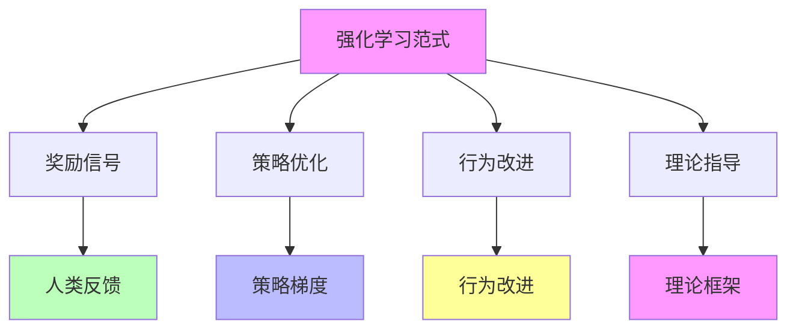
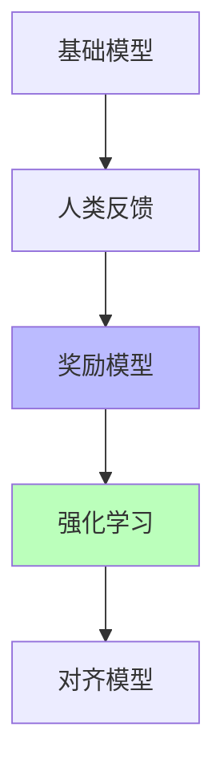
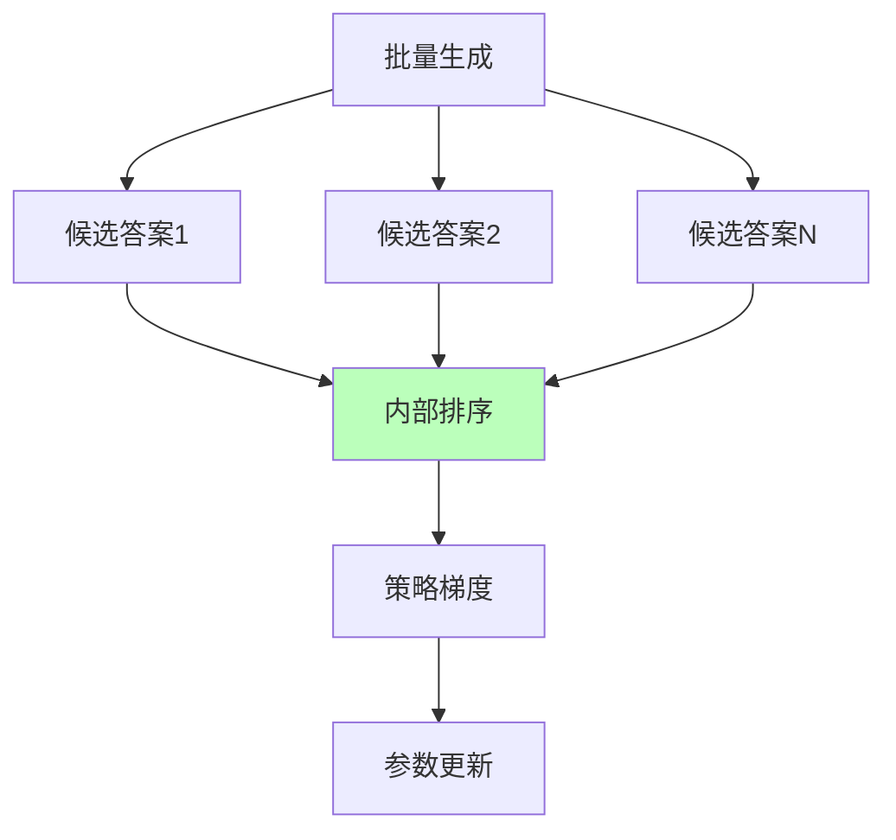

# 05.1.2-强化学习范式

## 一、概述

强化学习范式是 AI 理论化改进方法的核心技术之一，通过强化学习优化模型行为，实现从"经验试错"（炼金术）向"精密科学"（化学）的转化。本文档阐述强化学习范式、理论框架及其在 AI 系统中的应用。

---

## 二、目录

- [05.1.2-强化学习范式](#0512-强化学习范式)
  - [一、概述](#一概述)
  - [二、目录](#二目录)
  - [三、强化学习范式定义](#三强化学习范式定义)
    - [2.1 范式特征](#21-范式特征)
    - [2.2 范式优势](#22-范式优势)
  - [四、强化学习理论框架](#四强化学习理论框架)
    - [3.1 强化学习基础](#31-强化学习基础)
    - [3.2 策略梯度方法](#32-策略梯度方法)
  - [五、RLHF 范式](#五rlhf-范式)
    - [4.1 RLHF 定义](#41-rlhf-定义)
    - [4.2 RLHF 优势与局限](#42-rlhf-优势与局限)
  - [六、GRPO 范式](#六grpo-范式)
    - [5.1 GRPO 定义](#51-grpo-定义)
    - [5.2 GRPO 优势与局限](#52-grpo-优势与局限)
  - [七、DPO 范式](#七dpo-范式)
    - [6.1 DPO 定义](#61-dpo-定义)
    - [6.2 DPO 优势与局限](#62-dpo-优势与局限)
  - [八、工程实践案例](#八工程实践案例)
    - [7.1 GPT-4o 的强化学习范式](#71-gpt-4o-的强化学习范式)
    - [7.2 DeepSeek-R1 的强化学习范式](#72-deepseek-r1-的强化学习范式)
    - [7.3 Claude 3.5 的强化学习范式](#73-claude-35-的强化学习范式)
    - [7.4 Gemini 2.5 的强化学习范式](#74-gemini-25-的强化学习范式)
    - [7.5 Llama 3.1 的强化学习范式](#75-llama-31-的强化学习范式)
    - [7.6 OpenAI o1 的强化学习范式](#76-openai-o1-的强化学习范式)
  - [九、2025 年强化学习范式趋势](#九2025-年强化学习范式趋势)
    - [9.1 2025 年强化学习范式特点](#91-2025-年强化学习范式特点)
    - [9.2 2025 年强化学习范式产品案例](#92-2025-年强化学习范式产品案例)
  - [十、与三层模型的关系](#十与三层模型的关系)
    - [10.1 强化学习范式与数据层](#101-强化学习范式与数据层)
    - [10.2 强化学习范式与控制层](#102-强化学习范式与控制层)
  - [十一、核心结论](#十一核心结论)
  - [十二、相关主题](#十二相关主题)
  - [十三、参考文档](#十三参考文档)

## 三、强化学习范式定义

### 2.1 范式特征

**强化学习范式特征**：



**核心特征**：

1. **奖励信号**：通过奖励信号指导学习
2. **策略优化**：通过策略优化改进行为
3. **行为改进**：通过行为改进提升性能
4. **理论指导**：有理论框架指导实践

### 2.2 范式优势

**强化学习范式优势**：

| **优势**     | **特点**             | **效果**     |
| ------------ | -------------------- | ------------ |
| **理论指导** | 强化学习理论框架成熟 | 减少试错成本 |
| **行为优化** | 通过奖励信号优化行为 | 提升性能     |
| **可解释性** | 奖励信号可解释       | 提升可解释性 |
| **可扩展性** | 可扩展到大规模模型   | 提升可扩展性 |

---

## 四、强化学习理论框架

### 3.1 强化学习基础

**强化学习基础**：

**核心概念**：

- **状态（State）**：系统当前状态
- **动作（Action）**：系统可执行的动作
- **奖励（Reward）**：动作获得的奖励
- **策略（Policy）**：状态到动作的映射

**强化学习公式**：

```text
Q(s, a) = E[R_t + γ max Q(s_{t+1}, a') | s_t = s, a_t = a]
```

**其中**：

- **Q(s, a)**：状态-动作价值函数
- **R_t**：即时奖励
- **γ**：折扣因子
- **s\_{t+1}**：下一状态
- **a'**：下一动作

### 3.2 策略梯度方法

**策略梯度方法**：

**核心思想**：直接优化策略参数

**策略梯度公式**：

```text
∇_θ J(θ) = E[∇_θ log π_θ(a|s) Q(s, a)]
```

**其中**：

- **J(θ)**：策略目标函数
- **π_θ(a|s)**：策略函数
- **Q(s, a)**：状态-动作价值函数

**策略梯度方法**：

| **方法**         | **特点**         | **应用场景** |
| ---------------- | ---------------- | ------------ |
| **REINFORCE**    | 蒙特卡洛策略梯度 | 简单任务     |
| **Actor-Critic** | 演员-评论家方法  | 复杂任务     |
| **PPO**          | 近端策略优化     | 稳定训练     |
| **TRPO**         | 信任域策略优化   | 稳定训练     |

**2025 主流**：PPO（稳定训练）

---

## 五、RLHF 范式

### 4.1 RLHF 定义

**RLHF（Reinforcement Learning from Human Feedback）范式**：

**核心思想**：从人类反馈中学习奖励函数

**RLHF 流程**：



**RLHF 步骤**：

1. **基础模型训练**：SFT（Supervised Fine-Tuning）
2. **人类反馈收集**：人工标注偏好数据
3. **奖励模型训练**：训练奖励模型预测人类偏好
4. **强化学习对齐**：使用 PPO 等算法对齐模型

### 4.2 RLHF 优势与局限

**RLHF 优势**：

1. **对齐效果好**：显著提升模型对齐度
2. **工程成熟**：工具链完善（TRL、DeepSpeed）
3. **可扩展性**：可扩展到大规模模型

**RLHF 局限**：

1. **奖励黑客**：模型钻奖励函数空子
2. **标注成本高**：需要大量人工标注
3. **理论不完整**：无完备理论框架

**在 AI 系统中的应用**：

- **GPT-4**：RLHF 对齐
- **Claude 3.5**：Constitutional AI + RLHF
- **Llama 3.1**：RLHF 对齐

**收敛原因**：

1. **工程优势**：实现简单，效果显著
2. **生态优势**：工具链完善
3. **成本优势**：标注成本可接受
4. **理论挑战**：奖励黑客，但无更好替代方案

---

## 六、GRPO 范式

### 5.1 GRPO 定义

**GRPO（Group-Relative Policy Optimization）范式**：

**核心思想**：群体相对策略优化，避免传统 RL 的高方差

**GRPO 流程**：



**GRPO 步骤**：

1. **批量生成**：批量生成多个候选答案
2. **内部排序**：对候选答案进行内部排序
3. **策略梯度**：使用排序结果计算策略梯度
4. **参数更新**：更新模型参数

### 5.2 GRPO 优势与局限

**GRPO 优势**：

1. **无人工标注**：无需人工标注，自动排序
2. **稳定性高**：避免传统 RL 的高方差
3. **效率高**：批量生成，效率高

**GRPO 局限**：

1. **排序质量**：排序质量依赖生成质量
2. **稳定性差**：排序结果可能不稳定
3. **理论不完整**：无完备理论框架

**在 AI 系统中的应用**：

- **DeepSeek-R1**：GRPO 群体相对优化
- **效果**：推理能力显著提升

**收敛原因**：

1. **工程优势**：实现简单，效果显著
2. **成本优势**：无人工标注成本
3. **理论挑战**：排序质量，但无更好替代方案

---

## 七、DPO 范式

### 6.1 DPO 定义

**DPO（Direct Preference Optimization）范式**：

**核心思想**：直接优化偏好，无需奖励模型

**DPO 流程**：


**DPO 步骤**：

1. **偏好数据收集**：收集人类偏好数据
2. **DPO 优化**：直接优化偏好
3. **对齐模型**：获得对齐模型

### 6.2 DPO 优势与局限

**DPO 优势**：

1. **无需奖励模型**：直接优化偏好，无需奖励模型
2. **实现简单**：实现简单，计算成本低
3. **稳定性高**：稳定性高，无奖励黑客

**DPO 局限**：

1. **性能略低**：性能略低于 RLHF
2. **数据需求**：需要大量偏好数据
3. **理论不完整**：无完备理论框架

**在 AI 系统中的应用**：

- **部分开源模型**：使用 DPO 对齐
- **效果**：对齐效果略低于 RLHF

**收敛原因**：

1. **工程优势**：实现简单，计算成本低
2. **成本优势**：无需奖励模型
3. **理论挑战**：性能略低，但成本更低

---

## 八、工程实践案例

### 7.1 GPT-4o 的强化学习范式

**强化学习范式**：

1. **RLHF 对齐**：人类反馈强化学习
2. **PPO 优化**：近端策略优化
3. **奖励模型**：训练奖励模型预测人类偏好

**效果**：对齐效果显著，可控性强

### 7.2 DeepSeek-R1 的强化学习范式

**强化学习范式**：

1. **GRPO 优化**：群体相对策略优化
2. **纯 RL 驱动**：无 SFT 阶段
3. **自动排序**：自动排序，无需人工标注

**效果**：推理能力显著提升，成本最低

### 7.3 Claude 3.5 的强化学习范式

**强化学习范式**：

1. **DPO 对齐**：直接偏好优化
2. **Constitutional AI**：多阶段规则注入
3. **奖励模型**：训练奖励模型预测人类偏好

**效果**：延迟降低 50%，成本 $0.011/1K tokens，工程优化最好

### 7.4 Gemini 2.5 的强化学习范式

**强化学习范式**：

1. **RLHF 对齐**：人类反馈强化学习
2. **多模态融合**：文本、图像、视频统一优化
3. **TPU 优化**：TPU 优化，支持超长上下文（1000K）

**效果**：支持超长上下文（1000K），多模态融合能力强

### 7.5 Llama 3.1 的强化学习范式

**强化学习范式**：

1. **DPO 对齐**：直接偏好优化
2. **开源模型**：工程可复现性高（60%）
3. **混合精度**：显存节省 50%，速度提升 2x

**效果**：工程可复现性高（60%），可解释性较高（65%）

### 7.6 OpenAI o1 的强化学习范式

**强化学习范式**：

1. **RLHF 对齐**：人类反馈强化学习
2. **Test-time compute**：推理时计算扩展
3. **动态推理深度**：根据问题复杂度自适应调整推理深度

**效果**：推理能力显著提升，支持复杂推理任务，可解释性高（75%）

---

## 九、2025 年强化学习范式趋势

### 9.1 2025 年强化学习范式特点

**2025 年强化学习范式特点**：

1. **DPO 成为主流**：

   - **Claude 3.5**：DPO 对齐，延迟降低 50%
   - **Llama 3.1**：DPO 对齐，工程可复现性高
   - **优势**：无需奖励模型，计算成本低

2. **GRPO 成为新方向**：

   - **DeepSeek-R1**：GRPO 优化，纯 RL 驱动
   - **优势**：自动排序，无需人工标注，成本最低

3. **RLHF 持续应用**：

   - **OpenAI o1**：RLHF 对齐，推理能力显著提升
   - **Gemini 2.5**：RLHF 对齐，多模态融合
   - **优势**：对齐效果好，工程成熟

4. **混合方法成为趋势**：
   - **Test-time compute + RLHF**：OpenAI o1 采用
   - **GRPO + 元认知**：DeepSeek-R1 采用
   - **DPO + 元认知**：Llama 3.1 采用

### 9.2 2025 年强化学习范式产品案例

**2025 年强化学习范式产品案例**：

| **产品**        | **强化学习范式** | **效果**                     |
| --------------- | ---------------- | ---------------------------- |
| **DeepSeek-R1** | GRPO             | 推理能力显著提升，成本最低   |
| **OpenAI o1**   | RLHF + Test-time | 推理能力显著提升，可解释性高 |
| **Claude 3.5**  | DPO              | 延迟降低 50%，工程优化最好   |
| **Gemini 2.5**  | RLHF + 多模态    | 支持超长上下文，多模态融合   |
| **Llama 3.1**   | DPO + 开源       | 工程可复现性高，可解释性较高 |

**2025 年强化学习范式趋势**：

1. **DPO 成为主流**：无需奖励模型，计算成本低
2. **GRPO 成为新方向**：自动排序，无需人工标注，成本最低
3. **RLHF 持续应用**：对齐效果好，工程成熟
4. **混合方法成为趋势**：Test-time compute + RLHF、GRPO + 元认知、DPO + 元认知

---

## 十、与三层模型的关系

### 10.1 强化学习范式与数据层

**强化学习范式与数据层**：

- **策略优化**：强化学习优化数据层策略
- **奖励信号**：奖励信号反馈到数据层
- **行为改进**：通过行为改进提升数据层性能

### 10.2 强化学习范式与控制层

**强化学习范式与控制层**：

- **约束优化**：强化学习优化控制层约束
- **规则注入**：通过规则注入提升控制层可控性
- **行为改进**：通过行为改进提升控制层性能

---

## 十一、核心结论

1. **强化学习范式是理论化改进方法的核心**：通过强化学习优化模型行为
2. **RLHF、GRPO、DPO**：是主要强化学习范式
3. **2025 年最新趋势**：
   - **DPO 成为主流**：Claude 3.5、Llama 3.1 采用，无需奖励模型，计算成本低
   - **GRPO 成为新方向**：DeepSeek-R1 采用，自动排序，无需人工标注，成本最低
   - **RLHF 持续应用**：OpenAI o1、Gemini 2.5 采用，对齐效果好，工程成熟
   - **混合方法成为趋势**：Test-time compute + RLHF、GRPO + 元认知、DPO + 元认知
4. **理论指导**：有理论框架指导实践
5. **工程成熟**：工具链完善，工程实践成熟

---

## 十二、相关主题

- [05.1.1-推断时间计算增强](05.1.1-推断时间计算增强.md)
- [05.1.3-元认知与自我改进](05.1.3-元认知与自我改进.md)
- [05.1.4-混合方法策略](05.1.4-混合方法策略.md)：Test-time Compute + 强化学习 + 元认知
- [01.3.3-概率采样与奖励塑形](../01-AI三层模型架构/01.3.3-概率采样与奖励塑形.md)：DPO、GRPO、ORPO

---

## 十三、参考文档

- [AI-非意识的"认知模拟"是否可被理论化、确定性地改进](../../view/ai_科学理论_view.md)
