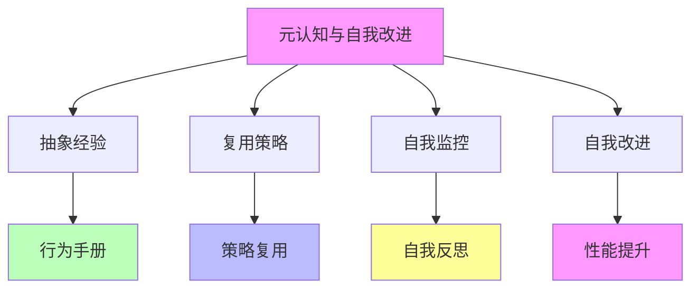
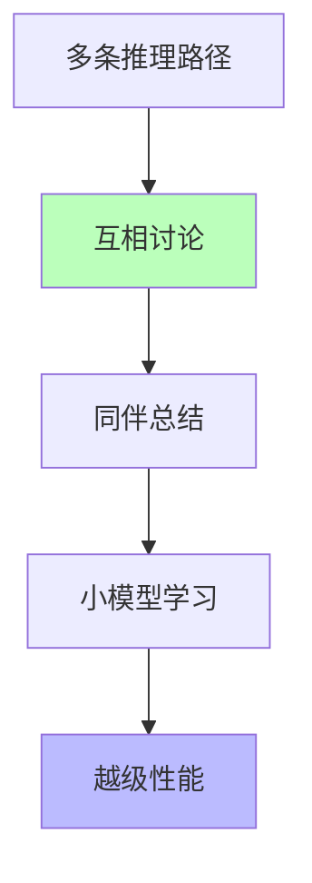

# 05.1.3-元认知与自我改进

## 一、概述

元认知与自我改进是理论化改进方法的核心技术之一，通过元认知（Metacognition）实现自我监控、自我反思和自我改进。代表技术包括 Meta 的"行为手册"、LeaP（从同伴学习）、元思维链（Meta-CoT）等。本文档阐述元认知与自我改进的理论核心、代表技术、确定性及其在 AI 系统中的应用。

---

## 二、目录

- [05.1.3-元认知与自我改进](#0513-元认知与自我改进)
  - [一、概述](#一概述)
  - [二、目录](#二目录)
  - [三、元认知与自我改进理论核心](#三元认知与自我改进理论核心)
    - [2.1 理论核心](#21-理论核心)
    - [2.2 理论优势](#22-理论优势)
  - [四、代表技术](#四代表技术)
    - [3.1 Meta 的"行为手册"](#31-meta-的行为手册)
    - [3.2 LeaP（从同伴学习）](#32-leap从同伴学习)
    - [3.3 元思维链（Meta-CoT）](#33-元思维链meta-cot)
  - [五、确定性分析](#五确定性分析)
    - [4.1 确定性评估](#41-确定性评估)
    - [4.2 理论局限](#42-理论局限)
  - [六、与三层模型的关系](#六与三层模型的关系)
    - [5.1 元认知与自我改进与执行层](#51-元认知与自我改进与执行层)
    - [5.2 元认知与自我改进与控制层](#52-元认知与自我改进与控制层)
    - [5.3 元认知与自我改进与数据层](#53-元认知与自我改进与数据层)
  - [七、核心结论](#七核心结论)
  - [八、相关主题](#八相关主题)
  - [九、参考文档](#九参考文档)

## 三、元认知与自我改进理论核心

### 2.1 理论核心

**元认知与自我改进的理论核心**：**抽象经验，复用策略**

**理论框架**：

**核心观点**：

- **抽象经验**：从推理历史中提炼"行为手册"
- **复用策略**：未来直接调用，而非重新推导
- **自我监控**：自我监控推理过程
- **自我改进**：自我改进推理策略

### 2.2 理论优势

**元认知与自我改进理论优势**：

1. **可解释性**：显式抽象的策略库，可解释性强
2. **可控性**：可控性强，优于黑箱 RL
3. **效率提升**：减少推理 token，提升效率
4. **性能提升**：性能提升明显

---

## 四、代表技术

### 3.1 Meta 的"行为手册"

**Meta 的"行为手册"**：

**核心思想**：模型自我总结解题套路，存储为可复用策略，**减少 46%推理 token**

**理论框架**：

**特点**：

1. **自我总结**：自我总结解题套路
2. **行为手册**：存储为可复用策略
3. **策略复用**：未来直接调用
4. **效率提升**：减少 46%推理 token

### 3.2 LeaP（从同伴学习）

**LeaP（Learning from Peers）**：

**核心思想**：多条推理路径互相"讨论"，小模型通过同伴总结实现越级性能

**理论框架**：

**特点**：

1. **多条推理路径**：多条推理路径互相"讨论"
2. **同伴总结**：同伴总结实现越级性能
3. **小模型学习**：小模型通过同伴总结学习
4. **越级性能**：实现越级性能

### 3.3 元思维链（Meta-CoT）

**元思维链（Meta-CoT）**：

**核心思想**：不仅生成推理步骤，还模拟"如何思考"的元过程，支持回溯与验证

**理论框架**：

**特点**：

1. **推理步骤**：生成推理步骤
2. **元过程模拟**：模拟"如何思考"的元过程
3. **回溯与验证**：支持回溯与验证
4. **可解释性**：提升可解释性

---

## 五、确定性分析

### 4.1 确定性评估

**元认知与自我改进确定性评估**：

| **维度**     | **特征**             | **确定性** |
| ------------ | -------------------- | ---------- |
| **抽象质量** | 抽象质量依赖基础模型 | 中         |
| **策略复用** | 策略复用效果确定     | 高         |
| **自我监控** | 自我监控效果不确定   | 中         |
| **自我改进** | 自我改进效果不确定   | 中         |

**综合确定性**：**较高**。因改进基于**显式抽象的策略库**，可解释性、可控性优于黑箱 RL。但**提炼质量依赖基础模型能力**，小模型可能提炼无效策略。

### 4.2 理论局限

**元认知与自我改进理论局限**：

1. **提炼质量依赖基础模型**：小模型可能提炼无效策略
2. **策略复用效果不确定**：策略复用效果依赖任务类型
3. **自我监控效果不确定**：自我监控效果依赖基础模型
4. **自我改进效果不确定**：自我改进效果依赖基础模型

---

## 六、与三层模型的关系

### 5.1 元认知与自我改进与执行层

**元认知与自我改进与执行层**：

- **计算优化**：元认知优化计算过程
- **策略复用**：策略复用提升计算效率
- **自我改进**：自我改进优化计算性能

### 5.2 元认知与自我改进与控制层

**元认知与自我改进与控制层**：

- **推理优化**：元认知优化推理过程
- **策略复用**：策略复用提升推理效率
- **自我改进**：自我改进优化推理性能

### 5.3 元认知与自我改进与数据层

**元认知与自我改进与数据层**：

- **训练优化**：元认知优化训练过程
- **策略复用**：策略复用提升训练效率
- **自我改进**：自我改进优化训练性能

---

## 七、核心结论

1. **元认知与自我改进是理论化改进方法的核心技术**：通过元认知实现自我监控、自我反思和自我改进
2. **代表技术**：Meta 的"行为手册"、LeaP、元思维链（Meta-CoT）
3. **确定性**：较高（显式抽象的策略库，可解释性、可控性优于黑箱 RL）
4. **理论局限**：提炼质量依赖基础模型，小模型可能提炼无效策略

---

## 八、相关主题

- [05.1.2-强化学习范式](05.1.2-强化学习范式.md)
- [05.1.4-混合方法策略](05.1.4-混合方法策略.md)
- [04.2.3-元认知与自我改进](../04-AI意识与认知模拟/04.2.3-元认知与自我改进.md)

---

## 九、参考文档

- [AI-非意识的"认知模拟"是否可被理论化、确定性地改进](../../view/ai_科学理论_view.md)
